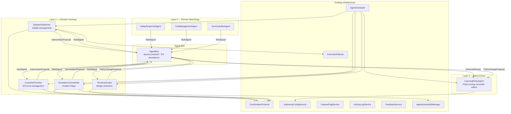
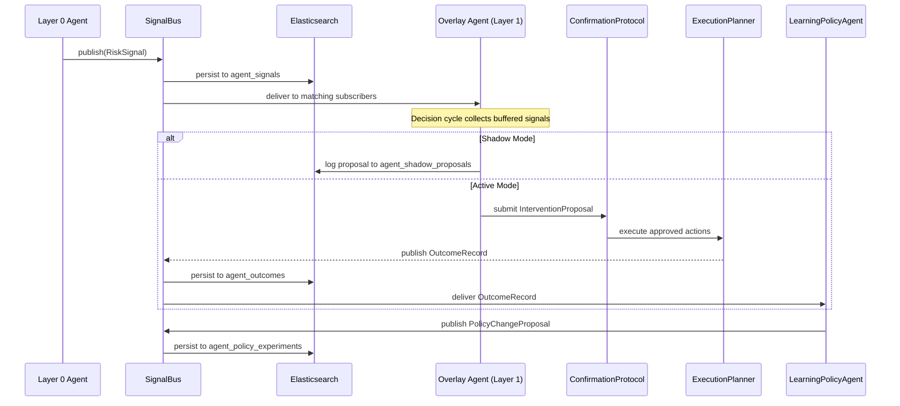
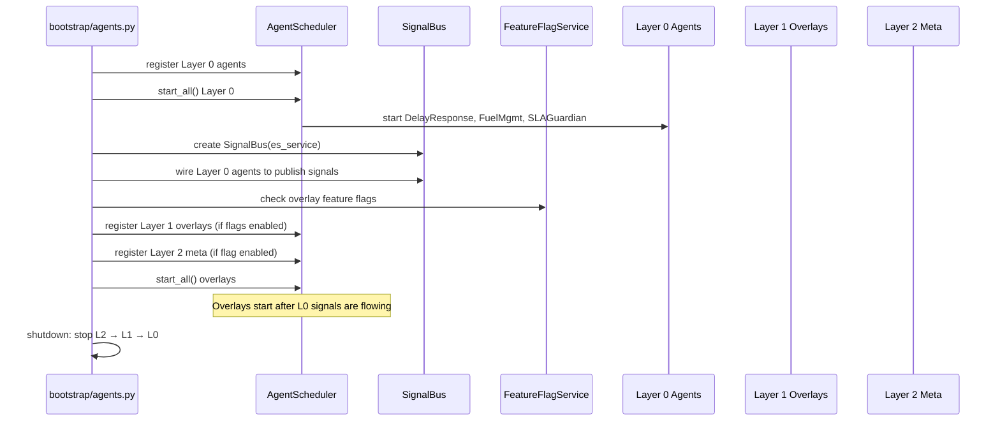

# Technical Design Document — Agent Overlay Architecture

## 1. Overview

This design describes a layered agent overlay architecture that composes five new agents on top of the existing three Layer 0 autonomous agents (DelayResponseAgent, FuelManagementAgent, SLAGuardianAgent). The overlay introduces a Signal Bus for inter-agent communication, standardized data contracts (RiskSignal, InterventionProposal, OutcomeRecord, PolicyChangeProposal), and a shared OverlayAgentBase class that handles signal subscription, decision cycle scheduling, shadow/active mode toggling, and proposal routing.

The five overlay agents are organized in two layers:

- **Layer 1 (Decision Overlays):** DispatchOptimizer, ExceptionCommander, RevenueGuard, CustomerPromise — consume Layer 0 signals and produce cross-domain decisions
- **Layer 2 (Meta-Control):** LearningPolicyAgent — observes outcomes across all layers and proposes policy/threshold adjustments

### Design Principles

1. **Composition over modification** — Overlay agents read Layer 0 outputs via the Signal Bus and write through the existing ExecutionPlanner and ConfirmationProtocol. No existing agent interfaces are modified.
2. **Shadow-first safety** — Every overlay agent starts in shadow mode (read-only observation). Graduation to active mode requires explicit operator confirmation through AutonomyConfigService.
3. **Feature-flag gated rollout** — Each overlay agent is gated behind a dedicated Redis-backed feature flag via the existing FeatureFlagService, supporting per-tenant granular states (disabled, shadow, active_gated, active_auto).
4. **Uniform lifecycle management** — Overlay agents are managed by the existing AgentScheduler with the same restart policies, health reporting, and graceful shutdown as Layer 0 agents.
5. **Closed-loop learning** — Every intervention is tracked from proposal through execution to measured outcome via OutcomeRecords, enabling the LearningPolicyAgent to continuously tune thresholds and policies.

### Key Design Decisions

| Decision | Rationale |
|---|---|
| In-process asyncio pub/sub for Signal Bus | Avoids external message broker dependency (Kafka/RabbitMQ). Sufficient for single-process deployment. ES persistence provides durability and replay. |
| Pydantic v2 models for data contracts | Consistent with existing `agent_models.py` pattern. Provides validation, serialization, and schema versioning. |
| OverlayAgentBase extends AutonomousAgentBase | Reuses polling loop, cooldown tracking, activity logging, and lifecycle management. Adds signal buffering and shadow mode. |
| Per-tenant feature flag states | Allows independent rollout per tenant without code deployments. Extends existing FeatureFlagService pattern. |
| ES persistence for all signal types | Provides audit trail, replay capability, and dashboard queries without additional infrastructure. |

## 2. Architecture

### 2.1 Three-Layer Agent Model



### 2.2 Signal Flow Sequence



### 2.3 Bootstrap Sequence Changes

The existing bootstrap sequence in `bootstrap/agents.py` is extended with a new phase that initializes overlay infrastructure after Layer 0 agents are running:



## 3. Components and Interfaces

### 3.1 Package Structure

```
Runsheet-backend/Agents/overlay/
├── __init__.py
├── base_overlay_agent.py    # OverlayAgentBase class
├── signal_bus.py            # SignalBus pub/sub + ES persistence
├── data_contracts.py        # RiskSignal, InterventionProposal, OutcomeRecord, PolicyChangeProposal
├── dispatch_optimizer.py    # DispatchOptimizer agent
├── exception_commander.py   # ExceptionCommander agent
├── revenue_guard.py         # RevenueGuard agent
├── customer_promise.py      # CustomerPromise agent
├── learning_policy_agent.py # LearningPolicyAgent (Layer 2)
├── outcome_tracker.py       # OutcomeTracker pipeline
└── overlay_es_mappings.py   # ES index mappings for overlay indices
```

### 3.2 Data Contracts (`Agents/overlay/data_contracts.py`)

All inter-agent messages use Pydantic v2 models with strict validation, consistent with the existing `agent_models.py` pattern.

```python
"""
Standardized data contracts for inter-agent communication.

Defines RiskSignal, InterventionProposal, OutcomeRecord, and
PolicyChangeProposal as Pydantic v2 models with schema versioning,
JSON round-trip support, and strict field validation.

Validates: Requirements 1.1–1.8
"""
import uuid
from datetime import datetime, timezone
from enum import Enum
from typing import Any, Dict, List, Optional

from pydantic import BaseModel, Field, field_validator


class Severity(str, Enum):
    LOW = "low"
    MEDIUM = "medium"
    HIGH = "high"
    CRITICAL = "critical"


class RiskClass(str, Enum):
    LOW = "low"
    MEDIUM = "medium"
    HIGH = "high"


class RiskSignal(BaseModel):
    """Signal emitted by Layer 0 agents when a condition is detected.

    Validates: Requirement 1.1, 1.5, 1.6, 1.7
    """
    signal_id: str = Field(default_factory=lambda: str(uuid.uuid4()))
    source_agent: str
    entity_id: str
    entity_type: str
    severity: Severity
    confidence: float = Field(ge=0.0, le=1.0)
    ttl_seconds: int = Field(gt=0)
    timestamp: datetime = Field(default_factory=lambda: datetime.now(timezone.utc))
    context: Dict[str, Any] = Field(default_factory=dict)
    tenant_id: str
    schema_version: str = "1.0.0"

    @field_validator("confidence")
    @classmethod
    def validate_confidence(cls, v: float) -> float:
        return round(v, 4)


class InterventionProposal(BaseModel):
    """Proposal produced by Layer 1 agents containing ranked actions.

    Validates: Requirement 1.2, 1.5, 1.8
    """
    proposal_id: str = Field(default_factory=lambda: str(uuid.uuid4()))
    source_agent: str
    actions: List[Dict[str, Any]]
    expected_kpi_delta: Dict[str, float]
    risk_class: RiskClass
    confidence: float = Field(ge=0.0, le=1.0)
    priority: int = Field(ge=0)
    tenant_id: str
    timestamp: datetime = Field(default_factory=lambda: datetime.now(timezone.utc))
    schema_version: str = "1.0.0"


class OutcomeRecord(BaseModel):
    """Record of an executed intervention's before/after KPIs.

    Validates: Requirement 1.3
    """
    outcome_id: str = Field(default_factory=lambda: str(uuid.uuid4()))
    intervention_id: str  # References InterventionProposal.proposal_id
    before_kpis: Dict[str, float]
    after_kpis: Dict[str, float]
    realized_delta: Dict[str, float]
    execution_duration_ms: float = Field(ge=0.0)
    tenant_id: str
    timestamp: datetime = Field(default_factory=lambda: datetime.now(timezone.utc))
    status: str = "measured"  # measured | adverse | inconclusive
    schema_version: str = "1.0.0"


class PolicyChangeProposal(BaseModel):
    """Proposal to adjust a system parameter, produced by LearningPolicyAgent.

    Validates: Requirement 1.4
    """
    proposal_id: str = Field(default_factory=lambda: str(uuid.uuid4()))
    source_agent: str
    parameter: str
    old_value: Any
    new_value: Any
    evidence: List[str] = Field(default_factory=list)  # OutcomeRecord IDs
    rollback_plan: Dict[str, Any] = Field(default_factory=dict)
    confidence: float = Field(ge=0.0, le=1.0)
    tenant_id: str
    timestamp: datetime = Field(default_factory=lambda: datetime.now(timezone.utc))
    schema_version: str = "1.0.0"
```

### 3.3 Signal Bus (`Agents/overlay/signal_bus.py`)

The Signal Bus is an in-process asyncio pub/sub system with ES persistence. It supports typed publish/subscribe, topic-based filtering, TTL expiration, and delivery metrics.

```python
"""
Signal Bus — in-process pub/sub for inter-agent communication.

Supports typed publish/subscribe for RiskSignal, InterventionProposal,
OutcomeRecord, and PolicyChangeProposal. Persists all signals to
Elasticsearch for audit and replay.

Validates: Requirements 2.1–2.8
"""
import asyncio
import logging
import time
from collections import defaultdict
from dataclasses import dataclass, field
from datetime import datetime, timezone
from typing import Any, Callable, Coroutine, Dict, List, Optional, Type

from Agents.overlay.data_contracts import (
    RiskSignal, InterventionProposal, OutcomeRecord, PolicyChangeProposal,
)

logger = logging.getLogger(__name__)

# Type alias for subscriber callbacks
SubscriberCallback = Callable[[Any], Coroutine[Any, Any, None]]

# ES index for signal persistence
AGENT_SIGNALS_INDEX = "agent_signals"


@dataclass
class Subscription:
    """A single subscription with optional filters."""
    subscriber_id: str
    message_type: Type
    callback: SubscriberCallback
    filters: Dict[str, Any] = field(default_factory=dict)
    # Filters support: source_agent, entity_type, severity, tenant_id


class SignalBus:
    """In-process pub/sub for inter-agent communication.

    Provides:
    - Typed publish/subscribe for all data contract types
    - Topic-based filtering by source_agent, entity_type, severity, tenant_id
    - TTL-based signal expiration for RiskSignals
    - ES persistence to agent_signals index
    - Delivery metrics (published, delivered, expired, active subscriptions)

    Args:
        es_service: ElasticsearchService for signal persistence.
    """

    def __init__(self, es_service) -> None:
        self._es = es_service
        self._subscriptions: Dict[Type, List[Subscription]] = defaultdict(list)
        self._lock = asyncio.Lock()

        # Metrics
        self._metrics = {
            "signals_published_total": defaultdict(int),   # by type name
            "signals_delivered_total": defaultdict(int),    # by subscriber_id
            "signals_expired_total": 0,
            "delivery_errors_total": 0,
        }

    # ------------------------------------------------------------------
    # Subscribe
    # ------------------------------------------------------------------

    async def subscribe(
        self,
        subscriber_id: str,
        message_type: Type,
        callback: SubscriberCallback,
        filters: Optional[Dict[str, Any]] = None,
    ) -> None:
        """Register a subscription for a message type with optional filters.

        Args:
            subscriber_id: Unique identifier for the subscriber.
            message_type: The data contract type to subscribe to.
            callback: Async callback invoked on matching messages.
            filters: Optional dict of field filters (source_agent,
                entity_type, severity, tenant_id).
        """
        sub = Subscription(
            subscriber_id=subscriber_id,
            message_type=message_type,
            callback=callback,
            filters=filters or {},
        )
        async with self._lock:
            self._subscriptions[message_type].append(sub)

    async def unsubscribe(self, subscriber_id: str) -> None:
        """Remove all subscriptions for a subscriber."""
        async with self._lock:
            for msg_type in self._subscriptions:
                self._subscriptions[msg_type] = [
                    s for s in self._subscriptions[msg_type]
                    if s.subscriber_id != subscriber_id
                ]

    # ------------------------------------------------------------------
    # Publish
    # ------------------------------------------------------------------

    async def publish(self, message) -> int:
        """Publish a message to all matching subscribers.

        Validates the message, persists to ES, checks TTL for
        RiskSignals, and delivers to matching subscribers.

        Returns:
            Number of subscribers that received the message.
        """
        msg_type = type(message)
        type_name = msg_type.__name__

        # Validate (Pydantic model_validate triggers on construction)
        # Persist to ES
        await self._persist(message)
        self._metrics["signals_published_total"][type_name] += 1

        # TTL check for RiskSignals
        if isinstance(message, RiskSignal):
            age_seconds = (
                datetime.now(timezone.utc) - message.timestamp
            ).total_seconds()
            if age_seconds > message.ttl_seconds:
                self._metrics["signals_expired_total"] += 1
                return 0

        # Deliver to matching subscribers
        async with self._lock:
            subs = list(self._subscriptions.get(msg_type, []))

        delivered = 0
        for sub in subs:
            if not self._matches_filters(message, sub.filters):
                continue
            try:
                await sub.callback(message)
                delivered += 1
                self._metrics["signals_delivered_total"][sub.subscriber_id] += 1
            except Exception as e:
                self._metrics["delivery_errors_total"] += 1
                logger.error(
                    "SignalBus delivery error for subscriber %s: %s",
                    sub.subscriber_id, e,
                )
                # Skip failing subscriber, continue delivering (Req 2.7)

        return delivered

    # ------------------------------------------------------------------
    # Filtering
    # ------------------------------------------------------------------

    def _matches_filters(self, message, filters: Dict[str, Any]) -> bool:
        """Check if a message matches subscription filters."""
        for field_name, expected_value in filters.items():
            actual = getattr(message, field_name, None)
            if actual is None:
                continue
            if isinstance(expected_value, (list, set, tuple)):
                if actual not in expected_value:
                    return False
            elif actual != expected_value:
                return False
        return True

    # ------------------------------------------------------------------
    # Persistence
    # ------------------------------------------------------------------

    async def _persist(self, message) -> None:
        """Persist a signal to the agent_signals ES index."""
        try:
            doc = message.model_dump(mode="json")
            doc["_signal_type"] = type(message).__name__
            doc_id = (
                getattr(message, "signal_id", None)
                or getattr(message, "proposal_id", None)
                or getattr(message, "outcome_id", None)
            )
            await self._es.index_document(AGENT_SIGNALS_INDEX, doc_id, doc)
        except Exception as e:
            logger.error("SignalBus persistence error: %s", e)

    # ------------------------------------------------------------------
    # Metrics
    # ------------------------------------------------------------------

    @property
    def active_subscriptions(self) -> int:
        return sum(len(subs) for subs in self._subscriptions.values())

    def get_metrics(self) -> Dict[str, Any]:
        return {
            "signals_published_total": dict(self._metrics["signals_published_total"]),
            "signals_delivered_total": dict(self._metrics["signals_delivered_total"]),
            "signals_expired_total": self._metrics["signals_expired_total"],
            "delivery_errors_total": self._metrics["delivery_errors_total"],
            "active_subscriptions": self.active_subscriptions,
        }
```

### 3.4 OverlayAgentBase (`Agents/overlay/base_overlay_agent.py`)

The base class extends `AutonomousAgentBase` with overlay-specific capabilities: signal buffering, shadow/active mode, and proposal routing.

```python
"""
Overlay Agent Base Class.

Extends AutonomousAgentBase with signal subscription, decision cycle
scheduling, shadow/active mode toggling, and proposal routing.

Validates: Requirements 3.1–3.8
"""
import asyncio
import logging
import time
from abc import abstractmethod
from datetime import datetime, timezone
from typing import Any, Dict, List, Optional, Tuple

from Agents.autonomous.base_agent import AutonomousAgentBase
from Agents.overlay.data_contracts import (
    RiskSignal, InterventionProposal, OutcomeRecord, PolicyChangeProposal,
)
from Agents.overlay.signal_bus import SignalBus

logger = logging.getLogger(__name__)

SHADOW_PROPOSALS_INDEX = "agent_shadow_proposals"


class OverlayAgentBase(AutonomousAgentBase):
    """Base class for Layer 1 and Layer 2 overlay agents.

    Extends AutonomousAgentBase with:
    - Signal Bus subscription and buffering
    - Shadow/active mode with per-tenant granularity
    - Decision cycle that collects signals, evaluates, and routes proposals
    - Per-cycle metrics tracking

    Args:
        agent_id: Unique identifier for this overlay agent.
        signal_bus: The SignalBus instance for pub/sub.
        subscriptions: List of dicts specifying signal subscriptions.
            Each dict has 'message_type' and optional 'filters'.
        activity_log_service: Service for logging agent activity.
        ws_manager: WebSocket manager for broadcasting events.
        confirmation_protocol: Protocol for routing mutations.
        autonomy_config_service: Service for mode management.
        feature_flag_service: Service for per-tenant feature flags.
        es_service: Elasticsearch service for shadow proposal logging.
        poll_interval: Seconds between decision cycles (default 60).
        cooldown_minutes: Minutes for per-entity cooldown (default 15).
    """

    def __init__(
        self,
        agent_id: str,
        signal_bus: SignalBus,
        subscriptions: List[Dict[str, Any]],
        activity_log_service,
        ws_manager,
        confirmation_protocol,
        autonomy_config_service,
        feature_flag_service,
        es_service,
        poll_interval: int = 60,
        cooldown_minutes: int = 15,
    ):
        super().__init__(
            agent_id=agent_id,
            poll_interval_seconds=poll_interval,
            cooldown_minutes=cooldown_minutes,
            activity_log_service=activity_log_service,
            ws_manager=ws_manager,
            confirmation_protocol=confirmation_protocol,
            feature_flag_service=feature_flag_service,
        )
        self._signal_bus = signal_bus
        self._subscription_specs = subscriptions
        self._autonomy_config = autonomy_config_service
        self._es = es_service
        self._signal_buffer: List[RiskSignal] = []
        self._buffer_lock = asyncio.Lock()

        # Per-cycle metrics
        self._cycle_metrics: Dict[str, Any] = {
            "signals_consumed": 0,
            "proposals_generated": 0,
            "cycle_duration_ms": 0.0,
            "mode": "shadow",
        }

    # ------------------------------------------------------------------
    # Lifecycle
    # ------------------------------------------------------------------

    async def start(self) -> None:
        """Start the overlay agent: register subscriptions, then start loop."""
        for spec in self._subscription_specs:
            await self._signal_bus.subscribe(
                subscriber_id=self.agent_id,
                message_type=spec["message_type"],
                callback=self._on_signal,
                filters=spec.get("filters"),
            )
        await super().start()

    async def stop(self) -> None:
        """Stop the overlay agent: unsubscribe and stop loop."""
        await self._signal_bus.unsubscribe(self.agent_id)
        await super().stop()

    # ------------------------------------------------------------------
    # Signal handling
    # ------------------------------------------------------------------

    async def _on_signal(self, signal) -> None:
        """Buffer incoming signals for the next decision cycle."""
        async with self._buffer_lock:
            self._signal_buffer.append(signal)

    # ------------------------------------------------------------------
    # Decision cycle (replaces monitor_cycle)
    # ------------------------------------------------------------------

    async def monitor_cycle(self) -> Tuple[List[Any], List[Any]]:
        """Execute one decision cycle: collect, evaluate, route.

        Collects buffered signals, invokes the subclass evaluate()
        method, and routes resulting proposals based on mode.
        """
        cycle_start = time.monotonic()

        # Collect buffered signals
        async with self._buffer_lock:
            signals = list(self._signal_buffer)
            self._signal_buffer.clear()

        if not signals:
            return [], []

        # Determine mode from feature flag
        # (tenant_id comes from signals; process per-tenant)
        proposals_generated = []
        for tenant_id, tenant_signals in self._group_by_tenant(signals).items():
            mode = await self._get_mode(tenant_id)
            self._cycle_metrics["mode"] = mode

            if mode == "disabled":
                continue

            # Evaluate
            proposals = await self.evaluate(tenant_signals)

            for proposal in proposals:
                if mode == "shadow":
                    await self._log_shadow_proposal(proposal)
                else:
                    await self._route_proposal(proposal, mode)
                proposals_generated.append(proposal)

        cycle_duration_ms = (time.monotonic() - cycle_start) * 1000
        self._cycle_metrics.update({
            "signals_consumed": len(signals),
            "proposals_generated": len(proposals_generated),
            "cycle_duration_ms": cycle_duration_ms,
        })

        return signals, proposals_generated

    # ------------------------------------------------------------------
    # Mode management
    # ------------------------------------------------------------------

    async def _get_mode(self, tenant_id: str) -> str:
        """Get the overlay agent's mode for a tenant.

        Checks the feature flag service for the overlay-specific flag.
        Returns: 'disabled', 'shadow', 'active_gated', or 'active_auto'.
        """
        if not self._feature_flags:
            return "shadow"
        try:
            flag_key = f"overlay.{self.agent_id}"
            # Extended FeatureFlagService returns granular state
            state = await self._feature_flags.get_overlay_state(
                flag_key, tenant_id
            )
            return state or "shadow"
        except AttributeError:
            # Fallback: basic is_enabled check
            enabled = await self._feature_flags.is_enabled(tenant_id)
            return "shadow" if enabled else "disabled"

    # ------------------------------------------------------------------
    # Proposal routing
    # ------------------------------------------------------------------

    async def _log_shadow_proposal(self, proposal) -> None:
        """Log a proposal to the shadow proposals ES index."""
        doc = proposal.model_dump(mode="json")
        doc["shadow_agent"] = self.agent_id
        doc["shadow_timestamp"] = datetime.now(timezone.utc).isoformat()
        await self._es.index_document(
            SHADOW_PROPOSALS_INDEX,
            getattr(proposal, "proposal_id", None),
            doc,
        )

    async def _route_proposal(self, proposal, mode: str) -> None:
        """Route a proposal through ConfirmationProtocol or auto-execute."""
        if isinstance(proposal, InterventionProposal):
            from Agents.confirmation_protocol import MutationRequest
            for action in proposal.actions:
                request = MutationRequest(
                    tool_name=action.get("tool_name", "overlay_action"),
                    parameters=action.get("parameters", {}),
                    tenant_id=proposal.tenant_id,
                    agent_id=self.agent_id,
                )
                await self._confirmation_protocol.process_mutation(request)
        # Publish proposal to Signal Bus for downstream consumers
        await self._signal_bus.publish(proposal)

    # ------------------------------------------------------------------
    # Helpers
    # ------------------------------------------------------------------

    def _group_by_tenant(self, signals) -> Dict[str, List]:
        """Group signals by tenant_id."""
        groups: Dict[str, List] = {}
        for sig in signals:
            tid = getattr(sig, "tenant_id", "default")
            groups.setdefault(tid, []).append(sig)
        return groups

    @property
    def cycle_metrics(self) -> Dict[str, Any]:
        return dict(self._cycle_metrics)

    # ------------------------------------------------------------------
    # Abstract interface
    # ------------------------------------------------------------------

    @abstractmethod
    async def evaluate(
        self, signals: List[RiskSignal]
    ) -> List[InterventionProposal]:
        """Domain-specific decision logic. Subclasses must implement.

        Args:
            signals: Buffered signals for a single tenant.

        Returns:
            List of InterventionProposals (or PolicyChangeProposals).
        """
        ...
```


### 3.5 DispatchOptimizer (`Agents/overlay/dispatch_optimizer.py`)

The DispatchOptimizer is a Layer 1 overlay agent that consumes delay and fuel risk signals and evaluates global reassignment opportunities across the affected tenant's routes and jobs. It produces ranked InterventionProposals with the constraint that no reassignment creates a net-negative SLA impact across the portfolio.

```python
"""
Dispatch Optimizer — Layer 1 overlay agent for global reassignment.

Subscribes to delay and fuel RiskSignals, evaluates reassignment
opportunities across affected routes/jobs, and produces ranked
InterventionProposals. Constraint: no net-negative SLA impact
across the portfolio.

Decision cycle: 60 seconds (configurable).

Validates: Requirements 4.1–4.8
"""
import logging
import time
from typing import Any, Dict, List

from Agents.overlay.base_overlay_agent import OverlayAgentBase
from Agents.overlay.data_contracts import (
    InterventionProposal,
    RiskClass,
    RiskSignal,
)
from Agents.overlay.signal_bus import SignalBus

logger = logging.getLogger(__name__)

JOBS_CURRENT_INDEX = "jobs_current"
ASSETS_INDEX = "trucks"


class DispatchOptimizer(OverlayAgentBase):
    """Global reassignment and reroute portfolio optimizer.

    Consumes delay and fuel RiskSignals from Layer 0 agents and
    evaluates all affected routes/jobs within the same tenant to
    identify reassignment opportunities that improve delivery time,
    fuel cost, and SLA compliance without creating new SLA breaches.

    Args:
        signal_bus: SignalBus for pub/sub.
        es_service: Elasticsearch service for querying jobs/assets.
        activity_log_service: For logging agent activity.
        ws_manager: WebSocket manager for broadcasting.
        confirmation_protocol: For routing approved mutations.
        autonomy_config_service: For mode management.
        feature_flag_service: For per-tenant feature flags.
        execution_planner: ExecutionPlanner for multi-step reassignments.
        poll_interval: Decision cycle interval in seconds (default 60).
    """

    def __init__(
        self,
        signal_bus: SignalBus,
        es_service,
        activity_log_service,
        ws_manager,
        confirmation_protocol,
        autonomy_config_service,
        feature_flag_service,
        execution_planner,
        poll_interval: int = 60,
    ):
        super().__init__(
            agent_id="dispatch_optimizer",
            signal_bus=signal_bus,
            subscriptions=[
                {
                    "message_type": RiskSignal,
                    "filters": {
                        "source_agent": [
                            "delay_response_agent",
                            "fuel_management_agent",
                        ]
                    },
                },
            ],
            activity_log_service=activity_log_service,
            ws_manager=ws_manager,
            confirmation_protocol=confirmation_protocol,
            autonomy_config_service=autonomy_config_service,
            feature_flag_service=feature_flag_service,
            es_service=es_service,
            poll_interval=poll_interval,
            cooldown_minutes=5,
        )
        self._execution_planner = execution_planner

    async def evaluate(
        self, signals: List[RiskSignal]
    ) -> List[InterventionProposal]:
        """Evaluate reassignment opportunities for buffered signals.

        Steps:
        1. Extract affected entity IDs (job_ids, station_ids) from signals.
        2. Query all active jobs and available assets for the tenant.
        3. Score reassignment candidates by (time_saved, fuel_delta, sla_impact).
        4. Filter out candidates that would create new SLA breaches.
        5. Rank remaining candidates and produce InterventionProposals.

        Returns:
            List of InterventionProposals with ranked reassignment actions.
        """
        if not signals:
            return []

        tenant_id = signals[0].tenant_id
        affected_entities = {s.entity_id for s in signals}

        # Query affected jobs
        affected_jobs = await self._query_affected_jobs(
            affected_entities, tenant_id
        )
        if not affected_jobs:
            return []

        # Query available assets
        available_assets = await self._query_available_assets(tenant_id)

        # Score and rank reassignment candidates
        candidates = self._score_reassignments(
            affected_jobs, available_assets, signals
        )

        # Filter: no net-negative SLA impact (Req 4.5)
        safe_candidates = [
            c for c in candidates if c["sla_impact"] >= 0
        ]

        if not safe_candidates:
            return []

        # Build proposal with ranked actions (Req 4.3, 4.4)
        actions = []
        total_time_saved = 0.0
        total_fuel_delta = 0.0
        for candidate in safe_candidates:
            actions.append({
                "tool_name": "assign_asset_to_job",
                "parameters": {
                    "job_id": candidate["job_id"],
                    "asset_id": candidate["asset_id"],
                },
                "expected_time_saved_minutes": candidate["time_saved"],
                "expected_fuel_delta_liters": candidate["fuel_delta"],
            })
            total_time_saved += candidate["time_saved"]
            total_fuel_delta += candidate["fuel_delta"]

        proposal = InterventionProposal(
            source_agent=self.agent_id,
            actions=actions,
            expected_kpi_delta={
                "delivery_time_minutes": -total_time_saved,
                "fuel_cost_liters": total_fuel_delta,
                "sla_compliance_pct": sum(
                    c["sla_impact"] for c in safe_candidates
                ),
            },
            risk_class=RiskClass.MEDIUM,
            confidence=min(s.confidence for s in signals),
            priority=len(safe_candidates),
            tenant_id=tenant_id,
        )

        return [proposal]

    # ------------------------------------------------------------------
    # Query helpers
    # ------------------------------------------------------------------

    async def _query_affected_jobs(
        self, entity_ids: set, tenant_id: str
    ) -> List[Dict[str, Any]]:
        """Query active jobs matching affected entity IDs."""
        query = {
            "query": {
                "bool": {
                    "filter": [
                        {"term": {"tenant_id": tenant_id}},
                        {"term": {"status": "in_progress"}},
                        {"terms": {"job_id": list(entity_ids)}},
                    ]
                }
            },
            "size": 100,
        }
        resp = await self._es.search_documents(JOBS_CURRENT_INDEX, query, 100)
        return [h["_source"] for h in resp["hits"]["hits"]]

    async def _query_available_assets(
        self, tenant_id: str
    ) -> List[Dict[str, Any]]:
        """Query available assets for the tenant."""
        query = {
            "query": {
                "bool": {
                    "filter": [
                        {"term": {"tenant_id": tenant_id}},
                        {"term": {"status": "on_time"}},
                    ]
                }
            },
            "size": 50,
        }
        resp = await self._es.search_documents(ASSETS_INDEX, query, 50)
        return [h["_source"] for h in resp["hits"]["hits"]]

    # ------------------------------------------------------------------
    # Scoring
    # ------------------------------------------------------------------

    def _score_reassignments(
        self,
        jobs: List[Dict],
        assets: List[Dict],
        signals: List[RiskSignal],
    ) -> List[Dict[str, Any]]:
        """Score all possible job-to-asset reassignments.

        Returns a list of candidate dicts sorted by composite score
        (descending), each containing job_id, asset_id, time_saved,
        fuel_delta, and sla_impact.
        """
        signal_severity = {s.entity_id: s.severity.value for s in signals}
        severity_weight = {"low": 1, "medium": 2, "high": 3, "critical": 4}

        candidates = []
        for job in jobs:
            job_id = job.get("job_id")
            job_type = job.get("job_type", "cargo_transport")
            for asset in assets:
                asset_type = asset.get("asset_type", "vehicle")
                # Basic compatibility check
                if not self._is_compatible(job_type, asset_type):
                    continue

                # Heuristic scoring
                sev = signal_severity.get(job_id, "medium")
                weight = severity_weight.get(sev, 2)
                time_saved = weight * 10.0  # placeholder heuristic
                fuel_delta = -weight * 2.0  # negative = savings
                sla_impact = weight * 0.5   # positive = improvement

                candidates.append({
                    "job_id": job_id,
                    "asset_id": asset.get("asset_id"),
                    "time_saved": time_saved,
                    "fuel_delta": fuel_delta,
                    "sla_impact": sla_impact,
                    "score": time_saved + abs(fuel_delta) + sla_impact,
                })

        candidates.sort(key=lambda c: c["score"], reverse=True)
        return candidates

    @staticmethod
    def _is_compatible(job_type: str, asset_type: str) -> bool:
        """Check if an asset type is compatible with a job type."""
        compatibility = {
            "cargo_transport": "vehicle",
            "passenger_transport": "vehicle",
            "vessel_movement": "vessel",
            "airport_transfer": "vehicle",
            "crane_booking": "equipment",
        }
        return compatibility.get(job_type, "vehicle") == asset_type
```


### 3.6 ExceptionCommander (`Agents/overlay/exception_commander.py`)

The ExceptionCommander is a Layer 1 overlay agent that subscribes to all Layer 0 RiskSignals, correlates related signals within a 30-second window into incidents, and produces ranked response plans. It maintains an incident state machine and broadcasts incident summaries via WebSocket for real-time operator visibility.

```python
"""
Exception Commander — Layer 1 overlay agent for incident triage.

Subscribes to all Layer 0 RiskSignals, correlates signals within a
30-second window into incidents, produces ranked response plans, and
broadcasts incident summaries via AgentActivityWSManager.

Incident state machine: detected → triaging → plan_proposed →
executing → resolved → escalated.

Escalation timeout: 5 minutes (configurable).

Validates: Requirements 5.1–5.8
"""
import asyncio
import logging
import time
from collections import defaultdict
from datetime import datetime, timedelta, timezone
from enum import Enum
from typing import Any, Dict, List, Optional

from Agents.overlay.base_overlay_agent import OverlayAgentBase
from Agents.overlay.data_contracts import (
    InterventionProposal,
    RiskClass,
    RiskSignal,
    Severity,
)
from Agents.overlay.signal_bus import SignalBus

logger = logging.getLogger(__name__)


class IncidentState(str, Enum):
    DETECTED = "detected"
    TRIAGING = "triaging"
    PLAN_PROPOSED = "plan_proposed"
    EXECUTING = "executing"
    RESOLVED = "resolved"
    ESCALATED = "escalated"


class Incident:
    """Represents a correlated incident from multiple RiskSignals."""

    def __init__(self, incident_id: str, tenant_id: str):
        self.incident_id = incident_id
        self.tenant_id = tenant_id
        self.state = IncidentState.DETECTED
        self.signals: List[RiskSignal] = []
        self.affected_entities: set = set()
        self.severity = Severity.LOW
        self.created_at = datetime.now(timezone.utc)
        self.state_changed_at = datetime.now(timezone.utc)
        self.proposal: Optional[InterventionProposal] = None

    def add_signal(self, signal: RiskSignal) -> None:
        """Add a correlated signal and update severity."""
        self.signals.append(signal)
        self.affected_entities.add(signal.entity_id)
        # Incident severity = max severity of constituent signals
        severity_order = [Severity.LOW, Severity.MEDIUM, Severity.HIGH, Severity.CRITICAL]
        if severity_order.index(signal.severity) > severity_order.index(self.severity):
            self.severity = signal.severity

    def transition(self, new_state: IncidentState) -> None:
        """Transition the incident to a new state."""
        self.state = new_state
        self.state_changed_at = datetime.now(timezone.utc)


class ExceptionCommander(OverlayAgentBase):
    """Incident triage and ranked response plan generator.

    Correlates RiskSignals from all Layer 0 agents within a configurable
    window into incidents, produces ranked response plans, and manages
    incident lifecycle with escalation timeouts.

    Args:
        signal_bus: SignalBus for pub/sub.
        es_service: Elasticsearch service.
        activity_log_service: For logging agent activity.
        ws_manager: WebSocket manager for incident broadcasts.
        confirmation_protocol: For routing approved actions.
        autonomy_config_service: For mode management.
        feature_flag_service: For per-tenant feature flags.
        correlation_window_seconds: Window for correlating signals (default 30).
        escalation_timeout_seconds: Timeout before escalation (default 300).
        poll_interval: Decision cycle interval in seconds (default 30).
    """

    def __init__(
        self,
        signal_bus: SignalBus,
        es_service,
        activity_log_service,
        ws_manager,
        confirmation_protocol,
        autonomy_config_service,
        feature_flag_service,
        correlation_window_seconds: int = 30,
        escalation_timeout_seconds: int = 300,
        poll_interval: int = 30,
    ):
        super().__init__(
            agent_id="exception_commander",
            signal_bus=signal_bus,
            subscriptions=[
                {"message_type": RiskSignal},  # All Layer 0 signals
            ],
            activity_log_service=activity_log_service,
            ws_manager=ws_manager,
            confirmation_protocol=confirmation_protocol,
            autonomy_config_service=autonomy_config_service,
            feature_flag_service=feature_flag_service,
            es_service=es_service,
            poll_interval=poll_interval,
            cooldown_minutes=2,
        )
        self._correlation_window = timedelta(seconds=correlation_window_seconds)
        self._escalation_timeout = timedelta(seconds=escalation_timeout_seconds)
        self._active_incidents: Dict[str, Incident] = {}
        self._incident_counter = 0

    async def evaluate(
        self, signals: List[RiskSignal]
    ) -> List[InterventionProposal]:
        """Correlate signals into incidents and produce response plans.

        Steps:
        1. Correlate incoming signals into existing or new incidents
           based on entity overlap within the correlation window.
        2. For each incident in DETECTED state, transition to TRIAGING
           and generate a ranked response plan.
        3. Check for escalation timeouts on PLAN_PROPOSED incidents.
        4. Broadcast incident summaries via WebSocket.

        Returns:
            List of InterventionProposals (one per new/updated incident).
        """
        tenant_id = signals[0].tenant_id if signals else "default"
        proposals = []

        # Step 1: Correlate signals into incidents (Req 5.2)
        for signal in signals:
            incident = self._find_or_create_incident(signal)
            incident.add_signal(signal)

        # Step 2: Triage new incidents and generate response plans
        for incident in self._active_incidents.values():
            if incident.tenant_id != tenant_id:
                continue

            if incident.state == IncidentState.DETECTED:
                incident.transition(IncidentState.TRIAGING)
                proposal = self._generate_response_plan(incident)
                incident.proposal = proposal
                incident.transition(IncidentState.PLAN_PROPOSED)
                proposals.append(proposal)

                # Broadcast incident summary (Req 5.5)
                await self._broadcast_incident(incident)

        # Step 3: Check escalation timeouts (Req 5.8)
        await self._check_escalations()

        # Cleanup resolved/escalated incidents older than 1 hour
        self._cleanup_old_incidents()

        return proposals

    # ------------------------------------------------------------------
    # Correlation
    # ------------------------------------------------------------------

    def _find_or_create_incident(self, signal: RiskSignal) -> Incident:
        """Find an existing incident matching the signal or create a new one.

        Matches by entity overlap within the correlation window.
        """
        now = datetime.now(timezone.utc)
        for incident in self._active_incidents.values():
            if incident.tenant_id != signal.tenant_id:
                continue
            if incident.state in (IncidentState.RESOLVED, IncidentState.ESCALATED):
                continue
            # Check time window
            if (now - incident.created_at) > self._correlation_window * 10:
                continue
            # Check entity overlap
            if signal.entity_id in incident.affected_entities:
                return incident
            # Check if any signal arrived within correlation window
            for existing_signal in incident.signals:
                if abs((signal.timestamp - existing_signal.timestamp).total_seconds()) <= self._correlation_window.total_seconds():
                    return incident

        # Create new incident
        self._incident_counter += 1
        incident_id = f"INC-{self._incident_counter:06d}"
        incident = Incident(incident_id=incident_id, tenant_id=signal.tenant_id)
        self._active_incidents[incident_id] = incident
        return incident

    # ------------------------------------------------------------------
    # Response plan generation
    # ------------------------------------------------------------------

    def _generate_response_plan(self, incident: Incident) -> InterventionProposal:
        """Generate a ranked response plan for an incident (Req 5.3, 5.4)."""
        actions = []
        severity_to_risk = {
            Severity.LOW: RiskClass.LOW,
            Severity.MEDIUM: RiskClass.MEDIUM,
            Severity.HIGH: RiskClass.HIGH,
            Severity.CRITICAL: RiskClass.HIGH,
        }

        # Build playbook steps based on signal sources
        source_agents = {s.source_agent for s in incident.signals}

        if "delay_response_agent" in source_agents:
            actions.append({
                "tool_name": "reassign_delayed_jobs",
                "parameters": {
                    "entity_ids": list(incident.affected_entities),
                    "incident_id": incident.incident_id,
                },
                "priority": 1,
                "description": "Reassign delayed jobs to available assets",
                "expected_impact": "Reduce delivery delays",
            })

        if "fuel_management_agent" in source_agents:
            actions.append({
                "tool_name": "emergency_fuel_dispatch",
                "parameters": {
                    "entity_ids": list(incident.affected_entities),
                    "incident_id": incident.incident_id,
                },
                "priority": 2,
                "description": "Dispatch emergency fuel to critical stations",
                "expected_impact": "Prevent fuel stockout",
            })

        if "sla_guardian_agent" in source_agents:
            actions.append({
                "tool_name": "escalate_sla_breach",
                "parameters": {
                    "entity_ids": list(incident.affected_entities),
                    "incident_id": incident.incident_id,
                    "priority": "critical",
                },
                "priority": 3,
                "description": "Escalate SLA breaches to operations lead",
                "expected_impact": "Prevent SLA penalty accumulation",
            })

        avg_confidence = (
            sum(s.confidence for s in incident.signals) / len(incident.signals)
            if incident.signals else 0.5
        )

        return InterventionProposal(
            source_agent=self.agent_id,
            actions=actions,
            expected_kpi_delta={
                "incident_resolution_time_minutes": -15.0,
                "affected_entities_count": len(incident.affected_entities),
            },
            risk_class=severity_to_risk.get(incident.severity, RiskClass.MEDIUM),
            confidence=avg_confidence,
            priority=len(incident.affected_entities),
            tenant_id=incident.tenant_id,
        )

    # ------------------------------------------------------------------
    # Escalation
    # ------------------------------------------------------------------

    async def _check_escalations(self) -> None:
        """Escalate incidents stuck in PLAN_PROPOSED beyond timeout (Req 5.8)."""
        now = datetime.now(timezone.utc)
        for incident in self._active_incidents.values():
            if incident.state != IncidentState.PLAN_PROPOSED:
                continue
            if (now - incident.state_changed_at) > self._escalation_timeout:
                incident.transition(IncidentState.ESCALATED)
                # Increase severity on escalation
                if incident.severity != Severity.CRITICAL:
                    severity_order = [Severity.LOW, Severity.MEDIUM, Severity.HIGH, Severity.CRITICAL]
                    idx = severity_order.index(incident.severity)
                    incident.severity = severity_order[min(idx + 1, 3)]
                await self._broadcast_incident(incident, escalated=True)

    # ------------------------------------------------------------------
    # Broadcasting
    # ------------------------------------------------------------------

    async def _broadcast_incident(
        self, incident: Incident, escalated: bool = False
    ) -> None:
        """Broadcast incident summary via WebSocket (Req 5.5)."""
        event_type = "incident_escalated" if escalated else "incident_detected"
        await self._ws.broadcast_event(event_type, {
            "incident_id": incident.incident_id,
            "state": incident.state.value,
            "severity": incident.severity.value,
            "affected_entities": list(incident.affected_entities),
            "signal_count": len(incident.signals),
            "source_agents": list({s.source_agent for s in incident.signals}),
            "created_at": incident.created_at.isoformat(),
            "tenant_id": incident.tenant_id,
        })

    # ------------------------------------------------------------------
    # Cleanup
    # ------------------------------------------------------------------

    def _cleanup_old_incidents(self) -> None:
        """Remove resolved/escalated incidents older than 1 hour."""
        now = datetime.now(timezone.utc)
        cutoff = now - timedelta(hours=1)
        to_remove = [
            iid for iid, inc in self._active_incidents.items()
            if inc.state in (IncidentState.RESOLVED, IncidentState.ESCALATED)
            and inc.state_changed_at < cutoff
        ]
        for iid in to_remove:
            del self._active_incidents[iid]
```


### 3.7 RevenueGuard (`Agents/overlay/revenue_guard.py`)

The RevenueGuard is a Layer 1 overlay agent that monitors margin metrics across jobs and routes. It detects margin leakage patterns (3+ consecutive below-target jobs on a route) and produces PolicyChangeProposals — always classified as HIGH risk, requiring explicit human approval.

```python
"""
Revenue Guard — Layer 1 overlay agent for margin protection.

Subscribes to fuel RiskSignals and OutcomeRecords, computes per-job
and per-route margin metrics, detects margin leakage patterns, and
produces PolicyChangeProposals (always HIGH risk).

Weekly summary reports are persisted to agent_revenue_reports index.

Validates: Requirements 6.1–6.8
"""
import logging
import time
from collections import defaultdict
from datetime import datetime, timedelta, timezone
from typing import Any, Dict, List

from Agents.overlay.base_overlay_agent import OverlayAgentBase
from Agents.overlay.data_contracts import (
    InterventionProposal,
    OutcomeRecord,
    PolicyChangeProposal,
    RiskClass,
    RiskSignal,
)
from Agents.overlay.signal_bus import SignalBus

logger = logging.getLogger(__name__)

REVENUE_REPORTS_INDEX = "agent_revenue_reports"
JOBS_CURRENT_INDEX = "jobs_current"

# Default margin target (percentage)
DEFAULT_MARGIN_TARGET_PCT = 15.0
# Consecutive below-target jobs to trigger leakage detection
DEFAULT_LEAKAGE_THRESHOLD = 3


class RevenueGuard(OverlayAgentBase):
    """Margin protection and leakage detection agent.

    Monitors fuel costs and intervention outcomes to compute per-job
    and per-route margin metrics. Detects patterns of margin leakage
    and produces PolicyChangeProposals for corrective action.

    All proposals are HIGH risk and require human approval (Req 6.5, 6.7).

    Args:
        signal_bus: SignalBus for pub/sub.
        es_service: Elasticsearch service.
        activity_log_service: For logging agent activity.
        ws_manager: WebSocket manager.
        confirmation_protocol: For routing proposals.
        autonomy_config_service: For mode management.
        feature_flag_service: For per-tenant feature flags.
        margin_target_pct: Target margin percentage (default 15.0).
        leakage_threshold: Consecutive below-target jobs to trigger (default 3).
        poll_interval: Decision cycle interval in seconds (default 120).
    """

    def __init__(
        self,
        signal_bus: SignalBus,
        es_service,
        activity_log_service,
        ws_manager,
        confirmation_protocol,
        autonomy_config_service,
        feature_flag_service,
        margin_target_pct: float = DEFAULT_MARGIN_TARGET_PCT,
        leakage_threshold: int = DEFAULT_LEAKAGE_THRESHOLD,
        poll_interval: int = 120,
    ):
        super().__init__(
            agent_id="revenue_guard",
            signal_bus=signal_bus,
            subscriptions=[
                {
                    "message_type": RiskSignal,
                    "filters": {"source_agent": "fuel_management_agent"},
                },
                {"message_type": OutcomeRecord},
            ],
            activity_log_service=activity_log_service,
            ws_manager=ws_manager,
            confirmation_protocol=confirmation_protocol,
            autonomy_config_service=autonomy_config_service,
            feature_flag_service=feature_flag_service,
            es_service=es_service,
            poll_interval=poll_interval,
            cooldown_minutes=60,
        )
        self._margin_target = margin_target_pct
        self._leakage_threshold = leakage_threshold
        # Track per-route margin history: route_id -> list of margin values
        self._route_margins: Dict[str, List[float]] = defaultdict(list)
        self._last_weekly_report: Optional[datetime] = None

    async def evaluate(
        self, signals: List[RiskSignal]
    ) -> List[InterventionProposal]:
        """Evaluate margin metrics and detect leakage patterns.

        Steps:
        1. Extract fuel cost signals and outcome records.
        2. Query job/route data to compute margin metrics (Req 6.2).
        3. Detect leakage patterns (3+ consecutive below-target) (Req 6.3).
        4. Generate PolicyChangeProposals for detected patterns (Req 6.3, 6.4).
        5. Check if weekly report is due (Req 6.6).

        Returns:
            List of PolicyChangeProposals (cast as InterventionProposal
            for base class compatibility).
        """
        if not signals:
            return []

        tenant_id = signals[0].tenant_id
        proposals = []

        # Compute margin metrics from recent jobs
        route_margins = await self._compute_route_margins(tenant_id)

        # Detect leakage patterns (Req 6.3)
        for route_id, margins in route_margins.items():
            self._route_margins[route_id].extend(margins)
            # Keep only last 20 entries per route
            self._route_margins[route_id] = self._route_margins[route_id][-20:]

            leakage = self._detect_leakage(self._route_margins[route_id])
            if leakage:
                # Cooldown check per route
                if self._is_on_cooldown(f"route:{route_id}"):
                    continue

                avg_margin = sum(margins[-self._leakage_threshold:]) / self._leakage_threshold
                weekly_impact = (self._margin_target - avg_margin) * len(margins)

                proposal = PolicyChangeProposal(
                    source_agent=self.agent_id,
                    parameter=f"route.{route_id}.pricing_adjustment",
                    old_value={"margin_target_pct": self._margin_target},
                    new_value={
                        "margin_target_pct": self._margin_target,
                        "fuel_surcharge_pct": max(2.0, self._margin_target - avg_margin),
                        "route_optimization": True,
                    },
                    evidence=[s.signal_id for s in signals[:5]],
                    rollback_plan={
                        "action": "revert_pricing",
                        "route_id": route_id,
                        "revert_to": {"margin_target_pct": self._margin_target},
                    },
                    confidence=0.7,
                    tenant_id=tenant_id,
                )
                proposals.append(proposal)
                self._set_cooldown(f"route:{route_id}")

        # Weekly report (Req 6.6)
        await self._maybe_generate_weekly_report(tenant_id)

        # Return as list — base class handles routing
        return proposals

    # ------------------------------------------------------------------
    # Margin computation
    # ------------------------------------------------------------------

    async def _compute_route_margins(
        self, tenant_id: str
    ) -> Dict[str, List[float]]:
        """Query recent jobs and compute per-route margin percentages."""
        query = {
            "query": {
                "bool": {
                    "filter": [
                        {"term": {"tenant_id": tenant_id}},
                        {"terms": {"status": ["completed", "delivered"]}},
                        {"range": {"completed_at": {"gte": "now-7d"}}},
                    ]
                }
            },
            "size": 200,
            "sort": [{"completed_at": {"order": "desc"}}],
        }
        resp = await self._es.search_documents(JOBS_CURRENT_INDEX, query, 200)
        jobs = [h["_source"] for h in resp["hits"]["hits"]]

        route_margins: Dict[str, List[float]] = defaultdict(list)
        for job in jobs:
            route_id = job.get("route_id", "unknown")
            revenue = job.get("revenue", 0)
            fuel_cost = job.get("fuel_cost", 0)
            sla_penalty = job.get("sla_penalty", 0)
            if revenue > 0:
                margin = ((revenue - fuel_cost - sla_penalty) / revenue) * 100
                route_margins[route_id].append(margin)

        return dict(route_margins)

    def _detect_leakage(self, margins: List[float]) -> bool:
        """Detect if the last N margins are all below target (Req 6.3)."""
        if len(margins) < self._leakage_threshold:
            return False
        recent = margins[-self._leakage_threshold:]
        return all(m < self._margin_target for m in recent)

    # ------------------------------------------------------------------
    # Weekly report
    # ------------------------------------------------------------------

    async def _maybe_generate_weekly_report(self, tenant_id: str) -> None:
        """Generate weekly summary report if due (Req 6.6)."""
        now = datetime.now(timezone.utc)
        if self._last_weekly_report and (now - self._last_weekly_report) < timedelta(days=7):
            return

        report = {
            "report_type": "weekly_revenue_summary",
            "tenant_id": tenant_id,
            "period_start": (now - timedelta(days=7)).isoformat(),
            "period_end": now.isoformat(),
            "total_routes_analyzed": len(self._route_margins),
            "leakage_patterns_detected": sum(
                1 for margins in self._route_margins.values()
                if self._detect_leakage(margins)
            ),
            "generated_at": now.isoformat(),
        }

        try:
            report_id = f"rev-report-{tenant_id}-{now.strftime('%Y%W')}"
            await self._es.index_document(REVENUE_REPORTS_INDEX, report_id, report)
            self._last_weekly_report = now
        except Exception as e:
            logger.error("Failed to persist weekly revenue report: %s", e)
```


### 3.8 CustomerPromise (`Agents/overlay/customer_promise.py`)

The CustomerPromise is a Layer 1 overlay agent that proactively manages customer ETA expectations. It detects high-confidence ETA breach risks and generates communication proposals with per-delivery cooldown and recovery notifications.

```python
"""
Customer Promise — Layer 1 overlay agent for ETA trust management.

Subscribes to SLA and delay RiskSignals, generates communication
proposals for high-confidence (≥0.7) ETA breaches, and manages
recovery notifications when ETA improves.

Cooldown: 30 minutes per delivery (configurable).
Priority: customer_tier × delivery_value × breach_severity.

Validates: Requirements 7.1–7.8
"""
import logging
import time
from datetime import datetime, timedelta, timezone
from typing import Any, Dict, List, Optional

from Agents.overlay.base_overlay_agent import OverlayAgentBase
from Agents.overlay.data_contracts import (
    InterventionProposal,
    RiskClass,
    RiskSignal,
    Severity,
)
from Agents.overlay.signal_bus import SignalBus

logger = logging.getLogger(__name__)

# Confidence threshold for generating communication proposals
CONFIDENCE_THRESHOLD = 0.7

# Default cooldown per delivery in minutes
DEFAULT_DELIVERY_COOLDOWN_MINUTES = 30


class CustomerPromise(OverlayAgentBase):
    """Proactive ETA trust management and customer communication agent.

    Detects high-confidence ETA breach risks from SLA and delay signals,
    generates communication proposals with appropriate channel selection,
    and sends recovery notifications when conditions improve.

    Args:
        signal_bus: SignalBus for pub/sub.
        es_service: Elasticsearch service.
        activity_log_service: For logging agent activity.
        ws_manager: WebSocket manager.
        confirmation_protocol: For routing communication proposals.
        autonomy_config_service: For mode management.
        feature_flag_service: For per-tenant feature flags.
        delivery_cooldown_minutes: Cooldown per delivery (default 30).
        poll_interval: Decision cycle interval in seconds (default 45).
    """

    def __init__(
        self,
        signal_bus: SignalBus,
        es_service,
        activity_log_service,
        ws_manager,
        confirmation_protocol,
        autonomy_config_service,
        feature_flag_service,
        delivery_cooldown_minutes: int = DEFAULT_DELIVERY_COOLDOWN_MINUTES,
        poll_interval: int = 45,
    ):
        super().__init__(
            agent_id="customer_promise",
            signal_bus=signal_bus,
            subscriptions=[
                {
                    "message_type": RiskSignal,
                    "filters": {
                        "source_agent": [
                            "sla_guardian_agent",
                            "delay_response_agent",
                        ]
                    },
                },
            ],
            activity_log_service=activity_log_service,
            ws_manager=ws_manager,
            confirmation_protocol=confirmation_protocol,
            autonomy_config_service=autonomy_config_service,
            feature_flag_service=feature_flag_service,
            es_service=es_service,
            poll_interval=poll_interval,
            cooldown_minutes=delivery_cooldown_minutes,
        )
        # Track previously flagged deliveries for recovery detection
        self._flagged_deliveries: Dict[str, Dict[str, Any]] = {}

    async def evaluate(
        self, signals: List[RiskSignal]
    ) -> List[InterventionProposal]:
        """Evaluate ETA breach risks and generate communication proposals.

        Steps:
        1. Filter signals with confidence >= 0.7 (Req 7.2).
        2. Check per-delivery cooldown (Req 7.4).
        3. Generate communication proposals with channel selection.
        4. Check for recovery conditions (Req 7.8).
        5. Prioritize by customer_tier × delivery_value × severity (Req 7.7).

        Returns:
            List of InterventionProposals for customer communications.
        """
        if not signals:
            return []

        tenant_id = signals[0].tenant_id
        proposals = []

        # Separate high-confidence breach signals from recovery signals
        breach_signals = []
        recovery_candidates = []

        for signal in signals:
            delivery_id = signal.entity_id

            if signal.confidence >= CONFIDENCE_THRESHOLD:
                if signal.severity in (Severity.LOW,) and delivery_id in self._flagged_deliveries:
                    # Previously flagged delivery now showing low severity = recovery
                    recovery_candidates.append(signal)
                else:
                    breach_signals.append(signal)

        # Generate breach communication proposals (Req 7.2, 7.3)
        for signal in breach_signals:
            delivery_id = signal.entity_id

            # Cooldown check (Req 7.4)
            if self._is_on_cooldown(delivery_id):
                continue

            # Compute priority (Req 7.7)
            priority_score = self._compute_priority(signal)

            # Select communication channel based on severity
            channel = self._select_channel(signal.severity)

            proposal = InterventionProposal(
                source_agent=self.agent_id,
                actions=[{
                    "tool_name": "send_customer_notification",
                    "parameters": {
                        "delivery_id": delivery_id,
                        "notification_type": "eta_breach_warning",
                        "channel": channel,
                        "message_template": "eta_delay_notification",
                        "context": signal.context,
                    },
                    "description": f"Notify customer of ETA breach risk for delivery {delivery_id}",
                }],
                expected_kpi_delta={
                    "customer_satisfaction_score": 0.1,
                    "proactive_notification_count": 1,
                },
                risk_class=RiskClass.MEDIUM,
                confidence=signal.confidence,
                priority=priority_score,
                tenant_id=tenant_id,
            )
            proposals.append(proposal)
            self._set_cooldown(delivery_id)

            # Track as flagged for recovery detection
            self._flagged_deliveries[delivery_id] = {
                "flagged_at": datetime.now(timezone.utc),
                "original_severity": signal.severity.value,
            }

        # Generate recovery notifications (Req 7.8)
        for signal in recovery_candidates:
            delivery_id = signal.entity_id

            if self._is_on_cooldown(delivery_id):
                continue

            recovery_proposal = InterventionProposal(
                source_agent=self.agent_id,
                actions=[{
                    "tool_name": "send_customer_notification",
                    "parameters": {
                        "delivery_id": delivery_id,
                        "notification_type": "eta_recovery",
                        "channel": "push",
                        "message_template": "eta_recovery_notification",
                        "context": signal.context,
                    },
                    "description": f"Notify customer of ETA recovery for delivery {delivery_id}",
                }],
                expected_kpi_delta={
                    "customer_satisfaction_score": 0.05,
                },
                risk_class=RiskClass.LOW,
                confidence=signal.confidence,
                priority=1,
                tenant_id=tenant_id,
            )
            proposals.append(recovery_proposal)
            self._set_cooldown(delivery_id)
            # Remove from flagged
            self._flagged_deliveries.pop(delivery_id, None)

        # Cleanup old flagged deliveries (older than 24 hours)
        self._cleanup_flagged()

        return proposals

    # ------------------------------------------------------------------
    # Priority and channel selection
    # ------------------------------------------------------------------

    def _compute_priority(self, signal: RiskSignal) -> int:
        """Compute priority score: customer_tier × delivery_value × severity (Req 7.7)."""
        severity_weight = {"low": 1, "medium": 2, "high": 3, "critical": 4}
        tier_weight = signal.context.get("customer_tier_weight", 1)
        delivery_value = signal.context.get("delivery_value", 1.0)
        sev = severity_weight.get(signal.severity.value, 2)
        return int(tier_weight * delivery_value * sev)

    @staticmethod
    def _select_channel(severity: Severity) -> str:
        """Select communication channel based on breach severity."""
        if severity in (Severity.CRITICAL, Severity.HIGH):
            return "sms"
        elif severity == Severity.MEDIUM:
            return "email"
        return "push"

    def _cleanup_flagged(self) -> None:
        """Remove flagged deliveries older than 24 hours."""
        cutoff = datetime.now(timezone.utc) - timedelta(hours=24)
        to_remove = [
            did for did, info in self._flagged_deliveries.items()
            if info["flagged_at"] < cutoff
        ]
        for did in to_remove:
            del self._flagged_deliveries[did]
```


### 3.9 LearningPolicyAgent (`Agents/overlay/learning_policy_agent.py`)

The LearningPolicyAgent is the Layer 2 meta-control agent. It observes OutcomeRecords and PolicyChangeProposal approval events, identifies parameters with consistently suboptimal outcomes, and proposes bounded policy adjustments with automatic rollback.

```python
"""
Learning Policy Agent — Layer 2 meta-control agent.

Subscribes to OutcomeRecords and PolicyChangeProposal approval events.
Identifies parameters with consistently suboptimal outcomes (5+ negative
in 7 days) and proposes bounded policy adjustments.

Bounded rollout: 10% traffic initially.
Auto-rollback: if KPIs degrade >5% within 48 hours.
Policy experiment log: agent_policy_experiments index.

Validates: Requirements 8.1–8.8
"""
import logging
import time
from collections import defaultdict
from datetime import datetime, timedelta, timezone
from typing import Any, Dict, List, Optional

from Agents.overlay.base_overlay_agent import OverlayAgentBase
from Agents.overlay.data_contracts import (
    InterventionProposal,
    OutcomeRecord,
    PolicyChangeProposal,
    RiskClass,
    RiskSignal,
)
from Agents.overlay.signal_bus import SignalBus

logger = logging.getLogger(__name__)

POLICY_EXPERIMENTS_INDEX = "agent_policy_experiments"

# Thresholds
DEFAULT_NEGATIVE_OUTCOME_THRESHOLD = 5
DEFAULT_NEGATIVE_WINDOW_DAYS = 7
DEFAULT_ROLLOUT_PERCENTAGE = 10
DEFAULT_ROLLBACK_DEGRADATION_PCT = 5.0
DEFAULT_ROLLBACK_WINDOW_HOURS = 48


class PolicyExperiment:
    """Tracks a deployed policy change experiment."""

    def __init__(
        self,
        experiment_id: str,
        proposal: PolicyChangeProposal,
        rollout_pct: int,
    ):
        self.experiment_id = experiment_id
        self.proposal = proposal
        self.rollout_pct = rollout_pct
        self.deployed_at: Optional[datetime] = None
        self.baseline_kpis: Dict[str, float] = {}
        self.current_kpis: Dict[str, float] = {}
        self.status: str = "pending"  # pending | deployed | rolled_back | graduated
        self.rollback_reason: Optional[str] = None


class LearningPolicyAgent(OverlayAgentBase):
    """Meta-control agent for continuous policy tuning.

    Observes intervention outcomes across all overlay agents and
    proposes threshold/policy adjustments when parameters consistently
    produce suboptimal results.

    All proposals are HIGH risk with mandatory human approval (Req 8.5).

    Args:
        signal_bus: SignalBus for pub/sub.
        es_service: Elasticsearch service.
        activity_log_service: For logging agent activity.
        ws_manager: WebSocket manager.
        confirmation_protocol: For routing proposals.
        autonomy_config_service: For mode and policy management.
        feature_flag_service: For per-tenant feature flags.
        feedback_service: For correlating with operator feedback.
        negative_threshold: Negative outcomes to trigger proposal (default 5).
        negative_window_days: Window for counting negatives (default 7).
        rollout_pct: Initial rollout percentage (default 10).
        rollback_degradation_pct: KPI degradation threshold for rollback (default 5.0).
        rollback_window_hours: Hours to monitor before rollback decision (default 48).
        poll_interval: Decision cycle interval in seconds (default 300).
    """

    def __init__(
        self,
        signal_bus: SignalBus,
        es_service,
        activity_log_service,
        ws_manager,
        confirmation_protocol,
        autonomy_config_service,
        feature_flag_service,
        feedback_service,
        negative_threshold: int = DEFAULT_NEGATIVE_OUTCOME_THRESHOLD,
        negative_window_days: int = DEFAULT_NEGATIVE_WINDOW_DAYS,
        rollout_pct: int = DEFAULT_ROLLOUT_PERCENTAGE,
        rollback_degradation_pct: float = DEFAULT_ROLLBACK_DEGRADATION_PCT,
        rollback_window_hours: int = DEFAULT_ROLLBACK_WINDOW_HOURS,
        poll_interval: int = 300,
    ):
        super().__init__(
            agent_id="learning_policy_agent",
            signal_bus=signal_bus,
            subscriptions=[
                {"message_type": OutcomeRecord},
                {"message_type": PolicyChangeProposal},
            ],
            activity_log_service=activity_log_service,
            ws_manager=ws_manager,
            confirmation_protocol=confirmation_protocol,
            autonomy_config_service=autonomy_config_service,
            feature_flag_service=feature_flag_service,
            es_service=es_service,
            poll_interval=poll_interval,
            cooldown_minutes=60,
        )
        self._feedback_service = feedback_service
        self._negative_threshold = negative_threshold
        self._negative_window_days = negative_window_days
        self._rollout_pct = rollout_pct
        self._rollback_degradation_pct = rollback_degradation_pct
        self._rollback_window = timedelta(hours=rollback_window_hours)

        # Track outcome history per parameter
        self._outcome_history: Dict[str, List[OutcomeRecord]] = defaultdict(list)
        # Active experiments
        self._experiments: Dict[str, PolicyExperiment] = {}
        self._experiment_counter = 0

    async def evaluate(
        self, signals: List[RiskSignal]
    ) -> List[InterventionProposal]:
        """Analyze outcomes and propose policy adjustments.

        Steps:
        1. Separate OutcomeRecords from PolicyChangeProposals.
        2. Track outcome history per source agent (Req 8.1).
        3. Correlate with operator feedback (Req 8.2).
        4. Identify parameters with 5+ negative outcomes in 7 days (Req 8.3).
        5. Generate PolicyChangeProposals with rollback plans (Req 8.4).
        6. Monitor active experiments for rollback triggers (Req 8.8).

        Returns:
            List of PolicyChangeProposals.
        """
        if not signals:
            return []

        tenant_id = getattr(signals[0], "tenant_id", "default")
        proposals = []

        # Categorize incoming signals
        outcome_records = [s for s in signals if isinstance(s, OutcomeRecord)]
        policy_events = [s for s in signals if isinstance(s, PolicyChangeProposal)]

        # Track outcomes (Req 8.1)
        for outcome in outcome_records:
            agent_key = outcome.intervention_id.split("-")[0] if "-" in outcome.intervention_id else "unknown"
            self._outcome_history[agent_key].append(outcome)
            # Prune old entries
            cutoff = datetime.now(timezone.utc) - timedelta(days=self._negative_window_days)
            self._outcome_history[agent_key] = [
                o for o in self._outcome_history[agent_key]
                if o.timestamp > cutoff
            ]

        # Identify suboptimal parameters (Req 8.3)
        for param_key, outcomes in self._outcome_history.items():
            negative_outcomes = [
                o for o in outcomes
                if o.status == "adverse" or any(
                    v < 0 for v in o.realized_delta.values()
                )
            ]

            if len(negative_outcomes) >= self._negative_threshold:
                if self._is_on_cooldown(f"policy:{param_key}"):
                    continue

                # Compute statistics for evidence (Req 8.4)
                sample_size = len(outcomes)
                negative_rate = len(negative_outcomes) / sample_size if sample_size > 0 else 0

                proposal = PolicyChangeProposal(
                    source_agent=self.agent_id,
                    parameter=f"agent.{param_key}.threshold",
                    old_value={"current": "auto"},
                    new_value={
                        "adjusted": "auto",
                        "rollout_pct": self._rollout_pct,
                        "evidence_sample_size": sample_size,
                        "negative_rate": round(negative_rate, 3),
                    },
                    evidence=[o.outcome_id for o in negative_outcomes[:10]],
                    rollback_plan={
                        "trigger": f"kpi_degradation_gt_{self._rollback_degradation_pct}pct",
                        "window_hours": self._rollback_window.total_seconds() / 3600,
                        "action": "revert_to_previous_value",
                        "auto_rollback": True,
                    },
                    confidence=min(0.9, negative_rate),
                    tenant_id=tenant_id,
                )
                proposals.append(proposal)
                self._set_cooldown(f"policy:{param_key}")

                # Log experiment (Req 8.6)
                await self._log_experiment(proposal, tenant_id)

        # Monitor active experiments for rollback (Req 8.8)
        await self._check_experiment_rollbacks(tenant_id)

        return proposals

    # ------------------------------------------------------------------
    # Experiment tracking
    # ------------------------------------------------------------------

    async def _log_experiment(
        self, proposal: PolicyChangeProposal, tenant_id: str
    ) -> None:
        """Log a policy experiment to the experiments index (Req 8.6)."""
        self._experiment_counter += 1
        experiment_id = f"exp-{self._experiment_counter:06d}"

        experiment = PolicyExperiment(
            experiment_id=experiment_id,
            proposal=proposal,
            rollout_pct=self._rollout_pct,
        )
        experiment.deployed_at = datetime.now(timezone.utc)
        experiment.status = "pending"
        self._experiments[experiment_id] = experiment

        doc = {
            "experiment_id": experiment_id,
            "proposal_id": proposal.proposal_id,
            "parameter": proposal.parameter,
            "old_value": proposal.old_value,
            "new_value": proposal.new_value,
            "rollout_pct": self._rollout_pct,
            "status": "pending",
            "tenant_id": tenant_id,
            "created_at": datetime.now(timezone.utc).isoformat(),
        }
        try:
            await self._es.index_document(
                POLICY_EXPERIMENTS_INDEX, experiment_id, doc
            )
        except Exception as e:
            logger.error("Failed to log policy experiment: %s", e)

    async def _check_experiment_rollbacks(self, tenant_id: str) -> None:
        """Check active experiments for KPI degradation and auto-rollback (Req 8.8)."""
        now = datetime.now(timezone.utc)
        for exp_id, experiment in list(self._experiments.items()):
            if experiment.status != "deployed":
                continue
            if not experiment.deployed_at:
                continue

            # Check if within rollback window
            if (now - experiment.deployed_at) > self._rollback_window:
                experiment.status = "graduated"
                await self._update_experiment_status(exp_id, "graduated")
                continue

            # Check KPI degradation
            if experiment.baseline_kpis and experiment.current_kpis:
                for kpi, baseline_val in experiment.baseline_kpis.items():
                    current_val = experiment.current_kpis.get(kpi, baseline_val)
                    if baseline_val > 0:
                        degradation = ((baseline_val - current_val) / baseline_val) * 100
                        if degradation > self._rollback_degradation_pct:
                            experiment.status = "rolled_back"
                            experiment.rollback_reason = (
                                f"KPI '{kpi}' degraded {degradation:.1f}% "
                                f"(threshold: {self._rollback_degradation_pct}%)"
                            )
                            await self._update_experiment_status(
                                exp_id, "rolled_back", experiment.rollback_reason
                            )
                            logger.warning(
                                "Auto-rollback experiment %s: %s",
                                exp_id, experiment.rollback_reason,
                            )
                            break

    async def _update_experiment_status(
        self, experiment_id: str, status: str, reason: str = None
    ) -> None:
        """Update experiment status in ES."""
        try:
            doc = {
                "status": status,
                "updated_at": datetime.now(timezone.utc).isoformat(),
            }
            if reason:
                doc["rollback_reason"] = reason
            await self._es.update_document(
                POLICY_EXPERIMENTS_INDEX, experiment_id, {"doc": doc}
            )
        except Exception as e:
            logger.error("Failed to update experiment status: %s", e)
```


### 3.10 OutcomeTracker (`Agents/overlay/outcome_tracker.py`)

The OutcomeTracker is a pipeline component (not an overlay agent) that links InterventionProposals to execution results. It captures before-KPIs at proposal time, schedules after-KPI measurement after an observation window, computes realized deltas, and flags adverse outcomes.

```python
"""
Outcome Tracker — links proposals to execution results.

Captures before-KPIs at proposal time, after-KPIs after observation
window (default 1 hour), computes realized_delta, flags adverse
outcomes (>10% worse), and handles inconclusive cases.

Validates: Requirements 11.1–11.8
"""
import asyncio
import logging
import time
from datetime import datetime, timedelta, timezone
from typing import Any, Dict, List, Optional

from Agents.overlay.data_contracts import OutcomeRecord
from Agents.overlay.signal_bus import SignalBus

logger = logging.getLogger(__name__)

OUTCOMES_INDEX = "agent_outcomes"

# Default observation window in seconds (1 hour)
DEFAULT_OBSERVATION_WINDOW_SECONDS = 3600
# Adverse outcome threshold (10% worse)
DEFAULT_ADVERSE_THRESHOLD_PCT = 10.0


class PendingOutcome:
    """Tracks a pending outcome awaiting after-KPI measurement."""

    def __init__(
        self,
        intervention_id: str,
        before_kpis: Dict[str, float],
        tenant_id: str,
        entity_ids: List[str],
        created_at: datetime,
    ):
        self.intervention_id = intervention_id
        self.before_kpis = before_kpis
        self.tenant_id = tenant_id
        self.entity_ids = entity_ids
        self.created_at = created_at
        self.measure_at = created_at + timedelta(
            seconds=DEFAULT_OBSERVATION_WINDOW_SECONDS
        )


class OutcomeTracker:
    """Links InterventionProposals to execution results.

    Lifecycle:
    1. ``record_proposal_execution`` — called when a proposal is approved
       and executed. Captures before-KPIs and schedules measurement.
    2. ``check_pending_outcomes`` — called periodically to measure
       after-KPIs for proposals past their observation window.
    3. Publishes OutcomeRecords to the SignalBus for LearningPolicyAgent.

    Args:
        signal_bus: SignalBus for publishing OutcomeRecords.
        es_service: Elasticsearch service for KPI queries and persistence.
        adverse_threshold_pct: Threshold for flagging adverse outcomes (default 10.0).
        observation_window_seconds: Seconds to wait before measuring after-KPIs (default 3600).
    """

    def __init__(
        self,
        signal_bus: SignalBus,
        es_service,
        adverse_threshold_pct: float = DEFAULT_ADVERSE_THRESHOLD_PCT,
        observation_window_seconds: int = DEFAULT_OBSERVATION_WINDOW_SECONDS,
    ):
        self._signal_bus = signal_bus
        self._es = es_service
        self._adverse_threshold = adverse_threshold_pct
        self._observation_window = timedelta(seconds=observation_window_seconds)
        self._pending: Dict[str, PendingOutcome] = {}

    # ------------------------------------------------------------------
    # Record proposal execution
    # ------------------------------------------------------------------

    async def record_proposal_execution(
        self,
        intervention_id: str,
        before_kpis: Dict[str, float],
        tenant_id: str,
        entity_ids: List[str],
    ) -> None:
        """Record that a proposal has been executed (Req 11.1, 11.2).

        Captures before-KPIs and schedules after-KPI measurement.
        """
        pending = PendingOutcome(
            intervention_id=intervention_id,
            before_kpis=before_kpis,
            tenant_id=tenant_id,
            entity_ids=entity_ids,
            created_at=datetime.now(timezone.utc),
        )
        self._pending[intervention_id] = pending

    # ------------------------------------------------------------------
    # Check pending outcomes
    # ------------------------------------------------------------------

    async def check_pending_outcomes(self) -> List[OutcomeRecord]:
        """Check and measure outcomes for proposals past observation window.

        Returns:
            List of newly created OutcomeRecords.
        """
        now = datetime.now(timezone.utc)
        completed = []

        for iid, pending in list(self._pending.items()):
            if now < pending.measure_at:
                continue

            # Measure after-KPIs
            after_kpis = await self._measure_kpis(
                pending.entity_ids, pending.tenant_id
            )

            if after_kpis is None:
                # Entity deleted or tenant disabled (Req 11.8)
                outcome = OutcomeRecord(
                    intervention_id=iid,
                    before_kpis=pending.before_kpis,
                    after_kpis={},
                    realized_delta={},
                    execution_duration_ms=(
                        now - pending.created_at
                    ).total_seconds() * 1000,
                    tenant_id=pending.tenant_id,
                    status="inconclusive",
                )
            else:
                # Compute realized delta (Req 11.3)
                realized_delta = {
                    k: after_kpis.get(k, 0) - pending.before_kpis.get(k, 0)
                    for k in set(pending.before_kpis) | set(after_kpis)
                }

                # Determine status (Req 11.7)
                status = "measured"
                for kpi, before_val in pending.before_kpis.items():
                    delta = realized_delta.get(kpi, 0)
                    if before_val != 0:
                        pct_change = (delta / abs(before_val)) * 100
                        if pct_change < -self._adverse_threshold:
                            status = "adverse"
                            break

                outcome = OutcomeRecord(
                    intervention_id=iid,
                    before_kpis=pending.before_kpis,
                    after_kpis=after_kpis,
                    realized_delta=realized_delta,
                    execution_duration_ms=(
                        now - pending.created_at
                    ).total_seconds() * 1000,
                    tenant_id=pending.tenant_id,
                    status=status,
                )

            # Persist to ES (Req 11.4)
            await self._persist_outcome(outcome)

            # Publish to SignalBus (Req 11.5)
            await self._signal_bus.publish(outcome)

            completed.append(outcome)
            del self._pending[iid]

        return completed

    # ------------------------------------------------------------------
    # KPI measurement
    # ------------------------------------------------------------------

    async def _measure_kpis(
        self, entity_ids: List[str], tenant_id: str
    ) -> Optional[Dict[str, float]]:
        """Measure current KPIs for the given entities.

        Returns None if entities cannot be found (deleted/disabled).
        """
        try:
            query = {
                "query": {
                    "bool": {
                        "filter": [
                            {"term": {"tenant_id": tenant_id}},
                            {"terms": {"job_id": entity_ids}},
                        ]
                    }
                },
                "size": len(entity_ids),
            }
            resp = await self._es.search_documents("jobs_current", query, len(entity_ids))
            hits = [h["_source"] for h in resp["hits"]["hits"]]

            if not hits:
                return None

            # Aggregate KPIs across entities
            total_delivery_time = 0.0
            total_fuel_cost = 0.0
            total_sla_compliance = 0.0
            count = len(hits)

            for job in hits:
                total_delivery_time += job.get("actual_delivery_minutes", 0)
                total_fuel_cost += job.get("fuel_cost", 0)
                total_sla_compliance += 1 if job.get("sla_met", False) else 0

            return {
                "avg_delivery_time_minutes": total_delivery_time / count if count else 0,
                "total_fuel_cost": total_fuel_cost,
                "sla_compliance_rate": total_sla_compliance / count if count else 0,
            }
        except Exception as e:
            logger.error("Failed to measure KPIs: %s", e)
            return None

    # ------------------------------------------------------------------
    # Persistence
    # ------------------------------------------------------------------

    async def _persist_outcome(self, outcome: OutcomeRecord) -> None:
        """Persist an OutcomeRecord to the agent_outcomes index (Req 11.4)."""
        try:
            doc = outcome.model_dump(mode="json")
            await self._es.index_document(
                OUTCOMES_INDEX, outcome.outcome_id, doc
            )
        except Exception as e:
            logger.error("Failed to persist outcome record: %s", e)
```


### 3.11 ES Index Mappings (`Agents/overlay/overlay_es_mappings.py`)

Defines Elasticsearch index mappings for all overlay-specific indices. Follows the same pattern as the existing `agent_es_mappings.py`.

```python
"""
Elasticsearch index mappings for overlay agent indices.

Defines mappings for agent_signals, agent_shadow_proposals,
agent_outcomes, agent_revenue_reports, and agent_policy_experiments.

Validates: Requirements 2.6, 3.4, 6.6, 8.6, 11.4
"""
import logging

logger = logging.getLogger(__name__)

AGENT_SIGNALS_INDEX = "agent_signals"
AGENT_SHADOW_PROPOSALS_INDEX = "agent_shadow_proposals"
AGENT_OUTCOMES_INDEX = "agent_outcomes"
AGENT_REVENUE_REPORTS_INDEX = "agent_revenue_reports"
AGENT_POLICY_EXPERIMENTS_INDEX = "agent_policy_experiments"

AGENT_SIGNALS_MAPPING = {
    "mappings": {
        "dynamic": "strict",
        "properties": {
            "signal_id":      {"type": "keyword"},
            "_signal_type":   {"type": "keyword"},
            "source_agent":   {"type": "keyword"},
            "entity_id":      {"type": "keyword"},
            "entity_type":    {"type": "keyword"},
            "severity":       {"type": "keyword"},
            "confidence":     {"type": "float"},
            "ttl_seconds":    {"type": "integer"},
            "timestamp":      {"type": "date"},
            "context":        {"type": "object", "enabled": True},
            "tenant_id":      {"type": "keyword"},
            "schema_version": {"type": "keyword"},
            # InterventionProposal fields (shared index)
            "proposal_id":        {"type": "keyword"},
            "actions":            {"type": "object", "enabled": True},
            "expected_kpi_delta": {"type": "object", "enabled": True},
            "risk_class":         {"type": "keyword"},
            "priority":           {"type": "integer"},
            # OutcomeRecord fields
            "outcome_id":           {"type": "keyword"},
            "intervention_id":      {"type": "keyword"},
            "before_kpis":          {"type": "object", "enabled": True},
            "after_kpis":           {"type": "object", "enabled": True},
            "realized_delta":       {"type": "object", "enabled": True},
            "execution_duration_ms": {"type": "float"},
            "status":               {"type": "keyword"},
            # PolicyChangeProposal fields
            "parameter":     {"type": "keyword"},
            "old_value":     {"type": "object", "enabled": True},
            "new_value":     {"type": "object", "enabled": True},
            "evidence":      {"type": "keyword"},
            "rollback_plan": {"type": "object", "enabled": True},
        },
    },
    "settings": {
        "number_of_shards": 1,
        "number_of_replicas": 1,
    },
}

AGENT_SHADOW_PROPOSALS_MAPPING = {
    "mappings": {
        "dynamic": "strict",
        "properties": {
            "proposal_id":        {"type": "keyword"},
            "source_agent":       {"type": "keyword"},
            "shadow_agent":       {"type": "keyword"},
            "shadow_timestamp":   {"type": "date"},
            "actions":            {"type": "object", "enabled": True},
            "expected_kpi_delta": {"type": "object", "enabled": True},
            "risk_class":         {"type": "keyword"},
            "confidence":         {"type": "float"},
            "priority":           {"type": "integer"},
            "tenant_id":          {"type": "keyword"},
            "timestamp":          {"type": "date"},
            "schema_version":     {"type": "keyword"},
            # PolicyChangeProposal fields (for RevenueGuard shadow)
            "parameter":     {"type": "keyword"},
            "old_value":     {"type": "object", "enabled": True},
            "new_value":     {"type": "object", "enabled": True},
            "evidence":      {"type": "keyword"},
            "rollback_plan": {"type": "object", "enabled": True},
        },
    },
    "settings": {
        "number_of_shards": 1,
        "number_of_replicas": 1,
    },
}

AGENT_OUTCOMES_MAPPING = {
    "mappings": {
        "dynamic": "strict",
        "properties": {
            "outcome_id":           {"type": "keyword"},
            "intervention_id":      {"type": "keyword"},
            "before_kpis":          {"type": "object", "enabled": True},
            "after_kpis":           {"type": "object", "enabled": True},
            "realized_delta":       {"type": "object", "enabled": True},
            "execution_duration_ms": {"type": "float"},
            "tenant_id":            {"type": "keyword"},
            "timestamp":            {"type": "date"},
            "status":               {"type": "keyword"},
            "schema_version":       {"type": "keyword"},
        },
    },
    "settings": {
        "number_of_shards": 1,
        "number_of_replicas": 1,
    },
}

AGENT_REVENUE_REPORTS_MAPPING = {
    "mappings": {
        "dynamic": "strict",
        "properties": {
            "report_type":               {"type": "keyword"},
            "tenant_id":                 {"type": "keyword"},
            "period_start":              {"type": "date"},
            "period_end":                {"type": "date"},
            "total_routes_analyzed":     {"type": "integer"},
            "leakage_patterns_detected": {"type": "integer"},
            "generated_at":              {"type": "date"},
        },
    },
    "settings": {
        "number_of_shards": 1,
        "number_of_replicas": 1,
    },
}

AGENT_POLICY_EXPERIMENTS_MAPPING = {
    "mappings": {
        "dynamic": "strict",
        "properties": {
            "experiment_id":  {"type": "keyword"},
            "proposal_id":    {"type": "keyword"},
            "parameter":      {"type": "keyword"},
            "old_value":      {"type": "object", "enabled": True},
            "new_value":      {"type": "object", "enabled": True},
            "rollout_pct":    {"type": "integer"},
            "status":         {"type": "keyword"},
            "tenant_id":      {"type": "keyword"},
            "created_at":     {"type": "date"},
            "updated_at":     {"type": "date"},
            "rollback_reason": {"type": "text"},
        },
    },
    "settings": {
        "number_of_shards": 1,
        "number_of_replicas": 1,
    },
}


def setup_overlay_indices(es_service) -> None:
    """Create overlay ES indices if they don't already exist.

    Follows the same pattern as setup_agent_indices in agent_es_mappings.py.

    Args:
        es_service: An ElasticsearchService instance.
    """
    from services.elasticsearch_service import ElasticsearchService

    es_client = es_service.client
    is_serverless = es_service.is_serverless

    indices = {
        AGENT_SIGNALS_INDEX: AGENT_SIGNALS_MAPPING,
        AGENT_SHADOW_PROPOSALS_INDEX: AGENT_SHADOW_PROPOSALS_MAPPING,
        AGENT_OUTCOMES_INDEX: AGENT_OUTCOMES_MAPPING,
        AGENT_REVENUE_REPORTS_INDEX: AGENT_REVENUE_REPORTS_MAPPING,
        AGENT_POLICY_EXPERIMENTS_INDEX: AGENT_POLICY_EXPERIMENTS_MAPPING,
    }

    for index_name, mapping in indices.items():
        try:
            if not es_client.indices.exists(index=index_name):
                if is_serverless:
                    mapping = ElasticsearchService.strip_serverless_incompatible_settings(mapping)
                es_client.indices.create(index=index_name, body=mapping)
                logger.info(f"Created overlay index: {index_name}")
            else:
                logger.info(f"Overlay index already exists: {index_name}")
        except Exception as e:
            logger.error(f"Failed to create overlay index {index_name}: {e}")
```


### 3.12 Bootstrap Changes (`bootstrap/agents.py`)

The existing `bootstrap/agents.py` is extended with a new phase that initializes overlay infrastructure after Layer 0 agents are running. The key changes are:

1. **Create SignalBus** after Layer 0 agents start, wired to `es_service`.
2. **Wire Layer 0 agents** to publish RiskSignals on each monitoring cycle.
3. **Check overlay feature flags** and register enabled overlay agents with AgentScheduler.
4. **Ordered shutdown**: L2 → L1 → L0 to prevent signal consumption from stopped producers.

```python
# --- Additions to bootstrap/agents.py (after Layer 0 agent startup) ---

    # ---- Overlay Infrastructure (Phase 2) ----
    from Agents.overlay.signal_bus import SignalBus
    from Agents.overlay.outcome_tracker import OutcomeTracker
    from Agents.overlay.overlay_es_mappings import setup_overlay_indices
    from Agents.overlay.dispatch_optimizer import DispatchOptimizer
    from Agents.overlay.exception_commander import ExceptionCommander
    from Agents.overlay.revenue_guard import RevenueGuard
    from Agents.overlay.customer_promise import CustomerPromise
    from Agents.overlay.learning_policy_agent import LearningPolicyAgent

    # Create SignalBus (Req 2.1)
    signal_bus = SignalBus(es_service=es_service)
    container.signal_bus = signal_bus
    logger.info("SignalBus initialized")

    # Create OutcomeTracker
    outcome_tracker = OutcomeTracker(
        signal_bus=signal_bus,
        es_service=es_service,
    )
    container.outcome_tracker = outcome_tracker

    # Wire Layer 0 agents to publish RiskSignals (Req 2.2)
    # This is done by injecting signal_bus into each L0 agent's
    # post-cycle hook. The actual wiring wraps monitor_cycle to
    # publish signals after each detection.
    for agent_name, agent in app.state.autonomous_agents.items():
        agent._signal_bus = signal_bus  # Injected for overlay integration

    # Set up overlay ES indices
    setup_overlay_indices(es_service)
    logger.info("Overlay ES indices ready")

    # Register overlay agents (Req 10.1, 10.4)
    overlay_common_args = dict(
        signal_bus=signal_bus,
        es_service=es_service,
        activity_log_service=activity_log_service,
        ws_manager=agent_ws_manager,
        confirmation_protocol=confirmation_protocol,
        autonomy_config_service=autonomy_config_service,
        feature_flag_service=ops_feature_flags,
    )

    dispatch_optimizer = DispatchOptimizer(
        **overlay_common_args,
        execution_planner=execution_planner,
    )
    exception_commander = ExceptionCommander(**overlay_common_args)
    revenue_guard = RevenueGuard(**overlay_common_args)
    customer_promise = CustomerPromise(**overlay_common_args)
    learning_policy_agent = LearningPolicyAgent(
        **overlay_common_args,
        feedback_service=feedback_service,
    )

    # Register with scheduler — Layer 1 first, then Layer 2
    scheduler.register(dispatch_optimizer, RestartPolicy.ON_FAILURE)
    scheduler.register(exception_commander, RestartPolicy.ON_FAILURE)
    scheduler.register(revenue_guard, RestartPolicy.ON_FAILURE)
    scheduler.register(customer_promise, RestartPolicy.ON_FAILURE)
    scheduler.register(learning_policy_agent, RestartPolicy.ON_FAILURE)

    await scheduler.start_all()  # Starts only newly registered agents
    logger.info("Overlay agents started via AgentScheduler")

    # Store overlay references on app.state
    app.state.overlay_agents = {
        "dispatch_optimizer": dispatch_optimizer,
        "exception_commander": exception_commander,
        "revenue_guard": revenue_guard,
        "customer_promise": customer_promise,
        "learning_policy_agent": learning_policy_agent,
    }
```

**Shutdown order** (Req 10.5): The shutdown function is updated to stop agents in reverse layer order:

```python
# --- Updated shutdown in bootstrap/agents.py ---

async def shutdown(app, container: ServiceContainer) -> None:
    """Stop agents in order: L2 → L1 → L0, then close resources."""
    global _autonomous_agents, _agent_scheduler, _agent_redis_client

    if _agent_scheduler is not None:
        try:
            # Stop Layer 2 first
            l2_agents = ["learning_policy_agent"]
            for agent_id in l2_agents:
                state = _agent_scheduler._agents.get(agent_id)
                if state:
                    await _agent_scheduler._stop_agent(state)

            # Stop Layer 1
            l1_agents = [
                "dispatch_optimizer", "exception_commander",
                "revenue_guard", "customer_promise",
            ]
            for agent_id in l1_agents:
                state = _agent_scheduler._agents.get(agent_id)
                if state:
                    await _agent_scheduler._stop_agent(state)

            # Stop Layer 0
            l0_agents = [
                "delay_response_agent", "fuel_management_agent",
                "sla_guardian_agent",
            ]
            for agent_id in l0_agents:
                state = _agent_scheduler._agents.get(agent_id)
                if state:
                    await _agent_scheduler._stop_agent(state)

            logger.info("AgentScheduler stopped all agents (L2 → L1 → L0)")
        except Exception as exc:
            logger.error("AgentScheduler shutdown error: %s", exc)
            await _agent_scheduler.stop_all()  # Fallback

    # ... rest of shutdown (WS manager, Redis) unchanged ...
```

### 3.13 FeatureFlagService Extensions

The existing `FeatureFlagService` in `ops/services/feature_flags.py` is extended with overlay-specific methods to support granular per-tenant states for each overlay agent.

**New method: `get_overlay_state`**

```python
# --- Extension to FeatureFlagService ---

OVERLAY_PREFIX = "overlay_ff:"

# Valid overlay states in order of increasing activation
VALID_OVERLAY_STATES = frozenset({
    "disabled",
    "shadow",
    "active_gated",
    "active_auto",
})

async def get_overlay_state(
    self, flag_key: str, tenant_id: str
) -> str:
    """Get the overlay agent state for a tenant.

    Uses key pattern: overlay_ff:{flag_key}:{tenant_id}
    Returns one of: disabled, shadow, active_gated, active_auto.
    Defaults to 'disabled' if not set.

    Args:
        flag_key: The overlay flag key (e.g., 'overlay.dispatch_optimizer').
        tenant_id: The tenant identifier.

    Returns:
        The overlay state string.

    Validates: Requirement 12.1, 12.4
    """
    if not self.client:
        raise RuntimeError("Redis client not connected.")
    try:
        key = f"{OVERLAY_PREFIX}{flag_key}:{tenant_id}"
        value = await self.client.get(key)
        if value and value in VALID_OVERLAY_STATES:
            return value
        return "disabled"
    except Exception as e:
        logger.warning(
            "Failed to get overlay state for %s/%s: %s",
            flag_key, tenant_id, e,
        )
        return "disabled"  # Fail-closed for overlay agents

async def set_overlay_state(
    self, flag_key: str, tenant_id: str, state: str, user_id: str
) -> str:
    """Set the overlay agent state for a tenant.

    Args:
        flag_key: The overlay flag key.
        tenant_id: The tenant identifier.
        state: The new state (disabled, shadow, active_gated, active_auto).
        user_id: The user making the change.

    Returns:
        The previous state.

    Raises:
        ValueError: If the state is not valid.

    Validates: Requirement 12.4, 12.5
    """
    if state not in VALID_OVERLAY_STATES:
        raise ValueError(
            f"Invalid overlay state '{state}'. "
            f"Must be one of: {', '.join(sorted(VALID_OVERLAY_STATES))}"
        )

    previous = await self.get_overlay_state(flag_key, tenant_id)

    if not self.client:
        raise RuntimeError("Redis client not connected.")

    key = f"{OVERLAY_PREFIX}{flag_key}:{tenant_id}"
    await self.client.set(key, state)

    logger.info(
        "Overlay flag change: flag=%s, tenant=%s, %s → %s, user=%s",
        flag_key, tenant_id, previous, state, user_id,
    )

    return previous
```

**Overlay-specific flag keys** (Req 12.1):

| Flag Key | Agent | Default State |
|---|---|---|
| `overlay.dispatch_optimizer` | DispatchOptimizer | disabled |
| `overlay.exception_commander` | ExceptionCommander | disabled |
| `overlay.customer_promise` | CustomerPromise | disabled |
| `overlay.revenue_guard` | RevenueGuard | disabled |
| `overlay.learning_policy` | LearningPolicyAgent | disabled |

## 4. Data Models

The data models are defined in section 3.2 (Data Contracts). The four core models are:

| Model | Purpose | Key Fields | ES Index |
|---|---|---|---|
| `RiskSignal` | Layer 0 → Layer 1 communication | signal_id, source_agent, entity_id, severity, confidence, ttl_seconds | agent_signals |
| `InterventionProposal` | Layer 1 decision output | proposal_id, actions, expected_kpi_delta, risk_class, confidence | agent_signals / agent_shadow_proposals |
| `OutcomeRecord` | Closed-loop feedback | outcome_id, intervention_id, before_kpis, after_kpis, realized_delta | agent_outcomes |
| `PolicyChangeProposal` | Layer 2 policy tuning | proposal_id, parameter, old_value, new_value, evidence, rollback_plan | agent_policy_experiments |

All models use Pydantic v2 with `schema_version` for forward-compatible evolution. JSON serialization round-trips are guaranteed by Pydantic's `model_dump(mode="json")` and `model_validate_json()`.


## 5. Correctness Properties

*A property is a characteristic or behavior that should hold true across all valid executions of a system — essentially, a formal statement about what the system should do. Properties serve as the bridge between human-readable specifications and machine-verifiable correctness guarantees.*

### Property 1: Data Contract JSON Round-Trip

*For any* valid data contract instance (RiskSignal, InterventionProposal, OutcomeRecord, or PolicyChangeProposal), serializing to JSON via `model_dump(mode="json")` then deserializing via `model_validate` SHALL produce an object equal to the original.

**Validates: Requirements 1.7, 1.8**

### Property 2: Data Contract Schema Validation

*For any* data contract instance constructed with valid field values, all required fields SHALL be present, correctly typed, and within their declared constraints (e.g., confidence in [0.0, 1.0], ttl_seconds > 0, schema_version is a non-empty string).

**Validates: Requirements 1.1, 1.2, 1.3, 1.4, 1.5**

### Property 3: SignalBus Type-Correct Routing

*For any* set of subscriptions and published messages, the SignalBus SHALL deliver each message only to subscribers whose registered message type matches the published message type, and whose filters match the message fields.

**Validates: Requirements 2.1, 2.3**

### Property 4: SignalBus TTL Expiration

*For any* RiskSignal whose age (current time minus timestamp) exceeds its `ttl_seconds`, the SignalBus SHALL not deliver it to any subscriber and SHALL increment the expired counter.

**Validates: Requirement 2.5**

### Property 5: SignalBus Metrics Consistency

*For any* sequence of publish and subscribe operations on the SignalBus, the `signals_published_total` counter for each type SHALL equal the number of times `publish` was called with that type, and `signals_delivered_total` per subscriber SHALL equal the number of successful deliveries to that subscriber.

**Validates: Requirement 2.8**

### Property 6: Shadow Mode Isolation

*For any* overlay agent in shadow mode processing any set of signals, the agent SHALL log all generated proposals to the `agent_shadow_proposals` ES index and SHALL NOT submit any proposals to the ConfirmationProtocol or trigger any external mutations.

**Validates: Requirements 3.3, 3.4, 9.2**

### Property 7: Decision Cycle Signal Consumption

*For any* overlay agent with a non-empty signal buffer, executing one decision cycle SHALL consume all buffered signals, invoke `evaluate` with the collected signals grouped by tenant, and update cycle metrics (signals_consumed, proposals_generated, cycle_duration_ms) to reflect the cycle's actual work.

**Validates: Requirements 3.6, 3.7**

### Property 8: DispatchOptimizer No Net-Negative SLA Constraint

*For any* set of reassignment candidates produced by the DispatchOptimizer, every candidate included in the final InterventionProposal SHALL have a non-negative SLA impact score. No reassignment that would create a new SLA breach for other jobs SHALL appear in the proposal.

**Validates: Requirement 4.5**

### Property 9: DispatchOptimizer Proposal Completeness

*For any* non-empty set of delay or fuel RiskSignals processed by the DispatchOptimizer, each resulting InterventionProposal SHALL contain ranked actions with affected job IDs, proposed asset assignments, estimated time savings, and estimated fuel cost delta.

**Validates: Requirements 4.3, 4.4**

### Property 10: ExceptionCommander Signal Correlation

*For any* set of RiskSignals arriving within the correlation window (30 seconds) that share entity overlap, the ExceptionCommander SHALL correlate them into a single incident rather than creating separate incidents.

**Validates: Requirement 5.2**

### Property 11: ExceptionCommander Tenant Isolation

*For any* set of RiskSignals from multiple tenants, the ExceptionCommander SHALL produce separate incidents and proposals per tenant, and no incident SHALL contain signals or entity references from a different tenant.

**Validates: Requirement 5.6**

### Property 12: Incident State Machine Validity

*For any* incident managed by the ExceptionCommander, the state transitions SHALL follow the valid state machine: detected → triaging → plan_proposed → (executing → resolved) | escalated. No invalid transition (e.g., detected → resolved) SHALL occur.

**Validates: Requirement 5.7**

### Property 13: Escalation Timeout

*For any* incident in `plan_proposed` state, if the time since the last state change exceeds the escalation timeout (default 5 minutes), the ExceptionCommander SHALL transition the incident to `escalated` and increase its severity by one level.

**Validates: Requirement 5.8**

### Property 14: Margin Leakage Detection

*For any* route with a sequence of job margins, the RevenueGuard SHALL detect a leakage pattern if and only if the last N consecutive margins (default N=3) are all below the target margin percentage.

**Validates: Requirements 6.2, 6.3**

### Property 15: RevenueGuard Output Constraint

*For any* evaluation by the RevenueGuard, all output proposals SHALL be PolicyChangeProposals (never InterventionProposals with direct mutation actions), and all proposals SHALL have HIGH risk classification.

**Validates: Requirements 6.5, 6.7**

### Property 16: CustomerPromise Confidence Threshold

*For any* RiskSignal processed by the CustomerPromise, a communication proposal SHALL be generated if and only if the signal's confidence is ≥ 0.7 and the delivery is not within the cooldown window.

**Validates: Requirements 7.2, 7.4**

### Property 17: CustomerPromise Priority Computation

*For any* RiskSignal with customer_tier_weight, delivery_value, and severity, the CustomerPromise priority score SHALL equal customer_tier_weight × delivery_value × severity_weight (where severity_weight maps low=1, medium=2, high=3, critical=4).

**Validates: Requirement 7.7**

### Property 18: CustomerPromise Recovery Detection

*For any* delivery that was previously flagged with a high-severity signal and subsequently receives a low-severity signal, the CustomerPromise SHALL generate a recovery notification proposal.

**Validates: Requirement 7.8**

### Property 19: LearningPolicyAgent Negative Outcome Detection

*For any* parameter with an outcome history, the LearningPolicyAgent SHALL generate a PolicyChangeProposal if and only if there are 5 or more negative outcomes within the 7-day window, and all proposals SHALL include statistical evidence (sample size, negative rate) and an automatic rollback plan.

**Validates: Requirements 8.3, 8.4, 8.5, 8.7**

### Property 20: Auto-Rollback on KPI Degradation

*For any* deployed policy experiment, if any tracked KPI degrades by more than 5% relative to baseline within the 48-hour rollback window, the LearningPolicyAgent SHALL automatically revert the change and mark the experiment as `rolled_back` with the degradation reason.

**Validates: Requirement 8.8**

### Property 21: Per-Tenant Mode Isolation

*For any* overlay agent and any two tenants with different configured modes (e.g., tenant A in shadow, tenant B in active_gated), the agent SHALL process signals from each tenant according to that tenant's specific mode, with no cross-tenant mode leakage.

**Validates: Requirements 9.5, 9.6**

### Property 22: Outcome Delta Computation

*For any* OutcomeRecord with before_kpis and after_kpis, the realized_delta for each metric SHALL equal after_kpis[metric] - before_kpis[metric], and the outcome SHALL be flagged as `adverse` if any metric's realized_delta represents a degradation exceeding 10% of the before value.

**Validates: Requirements 11.1, 11.3, 11.7**

### Property 23: Overlay Feature Flag State Round-Trip

*For any* valid overlay state (disabled, shadow, active_gated, active_auto), setting the state for a flag_key and tenant_id via `set_overlay_state` then reading it via `get_overlay_state` SHALL return the same state value.

**Validates: Requirement 12.4**


## 6. Error Handling

### 6.1 Signal Bus Error Isolation

| Error Scenario | Handling Strategy | Recovery |
|---|---|---|
| Subscriber callback raises exception | Log error, skip subscriber, continue delivering to remaining subscribers (Req 2.7) | Increment `delivery_errors_total` metric. Subscriber remains registered. |
| ES persistence failure during publish | Log error, continue with in-memory delivery. Signal is lost from audit trail. | Retry on next publish. Alert if error rate exceeds threshold. |
| Invalid message published (Pydantic validation) | Reject at construction time. `model_validate` raises `ValidationError`. | Log validation error with full context. Discard invalid message (Req 1.6). |
| SignalBus lock contention | asyncio.Lock ensures sequential access to subscription registry. Publish/subscribe are non-blocking for delivery. | No recovery needed — lock contention is bounded by subscription count. |

### 6.2 Overlay Agent Error Handling

| Error Scenario | Handling Strategy | Recovery |
|---|---|---|
| `evaluate()` raises exception | Caught by `AutonomousAgentBase._run_loop`. Logged. Cycle skipped. | AgentScheduler restarts agent per restart policy (ON_FAILURE). |
| Feature flag service unavailable | `_get_mode()` returns "shadow" (fail-safe). Agent continues in read-only mode. | No data loss. Agent resumes normal mode when service recovers. |
| ES query failure in agent evaluation | Caught within agent. Logged. Empty result returned. | Cycle produces no proposals. Retried on next cycle. |
| ConfirmationProtocol rejection | `MutationResult.executed = False`. Proposal queued or rejected. | Agent logs result. No retry — proposal is either queued for approval or rejected by business rules. |
| Shadow proposal ES write failure | Caught in `_log_shadow_proposal`. Logged. Proposal lost from shadow log. | No operational impact (shadow mode is observational). |

### 6.3 Outcome Tracker Error Handling

| Error Scenario | Handling Strategy | Recovery |
|---|---|---|
| Entity deleted before after-KPI measurement | `_measure_kpis` returns None. OutcomeRecord marked as `inconclusive` (Req 11.8). | Record persisted with empty after_kpis. No retry. |
| Tenant disabled during observation window | Same as entity deleted — `inconclusive` status. | Record persisted. No retry. |
| ES persistence failure for OutcomeRecord | Caught in `_persist_outcome`. Logged. | OutcomeRecord still published to SignalBus for downstream consumers. |

### 6.4 ExceptionCommander Error Handling

| Error Scenario | Handling Strategy | Recovery |
|---|---|---|
| WebSocket broadcast failure | Caught in `_broadcast_incident`. Logged. Incident processing continues. | Incident state is not affected. Broadcast retried on next state change. |
| Incident memory overflow (too many active incidents) | `_cleanup_old_incidents` removes resolved/escalated incidents older than 1 hour. | Bounded memory usage. Oldest incidents are cleaned first. |

### 6.5 LearningPolicyAgent Error Handling

| Error Scenario | Handling Strategy | Recovery |
|---|---|---|
| Auto-rollback ES update failure | Caught in `_update_experiment_status`. Logged. | Experiment status tracked in-memory. Retried on next cycle. |
| FeedbackService unavailable | Correlation step skipped. Agent proceeds with outcome data only. | Reduced evidence quality but no failure. |

### 6.6 Bootstrap Error Handling

| Error Scenario | Handling Strategy | Recovery |
|---|---|---|
| Overlay agent registration failure | Logged. Other overlay agents continue registration. | Failed agent is not started. Can be retried via incremental deployment. |
| Overlay ES index creation failure | Logged. Agent continues but persistence may fail. | Indices can be created manually or on next restart. |
| Layer 0 signal wiring failure | Logged. Overlay agents start but receive no signals. | Signals can be wired manually. Overlay agents operate in idle mode. |

## 7. Testing Strategy

### 7.1 Property-Based Tests (Hypothesis)

Property-based testing is appropriate for this feature because the overlay architecture contains significant pure logic (data contract validation, signal routing, margin computation, priority scoring, state machine transitions) with large input spaces.

**Library**: [Hypothesis](https://hypothesis.readthedocs.io/) (Python)
**Minimum iterations**: 100 per property test
**Tag format**: `Feature: agent-overlay-architecture, Property {N}: {title}`

| Property | Test File | Key Generators |
|---|---|---|
| 1: Data Contract JSON Round-Trip | `tests/overlay/test_data_contracts_props.py` | `st_risk_signal()`, `st_intervention_proposal()`, `st_outcome_record()`, `st_policy_change_proposal()` |
| 2: Data Contract Schema Validation | `tests/overlay/test_data_contracts_props.py` | Same generators with field constraint verification |
| 3: SignalBus Type-Correct Routing | `tests/overlay/test_signal_bus_props.py` | `st_subscription_config()`, `st_mixed_messages()` |
| 4: SignalBus TTL Expiration | `tests/overlay/test_signal_bus_props.py` | `st_risk_signal()` with `st_timedelta()` for age |
| 5: SignalBus Metrics Consistency | `tests/overlay/test_signal_bus_props.py` | `st_publish_sequence()` |
| 6: Shadow Mode Isolation | `tests/overlay/test_overlay_base_props.py` | `st_risk_signal()` with mock ConfirmationProtocol |
| 7: Decision Cycle Signal Consumption | `tests/overlay/test_overlay_base_props.py` | `st_signal_buffer()` |
| 8: No Net-Negative SLA Constraint | `tests/overlay/test_dispatch_optimizer_props.py` | `st_reassignment_candidates()` with varying SLA impacts |
| 9: Proposal Completeness | `tests/overlay/test_dispatch_optimizer_props.py` | `st_risk_signal()` with job/asset data |
| 10: Signal Correlation | `tests/overlay/test_exception_commander_props.py` | `st_risk_signal_sequence()` with varying timestamps |
| 11: Tenant Isolation | `tests/overlay/test_exception_commander_props.py` | `st_multi_tenant_signals()` |
| 12: State Machine Validity | `tests/overlay/test_exception_commander_props.py` | `st_event_sequence()` |
| 13: Escalation Timeout | `tests/overlay/test_exception_commander_props.py` | `st_incident()` with varying ages |
| 14: Margin Leakage Detection | `tests/overlay/test_revenue_guard_props.py` | `st_margin_sequence()` |
| 15: RevenueGuard Output Constraint | `tests/overlay/test_revenue_guard_props.py` | `st_risk_signal()` + `st_outcome_record()` |
| 16: Confidence Threshold | `tests/overlay/test_customer_promise_props.py` | `st_risk_signal()` with `st_floats(0, 1)` for confidence |
| 17: Priority Computation | `tests/overlay/test_customer_promise_props.py` | `st_risk_signal()` with varying context fields |
| 18: Recovery Detection | `tests/overlay/test_customer_promise_props.py` | `st_signal_sequence()` with breach then recovery |
| 19: Negative Outcome Detection | `tests/overlay/test_learning_policy_props.py` | `st_outcome_history()` with varying counts and dates |
| 20: Auto-Rollback | `tests/overlay/test_learning_policy_props.py` | `st_experiment()` with varying KPI degradation |
| 21: Per-Tenant Mode Isolation | `tests/overlay/test_overlay_base_props.py` | `st_multi_tenant_config()` |
| 22: Outcome Delta Computation | `tests/overlay/test_outcome_tracker_props.py` | `st_kpi_pair()` |
| 23: Feature Flag Round-Trip | `tests/overlay/test_feature_flags_props.py` | `st_overlay_state()`, `st_tenant_id()` |

### 7.2 Unit Tests (pytest)

Unit tests cover specific examples, edge cases, and integration points not suited for property-based testing.

| Test Area | Test File | Coverage |
|---|---|---|
| Data contract construction with edge values | `tests/overlay/test_data_contracts.py` | Empty context, boundary confidence (0.0, 1.0), minimum TTL |
| SignalBus subscriber error isolation | `tests/overlay/test_signal_bus.py` | Failing subscriber doesn't block others (Req 2.7) |
| OverlayAgentBase lifecycle (start/stop) | `tests/overlay/test_overlay_base.py` | Subscription registration, unsubscription on stop |
| ExceptionCommander incident creation | `tests/overlay/test_exception_commander.py` | Single signal creates incident, WebSocket broadcast |
| RevenueGuard weekly report generation | `tests/overlay/test_revenue_guard.py` | Report persistence, timing logic |
| CustomerPromise channel selection | `tests/overlay/test_customer_promise.py` | SMS for critical, email for medium, push for low |
| OutcomeTracker inconclusive handling | `tests/overlay/test_outcome_tracker.py` | Entity deleted, tenant disabled scenarios |
| Bootstrap overlay initialization | `tests/overlay/test_bootstrap.py` | SignalBus creation, agent registration order |
| FeatureFlagService overlay methods | `tests/overlay/test_feature_flags.py` | get/set overlay state, invalid state rejection |
| ES index mapping creation | `tests/overlay/test_es_mappings.py` | All 5 indices created with correct mappings |

### 7.3 Integration Tests

| Test Area | Test File | Coverage |
|---|---|---|
| End-to-end signal flow (L0 → SignalBus → L1) | `tests/overlay/test_signal_flow_integration.py` | RiskSignal published by L0, delivered to L1, proposal generated |
| Shadow mode full pipeline | `tests/overlay/test_shadow_integration.py` | Signal → evaluate → shadow log (no mutations) |
| Outcome tracking pipeline | `tests/overlay/test_outcome_integration.py` | Proposal → execution → before-KPIs → wait → after-KPIs → OutcomeRecord |
| Ordered shutdown (L2 → L1 → L0) | `tests/overlay/test_shutdown_integration.py` | Verify shutdown order via mock stop calls |
| Feature flag state transitions | `tests/overlay/test_flag_transitions_integration.py` | disabled → shadow → active_gated → active_auto with Redis |

## 8. Traceability Matrix

| Requirement | Design Section | Properties | Test Files |
|---|---|---|---|
| 1.1–1.5 (Data Contracts) | 3.2 | P1, P2 | test_data_contracts_props.py, test_data_contracts.py |
| 1.6 (Validation) | 3.2, 3.3 | P2 | test_data_contracts_props.py |
| 1.7–1.8 (Round-trip) | 3.2 | P1 | test_data_contracts_props.py |
| 2.1 (SignalBus pub/sub) | 3.3 | P3 | test_signal_bus_props.py |
| 2.2 (L0 publish) | 3.12 | — | test_signal_flow_integration.py |
| 2.3 (Topic filtering) | 3.3 | P3 | test_signal_bus_props.py |
| 2.4 (500ms delivery) | 3.3 | — | test_signal_flow_integration.py |
| 2.5 (TTL expiration) | 3.3 | P4 | test_signal_bus_props.py |
| 2.6 (ES persistence) | 3.3, 3.11 | — | test_signal_flow_integration.py |
| 2.7 (Error isolation) | 3.3 | — | test_signal_bus.py |
| 2.8 (Metrics) | 3.3 | P5 | test_signal_bus_props.py |
| 3.1–3.2 (OverlayAgentBase) | 3.4 | — | test_overlay_base.py |
| 3.3–3.4 (Shadow mode) | 3.4 | P6 | test_overlay_base_props.py |
| 3.5 (Mode transition) | 3.4, 3.13 | — | test_flag_transitions_integration.py |
| 3.6–3.7 (Decision cycle) | 3.4 | P7 | test_overlay_base_props.py |
| 3.8 (evaluate interface) | 3.4 | — | test_overlay_base.py |
| 4.1–4.4 (DispatchOptimizer) | 3.5 | P9 | test_dispatch_optimizer_props.py |
| 4.5 (No net-negative SLA) | 3.5 | P8 | test_dispatch_optimizer_props.py |
| 4.6–4.8 (Shadow/active) | 3.4, 3.5 | P6 | test_overlay_base_props.py |
| 5.1 (EC subscriptions) | 3.6 | — | test_exception_commander.py |
| 5.2 (Correlation) | 3.6 | P10 | test_exception_commander_props.py |
| 5.3–5.4 (Response plans) | 3.6 | P10 | test_exception_commander_props.py |
| 5.5 (WS broadcast) | 3.6 | — | test_exception_commander.py |
| 5.6 (Tenant isolation) | 3.6 | P11 | test_exception_commander_props.py |
| 5.7 (State machine) | 3.6 | P12 | test_exception_commander_props.py |
| 5.8 (Escalation) | 3.6 | P13 | test_exception_commander_props.py |
| 6.1–6.4 (RevenueGuard) | 3.7 | P14 | test_revenue_guard_props.py |
| 6.5, 6.7 (HIGH risk only) | 3.7 | P15 | test_revenue_guard_props.py |
| 6.6 (Weekly reports) | 3.7 | — | test_revenue_guard.py |
| 6.8 (Shadow mode) | 3.4, 3.7 | P6 | test_overlay_base_props.py |
| 7.1 (CP subscriptions) | 3.8 | — | test_customer_promise.py |
| 7.2 (Confidence ≥0.7) | 3.8 | P16 | test_customer_promise_props.py |
| 7.3 (Proposal fields) | 3.8 | P16 | test_customer_promise_props.py |
| 7.4 (Cooldown) | 3.8 | P16 | test_customer_promise_props.py |
| 7.5–7.6 (Active mode) | 3.4, 3.8 | — | test_shadow_integration.py |
| 7.7 (Priority) | 3.8 | P17 | test_customer_promise_props.py |
| 7.8 (Recovery) | 3.8 | P18 | test_customer_promise_props.py |
| 8.1–8.2 (LPA subscriptions) | 3.9 | — | test_learning_policy_props.py |
| 8.3–8.4 (Negative detection) | 3.9 | P19 | test_learning_policy_props.py |
| 8.5, 8.7 (HIGH risk, rollout) | 3.9 | P19 | test_learning_policy_props.py |
| 8.6 (Experiment log) | 3.9, 3.11 | — | test_learning_policy_props.py |
| 8.8 (Auto-rollback) | 3.9 | P20 | test_learning_policy_props.py |
| 9.1–9.2 (Shadow default) | 3.4, 3.13 | P6 | test_overlay_base_props.py |
| 9.3 (Dashboard query) | 3.11 | — | test_es_mappings.py |
| 9.4 (Activation audit) | 3.13 | — | test_feature_flags.py |
| 9.5–9.6 (Per-tenant mode) | 3.4, 3.13 | P21 | test_overlay_base_props.py |
| 9.7 (Health endpoint) | 3.12 | — | test_bootstrap.py |
| 9.8 (Retention) | 3.11 | — | test_es_mappings.py |
| 10.1 (Scheduler registration) | 3.12 | — | test_bootstrap.py |
| 10.2 (Layer distinction) | 3.12 | — | test_bootstrap.py |
| 10.3 (Subscription validation) | 3.4 | — | test_overlay_base.py |
| 10.4 (Bootstrap order) | 3.12 | — | test_shutdown_integration.py |
| 10.5 (Shutdown order) | 3.12 | — | test_shutdown_integration.py |
| 10.6 (Incremental deploy) | 3.12 | — | test_bootstrap.py |
| 10.7 (Cycle metrics) | 3.4 | P7 | test_overlay_base_props.py |
| 10.8 (Single instance) | 3.12 | — | test_bootstrap.py |
| 11.1–11.3 (Outcome tracking) | 3.10 | P22 | test_outcome_tracker_props.py |
| 11.4–11.5 (Persistence/publish) | 3.10 | — | test_outcome_integration.py |
| 11.6 (Statistics API) | 3.10 | — | test_outcome_tracker.py |
| 11.7 (Adverse flagging) | 3.10 | P22 | test_outcome_tracker_props.py |
| 11.8 (Inconclusive) | 3.10 | — | test_outcome_tracker.py |
| 12.1 (Feature flags) | 3.13 | P23 | test_feature_flags_props.py |
| 12.2 (Disabled prevents processing) | 3.4, 3.13 | P21 | test_overlay_base_props.py |
| 12.3 (Rollout sequence) | 3.12 | — | Documentation only |
| 12.4 (Granular states) | 3.13 | P23 | test_feature_flags_props.py |
| 12.5 (Transition logging) | 3.13 | — | test_feature_flags.py |
| 12.6 (Graceful drain) | 3.13 | — | test_flag_transitions_integration.py |
| 12.7 (No restart) | 3.13 | — | test_feature_flags.py |
| 12.8 (Prerequisite validation) | 3.12, 3.13 | — | test_bootstrap.py |
