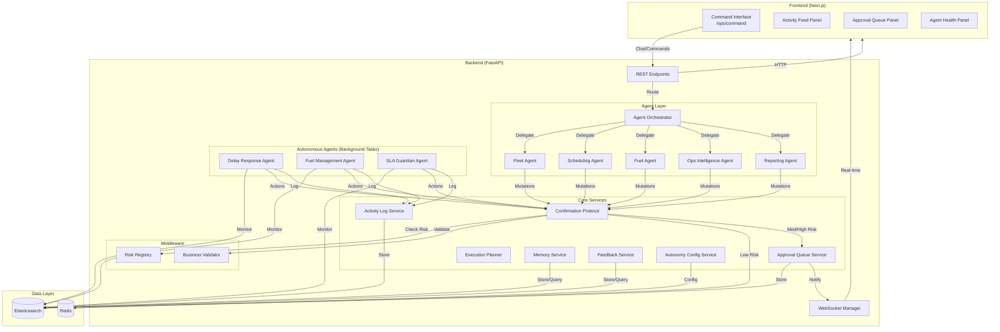
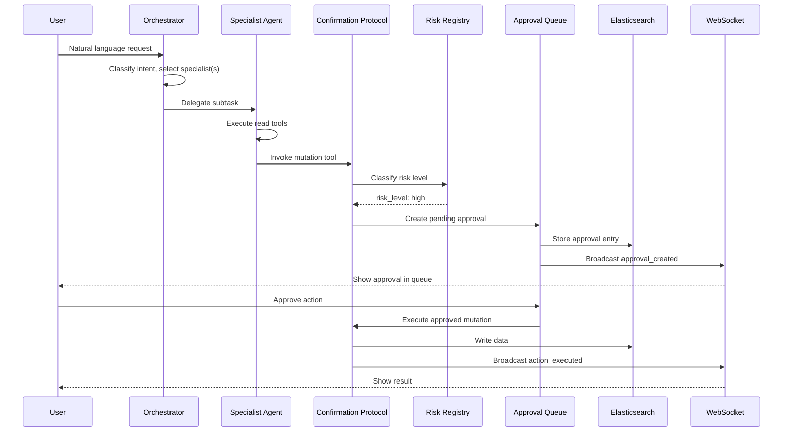
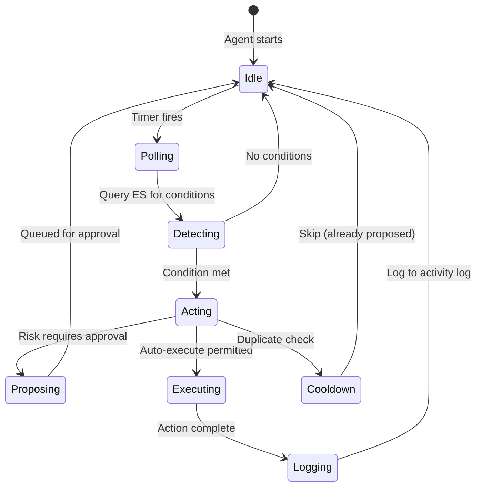
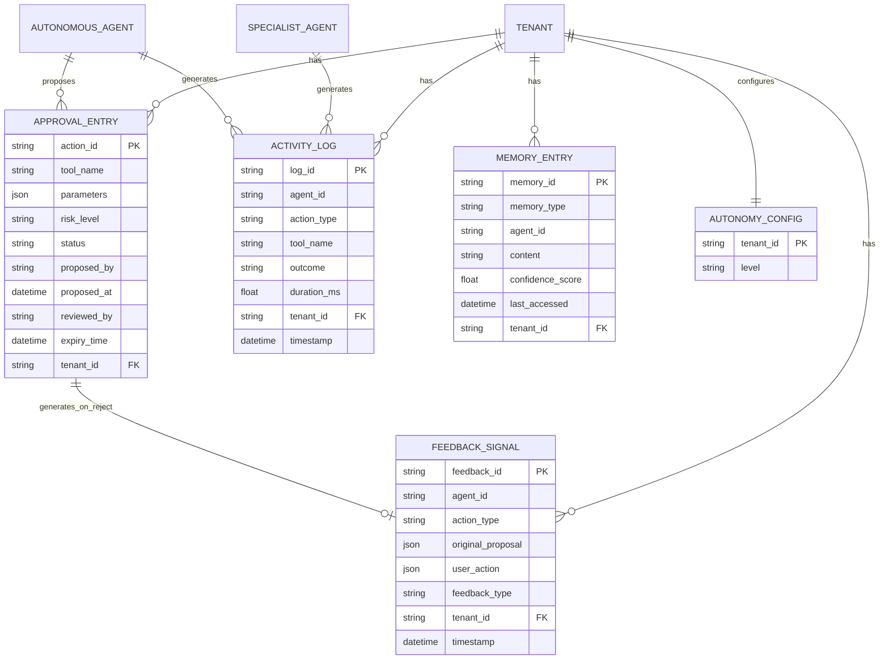

# Technical Design: Agentic AI Transformation

## Overview

This design transforms the Runsheet logistics platform from a read-only AI assistant into a fully agentic system where AI agents autonomously monitor, decide, and act on operational data. The transformation introduces:

- **Mutation tools** with risk-classified confirmation protocols enabling the agent to write data
- **Approval queue** for human oversight of high-impact agent actions
- **Autonomous background agents** (Delay Response, Fuel Management, SLA Guardian) that monitor and act without human prompting
- **Multi-step execution planning** for complex multi-tool operations
- **Multi-agent architecture** with an orchestrator routing to specialist domain agents
- **Agent activity log** for full observability and audit trail
- **Agent-first frontend** with command interface, activity feed, and approval queue
- **Autonomy level configuration** for gradual trust escalation per tenant
- **Long-term memory** for operational pattern learning across sessions
- **Human feedback loop** for continuous improvement from corrections and overrides

The system builds on the existing Strands SDK + Gemini 2.5 Flash agent, FastAPI backend, Elasticsearch data layer, WebSocket real-time updates, and Redis state management. All 26 existing read-only tools remain unchanged; new mutation tools and autonomous agents are additive.

## Architecture

### High-Level System Architecture



### Agent Orchestration Flow



### Autonomous Agent Lifecycle



## Components and Interfaces

### 1. Mutation Tools Module (`Runsheet-backend/Agents/tools/mutation_tools.py`)

New Strands `@tool`-decorated functions that modify data. Each mutation tool follows the same pattern as existing read-only tools but routes through the Confirmation Protocol before writing.

**Scheduling Mutations:**
```python
@tool
async def assign_asset_to_job(job_id: str, asset_id: str, tenant_id: str = "default") -> str:
    """Assign an asset to a job. Risk: medium."""

@tool
async def update_job_status(job_id: str, new_status: str, reason: str, tenant_id: str = "default") -> str:
    """Update job status with valid transition check. Risk: medium."""

@tool
async def cancel_job(job_id: str, reason: str, tenant_id: str = "default") -> str:
    """Cancel a job. Risk: high."""

@tool
async def create_job(job_type: str, origin: str, destination: str, scheduled_time: str,
                     asset_id: str = None, cargo_manifest: list = None,
                     tenant_id: str = "default") -> str:
    """Create a new logistics job. Risk: medium."""
```

**Ops Mutations:**
```python
@tool
async def reassign_rider(shipment_id: str, new_rider_id: str, reason: str, tenant_id: str) -> str:
    """Reassign a shipment to a different rider. Risk: high."""

@tool
async def escalate_shipment(shipment_id: str, priority: str, reason: str, tenant_id: str) -> str:
    """Escalate shipment priority. Risk: medium."""
```

**Fuel Mutations:**
```python
@tool
async def request_fuel_refill(station_id: str, quantity_liters: float, priority: str,
                               tenant_id: str = "default") -> str:
    """Request a fuel refill for a station. Risk: medium."""

@tool
async def update_fuel_threshold(station_id: str, threshold_pct: float,
                                 tenant_id: str = "default") -> str:
    """Update fuel alert threshold. Risk: low."""
```

### 2. Risk Classification Registry (`Runsheet-backend/Agents/risk_registry.py`)

A configurable mapping from tool names to risk levels, stored as a Python dict with Redis override capability.

```python
from enum import Enum
from typing import Dict, Optional
import json
import logging

logger = logging.getLogger(__name__)

class RiskLevel(str, Enum):
    LOW = "low"
    MEDIUM = "medium"
    HIGH = "high"

# Default risk classification for mutation tools
DEFAULT_RISK_REGISTRY: Dict[str, RiskLevel] = {
    # Low risk - execute immediately
    "update_fuel_threshold": RiskLevel.LOW,
    # Medium risk - brief confirmation window
    "assign_asset_to_job": RiskLevel.MEDIUM,
    "update_job_status": RiskLevel.MEDIUM,
    "create_job": RiskLevel.MEDIUM,
    "escalate_shipment": RiskLevel.MEDIUM,
    "request_fuel_refill": RiskLevel.MEDIUM,
    # High risk - explicit approval required
    "cancel_job": RiskLevel.HIGH,
    "reassign_rider": RiskLevel.HIGH,
}

class RiskRegistry:
    """Classifies mutation tool invocations by risk level."""

    def __init__(self, redis_client=None):
        self._defaults = dict(DEFAULT_RISK_REGISTRY)
        self._redis = redis_client

    async def classify(self, tool_name: str) -> RiskLevel:
        """Return the risk level for a tool, checking Redis overrides first."""
        if self._redis:
            override = await self._redis.get(f"risk_override:{tool_name}")
            if override:
                return RiskLevel(override.decode())
        return self._defaults.get(tool_name, RiskLevel.HIGH)  # Default to HIGH for unknown

    async def set_override(self, tool_name: str, level: RiskLevel) -> None:
        """Set a Redis-backed risk level override."""
        if self._redis:
            await self._redis.set(f"risk_override:{tool_name}", level.value)
```

### 3. Confirmation Protocol (`Runsheet-backend/Agents/confirmation_protocol.py`)

Central decision engine that determines whether a mutation executes immediately, waits for brief confirmation, or queues for approval.

```python
from dataclasses import dataclass
from typing import Any, Dict, Optional

@dataclass
class MutationRequest:
    tool_name: str
    parameters: Dict[str, Any]
    tenant_id: str
    agent_id: str
    user_id: Optional[str] = None
    session_id: Optional[str] = None

@dataclass
class MutationResult:
    executed: bool
    approval_id: Optional[str] = None
    result: Optional[str] = None
    risk_level: str = "unknown"
    confirmation_method: str = "unknown"  # "immediate", "timed", "approval_queue"

class ConfirmationProtocol:
    def __init__(self, risk_registry, approval_queue_service,
                 autonomy_config_service, activity_log_service, business_validator):
        self._risk_registry = risk_registry
        self._approval_queue = approval_queue_service
        self._autonomy = autonomy_config_service
        self._activity_log = activity_log_service
        self._validator = business_validator

    async def process_mutation(self, request: MutationRequest) -> MutationResult:
        """
        Route a mutation through risk classification and autonomy level checks.
        Returns MutationResult indicating whether the action was executed or queued.
        """
        # 1. Classify risk
        risk_level = await self._risk_registry.classify(request.tool_name)

        # 2. Validate business rules
        validation = await self._validator.validate(request.tool_name, request.parameters, request.tenant_id)
        if not validation.valid:
            return MutationResult(executed=False, risk_level=risk_level.value,
                                  result=f"Validation failed: {validation.reason}",
                                  confirmation_method="rejected")

        # 3. Check autonomy level
        autonomy = await self._autonomy.get_level(request.tenant_id)
        should_auto_execute = self._should_auto_execute(risk_level, autonomy)

        if should_auto_execute:
            # Execute immediately
            result = await self._execute_mutation(request)
            await self._activity_log.log_mutation(request, risk_level, "immediate", result)
            return MutationResult(executed=True, risk_level=risk_level.value,
                                  result=result, confirmation_method="immediate")
        else:
            # Queue for approval
            approval_id = await self._approval_queue.create(request, risk_level)
            await self._activity_log.log_mutation(request, risk_level, "approval_queue", None)
            return MutationResult(executed=False, approval_id=approval_id,
                                  risk_level=risk_level.value,
                                  confirmation_method="approval_queue")

    def _should_auto_execute(self, risk_level, autonomy_level: str) -> bool:
        matrix = {
            "suggest-only": set(),
            "auto-low": {"low"},
            "auto-medium": {"low", "medium"},
            "full-auto": {"low", "medium", "high"},
        }
        return risk_level.value in matrix.get(autonomy_level, set())
```

### 4. Approval Queue Service (`Runsheet-backend/Agents/approval_queue_service.py`)

Manages the lifecycle of pending agent actions requiring human approval.

```python
import uuid
from datetime import datetime, timedelta
from typing import Optional, List

class ApprovalQueueService:
    def __init__(self, es_service, ws_manager, activity_log_service, confirmation_protocol=None):
        self._es = es_service
        self._ws = ws_manager
        self._activity_log = activity_log_service
        self._confirmation_protocol = confirmation_protocol
        self.INDEX = "agent_approval_queue"

    async def create(self, request, risk_level, expiry_minutes: int = 60) -> str:
        """Create a pending approval entry. Returns action_id."""
        action_id = str(uuid.uuid4())
        doc = {
            "action_id": action_id,
            "action_type": "mutation",
            "tool_name": request.tool_name,
            "parameters": request.parameters,
            "risk_level": risk_level.value,
            "proposed_by": request.agent_id,
            "proposed_at": datetime.utcnow().isoformat() + "Z",
            "status": "pending",
            "reviewed_by": None,
            "reviewed_at": None,
            "expiry_time": (datetime.utcnow() + timedelta(minutes=expiry_minutes)).isoformat() + "Z",
            "impact_summary": self._generate_impact_summary(request),
            "tenant_id": request.tenant_id,
        }
        await self._es.index(self.INDEX, action_id, doc)
        await self._ws.broadcast_approval_event("approval_created", doc)
        return action_id

    async def approve(self, action_id: str, reviewer_id: str) -> dict:
        """Approve and execute a pending action."""
        ...

    async def reject(self, action_id: str, reviewer_id: str, reason: str = "") -> dict:
        """Reject a pending action and store feedback signal."""
        ...

    async def expire_stale(self) -> int:
        """Mark expired approvals. Called periodically."""
        ...

    async def list_pending(self, tenant_id: str, page: int = 1, size: int = 20) -> dict:
        """List pending approvals for a tenant."""
        ...
```

### 5. Autonomous Agent Base Class (`Runsheet-backend/Agents/autonomous/base_agent.py`)

Shared base for all background monitoring agents with polling, cooldown, and logging.

```python
import asyncio
import logging
from abc import ABC, abstractmethod
from datetime import datetime, timedelta
from typing import Dict, Set

class AutonomousAgentBase(ABC):
    """Base class for background monitoring agents."""

    def __init__(self, agent_id: str, poll_interval_seconds: int,
                 cooldown_minutes: int, activity_log_service, ws_manager,
                 confirmation_protocol, feature_flag_service=None):
        self.agent_id = agent_id
        self.poll_interval = poll_interval_seconds
        self.cooldown_minutes = cooldown_minutes
        self._activity_log = activity_log_service
        self._ws = ws_manager
        self._confirmation_protocol = confirmation_protocol
        self._feature_flags = feature_flag_service
        self._cooldown_tracker: Dict[str, datetime] = {}
        self._running = False
        self._task: asyncio.Task = None
        self.logger = logging.getLogger(f"agent.{agent_id}")

    async def start(self):
        """Start the polling loop as a background task."""
        self._running = True
        self._task = asyncio.create_task(self._run_loop())

    async def stop(self):
        """Gracefully stop the agent."""
        self._running = False
        if self._task:
            self._task.cancel()

    async def _run_loop(self):
        while self._running:
            cycle_start = datetime.utcnow()
            try:
                detections, actions = await self.monitor_cycle()
                await self._activity_log.log_monitoring_cycle(
                    self.agent_id, len(detections), len(actions),
                    (datetime.utcnow() - cycle_start).total_seconds() * 1000
                )
            except Exception as e:
                self.logger.error(f"Monitor cycle error: {e}")
            await asyncio.sleep(self.poll_interval)

    def _is_on_cooldown(self, entity_id: str) -> bool:
        last = self._cooldown_tracker.get(entity_id)
        if last and (datetime.utcnow() - last) < timedelta(minutes=self.cooldown_minutes):
            return True
        return False

    def _set_cooldown(self, entity_id: str):
        self._cooldown_tracker[entity_id] = datetime.utcnow()

    @abstractmethod
    async def monitor_cycle(self) -> tuple:
        """Execute one monitoring cycle. Returns (detections, actions)."""
        ...

    @property
    def status(self) -> str:
        if self._running and self._task and not self._task.done():
            return "running"
        elif self._task and self._task.done() and self._task.exception():
            return "error"
        return "stopped"
```

### 6. Specialist Agents (`Runsheet-backend/Agents/specialists/`)

Each specialist agent wraps a Strands `Agent` instance with a domain-specific system prompt and tool subset.

```python
# Example: fleet_agent.py
from strands import Agent
from strands.models.litellm import LiteLLMModel

class FleetAgent:
    """Specialist agent for fleet operations."""

    def __init__(self, model: LiteLLMModel):
        self.agent = Agent(
            model=model,
            system_prompt="""You are a Fleet Operations Specialist. You manage
            fleet assets, track locations, and handle fleet mutations.
            You have access to fleet-specific tools only.""",
            tools=[
                search_fleet_data, get_fleet_summary, find_truck_by_id,
                get_all_locations,
                # Mutation tools
                assign_asset_to_job,
            ]
        )

    async def handle(self, task: str, context: dict = None) -> str:
        """Process a fleet-related subtask."""
        result = await self.agent.invoke_async(task)
        return str(result)
```

### 7. Agent Orchestrator (`Runsheet-backend/Agents/orchestrator.py`)

Top-level agent that receives user requests, classifies intent, delegates to specialists, and synthesizes results.

```python
class AgentOrchestrator:
    """Routes requests to specialist agents and synthesizes results."""

    ROUTING_TABLE = {
        "fleet": ["truck", "vehicle", "vessel", "equipment", "container", "asset", "location", "fleet"],
        "scheduling": ["job", "schedule", "dispatch", "assign", "cancel", "delay", "cargo"],
        "fuel": ["fuel", "refill", "station", "diesel", "petrol", "consumption"],
        "ops": ["shipment", "rider", "sla", "delivery", "ops", "breach"],
        "reporting": ["report", "analysis", "summary", "overview", "performance", "productivity"],
    }

    def __init__(self, specialists: dict, execution_planner, activity_log_service):
        self._specialists = specialists  # {"fleet": FleetAgent, ...}
        self._planner = execution_planner
        self._activity_log = activity_log_service

    async def route(self, user_message: str, tenant_id: str, session_id: str = None) -> str:
        """Classify intent and delegate to appropriate specialist(s)."""
        targets = self._classify_intent(user_message)

        if len(targets) == 0:
            targets = ["reporting"]  # Default fallback

        if self._is_complex_request(user_message):
            plan = await self._planner.create_plan(user_message, targets)
            return await self._execute_plan(plan, tenant_id)

        results = []
        for target in targets:
            agent = self._specialists.get(target)
            if agent:
                result = await agent.handle(user_message, {"tenant_id": tenant_id})
                results.append(result)

        return self._synthesize(results)

    def _classify_intent(self, message: str) -> list:
        """Keyword-based intent classification against routing table."""
        message_lower = message.lower()
        matched = []
        for domain, keywords in self.ROUTING_TABLE.items():
            if any(kw in message_lower for kw in keywords):
                matched.append(domain)
        return matched
```

### 8. Execution Planner (`Runsheet-backend/Agents/execution_planner.py`)

Generates and executes multi-step plans for complex requests.

```python
from dataclasses import dataclass, field
from typing import List, Optional, Dict, Any
from enum import Enum

class StepStatus(str, Enum):
    PENDING = "pending"
    RUNNING = "running"
    COMPLETED = "completed"
    FAILED = "failed"
    SKIPPED = "skipped"
    ROLLED_BACK = "rolled_back"

@dataclass
class PlanStep:
    step_id: int
    description: str
    agent: str
    tool_name: str
    parameters: Dict[str, Any]
    depends_on: List[int] = field(default_factory=list)
    rollback_tool: Optional[str] = None
    rollback_params: Optional[Dict[str, Any]] = None
    status: StepStatus = StepStatus.PENDING
    result: Optional[str] = None
    recovery_attempts: int = 0

@dataclass
class ExecutionPlan:
    plan_id: str
    goal: str
    steps: List[PlanStep]
    status: str = "pending"  # pending, executing, completed, partial_failure, aborted

class ExecutionPlanner:
    MAX_RECOVERY_ATTEMPTS = 2

    async def create_plan(self, request: str, target_domains: list) -> ExecutionPlan:
        """Use the orchestrator LLM to decompose a request into ordered steps."""
        ...

    async def execute_plan(self, plan: ExecutionPlan, tenant_id: str) -> ExecutionPlan:
        """Execute plan steps in dependency order with error recovery."""
        ...

    async def rollback_plan(self, plan: ExecutionPlan) -> ExecutionPlan:
        """Rollback completed steps in reverse order."""
        ...
```

### 9. Activity Log Service (`Runsheet-backend/Agents/activity_log_service.py`)

Centralized logging for all agent actions to a dedicated Elasticsearch index.

```python
class ActivityLogService:
    INDEX = "agent_activity_log"

    def __init__(self, es_service, ws_manager=None):
        self._es = es_service
        self._ws = ws_manager

    async def log(self, entry: dict) -> str:
        """Write an activity log entry and broadcast via WebSocket."""
        log_id = str(uuid.uuid4())
        entry["log_id"] = log_id
        entry["timestamp"] = datetime.utcnow().isoformat() + "Z"
        await self._es.index(self.INDEX, log_id, entry)
        if self._ws:
            await self._ws.broadcast_activity(entry)
        return log_id

    async def log_mutation(self, request, risk_level, confirmation_method, result):
        ...

    async def log_monitoring_cycle(self, agent_id, detection_count, action_count, duration_ms):
        ...

    async def log_tool_invocation(self, agent_id, tool_name, params, outcome, duration_ms):
        ...

    async def query(self, filters: dict, page: int = 1, size: int = 50) -> dict:
        """Query activity log with filters."""
        ...

    async def get_stats(self, tenant_id: str) -> dict:
        """Aggregated statistics: actions per agent, success rates, etc."""
        ...
```

### 10. Memory Service (`Runsheet-backend/Agents/memory_service.py`)

Long-term memory store for operational patterns and user preferences.

```python
class MemoryService:
    INDEX = "agent_memory"

    async def store_pattern(self, agent_id: str, tenant_id: str, content: str,
                            confidence: float, tags: list) -> str:
        """Store a discovered operational pattern."""
        ...

    async def store_preference(self, agent_id: str, tenant_id: str, content: str,
                                tags: list) -> str:
        """Store a user preference from conversation."""
        ...

    async def query_relevant(self, tenant_id: str, context: str, limit: int = 5) -> list:
        """Query memories relevant to the current context using text matching."""
        ...

    async def decay_stale(self) -> int:
        """Reduce confidence of memories not accessed in 90 days. Purge below 0.1."""
        ...

    async def delete(self, memory_id: str, tenant_id: str) -> bool:
        """Delete a specific memory."""
        ...
```

### 11. Feedback Service (`Runsheet-backend/Agents/feedback_service.py`)

Captures and queries human feedback signals for agent learning.

```python
class FeedbackService:
    INDEX = "agent_feedback"

    async def record_rejection(self, agent_id: str, action_type: str,
                                original_proposal: dict, rejection_reason: str,
                                user_action: dict, tenant_id: str, user_id: str) -> str:
        """Record a rejection feedback signal."""
        ...

    async def record_override(self, agent_id: str, action_type: str,
                               original_suggestion: dict, user_action: dict,
                               tenant_id: str, user_id: str) -> str:
        """Record a manual override feedback signal."""
        ...

    async def query_similar(self, action_type: str, context: dict,
                             tenant_id: str, limit: int = 10) -> list:
        """Query recent feedback for similar situations."""
        ...

    async def get_stats(self, tenant_id: str) -> dict:
        """Feedback statistics: rejection rates, common reasons, trends."""
        ...

    def compute_confidence(self, action_type: str, parameters: dict,
                            recent_feedback: list) -> float:
        """Compute confidence score based on historical feedback."""
        ...
```

### 12. REST Endpoints

New FastAPI routes added to `main.py` or a dedicated `agent_endpoints.py` router:

```python
# Approval Queue Endpoints
GET  /agent/approvals                          # List pending approvals
POST /agent/approvals/{action_id}/approve      # Approve an action
POST /agent/approvals/{action_id}/reject       # Reject an action

# Activity Log Endpoints
GET  /agent/activity                           # Paginated activity log
GET  /agent/activity/stats                     # Aggregated statistics

# Autonomy Configuration
PATCH /agent/config/autonomy                   # Update autonomy level (admin only)

# Memory Endpoints
GET    /agent/memory                           # List memories
DELETE /agent/memory/{memory_id}               # Delete a memory

# Feedback Endpoints
GET  /agent/feedback                           # List feedback signals
GET  /agent/feedback/stats                     # Feedback statistics

# Agent Health
GET  /agent/health                             # Status of all agents
POST /agent/{agent_id}/pause                   # Pause an autonomous agent
POST /agent/{agent_id}/resume                  # Resume an autonomous agent
```

### 13. WebSocket Channels

New WebSocket channel for agent activity:

```
/ws/agent-activity    # Real-time agent activity feed
```

Existing WebSocket channels extended with new event types:
- `approval_created`, `approval_approved`, `approval_rejected`, `approval_expired`
- `delay_alert`, `fuel_alert`, `sla_breach`
- `agent_action_executed`


## Data Models

### Elasticsearch Index Mappings

#### `agent_approval_queue` Index

```json
{
  "mappings": {
    "properties": {
      "action_id": { "type": "keyword" },
      "action_type": { "type": "keyword" },
      "tool_name": { "type": "keyword" },
      "parameters": { "type": "object", "enabled": true },
      "risk_level": { "type": "keyword" },
      "proposed_by": { "type": "keyword" },
      "proposed_at": { "type": "date" },
      "status": { "type": "keyword" },
      "reviewed_by": { "type": "keyword" },
      "reviewed_at": { "type": "date" },
      "expiry_time": { "type": "date" },
      "impact_summary": { "type": "text" },
      "execution_result": { "type": "object", "enabled": true },
      "tenant_id": { "type": "keyword" }
    }
  }
}
```

#### `agent_activity_log` Index

```json
{
  "mappings": {
    "properties": {
      "log_id": { "type": "keyword" },
      "agent_id": { "type": "keyword" },
      "action_type": { "type": "keyword" },
      "tool_name": { "type": "keyword" },
      "parameters": { "type": "object", "enabled": true },
      "risk_level": { "type": "keyword" },
      "outcome": { "type": "keyword" },
      "duration_ms": { "type": "float" },
      "tenant_id": { "type": "keyword" },
      "user_id": { "type": "keyword" },
      "session_id": { "type": "keyword" },
      "timestamp": { "type": "date" },
      "details": { "type": "object", "enabled": true }
    }
  },
  "settings": {
    "index.lifecycle.name": "agent_activity_log_policy"
  }
}
```

**ILM Policy (`agent_activity_log_policy`):**
- Hot: 0-30 days
- Warm: 30-90 days
- Cold: 90-365 days
- Delete: after 365 days

#### `agent_memory` Index

```json
{
  "mappings": {
    "properties": {
      "memory_id": { "type": "keyword" },
      "memory_type": { "type": "keyword" },
      "agent_id": { "type": "keyword" },
      "tenant_id": { "type": "keyword" },
      "content": { "type": "text" },
      "confidence_score": { "type": "float" },
      "created_at": { "type": "date" },
      "last_accessed": { "type": "date" },
      "access_count": { "type": "integer" },
      "tags": { "type": "keyword" }
    }
  }
}
```

#### `agent_feedback` Index

```json
{
  "mappings": {
    "properties": {
      "feedback_id": { "type": "keyword" },
      "agent_id": { "type": "keyword" },
      "action_type": { "type": "keyword" },
      "original_proposal": { "type": "object", "enabled": true },
      "user_action": { "type": "object", "enabled": true },
      "feedback_type": { "type": "keyword" },
      "tenant_id": { "type": "keyword" },
      "user_id": { "type": "keyword" },
      "timestamp": { "type": "date" },
      "context": { "type": "object", "enabled": true }
    }
  }
}
```

### Redis Data Structures

#### Autonomy Level Configuration
```
Key:    tenant:{tenant_id}:autonomy_level
Value:  "suggest-only" | "auto-low" | "auto-medium" | "full-auto"
TTL:    None (persistent)
```

#### Risk Level Overrides
```
Key:    risk_override:{tool_name}
Value:  "low" | "medium" | "high"
TTL:    None (persistent)
```

#### Autonomous Agent Cooldown Tracking
```
Key:    agent_cooldown:{agent_id}:{entity_id}
Value:  ISO timestamp of last action
TTL:    Matches cooldown period (e.g., 900s for 15-min cooldown)
```

### Pydantic Models

```python
from pydantic import BaseModel, Field
from typing import Optional, List, Dict, Any
from datetime import datetime
from enum import Enum

class RiskLevel(str, Enum):
    LOW = "low"
    MEDIUM = "medium"
    HIGH = "high"

class AutonomyLevel(str, Enum):
    SUGGEST_ONLY = "suggest-only"
    AUTO_LOW = "auto-low"
    AUTO_MEDIUM = "auto-medium"
    FULL_AUTO = "full-auto"

class ApprovalStatus(str, Enum):
    PENDING = "pending"
    APPROVED = "approved"
    REJECTED = "rejected"
    EXPIRED = "expired"
    EXECUTED = "executed"

class ApprovalEntry(BaseModel):
    action_id: str
    action_type: str
    tool_name: str
    parameters: Dict[str, Any]
    risk_level: RiskLevel
    proposed_by: str
    proposed_at: datetime
    status: ApprovalStatus
    reviewed_by: Optional[str] = None
    reviewed_at: Optional[datetime] = None
    expiry_time: datetime
    impact_summary: str
    execution_result: Optional[Dict[str, Any]] = None
    tenant_id: str

class ActivityLogEntry(BaseModel):
    log_id: str
    agent_id: str
    action_type: str  # query, mutation, plan, monitoring_cycle, detection, approval_request
    tool_name: Optional[str] = None
    parameters: Optional[Dict[str, Any]] = None
    risk_level: Optional[RiskLevel] = None
    outcome: str  # success, failure, pending_approval, rejected
    duration_ms: float
    tenant_id: str
    user_id: Optional[str] = None
    session_id: Optional[str] = None
    timestamp: datetime
    details: Optional[Dict[str, Any]] = None

class MemoryEntry(BaseModel):
    memory_id: str
    memory_type: str  # pattern, preference, feedback
    agent_id: str
    tenant_id: str
    content: str
    confidence_score: float = Field(ge=0.0, le=1.0)
    created_at: datetime
    last_accessed: datetime
    access_count: int = 0
    tags: List[str] = []

class FeedbackSignal(BaseModel):
    feedback_id: str
    agent_id: str
    action_type: str
    original_proposal: Dict[str, Any]
    user_action: Optional[Dict[str, Any]] = None
    feedback_type: str  # rejection, override, correction
    tenant_id: str
    user_id: str
    timestamp: datetime
    context: Optional[Dict[str, Any]] = None

class AutonomyUpdateRequest(BaseModel):
    level: AutonomyLevel

class ApprovalRejectRequest(BaseModel):
    reason: str = ""
```

### Entity Relationship Diagram




## Correctness Properties

*A property is a characteristic or behavior that should hold true across all valid executions of a system — essentially, a formal statement about what the system should do. Properties serve as the bridge between human-readable specifications and machine-verifiable correctness guarantees.*

### Property 1: Confirmation Protocol Routing Matrix

*For any* combination of risk level (low, medium, high) and autonomy level (suggest-only, auto-low, auto-medium, full-auto), the Confirmation Protocol SHALL correctly determine whether to auto-execute the mutation or queue it for approval, according to the matrix: suggest-only allows nothing, auto-low allows low, auto-medium allows low+medium, full-auto allows all.

**Validates: Requirements 1.5, 1.7, 10.3**

### Property 2: Risk Classification Completeness

*For any* tool name, the Risk Registry SHALL return a valid RiskLevel (low, medium, or high). For any tool name not explicitly registered, the registry SHALL default to HIGH.

**Validates: Requirements 1.4**

### Property 3: Business Rule Validation Rejects Invalid Mutations

*For any* mutation request with parameters that violate business rules (invalid status transitions, non-existent entity references, out-of-range values), the Confirmation Protocol SHALL return executed=False with a validation failure reason, and the underlying data SHALL remain unchanged.

**Validates: Requirements 1.9**

### Property 4: Activity Log Completeness

*For any* agent action (tool invocation, mutation, monitoring cycle, plan execution, autonomy level change), an activity log entry SHALL be created containing agent_id, action_type, timestamp, outcome, and duration_ms. The count of activity log entries SHALL be greater than or equal to the count of agent actions performed.

**Validates: Requirements 1.8, 3.7, 4.6, 5.6, 6.7, 8.2, 8.3, 10.5**

### Property 5: Approval Lifecycle State Machine

*For any* approval entry, the status transitions SHALL follow the valid state machine: pending → approved → executed, pending → rejected, pending → expired. No other transitions are permitted. Approving a pending action SHALL trigger execution and store the execution result in the approval entry.

**Validates: Requirements 2.4, 2.5, 2.6, 2.8**

### Property 6: Approval Queue Sorting Invariant

*For any* set of pending approval entries returned by the list endpoint, the entries SHALL be sorted by proposed_at in descending order (most recent first).

**Validates: Requirements 2.3**

### Property 7: Approval Expiry Correctness

*For any* approval entry with status "pending" whose expiry_time is in the past, the expire_stale function SHALL mark it as "expired" and log the expiry to the activity log.

**Validates: Requirements 2.6**

### Property 8: Autonomous Agent Cooldown Prevents Duplicates

*For any* autonomous agent (Delay Response, Fuel Management, SLA Guardian) and any entity (job, station, shipment), if an action was proposed for that entity within the configured cooldown period, the agent SHALL NOT propose a duplicate action for the same entity until the cooldown expires.

**Validates: Requirements 3.6, 4.4, 5.7**

### Property 9: Fuel Refill Quantity Calculation

*For any* fuel station with capacity C liters and current stock S liters where status is "critical" or days_until_empty is below threshold, the calculated refill quantity SHALL equal (0.8 × C) − S, restoring the station to 80% capacity.

**Validates: Requirements 4.3**

### Property 10: Fuel Refill Priority Classification

*For any* fuel station with a days_until_empty value D, the calculated priority SHALL be: "critical" if D < 1, "high" if 1 ≤ D < 3, "medium" if 3 ≤ D < 5, and "normal" otherwise.

**Validates: Requirements 4.7**

### Property 11: Execution Plan Dependency Acyclicity

*For any* generated execution plan, the dependency graph formed by step depends_on references SHALL be a directed acyclic graph (DAG). All referenced step_ids in depends_on SHALL exist in the plan.

**Validates: Requirements 6.1**

### Property 12: Execution Plan Step Ordering

*For any* execution plan trace, no step SHALL begin execution before all of its dependencies have completed successfully. The execution order SHALL be a valid topological sort of the dependency graph.

**Validates: Requirements 6.3**

### Property 13: Execution Plan Recovery Bound

*For any* step in an execution plan that fails, the number of recovery attempts SHALL NOT exceed 2 (MAX_RECOVERY_ATTEMPTS).

**Validates: Requirements 6.5**

### Property 14: Execution Plan Rollback Order

*For any* plan rollback, steps with rollback actions SHALL be rolled back in reverse completion order (last completed step rolled back first).

**Validates: Requirements 6.8**

### Property 15: Specialist Agent Tool Set Isolation

*For any* specialist agent, its tool set SHALL be exactly the set of tools defined for its domain in the requirements. No specialist agent SHALL have access to tools outside its designated domain.

**Validates: Requirements 7.1, 7.2, 7.3, 7.4, 7.5**

### Property 16: Orchestrator Intent Routing

*For any* user request containing keywords from one or more domains in the routing table, the orchestrator SHALL delegate to all matching specialist agents. For requests with no keyword matches, the orchestrator SHALL fall back to the reporting agent.

**Validates: Requirements 7.6, 7.7, 7.8**

### Property 17: Activity Log Filter Correctness

*For any* query to the activity log endpoint with filters (agent_id, action_type, tenant_id, time_range, outcome), every returned entry SHALL match all specified filters. No entry matching all filters SHALL be excluded from the results.

**Validates: Requirements 8.4**

### Property 18: Memory Store Round-Trip

*For any* valid memory entry (pattern or preference) stored via the Memory Service, retrieving it by memory_id SHALL return the same content, memory_type, confidence_score, and tags.

**Validates: Requirements 11.2, 11.3**

### Property 19: Memory Deletion Completeness

*For any* memory entry, after deletion via DELETE /agent/memory/{memory_id}, querying by that memory_id SHALL return no results.

**Validates: Requirements 11.6**

### Property 20: Memory Relevance Decay

*For any* memory entry with last_accessed more than 90 days ago, after running the decay function, the confidence_score SHALL be reduced to 50% of its previous value. *For any* memory entry with confidence_score below 0.1 after decay, the entry SHALL be purged from the index.

**Validates: Requirements 11.7**

### Property 21: Rejection Feedback Signal Creation

*For any* approval that is rejected, a feedback signal SHALL be created in the agent_feedback index with feedback_type="rejection", the original_proposal matching the approval's tool_name and parameters, and the rejection reason.

**Validates: Requirements 12.1**

### Property 22: Confidence Score Monotonic Decrease with Rejections

*For any* proposed action type, as the number of similar past rejections increases, the computed confidence score SHALL monotonically decrease (or remain equal). An action with zero past rejections SHALL have a higher confidence than the same action with one or more past rejections.

**Validates: Requirements 12.7**

## Error Handling

### Mutation Tool Errors

| Error Scenario | Handling | User Impact |
|---|---|---|
| Business rule validation failure | Return validation error with reason, suggest corrective action | Agent explains what's wrong and how to fix it |
| Elasticsearch write failure | Retry once, then return error with details | Agent reports the failure and suggests retrying |
| Approval queue full/unavailable | Fall back to requiring explicit chat confirmation | Agent asks user to confirm in chat |
| Circuit breaker open (Gemini API) | Return cached error response with retry time | Existing circuit breaker pattern applies |

### Autonomous Agent Errors

| Error Scenario | Handling | Recovery |
|---|---|---|
| ES query timeout during monitoring | Log error, skip cycle, retry next interval | Self-healing via next poll cycle |
| Mutation tool failure during auto-action | Log failure, do not retry automatically, alert via WebSocket | Human reviews in activity log |
| Feature flag service unavailable | Fail-open (allow processing), log warning | Consistent with existing ops_feature_guard pattern |
| Redis unavailable for cooldown tracking | Fall back to in-memory cooldown dict | Graceful degradation, may produce occasional duplicates |

### Approval Queue Errors

| Error Scenario | Handling | Recovery |
|---|---|---|
| Approve action for already-expired entry | Return 409 Conflict with explanation | User sees current status |
| Approve action that fails execution | Mark as "executed" with failure details in execution_result | User sees failure in approval entry |
| Concurrent approve/reject race | Use ES optimistic concurrency (version/seq_no) | First writer wins, second gets 409 |

### Memory and Feedback Errors

| Error Scenario | Handling | Recovery |
|---|---|---|
| Memory store write failure | Log warning, continue without storing | Agent functions normally, just doesn't learn |
| Feedback query failure | Log warning, proceed without feedback context | Agent makes decisions without historical context |
| Memory decay job failure | Log error, retry on next scheduled run | Stale memories persist longer than intended |

## Testing Strategy

### Property-Based Testing

This feature is well-suited for property-based testing. The core logic involves pure functions (risk classification, routing matrix, priority calculation, dependency graph validation, confidence scoring) and state machines (approval lifecycle, cooldown tracking) that have universal properties across all valid inputs.

**Library:** [Hypothesis](https://hypothesis.readthedocs.io/) (Python)

**Configuration:**
- Minimum 100 iterations per property test
- Each property test references its design document property
- Tag format: `Feature: agentic-ai-transformation, Property {number}: {property_text}`

**Property tests to implement:**

1. **Confirmation Protocol Routing Matrix** (Property 1) — Generate all 12 combinations of (risk_level × autonomy_level) and verify correct execute/queue decision
2. **Risk Classification Completeness** (Property 2) — Generate random tool names and verify valid RiskLevel returned, unknown defaults to HIGH
3. **Business Rule Validation** (Property 3) — Generate invalid mutation parameters and verify rejection
4. **Activity Log Completeness** (Property 4) — Generate sequences of agent actions and verify log entry count
5. **Approval Lifecycle State Machine** (Property 5) — Generate sequences of state transitions and verify only valid transitions succeed
6. **Approval Queue Sorting** (Property 6) — Generate random approval entries and verify sorted output
7. **Approval Expiry** (Property 7) — Generate approvals with various expiry times and verify correct expiry marking
8. **Cooldown Deduplication** (Property 8) — Generate action sequences with timestamps and verify cooldown enforcement
9. **Fuel Refill Quantity** (Property 9) — Generate random (capacity, stock) pairs and verify calculation
10. **Fuel Priority Classification** (Property 10) — Generate random days_until_empty values and verify priority
11. **Plan Dependency Acyclicity** (Property 11) — Generate random dependency graphs and verify DAG validation
12. **Plan Step Ordering** (Property 12) — Generate plans and verify topological sort execution
13. **Recovery Bound** (Property 13) — Generate failing steps and verify max 2 recovery attempts
14. **Rollback Order** (Property 14) — Generate completed plans and verify reverse rollback order
15. **Specialist Tool Isolation** (Property 15) — Verify each specialist's tool set matches specification
16. **Orchestrator Routing** (Property 16) — Generate messages with domain keywords and verify routing
17. **Activity Log Filtering** (Property 17) — Generate log entries and filter combinations, verify correctness
18. **Memory Round-Trip** (Property 18) — Generate random memory entries, store and retrieve, verify equality
19. **Memory Deletion** (Property 19) — Generate memories, delete, verify absence
20. **Memory Decay** (Property 20) — Generate memories with various ages and confidence scores, verify decay
21. **Rejection Feedback** (Property 21) — Generate rejections and verify feedback signal creation
22. **Confidence Monotonic Decrease** (Property 22) — Generate rejection counts and verify monotonic decrease

### Unit Tests (Example-Based)

Unit tests complement property tests for specific scenarios and edge cases:

- Medium-risk action with 5-second confirmation window behavior (Req 1.6)
- Mutation failure reporting with specific error messages (Req 1.10)
- Delayed job detection with compatible asset found → reassignment proposal (Req 3.3, 3.4)
- Delayed job with no compatible asset → escalation alert (Req 3.5)
- Disabled tenant skipped by autonomous agents (Req 3.8)
- Near-breach shipment with overloaded rider → reassignment (Req 5.3, 5.4)
- SLA breach → priority escalation (Req 5.5)
- Execution plan presented before execution (Req 6.2)
- Recoverable vs terminal failure classification (Req 6.4)
- Plan completion summary format (Req 6.6)
- PATCH /agent/config/autonomy with admin vs non-admin JWT (Req 10.4)
- Default autonomy level for new tenants (Req 10.6)
- Manual override detection and storage (Req 12.2)

### Integration Tests

Integration tests verify end-to-end flows with real Elasticsearch and Redis:

- WebSocket broadcast on approval state changes (Req 2.7)
- WebSocket broadcast on agent activity events (Req 8.7)
- Autonomous agent polling with real ES queries (Req 3.2, 4.2, 5.2)
- Approval queue with concurrent approve/reject (optimistic concurrency)
- Full mutation flow: chat → orchestrator → specialist → confirmation → approval → execution
- Memory decay scheduled job with real ES data
- Feedback query during autonomous agent decision-making (Req 12.4)

### Frontend Tests

- Component tests for Command Interface, Activity Feed, Approval Queue, Agent Health panels (Req 9.1-9.7)
- E2E tests for inline action confirmation in chat flow (Req 9.4)
- E2E tests for pause/resume autonomous agents (Req 9.6)
- Toast notification tests for autonomous agent actions (Req 9.7)


---

## Low-Level Design

### 1. Mutation Tool Implementation Pattern

Every mutation tool follows a consistent pattern: validate → classify risk → route through confirmation protocol → log. Here is the detailed implementation for `assign_asset_to_job` as the canonical example:

```python
# Runsheet-backend/Agents/tools/mutation_tools.py

from strands import tool
from typing import Optional
import logging
import time

logger = logging.getLogger(__name__)

# Module-level references, wired at startup
_confirmation_protocol = None
_es_service = None

def configure_mutation_tools(confirmation_protocol, es_service):
    global _confirmation_protocol, _es_service
    _confirmation_protocol = confirmation_protocol
    _es_service = es_service

@tool
async def assign_asset_to_job(job_id: str, asset_id: str,
                               tenant_id: str = "default") -> str:
    """
    Assign an asset to a logistics job.

    This is a MUTATION tool that modifies job data. The action is routed
    through the Confirmation Protocol which checks risk level and tenant
    autonomy before executing.

    Args:
        job_id: The job to assign the asset to (e.g., "JOB_2332")
        asset_id: The asset to assign (e.g., "GI-58A")
        tenant_id: Tenant identifier for data scoping

    Returns:
        Result message indicating success, pending approval, or failure.
    """
    from Agents.confirmation_protocol import MutationRequest

    request = MutationRequest(
        tool_name="assign_asset_to_job",
        parameters={"job_id": job_id, "asset_id": asset_id},
        tenant_id=tenant_id,
        agent_id="ai_agent",
    )

    result = await _confirmation_protocol.process_mutation(request)

    if result.executed:
        return f"✅ Asset {asset_id} assigned to job {job_id}. {result.result}"
    elif result.approval_id:
        return (
            f"⏳ Assignment of {asset_id} to {job_id} requires approval "
            f"(risk: {result.risk_level}). Approval ID: {result.approval_id}. "
            f"Check the approval queue to approve or reject."
        )
    else:
        return f"❌ Assignment failed: {result.result}"
```

### 2. Business Validator Implementation

The validator enforces the same rules as existing REST endpoints:

```python
# Runsheet-backend/Agents/business_validator.py

from dataclasses import dataclass
from typing import Dict, Any, Optional

@dataclass
class ValidationResult:
    valid: bool
    reason: Optional[str] = None

# Valid job status transitions
VALID_JOB_TRANSITIONS = {
    "scheduled": {"assigned", "cancelled"},
    "assigned": {"in_progress", "cancelled"},
    "in_progress": {"completed", "failed"},
    "completed": set(),
    "cancelled": set(),
    "failed": set(),
}

class BusinessValidator:
    def __init__(self, es_service):
        self._es = es_service

    async def validate(self, tool_name: str, params: Dict[str, Any],
                       tenant_id: str) -> ValidationResult:
        """Dispatch to tool-specific validation."""
        validator = getattr(self, f"_validate_{tool_name}", None)
        if validator:
            return await validator(params, tenant_id)
        return ValidationResult(valid=True)  # No validator = pass

    async def _validate_update_job_status(self, params: dict,
                                           tenant_id: str) -> ValidationResult:
        job_id = params.get("job_id")
        new_status = params.get("new_status")

        # Fetch current job
        job = await self._fetch_job(job_id, tenant_id)
        if not job:
            return ValidationResult(False, f"Job {job_id} not found")

        current_status = job.get("status")
        allowed = VALID_JOB_TRANSITIONS.get(current_status, set())
        if new_status not in allowed:
            return ValidationResult(
                False,
                f"Invalid transition: {current_status} → {new_status}. "
                f"Allowed: {allowed}"
            )
        return ValidationResult(valid=True)

    async def _validate_assign_asset_to_job(self, params: dict,
                                             tenant_id: str) -> ValidationResult:
        job_id = params.get("job_id")
        asset_id = params.get("asset_id")

        job = await self._fetch_job(job_id, tenant_id)
        if not job:
            return ValidationResult(False, f"Job {job_id} not found")
        if job.get("status") not in ("scheduled", "assigned"):
            return ValidationResult(False, f"Job {job_id} is {job['status']}, cannot assign asset")

        asset = await self._fetch_asset(asset_id, tenant_id)
        if not asset:
            return ValidationResult(False, f"Asset {asset_id} not found")

        return ValidationResult(valid=True)

    async def _validate_cancel_job(self, params: dict,
                                    tenant_id: str) -> ValidationResult:
        job_id = params.get("job_id")
        job = await self._fetch_job(job_id, tenant_id)
        if not job:
            return ValidationResult(False, f"Job {job_id} not found")
        if job.get("status") in ("completed", "cancelled", "failed"):
            return ValidationResult(False, f"Job {job_id} is already {job['status']}")
        return ValidationResult(valid=True)

    async def _validate_request_fuel_refill(self, params: dict,
                                             tenant_id: str) -> ValidationResult:
        quantity = params.get("quantity_liters", 0)
        if quantity <= 0:
            return ValidationResult(False, "Refill quantity must be positive")
        if quantity > 100000:
            return ValidationResult(False, "Refill quantity exceeds maximum (100,000 L)")
        return ValidationResult(valid=True)

    async def _fetch_job(self, job_id: str, tenant_id: str) -> Optional[dict]:
        """Fetch a job by ID with tenant scoping."""
        query = {
            "query": {"bool": {"filter": [
                {"term": {"tenant_id": tenant_id}},
                {"term": {"job_id": job_id}},
            ]}}
        }
        resp = await self._es.search_documents("jobs_current", query, 1)
        hits = [h["_source"] for h in resp["hits"]["hits"]]
        return hits[0] if hits else None

    async def _fetch_asset(self, asset_id: str, tenant_id: str) -> Optional[dict]:
        """Fetch an asset by ID with tenant scoping."""
        query = {
            "query": {"bool": {"filter": [
                {"term": {"tenant_id": tenant_id}},
                {"bool": {"should": [
                    {"term": {"asset_id": asset_id}},
                    {"term": {"plate_number": asset_id}},
                ]}}
            ]}}
        }
        resp = await self._es.search_documents("trucks", query, 1)
        hits = [h["_source"] for h in resp["hits"]["hits"]]
        return hits[0] if hits else None
```

### 3. Autonomous Agent: Delay Response Agent

```python
# Runsheet-backend/Agents/autonomous/delay_response_agent.py

from datetime import datetime, timezone
from .base_agent import AutonomousAgentBase
from Agents.confirmation_protocol import MutationRequest

class DelayResponseAgent(AutonomousAgentBase):
    """
    Monitors for delayed jobs and proposes corrective actions.
    Polls jobs_current for in_progress jobs past their estimated_arrival.
    """

    def __init__(self, es_service, activity_log_service, ws_manager,
                 confirmation_protocol, feature_flag_service=None,
                 poll_interval: int = 60, cooldown_minutes: int = 15):
        super().__init__(
            agent_id="delay_response_agent",
            poll_interval_seconds=poll_interval,
            cooldown_minutes=cooldown_minutes,
            activity_log_service=activity_log_service,
            ws_manager=ws_manager,
            confirmation_protocol=confirmation_protocol,
            feature_flag_service=feature_flag_service,
        )
        self._es = es_service

    async def monitor_cycle(self) -> tuple:
        """One monitoring cycle: find delayed jobs, propose actions."""
        detections = []
        actions = []

        now = datetime.now(timezone.utc).isoformat()

        # Query for delayed in-progress jobs
        query = {
            "query": {
                "bool": {
                    "filter": [
                        {"term": {"status": "in_progress"}},
                        {"range": {"estimated_arrival": {"lt": now}}},
                    ]
                }
            },
            "size": 50,
        }

        resp = await self._es.search_documents("jobs_current", query, 50)
        delayed_jobs = [h["_source"] for h in resp["hits"]["hits"]]

        for job in delayed_jobs:
            job_id = job.get("job_id")
            tenant_id = job.get("tenant_id", "default")

            # Check feature flag
            if self._feature_flags:
                enabled = await self._feature_flags.is_enabled(tenant_id)
                if not enabled:
                    continue

            detections.append(job_id)

            # Check cooldown
            if self._is_on_cooldown(job_id):
                continue

            # Find compatible available asset
            job_type = job.get("job_type")
            asset_type = self._job_type_to_asset_type(job_type)
            available = await self._find_available_asset(asset_type, tenant_id)

            if available:
                # Propose reassignment
                request = MutationRequest(
                    tool_name="assign_asset_to_job",
                    parameters={
                        "job_id": job_id,
                        "asset_id": available["asset_id"],
                    },
                    tenant_id=tenant_id,
                    agent_id=self.agent_id,
                )
                result = await self._confirmation_protocol.process_mutation(request)
                actions.append({"job_id": job_id, "action": "reassignment", "result": result})
                self._set_cooldown(job_id)
            else:
                # Escalate - no alternative available
                self.logger.warning(f"No compatible asset for delayed job {job_id}")
                await self._ws.broadcast_event("delay_alert", {
                    "job_id": job_id,
                    "reason": "no_alternative_available",
                    "job_details": job,
                })
                actions.append({"job_id": job_id, "action": "escalation"})
                self._set_cooldown(job_id)

        return detections, actions

    def _job_type_to_asset_type(self, job_type: str) -> str:
        mapping = {
            "cargo_transport": "vehicle",
            "passenger_transport": "vehicle",
            "vessel_movement": "vessel",
            "airport_transfer": "vehicle",
            "crane_booking": "equipment",
        }
        return mapping.get(job_type, "vehicle")

    async def _find_available_asset(self, asset_type: str,
                                     tenant_id: str) -> dict | None:
        """Find an available asset of the given type."""
        query = {
            "query": {
                "bool": {
                    "filter": [
                        {"term": {"tenant_id": tenant_id}},
                        {"term": {"asset_type": asset_type}},
                        {"term": {"status": "on_time"}},
                    ]
                }
            },
            "size": 1,
        }
        resp = await self._es.search_documents("trucks", query, 1)
        hits = [h["_source"] for h in resp["hits"]["hits"]]
        return hits[0] if hits else None
```

### 4. Fuel Refill Quantity and Priority Algorithms

```python
# Runsheet-backend/Agents/autonomous/fuel_calculations.py

from enum import Enum

class FuelPriority(str, Enum):
    CRITICAL = "critical"
    HIGH = "high"
    MEDIUM = "medium"
    NORMAL = "normal"

def calculate_refill_quantity(capacity_liters: float,
                               current_stock_liters: float,
                               target_pct: float = 0.8) -> float:
    """
    Calculate the refill quantity to restore a station to target capacity.

    Args:
        capacity_liters: Total station capacity in liters.
        current_stock_liters: Current stock level in liters.
        target_pct: Target fill percentage (default 80%).

    Returns:
        Refill quantity in liters. Always >= 0.

    Property 9: For any (C, S), result == max(0, target_pct * C - S)
    """
    target = target_pct * capacity_liters
    quantity = target - current_stock_liters
    return max(0.0, quantity)


def calculate_refill_priority(days_until_empty: float) -> FuelPriority:
    """
    Classify refill priority based on days until empty.

    Args:
        days_until_empty: Estimated days until station is empty.

    Returns:
        FuelPriority enum value.

    Property 10: critical if <1, high if <3, medium if <5, normal otherwise
    """
    if days_until_empty < 1:
        return FuelPriority.CRITICAL
    elif days_until_empty < 3:
        return FuelPriority.HIGH
    elif days_until_empty < 5:
        return FuelPriority.MEDIUM
    else:
        return FuelPriority.NORMAL
```

### 5. Execution Plan DAG Validation and Topological Sort

```python
# Runsheet-backend/Agents/execution_planner.py (detailed algorithms)

from collections import deque
from typing import List, Dict, Set

def validate_plan_dag(steps: List[dict]) -> tuple[bool, str]:
    """
    Validate that plan step dependencies form a DAG.

    Args:
        steps: List of step dicts with 'step_id' and 'depends_on' fields.

    Returns:
        (is_valid, error_message) tuple.

    Property 11: All depends_on references exist, no cycles.
    """
    step_ids = {s["step_id"] for s in steps}

    # Check all references exist
    for step in steps:
        for dep in step.get("depends_on", []):
            if dep not in step_ids:
                return False, f"Step {step['step_id']} depends on non-existent step {dep}"

    # Cycle detection via Kahn's algorithm
    in_degree: Dict[int, int] = {s["step_id"]: 0 for s in steps}
    adj: Dict[int, List[int]] = {s["step_id"]: [] for s in steps}

    for step in steps:
        for dep in step.get("depends_on", []):
            adj[dep].append(step["step_id"])
            in_degree[step["step_id"]] += 1

    queue = deque([sid for sid, deg in in_degree.items() if deg == 0])
    visited = 0

    while queue:
        node = queue.popleft()
        visited += 1
        for neighbor in adj[node]:
            in_degree[neighbor] -= 1
            if in_degree[neighbor] == 0:
                queue.append(neighbor)

    if visited != len(steps):
        return False, "Circular dependency detected in execution plan"

    return True, ""


def topological_sort(steps: List[dict]) -> List[int]:
    """
    Return step_ids in valid execution order (topological sort).

    Property 12: Output is a valid topological ordering of the dependency DAG.
    """
    in_degree: Dict[int, int] = {s["step_id"]: 0 for s in steps}
    adj: Dict[int, List[int]] = {s["step_id"]: [] for s in steps}

    for step in steps:
        for dep in step.get("depends_on", []):
            adj[dep].append(step["step_id"])
            in_degree[step["step_id"]] += 1

    queue = deque([sid for sid, deg in in_degree.items() if deg == 0])
    order = []

    while queue:
        node = queue.popleft()
        order.append(node)
        for neighbor in adj[node]:
            in_degree[neighbor] -= 1
            if in_degree[neighbor] == 0:
                queue.append(neighbor)

    return order
```

### 6. Confidence Score Computation

```python
# Runsheet-backend/Agents/feedback_service.py (confidence algorithm)

import math

def compute_confidence(base_confidence: float,
                       rejection_count: int,
                       decay_factor: float = 0.3) -> float:
    """
    Compute confidence score based on historical rejection count.

    Uses exponential decay: confidence = base * e^(-decay_factor * rejections)

    Args:
        base_confidence: Starting confidence (0.0 to 1.0).
        rejection_count: Number of similar past rejections.
        decay_factor: How quickly confidence drops per rejection.

    Returns:
        Adjusted confidence score (0.0 to 1.0).

    Property 22: Monotonically decreasing as rejection_count increases.
    """
    if rejection_count <= 0:
        return base_confidence
    return base_confidence * math.exp(-decay_factor * rejection_count)
```

### 7. Autonomy Config Service

```python
# Runsheet-backend/Agents/autonomy_config_service.py

from typing import Optional

DEFAULT_AUTONOMY_LEVEL = "suggest-only"

class AutonomyConfigService:
    """Manages per-tenant autonomy level configuration in Redis."""

    def __init__(self, redis_client):
        self._redis = redis_client

    async def get_level(self, tenant_id: str) -> str:
        """Get the autonomy level for a tenant. Defaults to suggest-only."""
        key = f"tenant:{tenant_id}:autonomy_level"
        value = await self._redis.get(key)
        if value:
            return value.decode()
        return DEFAULT_AUTONOMY_LEVEL

    async def set_level(self, tenant_id: str, level: str) -> str:
        """Set the autonomy level. Returns the previous level."""
        key = f"tenant:{tenant_id}:autonomy_level"
        previous = await self.get_level(tenant_id)
        await self._redis.set(key, level)
        return previous
```

### 8. Agent Activity WebSocket Manager

```python
# Runsheet-backend/Agents/agent_ws_manager.py

import json
import logging
from datetime import datetime
from typing import Set
from fastapi import WebSocket

logger = logging.getLogger(__name__)

class AgentActivityWSManager:
    """WebSocket manager for /ws/agent-activity channel."""

    def __init__(self):
        self._clients: Set[WebSocket] = set()

    async def connect(self, websocket: WebSocket):
        await websocket.accept()
        self._clients.add(websocket)
        await websocket.send_json({
            "type": "connection",
            "status": "connected",
            "message": "Connected to agent activity feed",
            "timestamp": datetime.utcnow().isoformat() + "Z",
        })

    async def disconnect(self, websocket: WebSocket):
        self._clients.discard(websocket)

    async def broadcast_activity(self, entry: dict):
        """Broadcast an activity log entry to all connected clients."""
        message = {
            "type": "agent_activity",
            "data": entry,
            "timestamp": datetime.utcnow().isoformat() + "Z",
        }
        dead = set()
        for client in self._clients:
            try:
                await client.send_json(message)
            except Exception:
                dead.add(client)
        self._clients -= dead

    async def broadcast_approval_event(self, event_type: str, data: dict):
        """Broadcast approval queue changes."""
        message = {
            "type": event_type,  # approval_created, approval_approved, etc.
            "data": data,
            "timestamp": datetime.utcnow().isoformat() + "Z",
        }
        dead = set()
        for client in self._clients:
            try:
                await client.send_json(message)
            except Exception:
                dead.add(client)
        self._clients -= dead
```

### 9. REST Endpoint Signatures

```python
# Runsheet-backend/agent_endpoints.py

from fastapi import APIRouter, Depends, HTTPException, Query
from typing import Optional

router = APIRouter(prefix="/agent", tags=["agent"])

# --- Approval Queue ---

@router.get("/approvals")
async def list_approvals(
    tenant_id: str = Depends(get_tenant_id),
    status: Optional[str] = Query(None),
    page: int = Query(1, ge=1),
    size: int = Query(20, ge=1, le=100),
):
    """List approval queue entries for the tenant."""
    ...

@router.post("/approvals/{action_id}/approve")
async def approve_action(
    action_id: str,
    tenant_id: str = Depends(get_tenant_id),
    user_id: str = Depends(get_user_id),
):
    """Approve a pending action and trigger execution."""
    ...

@router.post("/approvals/{action_id}/reject")
async def reject_action(
    action_id: str,
    body: ApprovalRejectRequest,
    tenant_id: str = Depends(get_tenant_id),
    user_id: str = Depends(get_user_id),
):
    """Reject a pending action with optional reason."""
    ...

# --- Activity Log ---

@router.get("/activity")
async def list_activity(
    tenant_id: str = Depends(get_tenant_id),
    agent_id: Optional[str] = Query(None),
    action_type: Optional[str] = Query(None),
    outcome: Optional[str] = Query(None),
    start_date: Optional[str] = Query(None),
    end_date: Optional[str] = Query(None),
    page: int = Query(1, ge=1),
    size: int = Query(50, ge=1, le=200),
):
    """Paginated activity log with filtering."""
    ...

@router.get("/activity/stats")
async def activity_stats(
    tenant_id: str = Depends(get_tenant_id),
):
    """Aggregated activity statistics."""
    ...

# --- Autonomy Configuration ---

@router.patch("/config/autonomy")
async def update_autonomy(
    body: AutonomyUpdateRequest,
    tenant_id: str = Depends(get_tenant_id),
    user_id: str = Depends(get_admin_user_id),  # Requires admin claims
):
    """Update tenant autonomy level. Admin only."""
    ...

# --- Memory ---

@router.get("/memory")
async def list_memories(
    tenant_id: str = Depends(get_tenant_id),
    memory_type: Optional[str] = Query(None),
    tags: Optional[str] = Query(None),
    page: int = Query(1, ge=1),
    size: int = Query(20, ge=1, le=100),
):
    """List stored memories for the tenant."""
    ...

@router.delete("/memory/{memory_id}")
async def delete_memory(
    memory_id: str,
    tenant_id: str = Depends(get_tenant_id),
):
    """Delete a specific memory."""
    ...

# --- Feedback ---

@router.get("/feedback")
async def list_feedback(
    tenant_id: str = Depends(get_tenant_id),
    agent_id: Optional[str] = Query(None),
    action_type: Optional[str] = Query(None),
    start_date: Optional[str] = Query(None),
    end_date: Optional[str] = Query(None),
    page: int = Query(1, ge=1),
    size: int = Query(20, ge=1, le=100),
):
    """List feedback signals for the tenant."""
    ...

@router.get("/feedback/stats")
async def feedback_stats(
    tenant_id: str = Depends(get_tenant_id),
):
    """Feedback statistics: rejection rates, common reasons, trends."""
    ...

# --- Agent Health ---

@router.get("/health")
async def agent_health():
    """Status of all autonomous agents."""
    ...

@router.post("/{agent_id}/pause")
async def pause_agent(agent_id: str):
    """Pause an autonomous agent."""
    ...

@router.post("/{agent_id}/resume")
async def resume_agent(agent_id: str):
    """Resume a paused autonomous agent."""
    ...
```

### 10. Application Lifespan Integration

```python
# Addition to Runsheet-backend/main.py lifespan

@asynccontextmanager
async def lifespan(app: FastAPI):
    # ... existing startup code ...

    # Initialize agentic services
    risk_registry = RiskRegistry(redis_client=redis)
    business_validator = BusinessValidator(elasticsearch_service)
    activity_log_service = ActivityLogService(elasticsearch_service, agent_ws_manager)
    autonomy_config = AutonomyConfigService(redis)
    approval_queue = ApprovalQueueService(
        elasticsearch_service, agent_ws_manager, activity_log_service
    )
    confirmation_protocol = ConfirmationProtocol(
        risk_registry, approval_queue, autonomy_config,
        activity_log_service, business_validator
    )
    memory_service = MemoryService(elasticsearch_service)
    feedback_service = FeedbackService(elasticsearch_service)

    # Wire mutation tools
    configure_mutation_tools(confirmation_protocol, elasticsearch_service)

    # Initialize specialist agents
    specialists = {
        "fleet": FleetAgent(gemini_model),
        "scheduling": SchedulingAgent(gemini_model),
        "fuel": FuelAgent(gemini_model),
        "ops": OpsIntelligenceAgent(gemini_model),
        "reporting": ReportingAgent(gemini_model),
    }
    execution_planner = ExecutionPlanner(specialists, activity_log_service)
    orchestrator = AgentOrchestrator(specialists, execution_planner, activity_log_service)

    # Start autonomous agents
    delay_agent = DelayResponseAgent(
        elasticsearch_service, activity_log_service, agent_ws_manager,
        confirmation_protocol, feature_flag_service
    )
    fuel_agent = FuelManagementAgent(
        elasticsearch_service, activity_log_service, agent_ws_manager,
        confirmation_protocol, feature_flag_service
    )
    sla_agent = SLAGuardianAgent(
        elasticsearch_service, activity_log_service, agent_ws_manager,
        confirmation_protocol, feature_flag_service
    )

    await delay_agent.start()
    await fuel_agent.start()
    await sla_agent.start()

    # Store references for health endpoint and pause/resume
    app.state.autonomous_agents = {
        "delay_response_agent": delay_agent,
        "fuel_management_agent": fuel_agent,
        "sla_guardian_agent": sla_agent,
    }
    app.state.orchestrator = orchestrator

    yield

    # Shutdown autonomous agents
    await delay_agent.stop()
    await fuel_agent.stop()
    await sla_agent.stop()

    # ... existing shutdown code ...
```

### 11. File Structure

```
Runsheet-backend/
├── Agents/
│   ├── mainagent.py                    # Existing (updated to use orchestrator)
│   ├── orchestrator.py                 # NEW: Agent orchestrator
│   ├── execution_planner.py            # NEW: Multi-step plan engine
│   ├── confirmation_protocol.py        # NEW: Risk-based mutation routing
│   ├── risk_registry.py                # NEW: Tool risk classification
│   ├── business_validator.py           # NEW: Mutation parameter validation
│   ├── approval_queue_service.py       # NEW: Approval lifecycle management
│   ├── activity_log_service.py         # NEW: Agent activity logging
│   ├── memory_service.py              # NEW: Long-term memory store
│   ├── feedback_service.py            # NEW: Human feedback learning
│   ├── autonomy_config_service.py     # NEW: Per-tenant autonomy config
│   ├── agent_ws_manager.py            # NEW: Agent activity WebSocket
│   ├── autonomous/
│   │   ├── __init__.py
│   │   ├── base_agent.py              # NEW: Autonomous agent base class
│   │   ├── delay_response_agent.py    # NEW: Delay monitoring agent
│   │   ├── fuel_management_agent.py   # NEW: Fuel monitoring agent
│   │   ├── sla_guardian_agent.py      # NEW: SLA monitoring agent
│   │   └── fuel_calculations.py       # NEW: Fuel quantity/priority algorithms
│   ├── specialists/
│   │   ├── __init__.py
│   │   ├── fleet_agent.py             # NEW: Fleet specialist
│   │   ├── scheduling_agent.py        # NEW: Scheduling specialist
│   │   ├── fuel_agent.py              # NEW: Fuel specialist
│   │   ├── ops_intelligence_agent.py  # NEW: Ops specialist
│   │   └── reporting_agent.py         # NEW: Reporting specialist
│   └── tools/
│       ├── __init__.py                # Updated: add mutation tools
│       ├── mutation_tools.py          # NEW: All mutation tool functions
│       └── ... (existing tools unchanged)
├── agent_endpoints.py                  # NEW: REST endpoints for agent features
└── ... (existing files unchanged)
```
