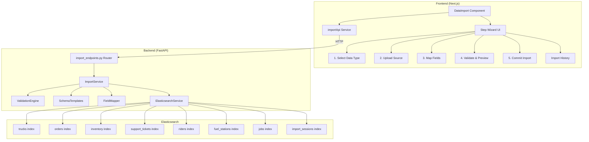
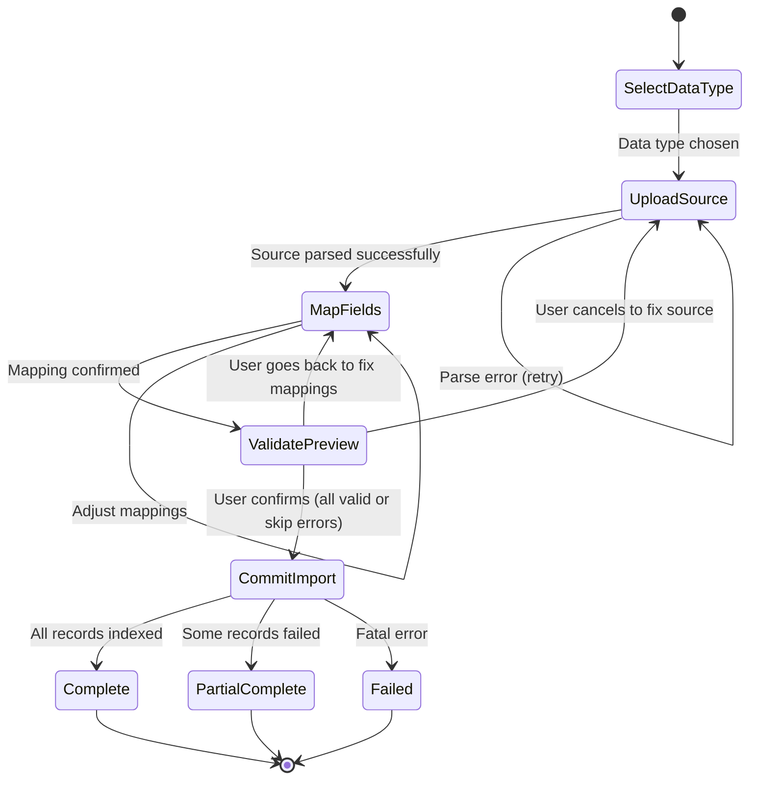

# Design Document: Data Import / Migration Tool

## Overview

This design transforms the existing DataUpload demo component into a production-grade data import/migration tool for Runsheet. The current component is oriented around demo simulation (time periods, batch IDs, "Reset Demo") — the new DataImport component replaces it entirely with a structured import workflow: select data type → upload source → map fields → validate → preview → commit → track history.

The backend introduces a new `import_endpoints.py` router with dedicated endpoints for the import lifecycle, a `ValidationEngine` for schema-aware row validation, and an `import_sessions` Elasticsearch index for persistent history. The frontend is a single new `DataImport.tsx` component with a multi-step wizard UI, replacing the old `DataUpload.tsx`.

### Design Decisions

1. **Replace, don't refactor**: The existing DataUpload component is tightly coupled to demo-specific state (time periods, batch IDs, demo status). A clean replacement is simpler and less error-prone than surgically removing demo logic.
2. **Backend-driven validation**: Validation runs on the backend so that the same rules apply regardless of source (CSV or Google Sheets) and the frontend stays thin.
3. **Session-based workflow**: Each import creates a server-side session that tracks state across the multi-step process, enabling progress tracking and history.
4. **Reuse existing ES infrastructure**: The `bulk_index_documents` method already handles partial failures gracefully — the import service builds on top of it rather than reimplementing bulk indexing.
5. **Schema templates as code**: Field definitions for each data type are defined in a Python dict, serving as the single source of truth for validation, auto-mapping, and CSV template generation.

## Architecture



### Import Workflow State Machine



## Components and Interfaces

### Frontend Components

#### DataImport (replaces DataUpload)

**File**: `runsheet/src/components/DataImport.tsx`

The main component renders a multi-step wizard. Each step is a sub-component managing its own local state, with the parent holding the shared workflow state.

```typescript
// Workflow state managed by the parent DataImport component
interface ImportWorkflowState {
  step: 'select-type' | 'upload' | 'map-fields' | 'validate' | 'commit' | 'complete';
  dataType: DataType | null;
  sessionId: string | null;
  sourceColumns: string[];
  sampleRows: Record<string, string>[];
  fieldMapping: Record<string, string>; // sourceColumn -> targetField
  validationResult: ValidationResult | null;
  importResult: ImportResult | null;
}

type DataType = 'fleet' | 'orders' | 'riders' | 'fuel_stations' | 'inventory' | 'support_tickets' | 'jobs';
```

Sub-components:
- **DataTypeSelector**: Card grid for choosing the import data type. Each card shows the type name, description, ES index, and required/optional field counts.
- **SourceUploader**: Tabbed interface for CSV drag-and-drop upload or Google Sheets URL input. Displays parsed column names and 5-row sample preview on success.
- **FieldMapper**: Two-column mapping UI — source columns on the left, target field dropdowns on the right. Auto-suggests matches, highlights required fields, warns on unmapped required fields.
- **ValidationPreview**: Displays the Preview_Report with counts and a scrollable error/warning table. Offers "Import valid rows" and "Cancel" actions.
- **ImportProgress**: Progress bar with record count (X / Y) and status label (processing → indexing → completing).
- **ImportComplete**: Summary card showing imported count, skipped count, data type, and a "Start New Import" button.
- **ImportHistory**: Table of past sessions with data type and status filters, expandable detail rows.

#### Sidebar Update

**File**: `runsheet/src/components/Sidebar.tsx`

Change the menu item label from "Upload Data" to "Data Import" while keeping the `id: "upload-data"` route identifier for backward compatibility. Update the icon from `Upload` to `FileInput` (from lucide-react).

### Backend Components

#### Import Endpoints Router

**File**: `Runsheet-backend/import_endpoints.py`

New FastAPI router mounted at `/api/import`. All endpoints are rate-limited using the existing `limiter` middleware.

| Method | Path | Description |
|--------|------|-------------|
| `POST` | `/api/import/upload/csv` | Upload CSV file, parse headers + sample rows, create session |
| `POST` | `/api/import/upload/sheets` | Fetch Google Sheets data, parse headers + sample rows, create session |
| `POST` | `/api/import/validate` | Validate mapped data against schema, return Preview_Report |
| `POST` | `/api/import/commit` | Commit validated records to ES, return progress/result |
| `GET`  | `/api/import/history` | List import sessions with optional filters |
| `GET`  | `/api/import/history/{session_id}` | Get single session details |
| `GET`  | `/api/import/templates/{data_type}` | Download CSV template for a data type |
| `GET`  | `/api/import/schemas/{data_type}` | Get schema template (fields, types, required) for a data type |

#### ImportService

**File**: `Runsheet-backend/services/import_service.py`

Orchestrates the import workflow. Holds in-memory session state (keyed by session_id) for active imports and persists completed sessions to ES.

```python
class ImportService:
    def __init__(self, es_service: ElasticsearchService):
        self.es_service = es_service
        self.schema_templates = SchemaTemplates()
        self.validation_engine = ValidationEngine(self.schema_templates)
        self.field_mapper = FieldMapper(self.schema_templates)
        self._active_sessions: dict[str, ImportSession] = {}

    async def parse_csv(self, file_content: bytes, data_type: str) -> ParseResult: ...
    async def parse_sheets(self, url: str, data_type: str) -> ParseResult: ...
    async def validate(self, session_id: str, field_mapping: dict) -> ValidationResult: ...
    async def commit(self, session_id: str, skip_errors: bool) -> ImportResult: ...
    async def get_history(self, data_type: str | None, status: str | None) -> list[ImportSessionRecord]: ...
    async def get_session(self, session_id: str) -> ImportSessionRecord: ...
    async def generate_template(self, data_type: str) -> str: ...
```

#### ValidationEngine

**File**: `Runsheet-backend/services/validation_engine.py`

Pure validation logic — no side effects. Takes rows + schema + field mapping, returns validation results.

```python
class ValidationEngine:
    def __init__(self, schema_templates: SchemaTemplates):
        self.schema_templates = schema_templates

    def validate_rows(
        self,
        rows: list[dict[str, str]],
        data_type: str,
        field_mapping: dict[str, str]
    ) -> ValidationResult:
        """Validate all rows against the schema template.
        
        For each row:
        1. Apply field mapping (source column -> target field)
        2. Check required field presence
        3. Check data type correctness (string, number, date, enum)
        4. Check value format compliance (date formats, enum values)
        
        Returns ValidationResult with per-row errors and warnings.
        """
        ...
```

#### FieldMapper

**File**: `Runsheet-backend/services/field_mapper.py`

Auto-mapping algorithm for suggesting field mappings.

```python
class FieldMapper:
    def __init__(self, schema_templates: SchemaTemplates):
        self.schema_templates = schema_templates

    def auto_map(self, source_columns: list[str], data_type: str) -> dict[str, str]:
        """Suggest mappings from source columns to target fields.
        
        Algorithm:
        1. Normalize both source and target names: lowercase, replace spaces/hyphens with underscores, strip whitespace
        2. Exact match after normalization -> map
        3. Substring containment (target name contained in source or vice versa) -> map
        4. Unmapped columns get no suggestion
        
        Returns dict of {source_column: target_field} for suggested mappings.
        """
        ...
```

#### SchemaTemplates

**File**: `Runsheet-backend/services/schema_templates.py`

Single source of truth for field definitions per data type.

```python
class SchemaTemplates:
    TEMPLATES: dict[str, SchemaTemplate] = {
        "fleet": SchemaTemplate(
            data_type="fleet",
            description="Vehicle and fleet asset records including trucks, drivers, and cargo information",
            es_index="trucks",
            fields=[
                FieldDef(name="truck_id", type="string", required=True, description="Unique vehicle identifier"),
                FieldDef(name="plate_number", type="string", required=True, description="License plate number"),
                FieldDef(name="driver_name", type="string", required=False, description="Assigned driver name"),
                FieldDef(name="status", type="enum", required=True, description="Vehicle status", enum_values=["on_time", "delayed", "idle", "maintenance"]),
                # ... additional fields
            ]
        ),
        "orders": SchemaTemplate(...),
        "riders": SchemaTemplate(...),
        "fuel_stations": SchemaTemplate(...),
        "inventory": SchemaTemplate(...),
        "support_tickets": SchemaTemplate(...),
        "jobs": SchemaTemplate(...),
    }

    DATA_TYPE_INDEX_MAP: dict[str, str] = {
        "fleet": "trucks",
        "orders": "orders",
        "inventory": "inventory",
        "support_tickets": "support_tickets",
        "riders": "riders",
        "fuel_stations": "fuel_stations",
        "jobs": "jobs",
    }

    def get_template(self, data_type: str) -> SchemaTemplate: ...
    def get_index(self, data_type: str) -> str: ...
    def get_required_fields(self, data_type: str) -> list[FieldDef]: ...
    def get_optional_fields(self, data_type: str) -> list[FieldDef]: ...
    def generate_csv_template(self, data_type: str) -> str: ...
```

### Frontend API Service

**File**: `runsheet/src/services/importApi.ts`

New API service module for import operations, following the existing `apiService` pattern.

```typescript
export const importApi = {
  uploadCSV(file: File, dataType: string): Promise<ParseResponse> { ... },
  uploadSheets(url: string, dataType: string): Promise<ParseResponse> { ... },
  validate(sessionId: string, fieldMapping: Record<string, string>): Promise<ValidationResponse> { ... },
  commit(sessionId: string, skipErrors: boolean): Promise<ImportResponse> { ... },
  getHistory(filters?: { dataType?: string; status?: string }): Promise<HistoryResponse> { ... },
  getSession(sessionId: string): Promise<SessionResponse> { ... },
  getSchema(dataType: string): Promise<SchemaResponse> { ... },
  downloadTemplate(dataType: string): void { ... },
};
```

## Data Models

### Backend Models (Pydantic)

```python
from pydantic import BaseModel
from typing import Optional
from enum import Enum
from datetime import datetime

class DataTypeEnum(str, Enum):
    FLEET = "fleet"
    ORDERS = "orders"
    RIDERS = "riders"
    FUEL_STATIONS = "fuel_stations"
    INVENTORY = "inventory"
    SUPPORT_TICKETS = "support_tickets"
    JOBS = "jobs"

class FieldType(str, Enum):
    STRING = "string"
    NUMBER = "number"
    DATE = "date"
    ENUM = "enum"
    BOOLEAN = "boolean"
    GEO_POINT = "geo_point"

class ImportStatus(str, Enum):
    PARSING = "parsing"
    MAPPED = "mapped"
    VALIDATING = "validating"
    VALIDATED = "validated"
    IMPORTING = "importing"
    COMPLETED = "completed"
    PARTIAL = "partial"
    FAILED = "failed"

class FieldDef(BaseModel):
    name: str
    type: FieldType
    required: bool
    description: str
    enum_values: Optional[list[str]] = None
    date_format: Optional[str] = None  # e.g. "ISO8601", "YYYY-MM-DD"

class SchemaTemplate(BaseModel):
    data_type: str
    description: str
    es_index: str
    fields: list[FieldDef]

class ParseResult(BaseModel):
    session_id: str
    columns: list[str]
    sample_rows: list[dict[str, str]]  # First 5 rows
    total_rows: int
    suggested_mapping: dict[str, str]  # Auto-suggested field mapping

class ValidationIssue(BaseModel):
    row_number: int
    field_name: str
    description: str
    value: Optional[str] = None

class ValidationResult(BaseModel):
    session_id: str
    total_rows: int
    valid_rows: int
    error_count: int
    warning_count: int
    errors: list[ValidationIssue]
    warnings: list[ValidationIssue]

class ImportResult(BaseModel):
    session_id: str
    status: ImportStatus
    total_records: int
    imported_records: int
    skipped_records: int
    error_count: int
    errors: list[str]
    data_type: str
    es_index: str
    duration_seconds: float

class ImportSessionRecord(BaseModel):
    """Persisted to the import_sessions ES index."""
    session_id: str
    data_type: str
    source_type: str  # "csv" or "google_sheets"
    source_name: str  # filename or URL
    total_records: int
    imported_records: int
    skipped_records: int
    error_count: int
    status: ImportStatus
    errors: list[str]
    field_mapping: dict[str, str]
    created_at: str  # ISO8601
    completed_at: Optional[str] = None
    duration_seconds: Optional[float] = None
```

### Elasticsearch Index: import_sessions

```json
{
  "mappings": {
    "properties": {
      "session_id": { "type": "keyword" },
      "data_type": { "type": "keyword" },
      "source_type": { "type": "keyword" },
      "source_name": { "type": "text", "fields": { "keyword": { "type": "keyword" } } },
      "total_records": { "type": "integer" },
      "imported_records": { "type": "integer" },
      "skipped_records": { "type": "integer" },
      "error_count": { "type": "integer" },
      "status": { "type": "keyword" },
      "errors": { "type": "text" },
      "field_mapping": { "type": "object", "enabled": false },
      "created_at": { "type": "date" },
      "completed_at": { "type": "date" },
      "duration_seconds": { "type": "float" }
    }
  }
}
```

### Frontend TypeScript Types

```typescript
// runsheet/src/types/import.ts

export type DataType = 'fleet' | 'orders' | 'riders' | 'fuel_stations' | 'inventory' | 'support_tickets' | 'jobs';

export type ImportStatus = 'parsing' | 'mapped' | 'validating' | 'validated' | 'importing' | 'completed' | 'partial' | 'failed';

export interface FieldDef {
  name: string;
  type: 'string' | 'number' | 'date' | 'enum' | 'boolean' | 'geo_point';
  required: boolean;
  description: string;
  enum_values?: string[];
}

export interface SchemaTemplate {
  data_type: string;
  description: string;
  es_index: string;
  fields: FieldDef[];
}

export interface ParseResponse {
  session_id: string;
  columns: string[];
  sample_rows: Record<string, string>[];
  total_rows: number;
  suggested_mapping: Record<string, string>;
}

export interface ValidationIssue {
  row_number: number;
  field_name: string;
  description: string;
  value?: string;
}

export interface ValidationResult {
  session_id: string;
  total_rows: number;
  valid_rows: number;
  error_count: number;
  warning_count: number;
  errors: ValidationIssue[];
  warnings: ValidationIssue[];
}

export interface ImportResult {
  session_id: string;
  status: ImportStatus;
  total_records: number;
  imported_records: number;
  skipped_records: number;
  error_count: number;
  errors: string[];
  data_type: string;
  es_index: string;
  duration_seconds: number;
}

export interface ImportSessionRecord {
  session_id: string;
  data_type: string;
  source_type: 'csv' | 'google_sheets';
  source_name: string;
  total_records: number;
  imported_records: number;
  skipped_records: number;
  error_count: number;
  status: ImportStatus;
  errors: string[];
  created_at: string;
  completed_at?: string;
  duration_seconds?: number;
}
```

## Correctness Properties

*A property is a characteristic or behavior that should hold true across all valid executions of a system — essentially, a formal statement about what the system should do. Properties serve as the bridge between human-readable specifications and machine-verifiable correctness guarantees.*

### Property 1: Data type metadata completeness

*For any* supported data type, selecting it should produce a non-empty description, a valid ES index name, and a list of fields where each field is classified as either required or optional — matching the schema template definition for that type.

**Validates: Requirements 2.2, 2.3**

### Property 2: CSV header parsing preserves column names

*For any* valid CSV byte string with a header row, parsing the CSV should extract column names that exactly match the comma-separated values in the first row (after trimming whitespace).

**Validates: Requirements 3.2**

### Property 3: Source data preview correctness

*For any* successfully parsed source data (CSV or Google Sheets) with N rows, the preview should contain all detected column names and exactly min(N, 5) sample rows, where each sample row has a value for every detected column.

**Validates: Requirements 3.5, 4.4**

### Property 4: Auto-suggest field mapping normalization

*For any* source column name that, after normalization (lowercase, replace spaces/hyphens with underscores, strip whitespace), exactly matches a target field name in the schema template, the auto-mapper should suggest that target field as the mapping.

**Validates: Requirements 5.2**

### Property 5: Unmapped required field detection

*For any* data type schema and any field mapping that omits at least one required target field, the field mapper should produce a warning for each unmapped required field, and the set of warned fields should exactly equal the set of unmapped required fields.

**Validates: Requirements 5.4**

### Property 6: Duplicate target mapping prevention

*For any* field mapping where two distinct source columns are mapped to the same target field, the system should reject the mapping and report the conflict.

**Validates: Requirements 5.6**

### Property 7: Validation detects all type and presence violations

*For any* set of rows and any data type schema, the validation engine should: (a) report an error for every row where a required field is missing or empty, (b) report an error for every field value that does not match the expected type (number, date, enum), and (c) never report a false positive error for a row where all fields are present and correctly typed.

**Validates: Requirements 6.1, 6.2**

### Property 8: Preview report count consistency

*For any* validation result, the following invariants hold: `total_rows == valid_rows + error_row_count` (where error_row_count is the number of distinct rows with at least one error), all counts are non-negative, and `error_count >= error_row_count` (since a single row can have multiple errors).

**Validates: Requirements 6.3**

### Property 9: Validation issue display completeness

*For any* validation issue (error or warning), the issue object contains a positive row_number, a non-empty field_name, and a non-empty description string.

**Validates: Requirements 6.4, 6.5**

### Property 10: Import session record completeness

*For any* persisted import session record, all of the following fields are present and non-null: session_id, data_type, source_type, source_name, total_records, imported_records, skipped_records, error_count, status, and created_at.

**Validates: Requirements 8.2**

### Property 11: Import history chronological ordering

*For any* list of import session records returned by the history endpoint, the records are ordered by created_at in descending order (most recent first).

**Validates: Requirements 8.3**

### Property 12: Schema template CSV generation round-trip

*For any* supported data type, the generated CSV template should have a header row whose column names exactly match the field names in the schema template for that type, and should contain between 2 and 3 data rows.

**Validates: Requirements 9.1, 9.2, 9.3**

## Error Handling

### Frontend Error Handling

| Error Scenario | Handling |
|---|---|
| File exceeds 10MB | Client-side check before upload. Display inline error: "File exceeds the 10MB size limit. Please split your data or reduce the file size." |
| Non-CSV file selected | Client-side MIME type + extension check. Display inline error: "Only CSV files are supported. Please select a .csv file." |
| CSV parse failure | Display backend error message in the upload step. Offer "Try Again" action. |
| Google Sheets URL invalid | Display error: "Could not access the Google Sheet. Please check the URL and sharing permissions." |
| Network error during upload | Display generic error with retry button. Preserve the selected file/URL. |
| Validation finds errors | Display Preview_Report with error table. User chooses to import valid rows or cancel. |
| Import fails mid-execution | Display error with count of records imported before failure. Session is marked as "failed" in history. |
| Session not found | Display "Import session not found" with link back to start new import. |

### Backend Error Handling

| Error Scenario | HTTP Status | Response |
|---|---|---|
| Invalid data type | 400 | `{"detail": "Unsupported data type: {type}. Supported: fleet, orders, ..."}` |
| CSV parse error | 422 | `{"detail": "Failed to parse CSV: {reason}"}` |
| Google Sheets fetch error | 422 | `{"detail": "Failed to fetch Google Sheet: {reason}"}` |
| Session not found | 404 | `{"detail": "Import session {id} not found"}` |
| Validation called before parse | 409 | `{"detail": "Session {id} has no parsed data. Upload a source first."}` |
| Commit called before validation | 409 | `{"detail": "Session {id} has not been validated. Run validation first."}` |
| ES circuit breaker open | 503 | `{"detail": "Database temporarily unavailable. Please retry."}` |
| ES bulk indexing partial failure | 207 | Import result with `status: "partial"`, listing failed records |

## Testing Strategy

### Property-Based Tests (Hypothesis — Python)

The backend validation engine, field mapper, schema templates, and CSV parser are pure-function-heavy modules well suited for property-based testing. Each property test maps to a correctness property above.

**Library**: [Hypothesis](https://hypothesis.readthedocs.io/) (already in use in this project — `.hypothesis/` directory exists)

**Configuration**: Minimum 100 examples per test via `@settings(max_examples=100)`.

**Tag format**: `# Feature: data-import-migration, Property {N}: {title}`

Property tests to implement:
1. **Property 1** — Generate random data types, verify metadata completeness
2. **Property 2** — Generate random CSV strings, verify header parsing
3. **Property 3** — Generate random parsed data, verify preview row count
4. **Property 4** — Generate column names with case/space/underscore variations, verify auto-mapping
5. **Property 5** — Generate partial field mappings, verify unmapped required field warnings
6. **Property 6** — Generate mappings with duplicate targets, verify rejection
7. **Property 7** — Generate rows with mixed valid/invalid values, verify error detection with no false positives
8. **Property 8** — Generate validation results, verify count invariants
9. **Property 9** — Generate validation issues, verify field completeness
10. **Property 10** — Generate import session records, verify all required fields present
11. **Property 11** — Generate session lists, verify descending chronological order
12. **Property 12** — Generate data types, verify CSV template headers match schema and row count is 2-3

### Unit Tests (Example-Based)

- **Requirement 1**: Render DataImport, assert absence of demo UI elements (time periods, batch ID, Reset Demo, temporal settings)
- **Requirement 2.4**: Assert upload button is disabled when no data type is selected
- **Requirement 3.1**: Simulate drag-and-drop and file input with CSV file
- **Requirement 3.3**: Upload a >10MB file, verify rejection
- **Requirement 3.4**: Upload a .txt file, verify rejection
- **Requirement 10.1–10.7**: Verify each data type maps to the correct ES index name
- **Requirement 12.1**: Render Sidebar, verify "Data Import" label
- **Requirement 12.2**: Verify sidebar item retains `upload-data` route identifier

### Integration Tests

- **Requirement 7.1**: POST commit endpoint, verify records appear in correct ES index
- **Requirement 8.1**: Complete an import, verify import_sessions document exists in ES
- **Requirement 11.1–11.6**: Test each API endpoint with valid and invalid inputs
- **Requirement 4.2**: Test Google Sheets fetch with mocked HTTP responses

### Frontend Tests (React Testing Library + Vitest)

- Step wizard navigation (forward/back)
- Field mapper interaction (select, override, duplicate prevention)
- Progress indicator updates during mock import
- Import history table rendering and filtering
- Template download trigger
