# Design Document: Frontend Feature Parity

## Overview

This design closes every gap between the Runsheet backend API surface and the frontend UI. The backend already exposes REST endpoints for fuel distribution MVP, agent autonomy/memory, ops monitoring, cargo management, fuel station CRUD, failure analytics enhancements, and scheduling metrics — but the frontend either has no page at all or is missing key interactions for these capabilities.

The approach is additive: new pages and components slot into the existing sidebar navigation and lazy-loading architecture. New API client functions extend the existing typed service modules (`fuelApi.ts`, `agentApi.ts`, `opsApi.ts`, `schedulingApi.ts`). No backend changes are required.

### Key Design Decisions

1. **Sidebar-first navigation** — New pages are added as sidebar menu items in `page.tsx`, following the existing `lazy()` + `Suspense` + `ErrorBoundary` pattern. No new Next.js route files are needed for pages that render inside the main layout.
2. **Extend existing API clients** — New functions are added to the existing service files rather than creating new ones, preserving the `fetchWithTimeout` / `buildQueryString` / typed-response pattern.
3. **Component colocation** — New components go in `src/components/ops/` alongside existing ops components, following the same naming and structure conventions.
4. **Polling for monitoring** — The ops monitoring dashboard uses a 30-second polling interval via `setInterval` + `useEffect`, consistent with how the platform handles non-WebSocket real-time data.
5. **CSV export via client-side generation** — Failure analytics export generates CSV in the browser from the currently filtered data, avoiding a new backend endpoint.

## Architecture

The frontend follows a layered architecture that this design preserves:

```mermaid
graph TD
    subgraph "Navigation Layer"
        SB[Sidebar.tsx] --> PM[page.tsx - Main Layout]
    end

    subgraph "Page Components (lazy-loaded)"
        PM --> FDP[FuelDistributionPage]
        PM --> ASP[AgentSettingsPage]
        PM --> OMP[OpsMonitoringDashboard]
        PM --> SMP[SchedulingMetricsPage]
        PM --> FAP[FailureAnalyticsPage - enhanced]
    end

    subgraph "Feature Components"
        FDP --> PG[PlanGenerator]
        FDP --> PV[PlanViewer]
        FDP --> RF[ReplanForm]
        FDP --> FT[ForecastsTable]
        FDP --> PT[PrioritiesTable]

        ASP --> ALC[AutonomyLevelConfig]
        ASP --> MML[MemoryManagementList]

        OMP --> IM[IngestionMetrics]
        OMP --> IXM[IndexingMetrics]
        OMP --> PQM[PoisonQueueMetrics]

        SMP --> JMC[JobMetricsChart]
        SMP --> CRC[CompletionRateCards]
        SMP --> AUC[AssetUtilizationTable]
        SMP --> DSC[DelayStatsCards]
    end

    subgraph "Existing Enhanced Components"
        FAP --> DDP[DrillDownPanel]
        FAP --> FTF[FailureTypeFilter]
        FAP --> EXP[CSVExport]

        FuelPage --> FSF[FuelStationForm]
        CargoPage --> CME[CargoManifestEditor]
        CargoPage --> CSS[CargoSearchSection]
    end

    subgraph "API Client Layer"
        PG --> FA[fuelApi.ts - MVP extensions]
        ALC --> AA[agentApi.ts - extensions]
        MML --> AA
        IM --> OA[opsApi.ts - existing]
        JMC --> SA[schedulingApi.ts - existing]
    end
```



### Data Flow

All new pages follow the same data flow pattern established by existing pages:

1. Page component mounts → calls API client function(s) via `useEffect` + `useCallback`
2. API client uses `fetchWithTimeout` → returns typed response
3. Component stores response in `useState` → renders UI
4. User interactions trigger API mutations → optimistic or refetch update
5. Where applicable, WebSocket hooks provide real-time updates

## Components and Interfaces

### New Sidebar Menu Items

The `Sidebar.tsx` `menuItems` array gains four new entries:

| id | label | icon | Position |
|---|---|---|---|
| `fuel-distribution` | Fuel Distribution | `Droplets` | After "fuel" |
| `agent-settings` | Agent Settings | `Settings` | After "control-center" |
| `ops-monitoring` | Ops Monitoring | `Activity` | After "agent-settings" |
| `scheduling-metrics` | Scheduling Metrics | `TrendingUp` | After "analytics" |

The `page.tsx` `renderMainContent()` switch gains matching cases, each wrapping the lazy-loaded component in `ErrorBoundary` + `Suspense`.

### New API Client Functions

#### fuelApi.ts — MVP Pipeline Extensions

```typescript
// Request/Response types
interface GeneratePlanResponse {
  run_id: string;
  status: string;
}

interface ReplanRequest {
  disruption_type: string;
  description: string;
  entity_id: string;
}

interface ForecastFilters {
  tenant_id: string;
  station_id?: string;
  fuel_grade?: string;
  page?: number;
  size?: number;
}

interface PaginationFilters {
  tenant_id: string;
  page?: number;
  size?: number;
}

// Functions
export async function generatePlan(tenantId: string): Promise<GeneratePlanResponse>;
export async function getPlan(planId: string, tenantId: string): Promise<PlanDetail>;
export async function replan(planId: string, body: ReplanRequest, tenantId: string): Promise<ReplanResponse>;
export async function getForecasts(filters: ForecastFilters): Promise<PaginatedResponse<Forecast>>;
export async function getPriorities(filters: PaginationFilters): Promise<PaginatedResponse<DeliveryPriority>>;
```

#### agentApi.ts — Autonomy & Memory Extensions

```typescript
// Types
type AutonomyLevel = "suggest-only" | "auto-low" | "auto-medium" | "full-auto";

interface AutonomyUpdateResponse {
  tenant_id: string;
  previous_level: string;
  new_level: string;
}

interface MemoryEntry {
  memory_id: string;
  memory_type: "pattern" | "preference";
  content: string;
  tags: string[];
  created_at: string;
  tenant_id: string;
}

interface MemoryFilters {
  tenant_id?: string;
  memory_type?: "pattern" | "preference";
  tags?: string;
  page?: number;
  size?: number;
}

interface PaginatedMemories {
  entries: MemoryEntry[];
  total: number;
  page: number;
  size: number;
}

// Functions
export async function getAutonomyLevel(tenantId: string): Promise<{ level: AutonomyLevel }>;
export async function updateAutonomyLevel(level: string, tenantId: string): Promise<AutonomyUpdateResponse>;
export async function getMemories(filters: MemoryFilters): Promise<PaginatedMemories>;
export async function deleteMemory(memoryId: string, tenantId: string): Promise<{ deleted: boolean }>;
```

#### fuelApi.ts — Station CRUD Extensions

```typescript
interface CreateStationPayload {
  name: string;
  fuel_type: FuelType;
  capacity_liters: number;
  location?: GeoPoint;
  alert_threshold_pct: number;
}

interface UpdateStationPayload {
  name?: string;
  fuel_type?: FuelType;
  capacity_liters?: number;
  location?: GeoPoint;
  alert_threshold_pct?: number;
}

export async function createStation(data: CreateStationPayload, tenantId: string): Promise<FuelStation>;
export async function updateStation(stationId: string, data: UpdateStationPayload, tenantId: string): Promise<FuelStation>;
export async function updateStationThreshold(stationId: string, threshold: number, tenantId: string): Promise<FuelStation>;
```

### New Page Components

#### 1. FuelDistributionPage

**File:** `src/components/ops/FuelDistributionPage.tsx`

Tabbed layout with three tabs: Plans, Forecasts, Priorities.

- **Plans tab**: "Generate Plan" button, plan list, plan detail view with loading/route plans, replan form modal
- **Forecasts tab**: Paginated table with station_id and fuel_grade filters
- **Priorities tab**: Paginated table of delivery priority rankings

State management: `useState` for active tab, plan list, selected plan, forecasts, priorities. Each tab fetches data on activation.

#### 2. AgentSettingsPage

**File:** `src/components/ops/AgentSettingsPage.tsx`

Two-section layout:

- **Autonomy Configuration**: Displays current level, four radio-button options with descriptions, confirm button. Read-only mode for non-admin users (checks `x-user-role` header or displays based on a role prop).
- **Memory Management**: Paginated list with type/tag filters, delete button per entry with confirmation dialog.

#### 3. OpsMonitoringDashboard

**File:** `src/components/ops/OpsMonitoringDashboard.tsx`

Three-card grid layout displaying ingestion, indexing, and poison queue metrics. Each card shows key metrics with color-coded values (green/yellow/red based on thresholds). Auto-refreshes every 30 seconds via `setInterval`.

Threshold configuration (hardcoded initially):
- Ingestion: `events_failed > 100` = red, `> 50` = yellow
- Indexing: `bulk_success_rate < 0.95` = red, `< 0.99` = yellow
- Poison queue: `queue_depth > 100` = red, `> 50` = yellow

#### 4. SchedulingMetricsPage

**File:** `src/components/ops/SchedulingMetricsPage.tsx`

Four-section dashboard with shared time range filters (bucket, start_date, end_date):

- **Job Metrics**: Bar/line chart of job counts by status and type over time buckets
- **Completion Rates**: Cards showing completion_rate and avg_completion_minutes per job_type
- **Asset Utilization**: Table with total_jobs, active_jobs, idle_hours per asset
- **Delay Statistics**: Summary cards for total_delayed, avg_delay_minutes, delays_by_type breakdown

#### 5. Failure Analytics Enhancements

**Enhanced file:** `src/app/ops/failures/page.tsx`

Additions to the existing page:
- **Drill-down panel**: Clicking a failed shipment row opens a side panel showing full shipment detail + event timeline (fetched via `getShipmentById`)
- **Failure type filter**: Dropdown filter that filters both charts and table by `failure_reason`
- **CSV export**: "Export" button generates CSV from currently filtered data with columns: shipment_id, failure_reason, rider_id, origin, destination, timestamp

#### 6. Fuel Station Form

**File:** `src/components/ops/FuelStationForm.tsx`

Modal form component used for both create and edit:
- Fields: name, fuel_type (select), capacity_liters (number), location_name (text), alert_threshold_pct (number with 0-100 range)
- Client-side validation: capacity > 0, threshold 0-100
- On submit: calls `createStation` or `updateStation` depending on mode
- Integrated into the existing fuel page via "Add Station" button and per-row "Edit" button

#### 7. Cargo Management Enhancements

**Enhanced components:**
- **CargoManifestEditor**: New component wrapping `CargoManifestView` with an edit mode toggle. In edit mode, fields become editable inputs. Submit calls `updateCargo`.
- **CargoSearchPage**: New section accessible from the scheduling area. Search form with container_number, description, item_status fields. Results table shows cargo items with associated job_id.

### Component Hierarchy

```
page.tsx (main layout)
├── Sidebar (updated with new menu items)
├── FuelDistributionPage (new, lazy-loaded)
│   ├── PlanGenerator
│   ├── PlanViewer
│   ├── ReplanForm (modal)
│   ├── ForecastsTable
│   └── PrioritiesTable
├── AgentSettingsPage (new, lazy-loaded)
│   ├── AutonomyLevelConfig
│   └── MemoryManagementList
├── OpsMonitoringDashboard (new, lazy-loaded)
│   ├── MetricCard (ingestion)
│   ├── MetricCard (indexing)
│   └── MetricCard (poison queue)
├── SchedulingMetricsPage (new, lazy-loaded)
│   ├── TimeRangeFilters (shared)
│   ├── JobMetricsSection
│   ├── CompletionRateSection
│   ├── AssetUtilizationSection
│   └── DelayStatsSection
└── Enhanced existing pages
    ├── FailureAnalyticsPage (+ drill-down, filter, export)
    ├── FuelDashboardPage (+ FuelStationForm)
    └── CargoPage (+ CargoManifestEditor, CargoSearchPage)
```

## Data Models

### Fuel Distribution MVP Types

```typescript
interface PlanDetail {
  plan_id: string;
  loading_plan: LoadingPlan | null;
  route_plan: RoutePlan | null;
}

interface LoadingPlan {
  plan_id: string;
  tenant_id: string;
  assignments: CompartmentAssignment[];
  timestamp: string;
}

interface CompartmentAssignment {
  truck_id: string;
  compartments: { compartment_id: string; fuel_grade: string; volume_liters: number }[];
}

interface RoutePlan {
  plan_id: string;
  tenant_id: string;
  routes: RouteAssignment[];
  timestamp: string;
}

interface RouteAssignment {
  truck_id: string;
  stops: { station_id: string; order: number; estimated_arrival: string }[];
  total_distance_km: number;
}

interface Forecast {
  station_id: string;
  fuel_grade: string;
  current_stock_liters: number;
  predicted_stock_liters: number;
  days_until_empty: number;
  timestamp: string;
}

interface DeliveryPriority {
  station_id: string;
  station_name: string;
  fuel_grade: string;
  priority_score: number;
  urgency: "low" | "medium" | "high" | "critical";
  timestamp: string;
}
```

### Agent Settings Types

```typescript
type AutonomyLevel = "suggest-only" | "auto-low" | "auto-medium" | "full-auto";

interface AutonomyConfig {
  tenant_id: string;
  level: AutonomyLevel;
}

interface MemoryEntry {
  memory_id: string;
  memory_type: "pattern" | "preference";
  content: string;
  tags: string[];
  created_at: string;
  tenant_id: string;
}
```

### Monitoring Types (already defined in opsApi.ts)

The existing `IngestionMetrics`, `IndexingMetrics`, and `PoisonQueueMetrics` interfaces in `opsApi.ts` are sufficient. No new types needed.

### Scheduling Metrics Types (already defined in schedulingApi.ts)

The existing `JobMetricsBucket`, `CompletionMetric`, `AssetUtilizationMetric`, `DelayMetrics`, and `MetricsFilters` interfaces in `schedulingApi.ts` are sufficient. No new types needed.

### Fuel Station CRUD Types

```typescript
interface CreateStationPayload {
  name: string;
  fuel_type: FuelType;
  capacity_liters: number;
  location?: GeoPoint;
  location_name?: string;
  alert_threshold_pct: number;
}

interface UpdateStationPayload {
  name?: string;
  fuel_type?: FuelType;
  capacity_liters?: number;
  location?: GeoPoint;
  location_name?: string;
  alert_threshold_pct?: number;
}
```


## Correctness Properties

*A property is a characteristic or behavior that should hold true across all valid executions of a system — essentially, a formal statement about what the system should do. Properties serve as the bridge between human-readable specifications and machine-verifiable correctness guarantees.*

Most acceptance criteria in this spec are UI rendering and interaction tests (render a page, click a button, verify an API call). These are best covered by example-based unit tests with React Testing Library. However, three areas involve pure logic functions where property-based testing adds value:

### Property 1: Monitoring metric threshold classification is consistent

*For any* set of metric values (non-negative numbers), the `getMetricStatus` function SHALL return `"healthy"` when the value is below the warning threshold, `"degraded"` when the value is between the warning and critical thresholds, and `"critical"` when the value exceeds the critical threshold. Additionally, *for any* metric classified as `"critical"`, the alert indicator SHALL be present.

**Validates: Requirements 6.4, 6.5**

### Property 2: Fuel station form validation accepts valid inputs and rejects invalid inputs

*For any* positive number `capacity`, the validation function SHALL accept it as a valid `capacity_liters` value. *For any* number `threshold` in the range [0, 100], the validation function SHALL accept it as a valid `alert_threshold_pct`. *For any* number ≤ 0 for capacity or outside [0, 100] for threshold, the validation function SHALL reject it.

**Validates: Requirements 8.6**

### Property 3: CSV export round-trip preserves failure data

*For any* array of failure shipment objects with fields `shipment_id`, `failure_reason`, `rider_id`, `origin`, `destination`, and `timestamp`, the `generateFailureCSV` function SHALL produce a CSV string whose header row contains exactly those six column names, and whose data rows contain the corresponding field values for each shipment in order.

**Validates: Requirements 9.4, 9.5**

## Error Handling

All new components follow the existing error handling patterns:

### API Error Handling

Every API call is wrapped in try/catch. Errors are handled at the component level:

1. **Network/timeout errors** — `ApiTimeoutError` from `fetchWithTimeout`. Display a "Request timed out" message with a retry button.
2. **HTTP errors** — `ApiError` with status code. Display the error message from the response body.
3. **403 Forbidden** — Specifically handled in the Agent Settings page to show "Admin access required" without modifying displayed data.
4. **404 Not Found** — Specifically handled in memory deletion to show "Memory not found" message.

### Component Error Boundaries

Every new lazy-loaded page is wrapped in `ErrorBoundary` + `Suspense` in `page.tsx`, following the existing pattern:

```tsx
case "fuel-distribution":
  return (
    <div className="flex-1 bg-gray-50">
      <ErrorBoundary componentName="Fuel Distribution">
        <Suspense fallback={<ComponentLoadingPlaceholder />}>
          <FuelDistributionPage />
        </Suspense>
      </ErrorBoundary>
    </div>
  );
```

### Form Error Handling

Forms (FuelStationForm, ReplanForm, CargoManifestEditor) follow a consistent pattern:
- Client-side validation runs before submission
- On API error, the error message is displayed inline and form values are preserved
- Loading state disables the submit button to prevent double-submission

### Polling Error Handling

The OpsMonitoringDashboard polling silently retries on failure — if a 30-second poll fails, the next poll at 60 seconds will try again. Persistent failures show a "Last updated X seconds ago" indicator so the user knows data may be stale.

## Testing Strategy

### Unit Tests (Jest + React Testing Library)

The primary testing approach for this feature. Each new component gets example-based unit tests covering:

- **Rendering**: Component renders without errors, displays expected elements
- **API integration**: Correct API functions are called with correct parameters
- **User interactions**: Clicks, form submissions, filter changes trigger expected behavior
- **Error states**: API errors display appropriate messages
- **Edge cases**: Empty data, loading states, permission restrictions

Estimated test count: ~60-80 unit tests across all new components.

### Property-Based Tests (fast-check)

Three properties are tested using the `fast-check` library with minimum 100 iterations each:

1. **Metric threshold classification** — Generate random metric values, verify color/status assignment matches threshold rules
   - Tag: `Feature: frontend-feature-parity, Property 1: Monitoring metric threshold classification is consistent`

2. **Form validation** — Generate random numbers for capacity and threshold, verify validation accepts/rejects correctly
   - Tag: `Feature: frontend-feature-parity, Property 2: Fuel station form validation accepts valid inputs and rejects invalid inputs`

3. **CSV export** — Generate random arrays of failure objects, verify CSV output has correct headers and data
   - Tag: `Feature: frontend-feature-parity, Property 3: CSV export round-trip preserves failure data`

### Integration Tests (Playwright)

End-to-end tests for critical user flows:

- Navigate to each new page via sidebar
- Generate a fuel distribution plan end-to-end
- Change autonomy level and verify persistence
- Export failure data as CSV

### Dead Code Verification

After all components are built, a static analysis pass verifies every exported function in the four API service files is imported by at least one component. Any remaining unused functions are removed.
