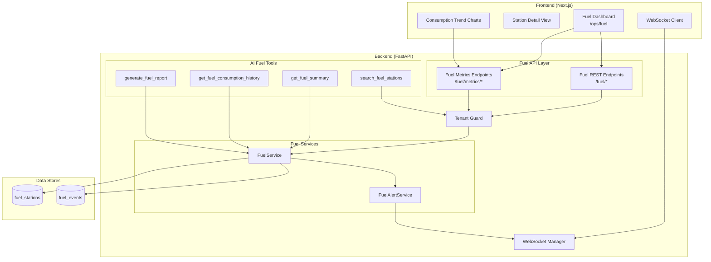
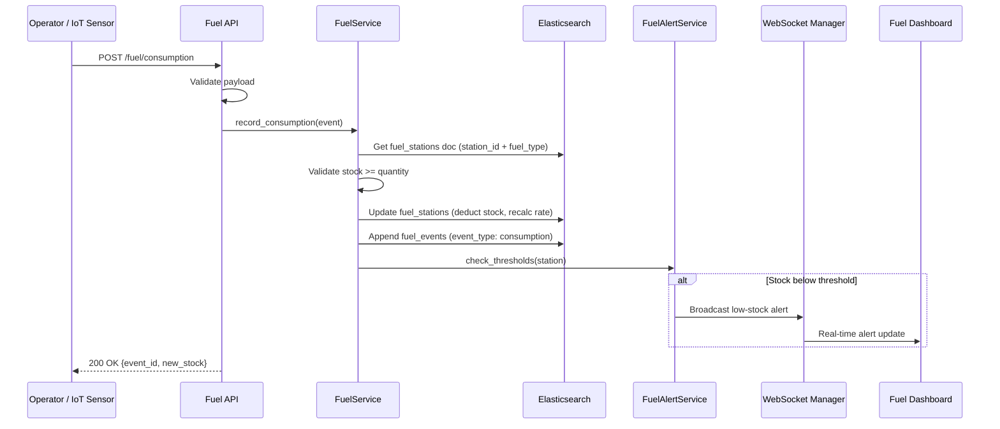

# Design Document: Fuel Monitoring

## Overview

The Fuel Monitoring module adds fuel inventory tracking, consumption analytics, and alert management to the Runsheet logistics platform. It builds on the existing infrastructure: the same `ElasticsearchService` with circuit breakers, `Settings` for configuration, `RequestIDMiddleware` for tracing, `AppException` for structured errors, rate limiting middleware, tenant scoping, and WebSocket broadcasting. New components are added as a `fuel/` package under the existing backend structure, with a new frontend page at `/ops/fuel`.

The module introduces two new Elasticsearch indices (`fuel_stations` for current state, `fuel_events` for append-only history), a set of REST endpoints under `/fuel/*`, WebSocket alerts for stock changes, and AI agent tools for fuel queries and reports.

## Architecture

### High-Level Component Architecture



### Fuel Event Flow



## Components and Interfaces

### 1. Elasticsearch Indices

#### fuel_stations Index

Holds the current state of each fuel station. Keyed by composite `station_id::fuel_type` to support stations with multiple fuel types.

```python
# fuel/services/fuel_es_mappings.py

FUEL_STATIONS_MAPPING = {
    "mappings": {
        "dynamic": "strict",
        "properties": {
            "station_id":           {"type": "keyword"},
            "name":                 {"type": "text", "fields": {"keyword": {"type": "keyword"}}},
            "fuel_type":            {"type": "keyword"},  # AGO, PMS, ATK, LPG
            "capacity_liters":      {"type": "float"},
            "current_stock_liters": {"type": "float"},
            "daily_consumption_rate": {"type": "float"},
            "days_until_empty":     {"type": "float"},
            "alert_threshold_pct":  {"type": "float"},    # default 20.0
            "status":               {"type": "keyword"},  # normal, low, critical, empty
            "location":             {"type": "geo_point"},
            "location_name":        {"type": "text", "fields": {"keyword": {"type": "keyword"}}},
            "tenant_id":            {"type": "keyword"},
            "created_at":           {"type": "date"},
            "last_updated":         {"type": "date"},
        }
    },
    "settings": {
        "number_of_shards": 1,
        "number_of_replicas": 1
    }
}
```

#### fuel_events Index

Append-only event history for all consumption and refill events.

```python
FUEL_EVENTS_MAPPING = {
    "mappings": {
        "dynamic": "strict",
        "properties": {
            "event_id":         {"type": "keyword"},
            "station_id":       {"type": "keyword"},
            "event_type":       {"type": "keyword"},  # consumption, refill
            "fuel_type":        {"type": "keyword"},
            "quantity_liters":  {"type": "float"},
            "asset_id":         {"type": "keyword"},  # truck/boat receiving fuel
            "operator_id":      {"type": "keyword"},
            "supplier":         {"type": "keyword"},  # for refill events
            "delivery_reference": {"type": "keyword"},  # for refill events
            "odometer_reading": {"type": "float"},
            "tenant_id":        {"type": "keyword"},
            "event_timestamp":  {"type": "date"},
            "ingested_at":      {"type": "date"},
        }
    },
    "settings": {
        "number_of_shards": 1,
        "number_of_replicas": 1
    }
}
```

### 2. FuelService

Core service class that handles all fuel business logic. Delegates to `ElasticsearchService` for storage.

```python
# fuel/services/fuel_service.py

class FuelService:
    """Manages fuel station state, consumption/refill recording, and analytics."""

    def __init__(self, es_service: ElasticsearchService):
        self._es = es_service

    async def list_stations(
        self, tenant_id: str, fuel_type: str = None,
        status: str = None, location: str = None,
        page: int = 1, size: int = 50
    ) -> PaginatedResponse[FuelStation]: ...

    async def get_station(self, station_id: str, tenant_id: str) -> FuelStationDetail: ...

    async def create_station(self, station: CreateFuelStation, tenant_id: str) -> FuelStation: ...

    async def update_station(self, station_id: str, update: UpdateFuelStation, tenant_id: str) -> FuelStation: ...

    async def record_consumption(self, event: ConsumptionEvent, tenant_id: str) -> ConsumptionResult: ...

    async def record_refill(self, event: RefillEvent, tenant_id: str) -> RefillResult: ...

    async def record_consumption_batch(self, events: list[ConsumptionEvent], tenant_id: str) -> BatchResult: ...

    async def get_alerts(self, tenant_id: str) -> list[FuelAlert]: ...

    async def update_threshold(self, station_id: str, threshold_pct: float, tenant_id: str) -> FuelStation: ...

    async def get_consumption_metrics(
        self, tenant_id: str, bucket: str = "daily",
        station_id: str = None, fuel_type: str = None,
        start_date: str = None, end_date: str = None
    ) -> list[MetricsBucket]: ...

    async def get_efficiency_metrics(
        self, tenant_id: str, asset_id: str = None,
        start_date: str = None, end_date: str = None
    ) -> list[EfficiencyMetric]: ...

    async def get_network_summary(self, tenant_id: str) -> FuelNetworkSummary: ...

    def _calculate_daily_rate(self, station_id: str, fuel_type: str, tenant_id: str) -> float:
        """Calculate rolling 7-day average daily consumption."""
        ...

    def _calculate_days_until_empty(self, current_stock: float, daily_rate: float) -> float:
        """Estimate days until stock reaches zero."""
        ...

    def _determine_status(self, current_stock: float, capacity: float, threshold_pct: float, days_until_empty: float) -> str:
        """Classify stock status: normal, low, critical, empty."""
        ...
```

### 3. Pydantic Models

```python
# fuel/models.py

class FuelStation(BaseModel):
    station_id: str
    name: str
    fuel_type: str          # AGO, PMS, ATK, LPG
    capacity_liters: float
    current_stock_liters: float
    daily_consumption_rate: float
    days_until_empty: float
    alert_threshold_pct: float = 20.0
    status: str             # normal, low, critical, empty
    location: Optional[GeoPoint] = None
    location_name: Optional[str] = None
    tenant_id: str
    last_updated: str

class CreateFuelStation(BaseModel):
    station_id: str
    name: str
    fuel_type: str
    capacity_liters: float  # must be > 0
    initial_stock_liters: float  # must be <= capacity
    alert_threshold_pct: float = 20.0
    location: Optional[GeoPoint] = None
    location_name: Optional[str] = None

class ConsumptionEvent(BaseModel):
    station_id: str
    fuel_type: str
    quantity_liters: float  # must be > 0
    asset_id: str           # truck/boat/vehicle receiving fuel
    operator_id: str
    odometer_reading: Optional[float] = None

class RefillEvent(BaseModel):
    station_id: str
    fuel_type: str
    quantity_liters: float  # must be > 0
    supplier: str
    delivery_reference: Optional[str] = None
    operator_id: str

class FuelAlert(BaseModel):
    station_id: str
    name: str
    fuel_type: str
    status: str             # low, critical, empty
    current_stock_liters: float
    capacity_liters: float
    stock_percentage: float
    days_until_empty: float
    location_name: Optional[str] = None

class FuelNetworkSummary(BaseModel):
    total_stations: int
    total_capacity_liters: float
    total_current_stock_liters: float
    total_daily_consumption: float
    average_days_until_empty: float
    stations_normal: int
    stations_low: int
    stations_critical: int
    stations_empty: int
    active_alerts: int
```

### 4. API Endpoints

```python
# fuel/api/endpoints.py

router = APIRouter(prefix="/fuel", tags=["fuel"])

# Station management
@router.get("/stations")           # List stations with filters
@router.get("/stations/{id}")      # Get station detail
@router.post("/stations")          # Register new station
@router.patch("/stations/{id}")    # Update station metadata
@router.patch("/stations/{id}/threshold")  # Update alert threshold

# Fuel events
@router.post("/consumption")       # Record consumption event
@router.post("/consumption/batch") # Batch consumption recording
@router.post("/refill")            # Record refill event

# Alerts
@router.get("/alerts")             # List active alerts

# Metrics
@router.get("/metrics/consumption")  # Consumption by time bucket
@router.get("/metrics/efficiency")   # Fuel efficiency per asset
@router.get("/metrics/summary")      # Network-wide summary
```

All endpoints are rate-limited using the existing `limiter` middleware and tenant-scoped using the existing `Tenant_Guard`.

### 5. AI Agent Tools

```python
# Agents/tools/fuel_tools.py

@tool
async def search_fuel_stations(query: str, fuel_type: str = None, status: str = None) -> str:
    """Search fuel stations by name, type, location, or stock status."""
    ...

@tool
async def get_fuel_summary() -> str:
    """Get network-wide fuel summary: total stock, alerts, days until empty."""
    ...

@tool
async def get_fuel_consumption_history(station_id: str = None, asset_id: str = None, days: int = 7) -> str:
    """Get fuel consumption events for a station or asset over a date range."""
    ...

@tool
async def generate_fuel_report(days: int = 7) -> str:
    """Generate a markdown fuel operations report with stock levels, trends, alerts, and recommendations."""
    ...
```

### 6. Frontend Components

```
runsheet/src/
├── app/ops/fuel/
│   └── page.tsx                    # Fuel dashboard page
├── components/ops/
│   ├── FuelStationList.tsx         # Station list with stock bars
│   ├── FuelSummaryBar.tsx          # Network summary metrics
│   ├── FuelConsumptionChart.tsx    # Consumption trend chart
│   └── FuelStationDetail.tsx       # Station detail panel
└── services/
    └── fuelApi.ts                  # Fuel API client functions
```

### 7. WebSocket Integration

Fuel alerts are broadcast through the existing `/ws/ops` WebSocket endpoint using a new subscription type `fuel_alert`. The `FuelAlertService` publishes messages when stock status changes:

```json
{
    "type": "fuel_alert",
    "data": {
        "station_id": "STATION_001",
        "name": "Industrial Area Station",
        "fuel_type": "AGO",
        "status": "low",
        "current_stock_liters": 8500,
        "capacity_liters": 50000,
        "stock_percentage": 17.0,
        "days_until_empty": 2.7
    }
}
```

## Configuration

New settings added to `config/settings.py`:

```python
# Fuel monitoring defaults
fuel_alert_default_threshold_pct: float = Field(default=20.0, description="Default low-stock alert threshold percentage")
fuel_consumption_rolling_window_days: int = Field(default=7, description="Rolling window for daily consumption rate calculation")
fuel_critical_days_threshold: int = Field(default=3, description="Days until empty below which alert escalates to critical")
```

## File Structure

```
Runsheet-backend/
├── fuel/
│   ├── __init__.py
│   ├── models.py                   # Pydantic models
│   ├── api/
│   │   ├── __init__.py
│   │   └── endpoints.py            # FastAPI router
│   └── services/
│       ├── __init__.py
│       ├── fuel_service.py         # Core business logic
│       ├── fuel_alert_service.py   # Alert management + WebSocket
│       └── fuel_es_mappings.py     # Elasticsearch index mappings
├── Agents/tools/
│   └── fuel_tools.py               # AI agent tools

runsheet/
├── src/app/ops/fuel/
│   └── page.tsx
├── src/components/ops/
│   ├── FuelStationList.tsx
│   ├── FuelSummaryBar.tsx
│   ├── FuelConsumptionChart.tsx
│   └── FuelStationDetail.tsx
└── src/services/
    └── fuelApi.ts
```
