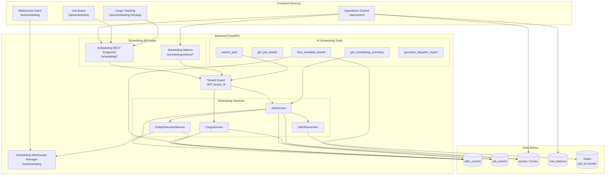
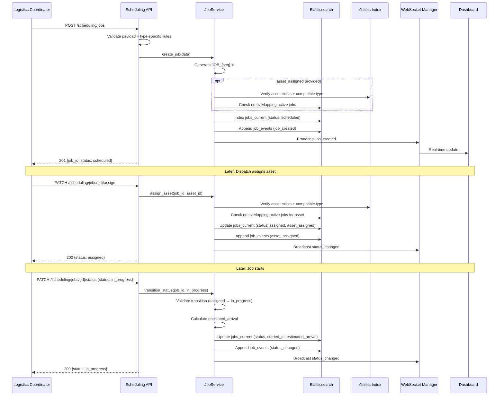
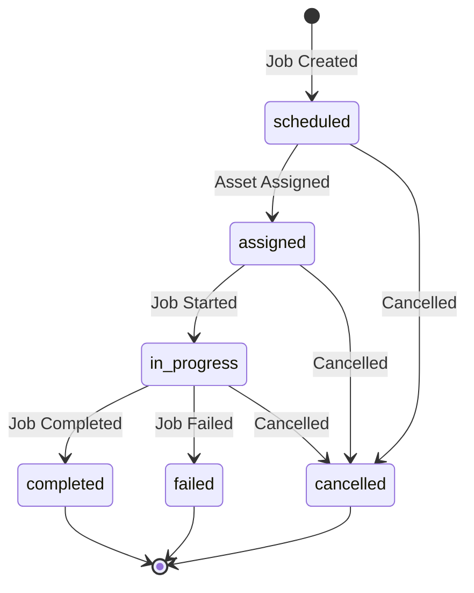

# Design Document: Logistics Scheduling & Dispatch

## Overview

The Logistics Scheduling & Dispatch module adds the central job management capability to the Runsheet logistics platform. It enables operations teams to create, assign, track, and complete logistics jobs across five types (cargo transport, passenger transport, vessel movement, airport transfer, crane booking), with cargo manifest tracking, ETA/delay detection, and a unified operations control dashboard.

The module builds on the existing infrastructure: `ElasticsearchService` with circuit breakers, `Settings` for configuration, `RequestIDMiddleware` for tracing, `AppException` for structured errors, rate limiting middleware, `Tenant_Guard` for tenant scoping, `ConnectionManager` for WebSocket broadcasting, and the multi-asset tracking system (Assets_Index) for asset validation and availability checks. New components are added as a `scheduling/` package under the existing backend structure, with new frontend pages under `/ops/scheduling` and `/ops/control`.

Two new Elasticsearch indices are introduced: `jobs_current` for current job state and `job_events` for append-only event history. The module integrates with the existing `trucks`/`assets` index for asset-type validation and conflict detection, and with `fuel_stations` for the unified control dashboard.

## Architecture

### High-Level Component Architecture



### Job Lifecycle Flow



### Job Status State Machine



### Asset-Type Compatibility Matrix

| Job Type | Compatible asset_type | Compatible asset_subtype |
|---|---|---|
| cargo_transport | vehicle | truck, fuel_truck |
| passenger_transport | vehicle | truck, personnel_vehicle |
| vessel_movement | vessel | boat, barge |
| airport_transfer | vehicle | truck, personnel_vehicle |
| crane_booking | equipment | crane |


## Components and Interfaces

### 1. Elasticsearch Indices

#### jobs_current Index

Holds the current state of each logistics job. Keyed by `job_id`.

```python
# scheduling/services/scheduling_es_mappings.py

JOBS_CURRENT_MAPPING = {
    "mappings": {
        "dynamic": "strict",
        "properties": {
            "job_id":              {"type": "keyword"},
            "job_type":            {"type": "keyword"},  # cargo_transport, passenger_transport, vessel_movement, airport_transfer, crane_booking
            "status":              {"type": "keyword"},  # scheduled, assigned, in_progress, completed, cancelled, failed
            "tenant_id":           {"type": "keyword"},
            "asset_assigned":      {"type": "keyword"},  # asset_id from assets index
            "origin":              {"type": "text", "fields": {"keyword": {"type": "keyword"}}},
            "destination":         {"type": "text", "fields": {"keyword": {"type": "keyword"}}},
            "origin_location":     {"type": "geo_point"},
            "destination_location": {"type": "geo_point"},
            "scheduled_time":      {"type": "date"},
            "estimated_arrival":   {"type": "date"},
            "started_at":          {"type": "date"},
            "completed_at":        {"type": "date"},
            "created_at":          {"type": "date"},
            "updated_at":          {"type": "date"},
            "created_by":          {"type": "keyword"},
            "priority":            {"type": "keyword"},  # low, normal, high, urgent
            "delayed":             {"type": "boolean"},
            "delay_duration_minutes": {"type": "integer"},
            "failure_reason":      {"type": "text", "fields": {"keyword": {"type": "keyword"}}},
            "notes":               {"type": "text"},
            "cargo_manifest": {
                "type": "nested",
                "properties": {
                    "item_id":           {"type": "keyword"},
                    "description":       {"type": "text", "fields": {"keyword": {"type": "keyword"}}},
                    "weight_kg":         {"type": "float"},
                    "container_number":  {"type": "keyword"},
                    "seal_number":       {"type": "keyword"},
                    "item_status":       {"type": "keyword"}  # pending, loaded, in_transit, delivered, damaged
                }
            }
        }
    },
    "settings": {
        "number_of_shards": 1,
        "number_of_replicas": 1
    }
}
```

#### job_events Index

Append-only event history for all job lifecycle events.

```python
JOB_EVENTS_MAPPING = {
    "mappings": {
        "dynamic": "strict",
        "properties": {
            "event_id":        {"type": "keyword"},
            "job_id":          {"type": "keyword"},
            "event_type":      {"type": "keyword"},  # job_created, asset_assigned, asset_reassigned, status_changed, cargo_status_changed, cargo_updated
            "tenant_id":       {"type": "keyword"},
            "actor_id":        {"type": "keyword"},
            "event_timestamp": {"type": "date"},
            "event_payload":   {"type": "object", "enabled": False}  # flexible JSON, not indexed
        }
    },
    "settings": {
        "number_of_shards": 1,
        "number_of_replicas": 1
    }
}
```

The `event_payload` uses `enabled: false` so it stores arbitrary JSON without indexing (same pattern as `ops_poison_queue`). This allows the payload to contain before/after state diffs without strict mapping constraints.

### 2. Pydantic Models

```python
# scheduling/models.py

from enum import Enum
from pydantic import BaseModel, Field, model_validator
from typing import Optional
from datetime import datetime

class JobType(str, Enum):
    CARGO_TRANSPORT = "cargo_transport"
    PASSENGER_TRANSPORT = "passenger_transport"
    VESSEL_MOVEMENT = "vessel_movement"
    AIRPORT_TRANSFER = "airport_transfer"
    CRANE_BOOKING = "crane_booking"

class JobStatus(str, Enum):
    SCHEDULED = "scheduled"
    ASSIGNED = "assigned"
    IN_PROGRESS = "in_progress"
    COMPLETED = "completed"
    CANCELLED = "cancelled"
    FAILED = "failed"

class Priority(str, Enum):
    LOW = "low"
    NORMAL = "normal"
    HIGH = "high"
    URGENT = "urgent"

class CargoItemStatus(str, Enum):
    PENDING = "pending"
    LOADED = "loaded"
    IN_TRANSIT = "in_transit"
    DELIVERED = "delivered"
    DAMAGED = "damaged"

# --- Valid status transitions ---
VALID_TRANSITIONS: dict[JobStatus, list[JobStatus]] = {
    JobStatus.SCHEDULED:   [JobStatus.ASSIGNED, JobStatus.CANCELLED],
    JobStatus.ASSIGNED:    [JobStatus.IN_PROGRESS, JobStatus.CANCELLED],
    JobStatus.IN_PROGRESS: [JobStatus.COMPLETED, JobStatus.FAILED, JobStatus.CANCELLED],
    JobStatus.COMPLETED:   [],
    JobStatus.CANCELLED:   [],
    JobStatus.FAILED:      [],
}

# --- Asset-type compatibility ---
JOB_ASSET_COMPATIBILITY: dict[JobType, list[str]] = {
    JobType.CARGO_TRANSPORT:     ["vehicle"],
    JobType.PASSENGER_TRANSPORT: ["vehicle"],
    JobType.VESSEL_MOVEMENT:     ["vessel"],
    JobType.AIRPORT_TRANSFER:    ["vehicle"],
    JobType.CRANE_BOOKING:       ["equipment"],
}

class GeoPoint(BaseModel):
    lat: float
    lng: float

class CargoItem(BaseModel):
    item_id: Optional[str] = None       # Auto-generated if not provided
    description: str
    weight_kg: float = Field(gt=0)
    container_number: Optional[str] = None
    seal_number: Optional[str] = None
    item_status: CargoItemStatus = CargoItemStatus.PENDING

class CreateJob(BaseModel):
    job_type: JobType
    origin: str
    destination: str
    scheduled_time: str                  # ISO 8601
    asset_assigned: Optional[str] = None
    cargo_manifest: Optional[list[CargoItem]] = None
    priority: Priority = Priority.NORMAL
    notes: Optional[str] = None
    created_by: Optional[str] = None
    origin_location: Optional[GeoPoint] = None
    destination_location: Optional[GeoPoint] = None

    @model_validator(mode="after")
    def validate_cargo_for_transport(self):
        if self.job_type == JobType.CARGO_TRANSPORT:
            if not self.cargo_manifest or len(self.cargo_manifest) == 0:
                raise ValueError("cargo_transport jobs require at least one cargo manifest item")
        return self

class AssignAsset(BaseModel):
    asset_id: str

class StatusTransition(BaseModel):
    status: JobStatus
    failure_reason: Optional[str] = None

    @model_validator(mode="after")
    def require_failure_reason(self):
        if self.status == JobStatus.FAILED and not self.failure_reason:
            raise ValueError("failure_reason is required when transitioning to failed")
        return self

class UpdateCargoManifest(BaseModel):
    items: list[CargoItem]

class UpdateCargoItemStatus(BaseModel):
    item_id: str
    item_status: CargoItemStatus

class Job(BaseModel):
    job_id: str
    job_type: JobType
    status: JobStatus
    tenant_id: str
    asset_assigned: Optional[str] = None
    origin: str
    destination: str
    origin_location: Optional[GeoPoint] = None
    destination_location: Optional[GeoPoint] = None
    scheduled_time: str
    estimated_arrival: Optional[str] = None
    started_at: Optional[str] = None
    completed_at: Optional[str] = None
    created_at: str
    updated_at: str
    created_by: Optional[str] = None
    priority: Priority = Priority.NORMAL
    delayed: bool = False
    delay_duration_minutes: Optional[int] = None
    failure_reason: Optional[str] = None
    notes: Optional[str] = None
    cargo_manifest: Optional[list[CargoItem]] = None

class JobEvent(BaseModel):
    event_id: str
    job_id: str
    event_type: str
    tenant_id: str
    actor_id: Optional[str] = None
    event_timestamp: str
    event_payload: dict

class JobSummary(BaseModel):
    total_jobs: int
    scheduled: int
    assigned: int
    in_progress: int
    completed: int
    cancelled: int
    failed: int
    delayed: int

class SchedulingMetricsBucket(BaseModel):
    timestamp: str
    counts_by_status: dict[str, int]
    counts_by_type: dict[str, int]

class CompletionMetrics(BaseModel):
    job_type: str
    total: int
    completed: int
    completion_rate: float
    avg_completion_minutes: float

class AssetUtilizationMetric(BaseModel):
    asset_id: str
    asset_type: str
    total_jobs: int
    active_jobs: int
    completed_jobs: int
    total_active_hours: float
    idle_hours: float
```

### 3. JobService

Core service class handling all job business logic.

```python
# scheduling/services/job_service.py

class JobService:
    """Manages job lifecycle: creation, assignment, status transitions, and queries."""

    JOBS_CURRENT = "jobs_current"
    JOB_EVENTS = "job_events"

    def __init__(self, es_service: ElasticsearchService, redis_url: str = None):
        self._es = es_service
        self._id_gen = JobIdGenerator(redis_url)

    # --- Job CRUD ---

    async def create_job(self, data: CreateJob, tenant_id: str, actor_id: str = None) -> Job:
        """
        Validates: Req 2.1-2.8
        - Generate JOB_{seq} id via Redis INCR
        - Validate type-specific rules (cargo manifest, asset compatibility)
        - Check asset availability if asset_assigned provided
        - Index into jobs_current
        - Append job_created event
        - Broadcast via WebSocket
        """
        ...

    async def get_job(self, job_id: str, tenant_id: str) -> Job:
        """Validates: Req 5.3 - Returns job with full event history."""
        ...

    async def list_jobs(
        self, tenant_id: str,
        job_type: str = None, status: str = None,
        asset_assigned: str = None, origin: str = None,
        destination: str = None, start_date: str = None,
        end_date: str = None, page: int = 1, size: int = 20,
        sort_by: str = "scheduled_time", sort_order: str = "asc"
    ) -> PaginatedResponse:
        """Validates: Req 5.1, 5.2, 5.6, 5.7"""
        ...

    async def get_active_jobs(self, tenant_id: str) -> list[Job]:
        """Validates: Req 5.4 - Jobs with status in (scheduled, assigned, in_progress)."""
        ...

    async def get_delayed_jobs(self, tenant_id: str) -> list[Job]:
        """Validates: Req 5.5 - In-progress jobs past estimated_arrival."""
        ...

    # --- Assignment ---

    async def assign_asset(self, job_id: str, asset_id: str, tenant_id: str, actor_id: str = None) -> Job:
        """
        Validates: Req 3.1-3.5
        - Verify asset exists in Assets_Index
        - Verify asset_type compatible with job_type
        - Check no overlapping active jobs for this asset
        - Update status to assigned, set asset_assigned
        - Append asset_assigned event
        """
        ...

    async def reassign_asset(self, job_id: str, new_asset_id: str, tenant_id: str, actor_id: str = None) -> Job:
        """Validates: Req 3.6 - Change assigned asset, log old + new."""
        ...

    # --- Status Transitions ---

    async def transition_status(self, job_id: str, transition: StatusTransition, tenant_id: str, actor_id: str = None) -> Job:
        """
        Validates: Req 4.1-4.8
        - Validate transition against VALID_TRANSITIONS
        - in_progress: verify asset assigned, set started_at, calculate ETA
        - completed: set completed_at, record delay duration if delayed
        - failed: require failure_reason
        - cancelled/failed: release asset
        - Append status_changed event
        - Broadcast via WebSocket
        """
        ...

    # --- Queries ---

    async def get_job_events(self, job_id: str, tenant_id: str) -> list[JobEvent]:
        """Validates: Req 15.2 - Full event timeline sorted by timestamp."""
        ...

    # --- Internal helpers ---

    async def _verify_asset_compatible(self, asset_id: str, job_type: JobType) -> dict:
        """Check asset exists and asset_type is in JOB_ASSET_COMPATIBILITY[job_type]."""
        ...

    async def _check_asset_availability(self, asset_id: str, scheduled_time: str, tenant_id: str, exclude_job_id: str = None) -> bool:
        """Query jobs_current for active jobs with same asset_assigned overlapping the time window."""
        ...

    async def _calculate_eta(self, job: dict) -> str:
        """Initial ETA = scheduled_time + estimated duration. Simple calculation for MVP."""
        ...

    async def _release_asset(self, job_id: str, asset_id: str):
        """No-op for MVP — asset availability is determined by querying active jobs, not a separate lock."""
        ...

    async def _append_event(self, job_id: str, event_type: str, tenant_id: str, actor_id: str, payload: dict):
        """Append event to job_events index with generated event_id."""
        ...

    async def _broadcast_job_update(self, event_type: str, job_data: dict):
        """Broadcast job change via WebSocket manager."""
        ...
```

**Asset availability design note:** Rather than maintaining a separate "locked" flag on assets, availability is determined by querying `jobs_current` for active jobs (status: assigned or in_progress) with the same `asset_assigned` and overlapping time window. This avoids dual-write consistency issues between the jobs and assets indices.

### 4. CargoService

Handles cargo manifest operations for cargo_transport jobs.

```python
# scheduling/services/cargo_service.py

class CargoService:
    """Manages cargo manifest items within cargo_transport jobs."""

    def __init__(self, es_service: ElasticsearchService):
        self._es = es_service

    async def get_cargo_manifest(self, job_id: str, tenant_id: str) -> list[CargoItem]:
        """Validates: Req 6.1 - Return cargo manifest for a job."""
        ...

    async def update_cargo_manifest(self, job_id: str, items: list[CargoItem], tenant_id: str, actor_id: str = None) -> list[CargoItem]:
        """
        Validates: Req 6.2
        - Replace cargo_manifest nested array in jobs_current
        - Auto-generate item_id for new items
        - Append cargo_updated event
        """
        ...

    async def update_cargo_item_status(self, job_id: str, item_id: str, new_status: CargoItemStatus, tenant_id: str, actor_id: str = None) -> CargoItem:
        """
        Validates: Req 6.3, 6.4
        - Update single item's item_status within the nested array
        - Append cargo_status_changed event
        - Check if all items delivered → broadcast cargo_complete
        """
        ...

    async def search_cargo(self, tenant_id: str, container_number: str = None, description: str = None, item_status: str = None, page: int = 1, size: int = 20) -> PaginatedResponse:
        """Validates: Req 6.5 - Search cargo items across all jobs using nested query."""
        ...

    async def _check_all_delivered(self, job_id: str, tenant_id: str) -> bool:
        """Check if every item in manifest has item_status=delivered."""
        ...
```

### 5. DelayDetectionService

Handles ETA tracking and delay detection. Runs as a periodic check or is triggered on status transitions.

```python
# scheduling/services/delay_detection_service.py

class DelayDetectionService:
    """Detects delayed jobs and broadcasts alerts."""

    def __init__(self, es_service: ElasticsearchService, ws_manager):
        self._es = es_service
        self._ws = ws_manager

    async def check_delays(self, tenant_id: str = None):
        """
        Validates: Req 7.3, 7.4
        - Query jobs_current for in_progress jobs where now > estimated_arrival AND delayed=false
        - Mark as delayed, calculate delay_duration_minutes
        - Broadcast delay_alert via WebSocket
        """
        ...

    async def get_eta(self, job_id: str, tenant_id: str) -> dict:
        """Validates: Req 7.2 - Return current estimated_arrival."""
        ...

    async def get_delay_metrics(self, tenant_id: str, start_date: str = None, end_date: str = None) -> dict:
        """
        Validates: Req 7.5
        - Count delayed jobs, avg delay duration, delays by job_type
        """
        ...
```

### 6. JobIdGenerator

Generates sequential job IDs using Redis INCR for atomicity across multiple backend instances.

```python
# scheduling/services/job_id_generator.py

class JobIdGenerator:
    """Generates JOB_{sequential_number} IDs using Redis atomic counter."""

    KEY = "scheduling:job_id_counter"

    def __init__(self, redis_url: str = None):
        self._redis_url = redis_url

    async def next_id(self) -> str:
        """
        Validates: Req 2.2
        - INCR scheduling:job_id_counter in Redis
        - Return f"JOB_{counter}"
        - Fallback to UUID-based ID if Redis unavailable
        """
        ...
```

### 7. API Endpoints

```python
# scheduling/api/endpoints.py

router = APIRouter(prefix="/scheduling", tags=["scheduling"])

# --- Job CRUD ---
@router.post("/jobs", status_code=201)
async def create_job(data: CreateJob, tenant: TenantContext = Depends(get_tenant_context)):
    """Validates: Req 2.1-2.8"""
    ...

@router.get("/jobs")
async def list_jobs(
    job_type: Optional[str] = None, status: Optional[str] = None,
    asset_assigned: Optional[str] = None, origin: Optional[str] = None,
    destination: Optional[str] = None, start_date: Optional[str] = None,
    end_date: Optional[str] = None, page: int = 1, size: int = 20,
    sort_by: str = "scheduled_time", sort_order: str = "asc",
    tenant: TenantContext = Depends(get_tenant_context)
):
    """Validates: Req 5.1, 5.2, 5.6, 5.7"""
    ...

@router.get("/jobs/active")
async def get_active_jobs(tenant: TenantContext = Depends(get_tenant_context)):
    """Validates: Req 5.4"""
    ...

@router.get("/jobs/delayed")
async def get_delayed_jobs(tenant: TenantContext = Depends(get_tenant_context)):
    """Validates: Req 5.5"""
    ...

@router.get("/jobs/{job_id}")
async def get_job(job_id: str, tenant: TenantContext = Depends(get_tenant_context)):
    """Validates: Req 5.3 - Returns job + event history."""
    ...

@router.get("/jobs/{job_id}/events")
async def get_job_events(job_id: str, tenant: TenantContext = Depends(get_tenant_context)):
    """Validates: Req 15.2"""
    ...

# --- Assignment ---
@router.patch("/jobs/{job_id}/assign")
async def assign_asset(job_id: str, data: AssignAsset, tenant: TenantContext = Depends(get_tenant_context)):
    """Validates: Req 3.1-3.5"""
    ...

@router.patch("/jobs/{job_id}/reassign")
async def reassign_asset(job_id: str, data: AssignAsset, tenant: TenantContext = Depends(get_tenant_context)):
    """Validates: Req 3.6"""
    ...

# --- Status Transitions ---
@router.patch("/jobs/{job_id}/status")
async def transition_status(job_id: str, data: StatusTransition, tenant: TenantContext = Depends(get_tenant_context)):
    """Validates: Req 4.1-4.8"""
    ...

# --- Cargo ---
@router.get("/jobs/{job_id}/cargo")
async def get_cargo(job_id: str, tenant: TenantContext = Depends(get_tenant_context)):
    """Validates: Req 6.1"""
    ...

@router.patch("/jobs/{job_id}/cargo")
async def update_cargo(job_id: str, data: UpdateCargoManifest, tenant: TenantContext = Depends(get_tenant_context)):
    """Validates: Req 6.2"""
    ...

@router.patch("/jobs/{job_id}/cargo/{item_id}/status")
async def update_cargo_item_status(job_id: str, item_id: str, data: UpdateCargoItemStatus, tenant: TenantContext = Depends(get_tenant_context)):
    """Validates: Req 6.3, 6.4"""
    ...

@router.get("/cargo/search")
async def search_cargo(
    container_number: Optional[str] = None, description: Optional[str] = None,
    item_status: Optional[str] = None, page: int = 1, size: int = 20,
    tenant: TenantContext = Depends(get_tenant_context)
):
    """Validates: Req 6.5"""
    ...

# --- ETA ---
@router.get("/jobs/{job_id}/eta")
async def get_eta(job_id: str, tenant: TenantContext = Depends(get_tenant_context)):
    """Validates: Req 7.2"""
    ...

# --- Metrics ---
@router.get("/metrics/jobs")
async def get_job_metrics(
    bucket: str = "hourly", start_date: Optional[str] = None,
    end_date: Optional[str] = None,
    tenant: TenantContext = Depends(get_tenant_context)
):
    """Validates: Req 13.1, 13.4, 13.5"""
    ...

@router.get("/metrics/completion")
async def get_completion_metrics(
    start_date: Optional[str] = None, end_date: Optional[str] = None,
    tenant: TenantContext = Depends(get_tenant_context)
):
    """Validates: Req 13.2"""
    ...

@router.get("/metrics/assets")
async def get_asset_utilization(
    start_date: Optional[str] = None, end_date: Optional[str] = None,
    tenant: TenantContext = Depends(get_tenant_context)
):
    """Validates: Req 13.3"""
    ...

@router.get("/metrics/delays")
async def get_delay_metrics(
    start_date: Optional[str] = None, end_date: Optional[str] = None,
    tenant: TenantContext = Depends(get_tenant_context)
):
    """Validates: Req 7.5"""
    ...
```

**Response envelope** (consistent with ops API pattern):
```json
{
    "data": [...],
    "pagination": {"page": 1, "size": 20, "total": 73, "total_pages": 4},
    "request_id": "req_abc123"
}
```

### 8. WebSocket Manager for Scheduling

Extends the existing WebSocket pattern with a dedicated `/ws/scheduling` endpoint.

```python
# scheduling/websocket/scheduling_ws.py

class SchedulingWebSocketManager:
    """
    Validates: Req 9.1-9.6
    - /ws/scheduling endpoint
    - Subscription filters: job_created, status_changed, delay_alert, cargo_update
    - Heartbeat every 30s
    - Broadcast on job mutations
    """

    async def connect(self, websocket: WebSocket, subscriptions: list[str]):
        ...

    async def broadcast_job_created(self, job_data: dict):
        ...

    async def broadcast_status_changed(self, job_data: dict, old_status: str, new_status: str):
        ...

    async def broadcast_delay_alert(self, job_data: dict, delay_minutes: int):
        ...

    async def broadcast_cargo_update(self, job_id: str, item_id: str, new_status: str):
        ...

    async def _heartbeat_loop(self, websocket: WebSocket):
        """Send heartbeat every 30s. Validates: Req 9.6"""
        ...
```

**WebSocket message format:**
```json
{
    "type": "status_changed",
    "data": {
        "job_id": "JOB_2332",
        "job_type": "cargo_transport",
        "old_status": "assigned",
        "new_status": "in_progress",
        "asset_assigned": "TRUCK_001",
        "origin": "Port Harcourt Port",
        "destination": "Bonny LNG Terminal",
        "scheduled_time": "2026-03-12T10:00:00Z",
        "estimated_arrival": "2026-03-12T14:00:00Z"
    }
}
```

### 9. AI Scheduling Tools

```python
# Agents/tools/scheduling_tools.py

from strands import tool

@tool
async def search_jobs(
    job_type: str = None, status: str = None,
    asset: str = None, origin: str = None,
    destination: str = None, start_date: str = None,
    end_date: str = None, tenant_id: str = None
) -> str:
    """
    Search logistics jobs by type, status, asset, location, or time range.
    Validates: Req 14.1, 14.6, 14.7
    """
    ...

@tool
async def get_job_details(job_id: str, tenant_id: str = None) -> str:
    """
    Get full details of a job including event history and cargo manifest.
    Validates: Req 14.2
    """
    ...

@tool
async def find_available_assets(
    asset_type: str = None, start_time: str = None,
    end_time: str = None, tenant_id: str = None
) -> str:
    """
    Find assets not assigned to active jobs within a time window.
    Validates: Req 14.3
    - Query assets index for all assets of the given type
    - Query jobs_current for active jobs in the time window
    - Return assets not in the active job set
    """
    ...

@tool
async def get_scheduling_summary(tenant_id: str = None) -> str:
    """
    Get summary: active jobs, delayed jobs, available assets, upcoming scheduled.
    Validates: Req 14.4
    """
    ...

@tool
async def generate_dispatch_report(
    days: int = 7, tenant_id: str = None
) -> str:
    """
    Generate markdown dispatch report: completion rates, delays, asset utilization.
    Validates: Req 14.5
    """
    ...
```

### 10. Frontend Components

#### File Structure

```
runsheet/src/
├── app/ops/
│   ├── control/
│   │   └── page.tsx                        # Unified operations control dashboard
│   └── scheduling/
│       ├── page.tsx                         # Job board page
│       └── [id]/
│           └── cargo/
│               └── page.tsx                 # Cargo tracking page
├── components/ops/
│   ├── OperationsControlView.tsx            # Command center layout
│   ├── OperationsSummaryBar.tsx             # Active jobs, delayed, assets, fuel alerts
│   ├── OperationsMap.tsx                    # Map with assets + job assignment overlay
│   ├── JobQueuePanel.tsx                    # Upcoming scheduled/assigned jobs
│   ├── DelayedOperationsPanel.tsx           # Delayed jobs with duration
│   ├── FuelStatusSidebar.tsx               # Low/critical fuel stations
│   ├── JobBoard.tsx                         # Job list with columns, sorting, color-coding
│   ├── JobSummaryBar.tsx                    # Job counts by status
│   ├── JobFilters.tsx                       # Filter controls for job board
│   ├── JobActionButtons.tsx                 # Status transition buttons per row
│   ├── CargoManifestView.tsx               # Cargo item list with status colors
│   └── CargoItemActions.tsx                 # Item status update buttons
├── hooks/
│   └── useSchedulingWebSocket.ts            # WebSocket hook for /ws/scheduling
└── services/
    └── schedulingApi.ts                     # Scheduling API client
```

#### TypeScript Types

```typescript
// Added to runsheet/src/types/api.ts

export type JobType = "cargo_transport" | "passenger_transport" | "vessel_movement" | "airport_transfer" | "crane_booking";
export type JobStatus = "scheduled" | "assigned" | "in_progress" | "completed" | "cancelled" | "failed";
export type CargoItemStatus = "pending" | "loaded" | "in_transit" | "delivered" | "damaged";
export type Priority = "low" | "normal" | "high" | "urgent";

export interface CargoItem {
    item_id: string;
    description: string;
    weight_kg: number;
    container_number?: string;
    seal_number?: string;
    item_status: CargoItemStatus;
}

export interface Job {
    job_id: string;
    job_type: JobType;
    status: JobStatus;
    tenant_id: string;
    asset_assigned?: string;
    origin: string;
    destination: string;
    scheduled_time: string;
    estimated_arrival?: string;
    started_at?: string;
    completed_at?: string;
    created_at: string;
    updated_at: string;
    created_by?: string;
    priority: Priority;
    delayed: boolean;
    delay_duration_minutes?: number;
    failure_reason?: string;
    notes?: string;
    cargo_manifest?: CargoItem[];
}

export interface JobEvent {
    event_id: string;
    job_id: string;
    event_type: string;
    actor_id?: string;
    event_timestamp: string;
    event_payload: Record<string, unknown>;
}

export interface JobSummary {
    total_jobs: number;
    scheduled: number;
    assigned: number;
    in_progress: number;
    completed: number;
    cancelled: number;
    failed: number;
    delayed: number;
}

export interface OperationsControlSummary {
    active_jobs: number;
    delayed_jobs: number;
    available_assets: number;
    fuel_alerts: number;
}
```

#### API Client

```typescript
// runsheet/src/services/schedulingApi.ts

export const schedulingApi = {
    // Jobs
    getJobs: (filters?) => fetchApi('/scheduling/jobs', { params: filters }),
    getJob: (id: string) => fetchApi(`/scheduling/jobs/${id}`),
    getActiveJobs: () => fetchApi('/scheduling/jobs/active'),
    getDelayedJobs: () => fetchApi('/scheduling/jobs/delayed'),
    createJob: (data) => fetchApi('/scheduling/jobs', { method: 'POST', body: data }),
    assignAsset: (jobId: string, assetId: string) => fetchApi(`/scheduling/jobs/${jobId}/assign`, { method: 'PATCH', body: { asset_id: assetId } }),
    reassignAsset: (jobId: string, assetId: string) => fetchApi(`/scheduling/jobs/${jobId}/reassign`, { method: 'PATCH', body: { asset_id: assetId } }),
    transitionStatus: (jobId: string, data) => fetchApi(`/scheduling/jobs/${jobId}/status`, { method: 'PATCH', body: data }),

    // Cargo
    getCargo: (jobId: string) => fetchApi(`/scheduling/jobs/${jobId}/cargo`),
    updateCargo: (jobId: string, items) => fetchApi(`/scheduling/jobs/${jobId}/cargo`, { method: 'PATCH', body: { items } }),
    updateCargoItemStatus: (jobId: string, itemId: string, status) => fetchApi(`/scheduling/jobs/${jobId}/cargo/${itemId}/status`, { method: 'PATCH', body: { item_id: itemId, item_status: status } }),
    searchCargo: (filters?) => fetchApi('/scheduling/cargo/search', { params: filters }),

    // ETA
    getEta: (jobId: string) => fetchApi(`/scheduling/jobs/${jobId}/eta`),

    // Metrics
    getJobMetrics: (params?) => fetchApi('/scheduling/metrics/jobs', { params }),
    getCompletionMetrics: (params?) => fetchApi('/scheduling/metrics/completion', { params }),
    getAssetUtilization: (params?) => fetchApi('/scheduling/metrics/assets', { params }),
    getDelayMetrics: (params?) => fetchApi('/scheduling/metrics/delays', { params }),

    // Job events
    getJobEvents: (jobId: string) => fetchApi(`/scheduling/jobs/${jobId}/events`),
};
```

#### Color-Coding Scheme

| Status | Color | Hex |
|---|---|---|
| scheduled | Blue | `#3B82F6` |
| assigned | Orange | `#F97316` |
| in_progress | Green | `#22C55E` |
| completed | Gray | `#6B7280` |
| failed | Red | `#EF4444` |
| cancelled | Gray (lighter) | `#9CA3AF` |
| delayed | Yellow | `#EAB308` |

#### Operations Control Dashboard Layout

```
┌─────────────────────────────────────────────────────────────────┐
│  Active Jobs: 73  │  Delayed: 4  │  Available Assets: 18  │  ⚠ Fuel: 2  │
├──────────────────────────────────────────┬──────────────────────┤
│                                          │  Job Queue           │
│           Map View                       │  ┌─ JOB_2332 10:00  │
│     (Assets + Job Assignments)           │  ├─ JOB_2333 10:30  │
│     🚛 = vehicle (green=active)          │  ├─ JOB_2334 11:00  │
│     🚢 = vessel (orange=assigned)        │  └─ JOB_2335 11:30  │
│     🏗️ = equipment                       ├──────────────────────┤
│     📦 = container                       │  Delayed Operations  │
│                                          │  ⚠ JOB_2301 +45min  │
│                                          │  ⚠ JOB_2298 +2h     │
│                                          ├──────────────────────┤
│                                          │  Fuel Alerts         │
│                                          │  🔴 Station A: 8%   │
│                                          │  🟡 Station B: 15%  │
└──────────────────────────────────────────┴──────────────────────┘
```

## Configuration

New settings added to `config/settings.py`:

```python
# Scheduling defaults
scheduling_default_eta_hours: int = Field(default=4, description="Default ETA hours when no route calculation available")
scheduling_delay_check_interval_seconds: int = Field(default=60, description="Interval for periodic delay detection check")
scheduling_max_active_jobs_per_asset: int = Field(default=1, description="Maximum concurrent active jobs per asset")
```

## File Structure

```
Runsheet-backend/
├── scheduling/
│   ├── __init__.py
│   ├── models.py                           # Pydantic models, enums, constants
│   ├── api/
│   │   ├── __init__.py
│   │   └── endpoints.py                    # FastAPI router
│   ├── services/
│   │   ├── __init__.py
│   │   ├── job_service.py                  # Core job business logic
│   │   ├── cargo_service.py                # Cargo manifest operations
│   │   ├── delay_detection_service.py      # ETA + delay detection
│   │   ├── job_id_generator.py             # Redis-backed sequential ID gen
│   │   └── scheduling_es_mappings.py       # Elasticsearch index mappings
│   └── websocket/
│       ├── __init__.py
│       └── scheduling_ws.py                # WebSocket manager
├── Agents/tools/
│   └── scheduling_tools.py                 # AI agent tools

runsheet/src/
├── app/ops/
│   ├── control/
│   │   └── page.tsx                        # Operations control dashboard
│   └── scheduling/
│       ├── page.tsx                         # Job board
│       └── [id]/cargo/
│           └── page.tsx                     # Cargo tracking
├── components/ops/
│   ├── OperationsControlView.tsx
│   ├── OperationsSummaryBar.tsx
│   ├── OperationsMap.tsx
│   ├── JobQueuePanel.tsx
│   ├── DelayedOperationsPanel.tsx
│   ├── FuelStatusSidebar.tsx
│   ├── JobBoard.tsx
│   ├── JobSummaryBar.tsx
│   ├── JobFilters.tsx
│   ├── JobActionButtons.tsx
│   ├── CargoManifestView.tsx
│   └── CargoItemActions.tsx
├── hooks/
│   └── useSchedulingWebSocket.ts
└── services/
    └── schedulingApi.ts
```

## Correctness Properties

### Property 1: Status Transition Validity

*For any* job and *for any* requested status transition, the JobService SHALL accept the transition if and only if the (current_status, target_status) pair exists in the VALID_TRANSITIONS map. All other transitions SHALL be rejected with a 400 error.

**Validates: Requirements 4.2, 4.3**

### Property 2: Asset-Type Compatibility

*For any* job assignment or creation with an asset_assigned, the JobService SHALL accept the assignment if and only if the asset's `asset_type` is in the `JOB_ASSET_COMPATIBILITY[job_type]` list. Incompatible assignments SHALL be rejected with a 400 error.

**Validates: Requirements 2.4, 2.5, 3.3**

### Property 3: Asset Scheduling Conflict Detection

*For any* asset assignment, the JobService SHALL reject the assignment with a 409 error if the asset is already assigned to another active job (status: assigned or in_progress) with an overlapping time window. No asset SHALL be double-booked.

**Validates: Requirements 2.6, 3.4**

### Property 4: Event Append Completeness

*For any* mutation on a job (creation, assignment, reassignment, status change, cargo update), the JobService SHALL append exactly one event to the job_events index before returning the response. The event count for a job SHALL equal the number of mutations performed on it.

**Validates: Requirements 2.7, 3.5, 4.7, 6.4, 15.3**

### Property 5: Tenant Isolation

*For any* scheduling API query, the Tenant_Guard SHALL inject a tenant_id filter such that the response contains zero documents belonging to a different tenant. Cross-tenant data access SHALL be impossible.

**Validates: Requirements 8.1-8.5**

### Property 6: Job ID Uniqueness

*For any* sequence of job creations across concurrent backend instances, the JobIdGenerator SHALL produce unique job_ids with no duplicates. The Redis INCR operation guarantees atomicity.

**Validates: Requirement 2.2**

### Property 7: Event Payload Round-Trip

*For any* valid job event, serializing the event_payload to JSON and deserializing it back SHALL produce an equivalent object. No data loss during serialization.

**Validates: Requirement 15.5**
