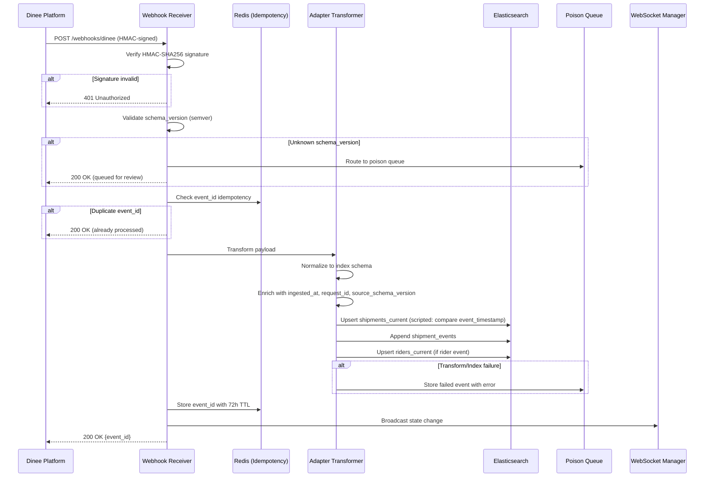
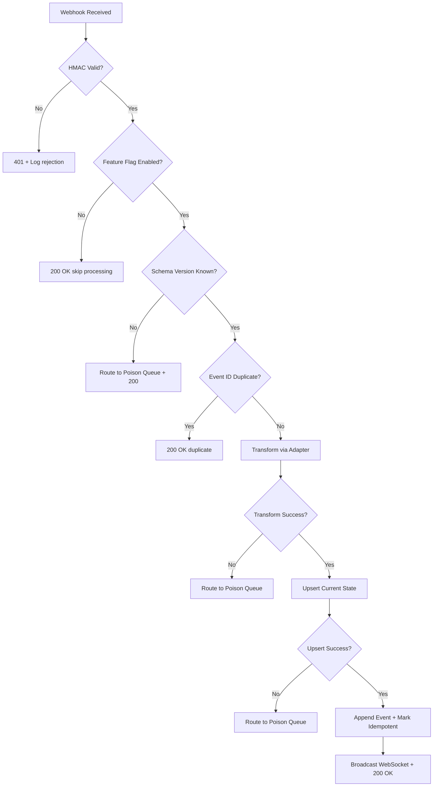

# Design Document: Ops Intelligence Layer

## Overview

The Ops Intelligence Layer adds a complete operational visibility and analytics system to the Runsheet logistics platform. It ingests real-time shipment and rider event data from the Dinee external platform via signed webhooks, normalizes payloads through a versioned adapter, materializes state into three Elasticsearch indices (shipments_current, shipment_events, riders_current), and exposes tenant-scoped REST APIs, a frontend operations dashboard, AI-powered query/report tools, and reliability infrastructure.

The design builds on the existing production-readiness foundation: the same `ElasticsearchService` with circuit breakers, `Settings` for configuration, `RequestIDMiddleware` for tracing, `AppException` for structured errors, `RedisSessionStore` for state, and `ConnectionManager` for WebSocket broadcasting. New components are added as modules under the existing package structure.

## Architecture

### High-Level System Architecture

```mermaid
graph TB
    subgraph "Dinee Platform (External)"
        DINEE[Dinee Webhook Sender]
        DINEE_API[Dinee Backfill REST API]
    end

    subgraph "Frontend (Next.js)"
        OPS_BOARD[Shipment Status Board]
        RIDER_VIEW[Rider Utilization View]
        FAILURE_PAGE[Failure Analytics Page]
        TRACKING[Shipment Tracking Monitor]
        WS_OPS[WebSocket Client /ws/ops]
    end

    subgraph "Backend Service (FastAPI)"
        subgraph "Ingestion Layer"
            WH_RECV[Webhook Receiver<br/>/webhooks/dinee]
            ADAPTER[Adapter Transformer]
            REPLAY[Replay Service]
            PQ[Poison Queue]
            IDEMP[Idempotency Store<br/>Redis]
        end

        subgraph "Ops API Layer"
            OPS_API[Ops REST Endpoints<br/>/ops/*]
            TENANT_GUARD[Tenant Guard<br/>JWT tenant_id]
            METRICS_API[Metrics Endpoints<br/>/ops/metrics/*]
            MON_API[Monitoring Endpoints<br/>/ops/monitoring/*]
        end

        subgraph "AI Tools Layer"
            SEARCH_SHIP[search_shipments]
            SEARCH_RIDER[search_riders]
            GET_EVENTS[get_shipment_events]
            GET_METRICS[get_ops_metrics]
            RPT_SLA[generate_sla_report]
            RPT_FAIL[generate_failure_report]
            RPT_RIDER[generate_rider_productivity_report]
        end

        subgraph "Infrastructure"
            FF_SVC[Feature Flag Service]
            PII[PII Masker]
            DRIFT[Drift Detector]
            WS_MGR[WebSocket Manager<br/>/ws/ops]
        end
    end

    subgraph "Data Stores"
        ES_SHIP[(shipments_current)]
        ES_EVENTS[(shipment_events)]
        ES_RIDER[(riders_current)]
        ES_PQ[(poison_queue index)]
        REDIS[(Redis)]
    end

    DINEE -->|HMAC-signed POST| WH_RECV
    DINEE_API -->|Paginated GET| REPLAY
    WH_RECV --> IDEMP
    WH_RECV --> ADAPTER
    ADAPTER --> ES_SHIP
    ADAPTER --> ES_EVENTS
    ADAPTER --> ES_RIDER
    ADAPTER -->|failures| PQ
    PQ --> ES_PQ
    REPLAY --> ADAPTER

    OPS_API --> TENANT_GUARD
    TENANT_GUARD --> ES_SHIP
    TENANT_GUARD --> ES_EVENTS
    TENANT_GUARD --> ES_RIDER
    METRICS_API --> TENANT_GUARD

    OPS_BOARD --> OPS_API
    RIDER_VIEW --> OPS_API
    FAILURE_PAGE --> METRICS_API
    TRACKING --> OPS_API
    WS_OPS --> WS_MGR

    SEARCH_SHIP --> TENANT_GUARD
    SEARCH_RIDER --> TENANT_GUARD
    GET_EVENTS --> TENANT_GUARD
    RPT_SLA --> TENANT_GUARD

    WS_MGR -->|broadcast| WS_OPS
    FF_SVC --> REDIS
```



### Webhook Ingestion Flow



## Components and Interfaces

### 1. Webhook Receiver

The Webhook Receiver is a FastAPI router mounted at `/webhooks/dinee`. It verifies HMAC-SHA256 signatures, enforces idempotency via Redis, validates schema versions, and delegates to the Adapter Transformer.

**Canonical Webhook Auth Policy:** Webhook authentication uses HMAC-SHA256 only. The `dinee_webhook_secret` is the sole credential for verifying inbound webhooks. The `dinee_api_key` setting is used exclusively for outbound REST API calls to Dinee (Replay Service backfill). There is no API key requirement on the webhook endpoint.

```python
# ops/webhooks/receiver.py
from fastapi import APIRouter, Request, Header, Depends
from pydantic import BaseModel
from typing import Optional
import hmac, hashlib

router = APIRouter(prefix="/webhooks", tags=["webhooks"])

class WebhookPayload(BaseModel):
    event_id: str
    event_type: str           # shipment_created, rider_assigned, etc.
    schema_version: str       # semver e.g. "1.0"
    tenant_id: str
    timestamp: str            # ISO 8601
    data: dict                # event-specific payload

class WebhookResponse(BaseModel):
    event_id: str
    status: str               # "processed" | "duplicate" | "queued_for_review"

@router.post("/dinee", response_model=WebhookResponse)
async def receive_dinee_webhook(
    request: Request,
    x_dinee_signature: str = Header(...),
    x_dinee_timestamp: str = Header(...)
):
    """
    Validates: Req 1.1-1.11
    - Verify HMAC-SHA256 signature
    - Check idempotency (Redis)
    - Validate schema_version
    - Route to Adapter or Poison Queue
    """
    ...
```

**Interface:**
- `POST /webhooks/dinee` → `WebhookResponse`
- Dependencies: `IdempotencyService`, `AdapterTransformer`, `PoisonQueueService`, `FeatureFlagService`

**Configuration additions to `Settings`:**
```python
# Added to config/settings.py
dinee_webhook_secret: str = Field(..., description="HMAC-SHA256 shared secret for verifying inbound Dinee webhooks (sole webhook auth credential)")
dinee_idempotency_ttl_hours: int = Field(default=72, description="Idempotency store TTL in hours")
dinee_api_base_url: Optional[str] = Field(default=None, description="Dinee REST API base URL for Replay Service backfill")
dinee_api_key: Optional[str] = Field(default=None, description="Dinee API key for outbound Replay Service REST calls only (NOT used for webhook auth)")
ops_webhook_rate_limit: int = Field(default=500, description="Webhook rate limit per minute per IP")
ops_api_rate_limit: int = Field(default=100, description="Ops API rate limit per minute per user")
ops_metrics_rate_limit: int = Field(default=20, description="Metrics API rate limit per minute per user")
```

### 2. Idempotency Service

Wraps Redis to provide event_id deduplication with configurable TTL. Reuses the existing `RedisSessionStore` connection pattern.

```python
# ops/ingestion/idempotency.py
class IdempotencyService:
    def __init__(self, redis_url: str, ttl_hours: int = 72):
        self.prefix = "idemp:"
        self.ttl = timedelta(hours=ttl_hours)

    async def is_duplicate(self, event_id: str) -> bool:
        """Check if event_id was already processed."""
        ...

    async def mark_processed(self, event_id: str) -> None:
        """Store event_id with TTL."""
        ...
```

**Interface:**
- `is_duplicate(event_id) -> bool`
- `mark_processed(event_id) -> None`

### 3. Adapter Transformer

Converts Dinee payloads into normalized Elasticsearch documents. Maintains a registry of schema version handlers for concurrent version support during migrations.

```python
# ops/ingestion/adapter.py
from abc import ABC, abstractmethod
from typing import Optional
from datetime import datetime

class TransformResult:
    shipment_current_doc: Optional[dict]   # For shipments_current upsert
    rider_current_doc: Optional[dict]       # For riders_current upsert
    event_doc: dict                         # For shipment_events append

class SchemaHandler(ABC):
    @abstractmethod
    def transform(self, payload: dict, request_id: str) -> TransformResult:
        """Transform a Dinee payload into ES documents."""
        ...

class AdapterTransformer:
    def __init__(self):
        self._handlers: dict[str, SchemaHandler] = {}
        self._deprecated_versions: set[str] = set()

    def register_handler(self, version: str, handler: SchemaHandler, deprecated: bool = False):
        """Register a schema version handler. Validates: Req 2.9"""
        ...

    def transform(self, payload: WebhookPayload, request_id: str) -> TransformResult:
        """
        Transform payload using the appropriate version handler.
        Validates: Req 2.1-2.10
        - Produces documents conforming to index mappings
        - Enriches with ingested_at, request_id, source_schema_version
        - Validates output against target schema
        - Logs warnings for unmappable fields and deprecated versions
        """
        ...

    def is_version_supported(self, version: str) -> bool:
        """Check if a schema version has a registered handler."""
        ...
```

**Interface:**
- `transform(payload, request_id) -> TransformResult`
- `register_handler(version, handler, deprecated)`
- `is_version_supported(version) -> bool`

### 4. Poison Queue Service

Stores failed events in a dedicated Elasticsearch index for durability across restarts. Supports listing, retry, and purge operations.

```python
# ops/ingestion/poison_queue.py
class PoisonQueueEntry(BaseModel):
    event_id: str
    original_payload: dict
    error_reason: str
    error_type: str
    created_at: datetime
    retry_count: int = 0
    max_retries: int = 5
    status: str = "pending"  # pending | retrying | permanently_failed

class PoisonQueueService:
    INDEX_NAME = "ops_poison_queue"

    async def store_failed_event(self, payload: dict, error: str, error_type: str) -> None:
        """Validates: Req 4.1 - Store with error reason, timestamp, retry count."""
        ...

    async def list_failed_events(
        self, error_type: Optional[str] = None,
        time_range: Optional[tuple] = None,
        retry_count: Optional[int] = None,
        page: int = 1, size: int = 20
    ) -> PaginatedResponse:
        """Validates: Req 4.3 - List with filtering."""
        ...

    async def retry_event(self, event_id: str) -> dict:
        """Validates: Req 4.4 - Resubmit through standard pipeline."""
        ...

    async def purge_event(self, event_id: str) -> None:
        """Validates: Req 4.7 - Manually purge permanently failed events."""
        ...
```

**Interface:**
- `store_failed_event(payload, error, error_type)`
- `list_failed_events(filters) -> PaginatedResponse`
- `retry_event(event_id) -> dict`
- `purge_event(event_id)`

### 5. Ops Elasticsearch Index Management

Extends the existing `ElasticsearchService` with three new indices using strict mappings. Adds upsert logic with out-of-order event reconciliation and ILM policies.

```python
# Added to services/elasticsearch_service.py (or ops/services/ops_es_service.py)

class OpsElasticsearchService:
    """
    Manages ops-specific indices and operations.
    Delegates to the existing ElasticsearchService for connection/circuit breaker.
    """

    SHIPMENTS_CURRENT = "shipments_current"
    SHIPMENT_EVENTS = "shipment_events"
    RIDERS_CURRENT = "riders_current"

    def setup_ops_indices(self):
        """Create indices with strict mappings. Validates: Req 5.1-5.6"""
        ...

    def _get_shipments_current_mapping(self) -> dict:
        """
        Strict mapping: shipment_id (keyword), status (keyword),
        tenant_id (keyword), rider_id (keyword), created_at (date),
        updated_at (date), estimated_delivery (date),
        current_location (geo_point), last_event_timestamp (date),
        source_schema_version (keyword), trace_id (keyword),
        ingested_at (date)
        Validates: Req 5.1
        """
        ...

    def _get_shipment_events_mapping(self) -> dict:
        """
        Strict mapping: event_id (keyword), shipment_id (keyword),
        event_type (keyword), tenant_id (keyword),
        event_timestamp (date), event_payload (nested object),
        source_schema_version (keyword), trace_id (keyword),
        ingested_at (date)
        Validates: Req 5.2
        """
        ...

    def _get_riders_current_mapping(self) -> dict:
        """
        Strict mapping: rider_id (keyword), status (keyword),
        tenant_id (keyword), availability (keyword),
        last_seen (date), current_location (geo_point),
        last_event_timestamp (date), source_schema_version (keyword),
        trace_id (keyword), ingested_at (date)
        Validates: Req 5.3
        """
        ...

    async def upsert_shipment_current(self, doc: dict) -> bool:
        """
        Scripted upsert: compare incoming event_timestamp vs existing
        last_event_timestamp. Discard if stale. Partial update only
        fields present in incoming event.
        Validates: Req 6.1, 6.4, 6.7, 6.8
        """
        ...

    async def upsert_rider_current(self, doc: dict) -> bool:
        """Same timestamp-based upsert logic for riders. Validates: Req 6.2, 6.7"""
        ...

    async def append_shipment_event(self, doc: dict) -> None:
        """Always append regardless of ordering. Validates: Req 6.3, 6.9"""
        ...

    async def bulk_upsert(self, operations: list[dict]) -> dict:
        """Bulk API for batch ingestion. Validates: Req 6.6"""
        ...

    def setup_ops_ilm_policies(self):
        """
        shipment_events: warm@30d, cold@90d, delete@365d
        shipments_current/riders_current: force-merge after 7d no writes
        Validates: Req 7.1-7.5
        """
        ...
```

### 6. Replay Service

Background job that pulls historical data from Dinee REST APIs for backfill. Reuses the Adapter Transformer and idempotency checks.

**Replay vs Live Conflict Rule:** Replay events are processed through the exact same pipeline as live webhook events: same AdapterTransformer, same idempotency checks, same scripted upsert with `last_event_timestamp` comparison. If a replay sends an older snapshot after a newer live update has already been indexed, the scripted upsert discards the stale replay event (`ctx.op = 'noop'`). The event is still appended to `shipment_events` for audit completeness. No special conflict resolution is needed beyond the existing out-of-order reconciliation.

```python
# ops/ingestion/replay.py
class ReplayJobStatus(BaseModel):
    job_id: str
    tenant_id: str
    status: str              # running | completed | failed
    total_records: int
    processed_count: int
    failed_count: int
    skipped_count: int       # duplicates
    estimated_remaining: Optional[str]
    started_at: datetime
    completed_at: Optional[datetime]

class ReplayService:
    def __init__(self, adapter: AdapterTransformer, idempotency: IdempotencyService,
                 ops_es: OpsElasticsearchService, settings: Settings):
        ...

    async def trigger_backfill(self, tenant_id: str, start_time: datetime,
                                end_time: datetime) -> ReplayJobStatus:
        """
        Validates: Req 3.1-3.2
        - Trigger backfill for tenant/time range
        - Pull paginated data from Dinee API
        """
        ...

    async def get_job_status(self, job_id: str) -> ReplayJobStatus:
        """Validates: Req 3.5 - Report progress."""
        ...
```

**Interface:**
- `POST /ops/replay/trigger` → `ReplayJobStatus`
- `GET /ops/replay/status/{job_id}` → `ReplayJobStatus`

### 7. Tenant Guard

Middleware/dependency that extracts tenant_id from JWT claims and injects it into every Elasticsearch query. Ignores tenant_id from query params or unsigned headers.

```python
# ops/middleware/tenant_guard.py
from fastapi import Depends, Request
from errors.exceptions import forbidden

class TenantContext:
    tenant_id: str
    user_id: str
    has_pii_access: bool

async def get_tenant_context(request: Request) -> TenantContext:
    """
    Extract tenant_id exclusively from signed JWT tenant_id claim.
    Validates: Req 9.1, 9.6, 9.8
    - Reject if JWT claim missing/invalid (403)
    - Ignore query param / unsigned header tenant_id
    """
    ...

def inject_tenant_filter(query: dict, tenant_id: str) -> dict:
    """
    Wrap any ES query with a bool filter on tenant_id.
    Validates: Req 9.2, 9.4
    """
    return {
        "query": {
            "bool": {
                "must": [query.get("query", {"match_all": {}})],
                "filter": [{"term": {"tenant_id": tenant_id}}]
            }
        }
    }
```

**Interface:**
- `get_tenant_context(request) -> TenantContext` (FastAPI dependency)
- `inject_tenant_filter(query, tenant_id) -> dict`

### 8. Ops API Endpoints

FastAPI router providing normalized REST endpoints. All endpoints use the Tenant Guard dependency and return a consistent JSON envelope.

```python
# ops/api/endpoints.py
from fastapi import APIRouter, Depends, Query
from typing import Optional

router = APIRouter(prefix="/ops", tags=["ops"], dependencies=[Depends(get_tenant_context)])

class PaginatedResponse(BaseModel):
    data: list[dict]
    pagination: PaginationMeta
    request_id: str

class PaginationMeta(BaseModel):
    page: int
    size: int
    total: int
    total_pages: int

# --- Read Endpoints (Req 8) ---
@router.get("/shipments", response_model=PaginatedResponse)
async def list_shipments(
    status: Optional[str] = None,
    rider_id: Optional[str] = None,
    start_date: Optional[str] = None,
    end_date: Optional[str] = None,
    page: int = 1, size: int = 20,
    sort_by: str = "updated_at", sort_order: str = "desc",
    tenant: TenantContext = Depends(get_tenant_context)
):
    """Validates: Req 8.1, 10.1, 10.5"""
    ...

@router.get("/shipments/{shipment_id}")
async def get_shipment(shipment_id: str, tenant: TenantContext = Depends(get_tenant_context)):
    """Returns shipment + full event history. Validates: Req 8.2"""
    ...

@router.get("/riders", response_model=PaginatedResponse)
async def list_riders(status: Optional[str] = None, page: int = 1, size: int = 20,
                      tenant: TenantContext = Depends(get_tenant_context)):
    """Validates: Req 8.3"""
    ...

@router.get("/riders/{rider_id}")
async def get_rider(rider_id: str, tenant: TenantContext = Depends(get_tenant_context)):
    """Validates: Req 8.4"""
    ...

@router.get("/events", response_model=PaginatedResponse)
async def list_events(shipment_id: Optional[str] = None, event_type: Optional[str] = None,
                      start_date: Optional[str] = None, end_date: Optional[str] = None,
                      page: int = 1, size: int = 20,
                      tenant: TenantContext = Depends(get_tenant_context)):
    """Validates: Req 8.5"""
    ...

# --- Filtered Endpoints (Req 10) ---
@router.get("/shipments/sla-breaches", response_model=PaginatedResponse)
async def get_sla_breaches(tenant: TenantContext = Depends(get_tenant_context)):
    """Validates: Req 10.2"""
    ...

@router.get("/riders/utilization", response_model=PaginatedResponse)
async def get_rider_utilization(tenant: TenantContext = Depends(get_tenant_context)):
    """Validates: Req 10.3"""
    ...

@router.get("/shipments/failures", response_model=PaginatedResponse)
async def get_shipment_failures(tenant: TenantContext = Depends(get_tenant_context)):
    """Validates: Req 10.4"""
    ...

# --- Aggregated Metrics (Req 11) ---
@router.get("/metrics/shipments")
async def get_shipment_metrics(bucket: str = "hourly", start_date: str = None,
                                end_date: str = None,
                                tenant: TenantContext = Depends(get_tenant_context)):
    """Validates: Req 11.1, 11.5, 11.6"""
    ...

@router.get("/metrics/sla")
async def get_sla_metrics(bucket: str = "hourly", tenant: TenantContext = Depends(get_tenant_context)):
    """Validates: Req 11.2"""
    ...

@router.get("/metrics/riders")
async def get_rider_metrics(bucket: str = "hourly", tenant: TenantContext = Depends(get_tenant_context)):
    """Validates: Req 11.3"""
    ...

@router.get("/metrics/failures")
async def get_failure_metrics(bucket: str = "hourly", tenant: TenantContext = Depends(get_tenant_context)):
    """Validates: Req 11.4"""
    ...

# --- Monitoring (Req 23) ---
@router.get("/monitoring/ingestion")
async def get_ingestion_metrics(window: str = "5m"):
    """Validates: Req 23.1"""
    ...

@router.get("/monitoring/indexing")
async def get_indexing_metrics(window: str = "5m"):
    """Validates: Req 23.2"""
    ...

@router.get("/monitoring/poison-queue")
async def get_poison_queue_metrics():
    """Validates: Req 23.3"""
    ...
```

**Response Envelope (all endpoints):**
```json
{
  "data": [...],
  "pagination": {"page": 1, "size": 20, "total": 142, "total_pages": 8},
  "request_id": "req_abc123"
}
```

### 9. PII Masker

Middleware component that redacts PII from API responses and AI outputs. Uses role-based masking by endpoint audience rather than blanket masking on all responses.

**Masking Policy by Audience:**
- External/customer-facing endpoints: always mask PII regardless of permissions
- Internal ops endpoints (`/ops/*`): mask by default; unmask only if JWT contains `has_pii_access: true`
- AI tool outputs: always mask (PII never exposed in agent responses)
- WebSocket broadcasts: mask by default; client-specific unmasking based on connection auth

```python
# ops/middleware/pii_masker.py
import re

class PIIMasker:
    PHONE_PATTERN = re.compile(r'\+?\d[\d\s\-]{7,}\d')
    EMAIL_PATTERN = re.compile(r'[\w.+-]+@[\w-]+\.[\w.-]+')
    NAME_FIELDS = {"customer_name", "recipient_name", "sender_name"}

    def mask_response(self, data: dict, has_pii_access: bool = False) -> dict:
        """
        Validates: Req 22.1-22.4
        - Redact phone, email, names unless user has pii_access
        - Replace with masked placeholders
        """
        ...

    def mask_phone(self, phone: str) -> str:
        """'+XX-XXXX-XX34' retaining last 2 digits. Validates: Req 22.3"""
        ...

    def mask_email(self, email: str) -> str:
        """'***@***.com'. Validates: Req 22.3"""
        ...
```

### 10. WebSocket Manager for Ops

Extends the existing `ConnectionManager` pattern to support ops-specific subscription filters (shipment_update, rider_update, sla_breach).

```python
# ops/websocket/ops_ws.py
from fastapi import WebSocket

class OpsWebSocketManager:
    """
    Validates: Req 16.1-16.6
    - /ws/ops endpoint
    - Subscription filters by event type
    - Heartbeat every 30s
    - Broadcast on upsert
    """

    async def connect(self, websocket: WebSocket, subscriptions: list[str]):
        ...

    async def broadcast_shipment_update(self, shipment_data: dict):
        """Validates: Req 16.2"""
        ...

    async def broadcast_rider_update(self, rider_data: dict):
        """Validates: Req 16.3"""
        ...

    async def broadcast_sla_breach(self, breach_data: dict):
        ...

    async def _heartbeat_loop(self, websocket: WebSocket):
        """Send heartbeat every 30s. Validates: Req 16.6"""
        ...
```

### 11. Feature Flag Service

Controls per-tenant rollout using Redis-backed flags. Integrates with webhook receiver, API layer, WebSocket, AI tools, and frontend.

**Disabled Tenant Behavior by Surface:**
| Surface | Behavior when disabled |
|---|---|
| Webhook | Accept with 200, skip processing (no ES writes) |
| Ops API | Return 404 `TENANT_DISABLED` for all `/ops/*` endpoints |
| WebSocket | Reject new connections with close code 4403 "tenant_disabled"; disconnect existing clients within 30s |
| AI Tools | Return structured disabled response `{"status": "disabled", "message": "..."}` (no exception) |
| Frontend | Hide ops sidebar nav section |

```python
# ops/services/feature_flags.py
class FeatureFlagService:
    PREFIX = "ops_ff:"

    async def is_enabled(self, tenant_id: str) -> bool:
        """Validates: Req 27.1"""
        ...

    async def enable(self, tenant_id: str, user_id: str) -> None:
        """Validates: Req 27.6 - Log change."""
        ...

    async def disable(self, tenant_id: str, user_id: str) -> None:
        """Validates: Req 27.2-27.4"""
        ...

    async def rollback(self, tenant_id: str, user_id: str, purge_data: bool = False) -> None:
        """Validates: Req 27.5 - Disable + optional data purge."""
        ...
```

### 12. AI Ops Tools

New tool functions for the Strands-based AI agent, following the existing `@tool` decorator pattern from `search_tools.py` and `report_tools.py`. All tools enforce tenant scoping and read-only access.

```python
# Agents/tools/ops_search_tools.py
from strands import tool

@tool
async def search_shipments(
    status: str = None, rider_id: str = None,
    start_date: str = None, end_date: str = None,
    query: str = None, tenant_id: str = None
) -> str:
    """Validates: Req 17.1, 17.5, 17.6, 19.1-19.2"""
    ...

@tool
async def search_riders(
    status: str = None, availability: str = None,
    tenant_id: str = None
) -> str:
    """Validates: Req 17.2"""
    ...

@tool
async def get_shipment_events(
    shipment_id: str, tenant_id: str = None
) -> str:
    """Validates: Req 17.3"""
    ...

@tool
async def get_ops_metrics(
    metric_type: str = "shipments",
    bucket: str = "hourly",
    start_date: str = None, end_date: str = None,
    tenant_id: str = None
) -> str:
    """Validates: Req 17.4"""
    ...

# Agents/tools/ops_report_tools.py
@tool
async def generate_sla_report(
    start_date: str, end_date: str, tenant_id: str = None
) -> str:
    """Validates: Req 18.1, 18.4, 18.5"""
    ...

@tool
async def generate_failure_report(
    start_date: str, end_date: str, tenant_id: str = None
) -> str:
    """Validates: Req 18.2"""
    ...

@tool
async def generate_rider_productivity_report(
    start_date: str, end_date: str, tenant_id: str = None
) -> str:
    """Validates: Req 18.3"""
    ...
```

### 13. Drift Detector

Compares Dinee source state against Runsheet read-model state. Exposes API endpoint and supports scheduled runs.

```python
# ops/services/drift_detector.py
class DriftResult(BaseModel):
    tenant_id: str
    checked_at: datetime
    shipment_count_dinee: int
    shipment_count_runsheet: int
    divergent_shipments: list[dict]
    divergent_riders: list[dict]
    drift_percentage: float
    alert_triggered: bool

class DriftDetector:
    def __init__(self, dinee_api_client, ops_es: OpsElasticsearchService, settings: Settings):
        self.threshold_pct = 1.0  # configurable, default 1%
        self.schedule_interval_hours = 6

    async def run_detection(self, tenant_id: str, start_time: datetime = None,
                             end_time: datetime = None) -> DriftResult:
        """Validates: Req 25.1-25.6"""
        ...
```

### 14. Prometheus Metrics and Alert Rules

Exposes Prometheus-compatible metrics for monitoring the ops intelligence layer. All metrics use the `ops_` prefix for namespace isolation.

**Metric Definitions:**

| Metric Name | Type | Labels | Description |
|---|---|---|---|
| `ops_webhook_received_total` | Counter | tenant_id, schema_version | Total webhooks received |
| `ops_webhook_processed_total` | Counter | tenant_id, status | Processing outcomes (processed/duplicate/rejected/queued) |
| `ops_ingestion_latency_seconds` | Histogram | tenant_id, event_type | Webhook receipt to ES upsert latency |
| `ops_transform_errors_total` | Counter | tenant_id, error_type | Adapter transform failures |
| `ops_es_indexing_latency_seconds` | Histogram | index_name | ES indexing operation latency |
| `ops_es_indexing_errors_total` | Counter | index_name, error_type | ES indexing failures |
| `ops_poison_queue_depth` | Gauge | tenant_id | Current poison queue size |
| `ops_poison_queue_oldest_age_seconds` | Gauge | — | Age of oldest unresolved entry |
| `ops_api_request_duration_seconds` | Histogram | endpoint, method | API response latency |
| `ops_ws_active_connections` | Gauge | tenant_id | Active WebSocket connections |
| `ops_drift_percentage` | Gauge | tenant_id | Last drift detection result |
| `ops_feature_flag_changes_total` | Counter | tenant_id, action | Flag changes (enable/disable/rollback) |

**Alert Rules (log-based, upgradeable to Alertmanager):**

| Severity | Condition | Description |
|---|---|---|
| WARN | `ops_ingestion_latency_seconds` p95 > 5s for 5min | Ingestion pipeline slow |
| ERROR | `ops_poison_queue_depth` > 100 | Poison queue backlog critical |
| WARN | `ops_poison_queue_oldest_age_seconds` > 3600 | Stale poison queue entries |
| ERROR | `ops_es_indexing_errors_total` rate > 10/min for 5min | ES indexing failures spiking |
| WARN | `ops_drift_percentage` > 1% | Source-replica drift detected |
| WARN | `ops_ws_active_connections` = 0 for > 10min | Potential WebSocket connectivity issue |

### 15. Frontend Ops Dashboard Components

New Next.js pages and components under `runsheet/src/`, following existing patterns (component files in `src/components/`, hooks in `src/hooks/`, API calls in `src/services/api.ts`).

```
runsheet/src/
├── app/
│   └── ops/                          # New ops route group
│       ├── page.tsx                   # Shipment status board (Req 12)
│       ├── riders/page.tsx            # Rider utilization view (Req 13)
│       ├── failures/page.tsx          # Failure analytics page (Req 14)
│       └── tracking/[id]/page.tsx     # Shipment tracking monitor (Req 15)
├── components/
│   ├── ops/
│   │   ├── ShipmentBoard.tsx          # Status board with color-coded rows
│   │   ├── ShipmentSummaryBar.tsx     # Status count summary
│   │   ├── RiderUtilizationList.tsx   # Rider list with utilization bars
│   │   ├── FailureBarChart.tsx        # Failure counts by reason
│   │   ├── FailureTrendChart.tsx      # Failure trend over time
│   │   ├── ShipmentTimeline.tsx       # Event timeline for tracking
│   │   ├── ShipmentMap.tsx            # Map with event location markers
│   │   └── OpsFilters.tsx             # Shared filter controls
│   └── ...existing components
├── hooks/
│   ├── useOpsWebSocket.ts             # WebSocket hook for /ws/ops
│   └── ...existing hooks
└── services/
    ├── opsApi.ts                      # Ops API client functions
    └── api.ts                         # ...existing
```

**Key Frontend Behaviors:**
- `ShipmentBoard`: Fetches from `/ops/shipments`, color-codes by status (green=delivered, yellow=in_transit, red=failed, orange=SLA breach). Supports column sorting and filter controls. Updates via `useOpsWebSocket` within 5 seconds. (Req 12.1-12.6)
- `RiderUtilizationList`: Fetches from `/ops/riders/utilization`, shows utilization bar per rider, highlights overloaded (red) and idle >30min (yellow). Updates via WebSocket. (Req 13.1-13.5)
- `FailureBarChart` + `FailureTrendChart`: Fetches from `/ops/metrics/failures`, supports time range selection. Click-to-filter on bar chart. (Req 14.1-14.5)
- `ShipmentTimeline` + `ShipmentMap`: Fetches from `/ops/shipments/{id}`, renders event timeline and map markers. Live updates via WebSocket. (Req 15.1-15.5)
- `useOpsWebSocket`: Connects to `/ws/ops`, supports subscription filters, auto-reconnect with exponential backoff (1s to 30s max). (Req 16.5)

## Data Models

### Elasticsearch Index Mappings

#### shipments_current (Req 5.1)
```json
{
  "mappings": {
    "dynamic": "strict",
    "properties": {
      "shipment_id":          {"type": "keyword"},
      "status":               {"type": "keyword"},
      "tenant_id":            {"type": "keyword"},
      "rider_id":             {"type": "keyword"},
      "origin":               {"type": "text", "fields": {"keyword": {"type": "keyword"}}},
      "destination":          {"type": "text", "fields": {"keyword": {"type": "keyword"}}},
      "created_at":           {"type": "date"},
      "updated_at":           {"type": "date"},
      "estimated_delivery":   {"type": "date"},
      "current_location":     {"type": "geo_point"},
      "last_event_timestamp": {"type": "date"},
      "failure_reason":       {"type": "keyword"},
      "source_schema_version":{"type": "keyword"},
      "trace_id":             {"type": "keyword"},
      "ingested_at":          {"type": "date"}
    }
  },
  "settings": {
    "number_of_shards": 1,
    "number_of_replicas": 1
  }
}
```

#### shipment_events (Req 5.2)
```json
{
  "mappings": {
    "dynamic": "strict",
    "properties": {
      "event_id":             {"type": "keyword"},
      "shipment_id":          {"type": "keyword"},
      "event_type":           {"type": "keyword"},
      "tenant_id":            {"type": "keyword"},
      "event_timestamp":      {"type": "date"},
      "event_payload":        {"type": "nested", "properties": {
        "key":   {"type": "keyword"},
        "value": {"type": "text"}
      }},
      "location":             {"type": "geo_point"},
      "source_schema_version":{"type": "keyword"},
      "trace_id":             {"type": "keyword"},
      "ingested_at":          {"type": "date"}
    }
  },
  "settings": {
    "number_of_shards": 1,
    "number_of_replicas": 1
  }
}
```

Note: `shipment_events` uses time-based index naming with monthly rollover (e.g., `shipment_events-2026.03`) managed by ILM rollover action. An index alias `shipment_events` points to the active write index. (Req 5.6)

#### riders_current (Req 5.3)
```json
{
  "mappings": {
    "dynamic": "strict",
    "properties": {
      "rider_id":             {"type": "keyword"},
      "rider_name":           {"type": "text", "fields": {"keyword": {"type": "keyword"}}},
      "status":               {"type": "keyword"},
      "tenant_id":            {"type": "keyword"},
      "availability":         {"type": "keyword"},
      "last_seen":            {"type": "date"},
      "current_location":     {"type": "geo_point"},
      "active_shipment_count":{"type": "integer"},
      "completed_today":      {"type": "integer"},
      "last_event_timestamp": {"type": "date"},
      "source_schema_version":{"type": "keyword"},
      "trace_id":             {"type": "keyword"},
      "ingested_at":          {"type": "date"}
    }
  },
  "settings": {
    "number_of_shards": 1,
    "number_of_replicas": 1
  }
}
```

#### ops_poison_queue
```json
{
  "mappings": {
    "properties": {
      "event_id":         {"type": "keyword"},
      "original_payload": {"type": "object", "enabled": false},
      "error_reason":     {"type": "text", "fields": {"keyword": {"type": "keyword"}}},
      "error_type":       {"type": "keyword"},
      "created_at":       {"type": "date"},
      "retry_count":      {"type": "integer"},
      "max_retries":      {"type": "integer"},
      "status":           {"type": "keyword"},
      "tenant_id":        {"type": "keyword"}
    }
  }
}
```

### API Response Models

```python
# ops/models.py
from pydantic import BaseModel
from typing import Optional, Any
from datetime import datetime

class PaginationMeta(BaseModel):
    page: int
    size: int
    total: int
    total_pages: int

class PaginatedResponse(BaseModel):
    data: list[dict[str, Any]]
    pagination: PaginationMeta
    request_id: str

class ShipmentDetail(BaseModel):
    shipment_id: str
    status: str
    tenant_id: str
    rider_id: Optional[str]
    origin: Optional[str]
    destination: Optional[str]
    created_at: Optional[datetime]
    updated_at: Optional[datetime]
    estimated_delivery: Optional[datetime]
    current_location: Optional[dict]
    failure_reason: Optional[str]
    events: Optional[list[dict]]  # Populated on detail endpoint

class RiderDetail(BaseModel):
    rider_id: str
    rider_name: Optional[str]
    status: str
    tenant_id: str
    availability: Optional[str]
    last_seen: Optional[datetime]
    current_location: Optional[dict]
    active_shipment_count: int = 0
    completed_today: int = 0

class MetricsBucket(BaseModel):
    timestamp: str
    count: int
    breakdown: Optional[dict] = None

class MetricsResponse(BaseModel):
    data: list[MetricsBucket]
    bucket: str
    start_date: str
    end_date: str
    request_id: str
```

### Upsert Script for Out-of-Order Reconciliation (Req 6.7-6.9)

The scripted upsert uses Elasticsearch's painless scripting to compare timestamps:

```json
{
  "scripted_upsert": true,
  "script": {
    "source": "if (ctx._source.last_event_timestamp == null || Instant.parse(params.event_timestamp).isAfter(Instant.parse(ctx._source.last_event_timestamp))) { for (entry in params.updates.entrySet()) { ctx._source[entry.getKey()] = entry.getValue(); } ctx._source.last_event_timestamp = params.event_timestamp; } else { ctx.op = 'noop'; }",
    "params": {
      "event_timestamp": "2026-03-03T10:00:00Z",
      "updates": { "status": "in_transit", "rider_id": "R-001" }
    }
  },
  "upsert": { "...full document for initial insert..." }
}
```

When `ctx.op = 'noop'`, the stale event is discarded and logged at INFO level with event_id, entity_id, incoming timestamp, and existing timestamp. The event is still appended to `shipment_events` regardless.

## Correctness Properties

### Property 1: HMAC Signature Verification Completeness

*For any* webhook request with a payload and signature header, the Webhook_Receiver SHALL accept the request if and only if `HMAC-SHA256(shared_secret, payload_body)` equals the provided signature. All other requests SHALL be rejected with 401.

**Validates: Requirements 1.2, 1.3**

### Property 2: Idempotent Processing Guarantee

*For any* event_id delivered N times (N ≥ 1) to the Webhook_Receiver, the resulting Elasticsearch state SHALL be identical to processing the event exactly once. The first delivery produces a state change; all subsequent deliveries return 200 without side effects.

**Validates: Requirements 1.4, 1.5, 1.11**

### Property 3: Adapter Transform Round-Trip Consistency

*For any* valid Dinee payload, transforming it through the Adapter_Transformer, serializing the output to JSON, deserializing it back, and comparing against the original transform output SHALL produce an equivalent document.

**Validates: Requirement 2.7**

### Property 4: Schema Version Registry Completeness

*For any* schema_version value in a webhook payload, exactly one of the following holds: (a) a registered handler processes it, (b) a deprecated handler processes it with a WARN log, or (c) the event is routed to the Poison_Queue. No payload is silently dropped.

**Validates: Requirements 1.10, 2.8, 2.9, 2.10**

### Property 5: Out-of-Order Event Reconciliation

*For any* sequence of events for a given entity (shipment or rider), the current-state index document SHALL always reflect the event with the latest `event_timestamp`, regardless of delivery order. The `shipment_events` append-only index SHALL contain all events regardless of ordering.

**Validates: Requirements 6.7, 6.8, 6.9**

### Property 6: Tenant Isolation

*For any* Ops_API request with a valid JWT containing `tenant_id = T`, every Elasticsearch query executed SHALL include a `term` filter on `tenant_id = T`. No query SHALL return documents where `tenant_id ≠ T`.

**Validates: Requirements 9.1-9.8**

### Property 7: Poison Queue Retry Bound

*For any* event in the Poison_Queue, the retry_count SHALL never exceed max_retries (5). After the 5th retry failure, the event status SHALL be "permanently_failed" and an ERROR log SHALL be emitted.

**Validates: Requirements 4.5, 4.6**

### Property 8: PII Masking Completeness

*For any* API response containing fields matching phone, email, or name patterns, the PII_Masker SHALL replace those values with masked placeholders unless the requesting user has `pii_access` permission. Masked responses SHALL never contain raw PII values.

**Validates: Requirements 22.1-22.4**

### Property 9: Feature Flag Tenant Gating

*For any* tenant_id where the feature flag is disabled: (a) webhook events for that tenant return 200 but are not processed, (b) Ops_API endpoints return 404, (c) WebSocket connections are rejected with close code 4403 and existing connections are disconnected within 30s, (d) AI tools return a structured disabled response without raising exceptions, (e) frontend hides the ops sidebar nav.

**Validates: Requirements 27.1-27.4**

### Property 10: Request Trace Propagation

*For any* webhook event processed through the pipeline, the `trace_id` field in the resulting Elasticsearch documents SHALL match the `request_id` generated by the Webhook_Receiver, and the same `request_id` SHALL appear in all log entries for that event's processing chain.

**Validates: Requirements 20.1-20.6**

### Property 11: Rate Limit Enforcement

*For any* source IP sending webhook requests, requests beyond 500/minute SHALL receive 429 responses. *For any* authenticated user on Ops_API, requests beyond 100/minute (or 20/minute for metrics) SHALL receive 429 responses with Retry-After header.

**Validates: Requirements 21.1-21.3, 21.6**

### Property 12: AI Read-Only Invariant

*For any* invocation of an AI_Ops_Tool, the tool SHALL execute only read operations (search, get, aggregate) against Elasticsearch. No AI tool invocation SHALL result in a document create, update, or delete operation.

**Validates: Requirements 19.1-19.2**

## Error Handling

### Error Codes (additions to existing catalog)

| Error Code | HTTP Status | Description |
|---|---|---|
| WEBHOOK_SIGNATURE_INVALID | 401 | HMAC signature verification failed |
| WEBHOOK_SCHEMA_UNKNOWN | 200 | Unknown schema version, routed to poison queue |
| TENANT_NOT_FOUND | 403 | JWT missing tenant_id claim |
| TENANT_DISABLED | 404 | Ops layer disabled for tenant via feature flag |
| POISON_QUEUE_MAX_RETRIES | 500 | Event exceeded max retry count |
| DRIFT_THRESHOLD_EXCEEDED | 200 | Drift detection found divergence above threshold |
| BACKFILL_IN_PROGRESS | 409 | Backfill job already running for tenant |

### Error Flow for Webhook Processing



## Testing Strategy

### Unit Tests

- Webhook signature verification (valid, invalid, missing header)
- Adapter transformer for each event type and schema version
- Idempotency service (duplicate detection, TTL expiry)
- Tenant guard (valid JWT, missing claim, spoofed query param)
- PII masker (phone, email, name patterns; elevated access bypass)
- Feature flag service (enable, disable, rollback)
- Out-of-order upsert logic (newer wins, stale discarded)
- Poison queue (store, retry, max retries, purge)

### Property-Based Tests (Hypothesis)

Each property test tagged with feature and property number:

```python
# Feature: ops-intelligence-layer, Property 1: HMAC Signature Verification
# Feature: ops-intelligence-layer, Property 2: Idempotent Processing
# Feature: ops-intelligence-layer, Property 3: Transform Round-Trip
# Feature: ops-intelligence-layer, Property 5: Out-of-Order Reconciliation
# Feature: ops-intelligence-layer, Property 6: Tenant Isolation
# Feature: ops-intelligence-layer, Property 7: Poison Queue Retry Bound
# Feature: ops-intelligence-layer, Property 8: PII Masking Completeness
# Feature: ops-intelligence-layer, Property 12: AI Read-Only Invariant
```

Minimum 100 iterations per property test.

### Contract Tests (Req 24)

- Sample Dinee payloads for all event types (shipment_created, shipment_updated, shipment_delivered, shipment_failed, rider_assigned, rider_status_changed)
- End-to-end: POST webhook → verify ES documents match expected schemas
- Signature verification: valid and invalid signatures
- Idempotency: repeated delivery produces no duplicates

### Integration Tests

- Webhook → Adapter → ES upsert pipeline with test ES instance
- Ops API endpoints with tenant scoping verification
- WebSocket connection lifecycle and subscription filtering
- Poison queue retry flow
- Feature flag gating of webhook and API endpoints

### Load Tests (Req 26)

- 100 webhooks/second sustained for 10 minutes
- `/ops/shipments` under 50 concurrent users (p95 < 500ms)
- Metrics endpoints under 20 concurrent users (p95 < 500ms)
- Ingestion p95 latency < 2 seconds

### Frontend Tests

- Jest: Component rendering for ShipmentBoard, RiderUtilizationList, FailureBarChart, ShipmentTimeline
- Playwright E2E: Navigate ops pages, verify data display, filter interactions, WebSocket live updates

### Test Infrastructure

```
Runsheet-backend/tests/
├── unit/
│   ├── test_webhook_receiver.py
│   ├── test_adapter_transformer.py
│   ├── test_idempotency_service.py
│   ├── test_tenant_guard.py
│   ├── test_pii_masker.py
│   ├── test_feature_flags.py
│   ├── test_poison_queue.py
│   └── test_ops_upsert.py
├── property/
│   ├── test_hmac_properties.py
│   ├── test_idempotency_properties.py
│   ├── test_transform_properties.py
│   ├── test_ordering_properties.py
│   ├── test_tenant_isolation_properties.py
│   ├── test_pii_properties.py
│   └── test_ai_readonly_properties.py
├── contract/
│   ├── test_dinee_contracts.py
│   └── sample_payloads/
│       ├── shipment_created.json
│       ├── shipment_updated.json
│       ├── shipment_delivered.json
│       ├── shipment_failed.json
│       ├── rider_assigned.json
│       └── rider_status_changed.json
├── integration/
│   ├── test_ingestion_pipeline.py
│   ├── test_ops_api.py
│   ├── test_ops_websocket.py
│   └── test_feature_flags_integration.py
└── load/
    ├── locustfile_webhooks.py
    └── locustfile_ops_api.py

runsheet/src/__tests__/
├── ops/
│   ├── ShipmentBoard.test.tsx
│   ├── RiderUtilizationList.test.tsx
│   ├── FailureBarChart.test.tsx
│   └── ShipmentTimeline.test.tsx

runsheet/e2e/
├── ops-shipments.spec.ts
├── ops-riders.spec.ts
├── ops-failures.spec.ts
└── ops-tracking.spec.ts
```
