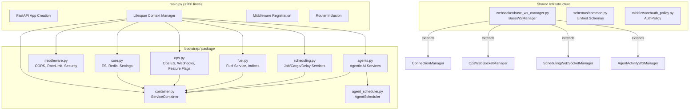
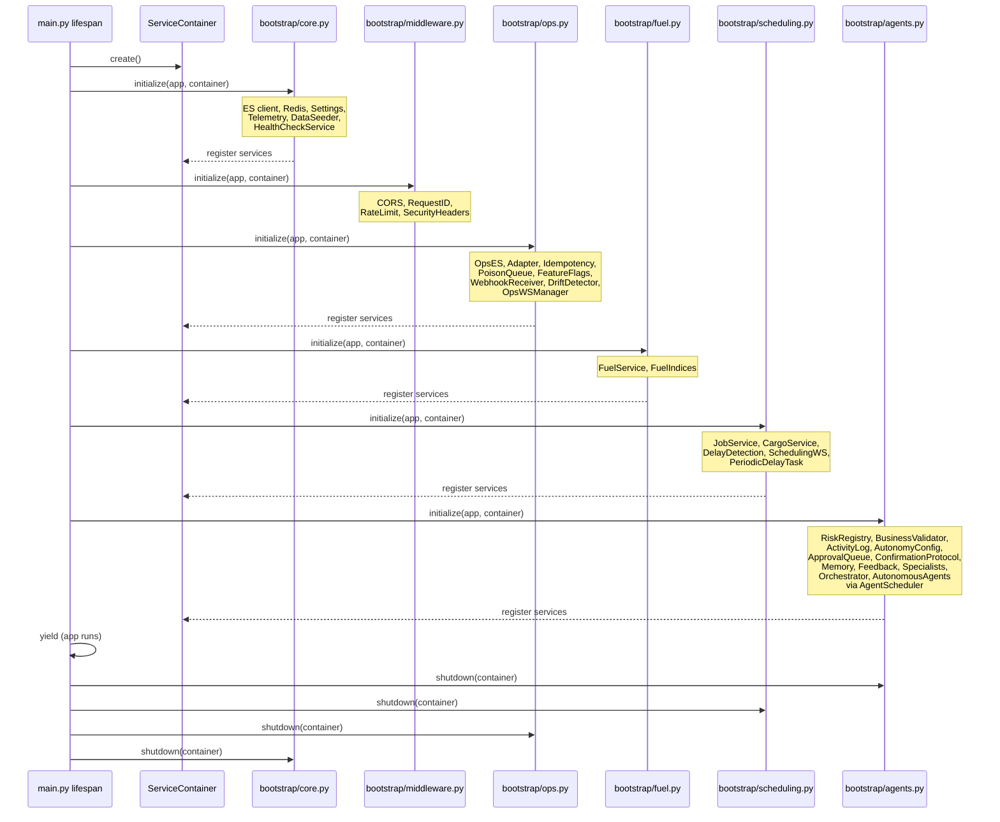
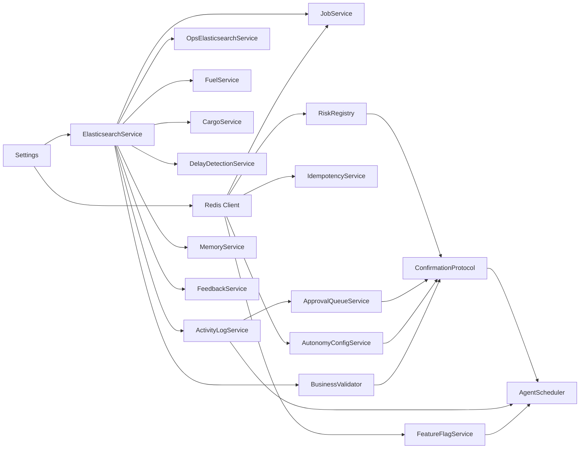

# Technical Design Document — Platform Refactor & Hardening

## 1. Overview

This design document describes the technical approach for refactoring and hardening the Runsheet logistics platform backend. The current `main.py` is ~1,950 lines containing all service initialization, WebSocket route handlers, lifespan management, and inline endpoint definitions. Four WebSocket managers share no common base class. Three autonomous agents run as bare `asyncio.create_task` calls with no restart policy. Services are wired via module-level singletons and ad-hoc `configure_*()` calls.

The refactoring decomposes `main.py` into a `bootstrap/` package with domain-specific initialization modules, introduces an explicit `ServiceContainer` for dependency injection, extracts a `BaseWSManager` base class for all WebSocket managers, wraps autonomous agents in an `AgentScheduler` with restart policies, unifies response schemas, formalizes auth contracts, and establishes CI gates, repository hygiene, and architectural governance.

### Design Principles

1. **Staged migration with compatibility adapters** — existing `get_*()` singleton APIs continue to work during migration, delegating to the container internally.
2. **Fail-open startup** — individual bootstrap module failures are logged but do not crash the application, preserving current behavior.
3. **No new features** — this is a structural refactor only. All existing endpoints, WebSocket channels, and agent behaviors are preserved.
4. **Incremental testability** — each component (container, bootstrap module, base WS manager, scheduler) is independently unit-testable with mocked dependencies.
5. **Phase-gated delivery** — five phases (Hygiene → Bootstrap → Schemas/Auth → WS/Scheduler → Testing/CI) are independently shippable.

## 2. Architecture

### 2.1 High-Level Component Diagram



### 2.2 Bootstrap Sequence



### 2.3 Dependency Flow



## 3. Components and Interfaces

### 3.1 `bootstrap/` Package Structure

```
Runsheet-backend/bootstrap/
├── __init__.py          # Package init, exports initialize_all / shutdown_all
├── container.py         # ServiceContainer class
├── core.py              # ES, Redis, Settings, Telemetry, DataSeeder, Health
├── middleware.py         # CORS, RequestID, RateLimit, SecurityHeaders
├── ops.py               # Ops ES, Webhooks, Idempotency, FeatureFlags, DriftDetector
├── fuel.py              # FuelService, fuel indices
├── scheduling.py        # JobService, CargoService, DelayDetection, periodic tasks
├── agents.py            # Agentic AI services, specialists, orchestrator, autonomous agents
└── agent_scheduler.py   # AgentScheduler with restart policies
```

#### `bootstrap/__init__.py`

```python
"""
Bootstrap package for Runsheet backend.

Orchestrates domain-specific initialization in dependency order:
core → middleware → ops → fuel → scheduling → agents
"""
from .container import ServiceContainer

# Ordered list of bootstrap modules
_BOOT_ORDER = ["core", "middleware", "ops", "fuel", "scheduling", "agents"]


async def initialize_all(app, container: ServiceContainer) -> None:
    """Initialize all bootstrap modules in dependency order.

    Each module's ``initialize(app, container)`` is called sequentially.
    If a module raises, the error is logged and remaining modules proceed.
    """
    import importlib
    import logging

    logger = logging.getLogger("bootstrap")

    for module_name in _BOOT_ORDER:
        try:
            mod = importlib.import_module(f".{module_name}", package=__name__)
            await mod.initialize(app, container)
            logger.info("✅ Bootstrap module '%s' initialized", module_name)
        except Exception as exc:
            logger.error(
                "❌ Bootstrap module '%s' failed: %s", module_name, exc,
                exc_info=True,
            )


async def shutdown_all(app, container: ServiceContainer) -> None:
    """Shutdown all bootstrap modules in reverse order."""
    import importlib
    import logging

    logger = logging.getLogger("bootstrap")

    for module_name in reversed(_BOOT_ORDER):
        try:
            mod = importlib.import_module(f".{module_name}", package=__name__)
            if hasattr(mod, "shutdown"):
                await mod.shutdown(app, container)
                logger.info("✅ Bootstrap module '%s' shut down", module_name)
        except Exception as exc:
            logger.error(
                "❌ Bootstrap module '%s' shutdown failed: %s",
                module_name, exc,
            )
```

#### Bootstrap Module Interface

Each module in `bootstrap/` exposes:

```python
async def initialize(app: FastAPI, container: ServiceContainer) -> None:
    """Initialize this domain's services and register them in the container."""
    ...

async def shutdown(app: FastAPI, container: ServiceContainer) -> None:
    """Gracefully shut down this domain's services (optional)."""
    ...
```

### 3.2 `ServiceContainer` (`bootstrap/container.py`)

The `ServiceContainer` is a typed registry holding all service instances. It replaces the current pattern of module-level singletons and ad-hoc `configure_*()` calls.

```python
"""
Explicit dependency container for all backend services.

Replaces module-level singletons and configure_*() wiring with a single
registry that is created at startup, populated by bootstrap modules, and
stored on ``app.state.container``.
"""
from __future__ import annotations

import logging
from typing import Any, Dict, Optional, TYPE_CHECKING

if TYPE_CHECKING:
    from config.settings import Settings
    from services.elasticsearch_service import ElasticsearchService
    from ops.services.ops_es_service import OpsElasticsearchService
    from ops.services.feature_flags import FeatureFlagService
    from ops.ingestion.idempotency import IdempotencyService
    from ops.ingestion.poison_queue import PoisonQueueService
    from fuel.services.fuel_service import FuelService
    from scheduling.services.job_service import JobService
    from scheduling.services.cargo_service import CargoService
    from scheduling.services.delay_detection_service import DelayDetectionService
    from health.service import HealthCheckService
    from telemetry.service import TelemetryService
    from ingestion.service import DataIngestionService
    from websocket.connection_manager import ConnectionManager
    from ops.websocket.ops_ws import OpsWebSocketManager
    from scheduling.websocket.scheduling_ws import SchedulingWebSocketManager
    from Agents.agent_ws_manager import AgentActivityWSManager
    from Agents.risk_registry import RiskRegistry
    from Agents.business_validator import BusinessValidator
    from Agents.activity_log_service import ActivityLogService
    from Agents.autonomy_config_service import AutonomyConfigService
    from Agents.approval_queue_service import ApprovalQueueService
    from Agents.confirmation_protocol import ConfirmationProtocol
    from Agents.memory_service import MemoryService
    from Agents.feedback_service import FeedbackService
    from Agents.orchestrator import AgentOrchestrator

logger = logging.getLogger(__name__)


class ServiceContainer:
    """Typed registry for all backend service instances.

    Services are set as attributes during bootstrap and accessed via
    attribute lookup or the ``get()`` method.

    Usage::

        container = ServiceContainer()
        container.settings = get_settings()
        container.es_service = ElasticsearchService(...)

        # Later, in endpoint handlers or other modules:
        es = container.get("es_service")
        # or
        es = container.es_service
    """

    # -- Core --
    settings: Settings
    es_service: ElasticsearchService
    redis_client: Any  # redis.asyncio client
    telemetry_service: TelemetryService
    health_check_service: HealthCheckService
    data_ingestion_service: DataIngestionService

    # -- WebSocket Managers --
    fleet_ws_manager: ConnectionManager
    ops_ws_manager: OpsWebSocketManager
    scheduling_ws_manager: SchedulingWebSocketManager
    agent_ws_manager: AgentActivityWSManager

    # -- Ops --
    ops_es_service: OpsElasticsearchService
    ops_idempotency: IdempotencyService
    ops_poison_queue: PoisonQueueService
    ops_feature_flags: FeatureFlagService

    # -- Fuel --
    fuel_service: FuelService

    # -- Scheduling --
    job_service: JobService
    cargo_service: CargoService
    delay_detection_service: DelayDetectionService

    # -- Agents --
    risk_registry: RiskRegistry
    business_validator: BusinessValidator
    activity_log_service: ActivityLogService
    autonomy_config_service: AutonomyConfigService
    approval_queue_service: ApprovalQueueService
    confirmation_protocol: ConfirmationProtocol
    memory_service: MemoryService
    feedback_service: FeedbackService
    agent_orchestrator: AgentOrchestrator
    agent_scheduler: Any  # AgentScheduler (avoids circular import)

    def __init__(self) -> None:
        self._registry: Dict[str, Any] = {}

    def __setattr__(self, name: str, value: Any) -> None:
        if name.startswith("_"):
            super().__setattr__(name, value)
        else:
            self._registry[name] = value

    def __getattr__(self, name: str) -> Any:
        if name.startswith("_"):
            raise AttributeError(name)
        try:
            return self._registry[name]
        except KeyError:
            raise AttributeError(
                f"Service '{name}' has not been registered in the container. "
                f"Available services: {sorted(self._registry.keys())}"
            )

    def get(self, service_name: str) -> Any:
        """Retrieve a service by name.

        Raises:
            KeyError: If the service has not been registered, with a
                descriptive message listing available services.
        """
        try:
            return self._registry[service_name]
        except KeyError:
            raise KeyError(
                f"Service '{service_name}' not found in container. "
                f"Registered services: {sorted(self._registry.keys())}"
            )

    def has(self, service_name: str) -> bool:
        """Check whether a service is registered."""
        return service_name in self._registry

    @property
    def registered_services(self) -> list[str]:
        """Return sorted list of registered service names."""
        return sorted(self._registry.keys())
```

#### Compatibility Adapters

During the migration, existing `get_*()` singleton functions are preserved but delegate to the container. This is done by storing a module-level reference to the container:

```python
# In websocket/connection_manager.py (and similar for other singletons)

_container: Optional["ServiceContainer"] = None
_legacy_instance: Optional[ConnectionManager] = None


def bind_container(container: "ServiceContainer") -> None:
    """Called by bootstrap/core.py to wire the compatibility adapter."""
    global _container
    _container = container


def get_connection_manager() -> ConnectionManager:
    """Return the ConnectionManager singleton.

    If a ServiceContainer has been bound, delegates to it.
    Otherwise falls back to the legacy module-level singleton.
    """
    if _container is not None:
        return _container.fleet_ws_manager
    global _legacy_instance
    if _legacy_instance is None:
        _legacy_instance = ConnectionManager()
    return _legacy_instance
```

This pattern is applied to all four singleton modules:
- `websocket/connection_manager.py` → `get_connection_manager()`
- `ops/websocket/ops_ws.py` → `get_ops_ws_manager()`
- `scheduling/websocket/scheduling_ws.py` → `get_scheduling_ws_manager()`
- `Agents/agent_ws_manager.py` → `get_agent_ws_manager()`

### 3.3 Refactored `main.py`

After decomposition, `main.py` contains only:

```python
"""
Runsheet Logistics API — Application entry point.

All service initialization is delegated to the bootstrap/ package.
This file contains only app creation, lifespan, middleware, and router inclusion.
"""
from contextlib import asynccontextmanager
import logging

from fastapi import FastAPI

from bootstrap import ServiceContainer, initialize_all, shutdown_all
from data_endpoints import router as data_router
from ops.webhooks.receiver import router as webhook_router
from ops.api.endpoints import router as ops_router
from fuel.api.endpoints import router as fuel_router
from scheduling.api.endpoints import router as scheduling_router
from agent_endpoints import router as agent_router

logger = logging.getLogger(__name__)


@asynccontextmanager
async def lifespan(app: FastAPI):
    """Lifespan context manager — delegates to bootstrap modules."""
    container = ServiceContainer()
    app.state.container = container

    await initialize_all(app, container)

    yield

    await shutdown_all(app, container)


app = FastAPI(title="Runsheet Logistics API", version="1.0.0", lifespan=lifespan)

# Routers (middleware is registered by bootstrap/middleware.py)
app.include_router(data_router)
app.include_router(webhook_router)
app.include_router(ops_router)
app.include_router(fuel_router)
app.include_router(scheduling_router)
app.include_router(agent_router)

# Inline endpoints that remain in main.py:
# - GET / (root health check)
# - POST /api/chat, /api/chat/fallback, /api/chat/clear
# - POST /api/upload/csv, /api/upload/batch, /api/upload/selective, /api/upload/sheets
# - POST /api/locations/webhook, /api/locations/batch
# - GET /api/demo/status, POST /api/demo/reset
# - GET /health, /health/ready, /health/live
# - WS /ws/ops, /ws/scheduling, /ws/agent-activity, /api/fleet/live
#
# These are defined in separate router modules or kept inline
# (see bootstrap/core.py for endpoint registration).

if __name__ == "__main__":
    import uvicorn
    import os
    port = int(os.environ.get("PORT", 8080))
    uvicorn.run(app, host="0.0.0.0", port=port, log_level="info")
```

The inline endpoints (chat, upload, demo, locations, health, WebSocket handlers) are extracted into dedicated router modules during the decomposition. The target is ≤200 lines for `main.py`.

### 3.4 `BaseWSManager` (`websocket/base_ws_manager.py`)

All four WebSocket managers currently implement `connect`, `disconnect`, `broadcast`, `shutdown`, and `get_connection_count` independently with inconsistent lifecycle and no shared metrics. The `BaseWSManager` extracts the common pattern.

```python
"""
Base WebSocket Manager with lifecycle metrics and backpressure.

All four WS managers (fleet, ops, scheduling, agent activity) extend
this base class to get consistent connection tracking, metric emission,
backpressure enforcement, and stale client detection.

Requirements: 6.1–6.9
"""
import asyncio
import logging
import time
from abc import ABC
from datetime import datetime, timezone
from typing import Any, Dict, List, Optional, Set

from fastapi import WebSocket

logger = logging.getLogger(__name__)


class BaseWSManager(ABC):
    """Abstract base for all WebSocket connection managers.

    Provides:
    - Connection registry with metadata (connected_at, last_send, tenant_id)
    - Prometheus-compatible metric counters
    - Configurable backpressure (max pending messages per client)
    - Stale client detection (time since last successful send)
    - Standard lifecycle: connect, disconnect, broadcast, shutdown

    Args:
        manager_name: Label for metrics (e.g., "fleet", "ops").
        max_pending_messages: Backpressure threshold per client (default 100).
    """

    def __init__(
        self,
        manager_name: str,
        max_pending_messages: int = 100,
    ) -> None:
        self.manager_name = manager_name
        self.max_pending_messages = max_pending_messages
        self._lock = asyncio.Lock()

        # Connection registry: ws → metadata dict
        self._clients: Dict[WebSocket, Dict[str, Any]] = {}

        # Metrics counters
        self._metrics = {
            "connections_total": 0,
            "disconnections_total": 0,
            "messages_sent_total": 0,
            "send_failures_total": 0,
            "messages_dropped_total": 0,
        }

    # ------------------------------------------------------------------
    # Metrics
    # ------------------------------------------------------------------

    @property
    def active_connections(self) -> int:
        """Gauge: number of currently active connections."""
        return len(self._clients)

    def get_metrics(self) -> Dict[str, Any]:
        """Return a snapshot of all metrics for this manager."""
        return {
            "manager": self.manager_name,
            "active_connections": self.active_connections,
            **self._metrics,
        }

    # ------------------------------------------------------------------
    # Connection lifecycle
    # ------------------------------------------------------------------

    async def connect(
        self,
        websocket: WebSocket,
        *,
        tenant_id: str = "",
        metadata: Optional[Dict[str, Any]] = None,
    ) -> None:
        """Accept and register a WebSocket connection.

        Sends a standard connection confirmation message:
        ``{"type": "connection", "status": "connected", ...}``
        """
        await websocket.accept()

        client_meta = {
            "connected_at": datetime.now(timezone.utc),
            "last_send": None,
            "tenant_id": tenant_id,
            "pending_count": 0,
            **(metadata or {}),
        }

        async with self._lock:
            self._clients[websocket] = client_meta
            self._metrics["connections_total"] += 1

        # Standard handshake confirmation (Req 6.9)
        await self._send_to_client(websocket, {
            "type": "connection",
            "status": "connected",
            "manager": self.manager_name,
            "timestamp": datetime.now(timezone.utc).isoformat(),
        })

        logger.info(
            "%s WS client connected. total=%d tenant=%s",
            self.manager_name, self.active_connections, tenant_id,
        )

    async def disconnect(self, websocket: WebSocket) -> None:
        """Remove a WebSocket connection and update metrics."""
        async with self._lock:
            removed = self._clients.pop(websocket, None)
            if removed is not None:
                self._metrics["disconnections_total"] += 1

        logger.info(
            "%s WS client disconnected. total=%d",
            self.manager_name, self.active_connections,
        )

    # ------------------------------------------------------------------
    # Broadcasting with backpressure
    # ------------------------------------------------------------------

    async def broadcast(self, message: dict) -> int:
        """Send *message* to all connected clients.

        Applies backpressure: clients whose pending count exceeds
        ``max_pending_messages`` have the message dropped.

        Returns the number of clients that received the message.
        """
        async with self._lock:
            clients = list(self._clients.items())

        if not clients:
            return 0

        successful = 0
        dead: List[WebSocket] = []

        for ws, meta in clients:
            # Backpressure check
            if meta.get("pending_count", 0) >= self.max_pending_messages:
                self._metrics["messages_dropped_total"] += 1
                logger.warning(
                    "%s backpressure: dropping message for client (pending=%d)",
                    self.manager_name, meta["pending_count"],
                )
                continue

            meta["pending_count"] = meta.get("pending_count", 0) + 1
            ok = await self._send_to_client(ws, message)
            meta["pending_count"] = max(0, meta.get("pending_count", 1) - 1)

            if ok:
                successful += 1
                meta["last_send"] = datetime.now(timezone.utc)
                self._metrics["messages_sent_total"] += 1
            else:
                dead.append(ws)
                self._metrics["send_failures_total"] += 1

        # Clean up dead clients (Req 6.7 — within 5 seconds)
        if dead:
            async with self._lock:
                for ws in dead:
                    self._clients.pop(ws, None)
                    self._metrics["disconnections_total"] += 1
            logger.info(
                "%s: removed %d dead clients during broadcast",
                self.manager_name, len(dead),
            )

        return successful

    # ------------------------------------------------------------------
    # Client communication
    # ------------------------------------------------------------------

    async def _send_to_client(self, websocket: WebSocket, data: dict) -> bool:
        """Send JSON to a single client. Returns True on success."""
        try:
            await websocket.send_json(data)
            return True
        except Exception as exc:
            logger.warning(
                "%s: send failed: %s", self.manager_name, exc,
            )
            return False

    # ------------------------------------------------------------------
    # Utilities
    # ------------------------------------------------------------------

    def get_connection_count(self) -> int:
        """Return the number of active connections."""
        return len(self._clients)

    def get_stale_clients(self, stale_seconds: float = 120.0) -> List[WebSocket]:
        """Return clients that haven't received a message in *stale_seconds*."""
        now = datetime.now(timezone.utc)
        stale = []
        for ws, meta in self._clients.items():
            last = meta.get("last_send")
            if last and (now - last).total_seconds() > stale_seconds:
                stale.append(ws)
        return stale

    async def shutdown(self) -> None:
        """Close all connections and clear the client pool."""
        async with self._lock:
            for ws in list(self._clients.keys()):
                try:
                    await ws.close(code=1000, reason="shutdown")
                except Exception:
                    pass
            self._clients.clear()

        logger.info("%s WS manager shut down", self.manager_name)
```

#### Migration of Existing Managers

Each existing manager extends `BaseWSManager` and adds its domain-specific methods:

| Manager | `manager_name` | Domain Methods Preserved |
|---------|----------------|--------------------------|
| `ConnectionManager` | `"fleet"` | `broadcast_location_update`, `broadcast_batch_update`, `send_heartbeat` |
| `OpsWebSocketManager` | `"ops"` | `broadcast_shipment_update`, `broadcast_rider_update`, `broadcast_sla_breach`, `disconnect_tenant`, `set_feature_flag_service`, subscription filtering |
| `SchedulingWebSocketManager` | `"scheduling"` | `broadcast_job_created`, `broadcast_status_changed`, `broadcast_delay_alert`, `broadcast_cargo_update`, subscription filtering, heartbeat loop |
| `AgentActivityWSManager` | `"agent_activity"` | `broadcast_activity`, `broadcast_approval_event`, `broadcast_event` |

### 3.5 `AgentScheduler` (`bootstrap/agent_scheduler.py`)

```python
"""
Autonomous Agent Scheduler with restart policies and health reporting.

Replaces bare ``asyncio.create_task`` calls in the lifespan function
with a managed lifecycle framework.

Requirements: 7.1–7.7, 8.1–8.6
"""
import asyncio
import logging
import time
from dataclasses import dataclass, field
from datetime import datetime, timezone
from enum import Enum
from typing import Any, Dict, List, Optional

from Agents.autonomous.base_agent import AutonomousAgentBase

logger = logging.getLogger(__name__)


class RestartPolicy(Enum):
    """Restart policy for autonomous agents."""
    ALWAYS = "always"        # Restart on any exit
    ON_FAILURE = "on_failure"  # Restart only on unhandled exception
    NEVER = "never"          # Do not restart


# SLO constants (Req 8.1, 8.2)
SLO_MAX_RESTART_SECONDS = 5
SLO_MAX_CONSECUTIVE_FAILURES = 3
SLO_MIN_UPTIME_PCT = 99.0
SLO_RESTART_WINDOW_SECONDS = 300  # 5-minute window for max restarts
SLO_MAX_CYCLE_DURATION_SECONDS = 5
SLO_SCHEDULE_DRIFT_PCT = 10


@dataclass
class AgentState:
    """Runtime state for a managed agent."""
    agent: AutonomousAgentBase
    policy: RestartPolicy
    status: str = "stopped"  # running | stopped | restarting | failed
    task: Optional[asyncio.Task] = None
    started_at: Optional[datetime] = None
    restart_count: int = 0
    restart_timestamps: List[datetime] = field(default_factory=list)
    last_error: Optional[str] = None
    total_uptime_seconds: float = 0.0


class AgentScheduler:
    """Manages the lifecycle of all autonomous background agents.

    Provides:
    - Configurable restart policies (always, on_failure, never)
    - Bounded restart attempts (max 3 within 5-minute window)
    - Health reporting per agent
    - Graceful shutdown with configurable timeout
    - SLO compliance tracking

    Args:
        telemetry_service: For emitting alerts on SLO violations.
        activity_log_service: For recording restart events.
        shutdown_timeout: Seconds to wait for graceful stop (default 10).
    """

    def __init__(
        self,
        telemetry_service=None,
        activity_log_service=None,
        shutdown_timeout: float = 10.0,
    ) -> None:
        self._agents: Dict[str, AgentState] = {}
        self._telemetry = telemetry_service
        self._activity_log = activity_log_service
        self._shutdown_timeout = shutdown_timeout

    def register(
        self,
        agent: AutonomousAgentBase,
        policy: RestartPolicy = RestartPolicy.ON_FAILURE,
    ) -> None:
        """Register an agent with a restart policy."""
        self._agents[agent.agent_id] = AgentState(agent=agent, policy=policy)

    async def start_all(self) -> None:
        """Start all registered agents."""
        for agent_id, state in self._agents.items():
            await self._start_agent(state)

    async def stop_all(self) -> None:
        """Stop all agents gracefully within the shutdown timeout."""
        tasks = []
        for state in self._agents.values():
            tasks.append(self._stop_agent(state))
        await asyncio.gather(*tasks, return_exceptions=True)

    async def _start_agent(self, state: AgentState) -> None:
        """Start a single agent and monitor its task."""
        await state.agent.start()
        state.status = "running"
        state.started_at = datetime.now(timezone.utc)
        state.task = asyncio.create_task(
            self._monitor_agent(state),
            name=f"scheduler-{state.agent.agent_id}",
        )

    async def _stop_agent(self, state: AgentState) -> None:
        """Stop a single agent with timeout."""
        try:
            await asyncio.wait_for(
                state.agent.stop(), timeout=self._shutdown_timeout
            )
        except asyncio.TimeoutError:
            if state.task and not state.task.done():
                state.task.cancel()
        state.status = "stopped"

    async def _monitor_agent(self, state: AgentState) -> None:
        """Watch the agent's internal task and restart on failure."""
        while state.status == "running":
            if state.agent._task is None or not state.agent._task.done():
                await asyncio.sleep(1)
                continue

            # Task exited — check for exception
            exc = None
            try:
                exc = state.agent._task.exception()
            except asyncio.CancelledError:
                state.status = "stopped"
                return

            if exc is None and state.policy != RestartPolicy.ALWAYS:
                state.status = "stopped"
                return

            # Restart logic
            if not self._can_restart(state):
                state.status = "failed"
                state.last_error = str(exc) if exc else "max restarts exceeded"
                if self._telemetry:
                    self._telemetry.emit_alert(
                        "agent_failed",
                        agent_id=state.agent.agent_id,
                        error=state.last_error,
                    )
                return

            state.status = "restarting"
            state.restart_count += 1
            state.restart_timestamps.append(datetime.now(timezone.utc))
            state.last_error = str(exc) if exc else None

            if self._activity_log:
                await self._activity_log.log_monitoring_cycle(
                    state.agent.agent_id, 0, 0, 0,
                )

            await asyncio.sleep(0.5)  # Brief pause before restart
            await state.agent.start()
            state.status = "running"

    def _can_restart(self, state: AgentState) -> bool:
        """Check if restart is allowed within the SLO window."""
        if state.policy == RestartPolicy.NEVER:
            return False
        now = datetime.now(timezone.utc)
        cutoff = now.timestamp() - SLO_RESTART_WINDOW_SECONDS
        recent = [
            ts for ts in state.restart_timestamps
            if ts.timestamp() > cutoff
        ]
        return len(recent) < SLO_MAX_CONSECUTIVE_FAILURES

    def get_health(self) -> Dict[str, Any]:
        """Return health status for all managed agents.

        Returns a dict keyed by agent_id with status, uptime,
        restart_count, and last_error for each agent.
        """
        result = {}
        now = datetime.now(timezone.utc)
        for agent_id, state in self._agents.items():
            uptime = 0.0
            if state.started_at and state.status == "running":
                uptime = (now - state.started_at).total_seconds()
            result[agent_id] = {
                "status": state.status,
                "uptime_seconds": uptime,
                "restart_count": state.restart_count,
                "last_error": state.last_error,
                "policy": state.policy.value,
            }
        return result
```

### 3.6 Unified Schemas (`schemas/common.py`)

```python
"""
Unified request/response schemas shared across all domain routers.

Provides consistent response shapes for pagination, errors, and
list envelopes, replacing ad-hoc per-domain response dicts.

Requirements: 4.1–4.8
"""
from datetime import datetime
from typing import Generic, List, Optional, TypeVar

from pydantic import BaseModel, Field
from pydantic.generics import GenericModel

T = TypeVar("T")


class PaginatedResponse(GenericModel, Generic[T]):
    """Standard paginated list response.

    All paginated list endpoints across ops, fuel, scheduling, and
    agent routers return this shape.
    """
    items: List[T]
    total: int = Field(..., description="Total number of items matching the query")
    page: int = Field(..., ge=1, description="Current page number (1-indexed)")
    page_size: int = Field(..., ge=1, le=500, description="Items per page")
    has_next: bool = Field(..., description="Whether more pages exist")


class ErrorResponse(BaseModel):
    """Standard error response returned by all endpoints.

    Replaces ad-hoc ``{"detail": ...}`` and ``{"error": ...}`` dicts.
    """
    error_code: str = Field(..., description="Machine-readable error code")
    message: str = Field(..., description="Human-readable error message")
    details: Optional[dict] = Field(None, description="Additional error context")
    request_id: str = Field(..., description="Correlation ID from X-Request-ID header")


class ListEnvelope(GenericModel, Generic[T]):
    """Envelope for non-paginated list responses."""
    items: List[T]
    count: int = Field(..., description="Number of items in the list")


class TenantScopedRequest(BaseModel):
    """Base for requests that require tenant context."""
    tenant_id: str = Field(..., min_length=1, description="Tenant identifier from JWT")
```

### 3.7 Auth Policy Middleware (`middleware/auth_policy.py`)

```python
"""
Centralized authentication and tenant scoping policy.

Defines an AuthPolicy enum and a middleware/dependency that enforces
the declared policy for every request. Routers declare their default
policy; per-route overrides are supported via dependency injection.

Requirements: 5.1–5.7
"""
from enum import Enum
from typing import Optional

from fastapi import Depends, HTTPException, Request
from pydantic import BaseModel


class AuthPolicy(str, Enum):
    """Authentication policy for endpoints."""
    JWT_REQUIRED = "jwt_required"
    API_KEY_REQUIRED = "api_key_required"
    WEBHOOK_HMAC = "webhook_hmac"
    PUBLIC = "public"


# Policy matrix — validated at startup against registered routes (Req 5.6)
POLICY_MATRIX = {
    "/api/scheduling": AuthPolicy.JWT_REQUIRED,
    "/api/ops": AuthPolicy.JWT_REQUIRED,
    "/api/ops/admin": AuthPolicy.JWT_REQUIRED,  # + admin role check
    "/api/fuel": AuthPolicy.JWT_REQUIRED,
    "/api/agent": AuthPolicy.JWT_REQUIRED,       # except GET /agent/health → PUBLIC
    "/api/chat": AuthPolicy.JWT_REQUIRED,
    "/api/data": AuthPolicy.JWT_REQUIRED,
    "/ws": AuthPolicy.JWT_REQUIRED,              # via query param or first message
    "/health": AuthPolicy.PUBLIC,
    "/docs": AuthPolicy.PUBLIC,
    "/openapi.json": AuthPolicy.PUBLIC,
}

# Per-route exceptions
POLICY_EXCEPTIONS = {
    "GET /api/agent/health": AuthPolicy.PUBLIC,
    "GET /ws/agent-activity": AuthPolicy.PUBLIC,  # read-only
}


def validate_policy_matrix(app) -> None:
    """Compare declared policies against registered routes at startup.

    Logs warnings for any route without an explicit policy declaration.
    Called during bootstrap/middleware.py initialization.
    """
    import logging
    logger = logging.getLogger(__name__)

    for route in app.routes:
        path = getattr(route, "path", "")
        matched = any(path.startswith(prefix) for prefix in POLICY_MATRIX)
        if not matched and path not in ("/", "/openapi.json"):
            logger.warning(
                "Route %s has no explicit AuthPolicy — defaulting to JWT_REQUIRED",
                path,
            )


class TenantContext(BaseModel):
    """Extracted tenant context from JWT claims."""
    tenant_id: str
    user_id: Optional[str] = None
    roles: list[str] = []


async def require_tenant(request: Request) -> TenantContext:
    """FastAPI dependency that extracts tenant_id from JWT claims.

    Raises 401 if no valid JWT is present.
    """
    # Implementation delegates to JWT verification logic
    # (existing jose-based verification in the codebase)
    ...
```

### 3.8 Endpoint Registry Generator (`scripts/generate_endpoint_registry.py`)

```python
"""
Auto-generate endpoint registry documentation from the FastAPI app.

Introspects all registered routes (HTTP + WebSocket) and produces
a Markdown document at docs/endpoint-registry.md.

Requirements: 3.1–3.5
"""
import importlib
import sys
from pathlib import Path


def generate_registry() -> str:
    """Introspect the FastAPI app and return Markdown documentation."""
    # Import the app
    sys.path.insert(0, str(Path(__file__).parent.parent))
    from main import app

    lines = [
        "# Endpoint Registry",
        "",
        "> Auto-generated by `scripts/generate_endpoint_registry.py`.",
        "> Do not edit manually.",
        "",
        "## HTTP Endpoints",
        "",
        "| Method | Path | Router | Auth | Rate Limit | Request Schema | Response Schema |",
        "|--------|------|--------|------|------------|----------------|-----------------|",
    ]

    for route in app.routes:
        if hasattr(route, "methods"):
            for method in sorted(route.methods):
                path = route.path
                # Extract router prefix, auth, rate limit from route metadata
                lines.append(
                    f"| {method} | `{path}` | — | — | — | — | — |"
                )

    lines += [
        "",
        "## WebSocket Endpoints",
        "",
        "| Path | Subscriptions | Auth |",
        "|------|--------------|------|",
    ]

    for route in app.routes:
        if hasattr(route, "path") and not hasattr(route, "methods"):
            # WebSocket routes don't have methods
            if "/ws" in route.path or "live" in route.path:
                lines.append(f"| `{route.path}` | — | — |")

    return "\n".join(lines)


if __name__ == "__main__":
    output_path = Path(__file__).parent.parent / "docs" / "endpoint-registry.md"
    output_path.parent.mkdir(parents=True, exist_ok=True)
    output_path.write_text(generate_registry())
    print(f"✅ Endpoint registry written to {output_path}")
```

### 3.9 Secret Scanner (`scripts/check-secrets.sh`)

```bash
#!/usr/bin/env bash
# check-secrets.sh — Scan staged files for potential secrets.
#
# Blocks commits containing patterns that look like API keys,
# JWT secrets, or connection strings.
#
# Requirements: 12.4
#
# Usage:
#   As a pre-commit hook: cp scripts/check-secrets.sh .git/hooks/pre-commit
#   Manual scan:          bash scripts/check-secrets.sh [file ...]

set -euo pipefail

RED='\033[0;31m'
NC='\033[0m'

# Patterns to detect (extended regex)
PATTERNS=(
    # Generic API keys (base64-ish, 20+ chars)
    '[A-Za-z0-9+/=]{40,}'
    # AWS-style keys
    'AKIA[0-9A-Z]{16}'
    # Elasticsearch API keys
    'ELASTIC_API_KEY=[^$\{]'
    # JWT secrets (non-placeholder)
    'JWT_SECRET=[^$\{].*[^change-me]'
    # Webhook secrets (non-placeholder)
    'WEBHOOK_SECRET=[^$\{].*[^change-me]'
    # Redis URLs with passwords
    'redis://:[^@]+@'
    # Generic password assignments
    'password\s*=\s*["\x27][^"\x27]{8,}'
)

# Get files to scan
if [ $# -gt 0 ]; then
    FILES=("$@")
else
    # Staged files (pre-commit hook mode)
    mapfile -t FILES < <(git diff --cached --name-only --diff-filter=ACM)
fi

FOUND=0

for file in "${FILES[@]}"; do
    # Skip binary files and .env.example (allowed to have placeholders)
    [[ "$file" == *.env.example ]] && continue
    [[ "$file" == *.png ]] && continue
    [[ "$file" == *.jpg ]] && continue

    for pattern in "${PATTERNS[@]}"; do
        if grep -qE "$pattern" "$file" 2>/dev/null; then
            echo -e "${RED}⚠️  Potential secret in $file matching: $pattern${NC}"
            FOUND=1
        fi
    done
done

if [ "$FOUND" -eq 1 ]; then
    echo -e "${RED}❌ Commit blocked: potential secrets detected. Review the files above.${NC}"
    exit 1
fi

echo "✅ No secrets detected."
exit 0
```

### 3.10 CI Pipeline (`.github/workflows/ci.yml`)

```yaml
name: CI

on:
  pull_request:
    branches: [main]
  push:
    branches: [main]

env:
  PYTHON_VERSION: "3.11"
  NODE_VERSION: "20"
  COVERAGE_THRESHOLD: 70

jobs:
  # ---------------------------------------------------------------
  # Job 1: Secret scan
  # ---------------------------------------------------------------
  secret-scan:
    runs-on: ubuntu-latest
    steps:
      - uses: actions/checkout@v4
      - name: Scan for secrets
        run: bash scripts/check-secrets.sh $(git diff --name-only origin/main...HEAD)

  # ---------------------------------------------------------------
  # Job 2: Backend tests + coverage
  # ---------------------------------------------------------------
  backend-tests:
    runs-on: ubuntu-latest
    services:
      redis:
        image: redis:7
        ports: [6379:6379]
    steps:
      - uses: actions/checkout@v4
      - uses: actions/setup-python@v5
        with:
          python-version: ${{ env.PYTHON_VERSION }}
      - name: Install dependencies
        run: pip install -r Runsheet-backend/requirements.txt
      - name: Run tests with coverage
        run: |
          cd Runsheet-backend
          pytest --cov=. --cov-report=xml --cov-report=term-missing \
                 --cov-fail-under=${{ env.COVERAGE_THRESHOLD }}
      - name: Check changed-file coverage
        run: python scripts/check_coverage.py --threshold 0
      - name: Upload coverage
        uses: actions/upload-artifact@v4
        with:
          name: coverage-report
          path: Runsheet-backend/coverage.xml

  # ---------------------------------------------------------------
  # Job 3: Route smoke tests
  # ---------------------------------------------------------------
  smoke-tests:
    runs-on: ubuntu-latest
    needs: backend-tests
    steps:
      - uses: actions/checkout@v4
      - uses: actions/setup-python@v5
        with:
          python-version: ${{ env.PYTHON_VERSION }}
      - name: Install dependencies
        run: pip install -r Runsheet-backend/requirements.txt
      - name: Run smoke tests
        run: |
          cd Runsheet-backend
          pytest tests/smoke/ -v --timeout=30

  # ---------------------------------------------------------------
  # Job 4: Integration tests (feature flags, tenant flows)
  # ---------------------------------------------------------------
  integration-tests:
    runs-on: ubuntu-latest
    needs: backend-tests
    services:
      redis:
        image: redis:7
        ports: [6379:6379]
    steps:
      - uses: actions/checkout@v4
      - uses: actions/setup-python@v5
        with:
          python-version: ${{ env.PYTHON_VERSION }}
      - name: Install dependencies
        run: pip install -r Runsheet-backend/requirements.txt
      - name: Run integration tests
        run: |
          cd Runsheet-backend
          pytest tests/integration/ -v --timeout=120

  # ---------------------------------------------------------------
  # Job 5: Endpoint registry freshness check
  # ---------------------------------------------------------------
  endpoint-registry:
    runs-on: ubuntu-latest
    needs: backend-tests
    steps:
      - uses: actions/checkout@v4
      - uses: actions/setup-python@v5
        with:
          python-version: ${{ env.PYTHON_VERSION }}
      - name: Install dependencies
        run: pip install -r Runsheet-backend/requirements.txt
      - name: Generate endpoint registry
        run: python scripts/generate_endpoint_registry.py
      - name: Check registry is up to date
        run: git diff --exit-code docs/endpoint-registry.md

  # ---------------------------------------------------------------
  # Job 6: Git hygiene check
  # ---------------------------------------------------------------
  git-hygiene:
    runs-on: ubuntu-latest
    steps:
      - uses: actions/checkout@v4
      - name: Verify no ignored files are tracked
        run: |
          tracked=$(git ls-files -i --exclude-standard)
          if [ -n "$tracked" ]; then
            echo "❌ Tracked files matching .gitignore patterns:"
            echo "$tracked"
            exit 1
          fi
      - name: Verify ADR index exists
        run: test -f docs/adr/README.md
```

### 3.11 Smoke Test Fixtures (`tests/smoke/`)

#### `tests/smoke/fixtures.py`

```python
"""
Smoke test fixture registry.

Maps route paths to minimal valid request payloads. Routes without
an entry use a default empty-body request and are expected to return
400 or 422 (not 500).

Requirements: 15.1–15.7
"""

# Fixture format: { "path": { "method": "GET"|"POST"|..., "headers": {}, "json": {}, "params": {} } }
ROUTE_FIXTURES = {
    "/": {"method": "GET"},
    "/api/health": {"method": "GET"},
    "/health": {"method": "GET"},
    "/health/ready": {"method": "GET"},
    "/health/live": {"method": "GET"},
    "/api/demo/status": {"method": "GET"},
    "/api/chat": {
        "method": "POST",
        "json": {"message": "hello", "mode": "chat"},
    },
    "/api/chat/clear": {
        "method": "POST",
        "json": {},
    },
    "/api/demo/reset": {"method": "POST"},
    # Additional fixtures added per-domain as endpoints are catalogued
}

WS_FIXTURES = {
    "/ws/ops": {"query_params": {"token": "test-jwt"}},
    "/ws/scheduling": {"query_params": {}},
    "/ws/agent-activity": {"query_params": {}},
    "/api/fleet/live": {"query_params": {}},
}
```

#### `tests/smoke/test_route_smoke.py`

```python
"""
Parametrized smoke tests for all registered HTTP and WebSocket routes.

Verifies every endpoint returns a non-500 status code with valid auth
and minimal input. WebSocket endpoints are verified by establishing a
connection and optionally receiving a confirmation message within 2s.

Requirements: 15.1–15.7
"""
import asyncio
import pytest
from httpx import AsyncClient, ASGITransport
from .fixtures import ROUTE_FIXTURES, WS_FIXTURES


@pytest.fixture
def app():
    """Create the FastAPI app with mocked external dependencies."""
    # Mocks for ES, Redis, Google Cloud are applied here
    from main import app
    return app


@pytest.mark.parametrize("path", ROUTE_FIXTURES.keys())
@pytest.mark.asyncio
async def test_http_route_smoke(app, path):
    """Each HTTP route returns a non-500 status code."""
    fixture = ROUTE_FIXTURES[path]
    method = fixture.get("method", "GET")

    async with AsyncClient(
        transport=ASGITransport(app=app), base_url="http://test"
    ) as client:
        response = await getattr(client, method.lower())(
            path,
            json=fixture.get("json"),
            params=fixture.get("params"),
            headers=fixture.get("headers", {}),
        )
        assert response.status_code < 500, (
            f"Route {method} {path} returned {response.status_code}: "
            f"{response.text[:200]}"
        )
```

## 4. Data Models

### 4.1 New Data Structures

No new Elasticsearch index mappings or persistent data models are introduced. The refactoring adds only in-memory structures:

| Structure | Location | Purpose |
|-----------|----------|---------|
| `ServiceContainer` | `bootstrap/container.py` | Runtime service registry (dict-backed) |
| `AgentState` | `bootstrap/agent_scheduler.py` | Per-agent lifecycle state (dataclass) |
| `RestartPolicy` | `bootstrap/agent_scheduler.py` | Enum for restart behavior |
| `PaginatedResponse[T]` | `schemas/common.py` | Generic paginated response model |
| `ErrorResponse` | `schemas/common.py` | Standard error response model |
| `ListEnvelope[T]` | `schemas/common.py` | Non-paginated list wrapper |
| `TenantScopedRequest` | `schemas/common.py` | Base for tenant-scoped requests |
| `AuthPolicy` | `middleware/auth_policy.py` | Enum for auth requirements |
| `TenantContext` | `middleware/auth_policy.py` | Extracted JWT claims model |
| `BaseWSManager._clients` | `websocket/base_ws_manager.py` | Connection registry with metadata |

### 4.2 Schema Migration (Deprecation Window)

For endpoints that currently return non-conforming response shapes, the migration uses a dual-field approach during the 60-day deprecation window:

```python
# Example: an ops endpoint currently returns {"data": [...], "count": 5}
# During deprecation window, it returns both old and new fields:
{
    # New unified fields (PaginatedResponse)
    "items": [...],
    "total": 5,
    "page": 1,
    "page_size": 20,
    "has_next": false,

    # Old fields (deprecated, removed after 60 days)
    "data": [...],
    "count": 5
}
```

The deprecation timeline is documented in `docs/schema-migration.md` with start date, affected endpoints, old vs new field mappings, and removal date.

## 5. Correctness Properties

The refactoring must preserve the following invariants:

### P1: Startup Equivalence
**Property:** The set of registered HTTP routes and WebSocket endpoints after bootstrap is identical to the set registered by the current monolithic `main.py`.
**Verification:** A test compares `sorted([r.path for r in app.routes])` before and after refactoring.

### P2: Service Availability
**Property:** For every service `S` that was accessible via a `get_*()` singleton before refactoring, `container.get(S_name)` returns the same instance type after refactoring.
**Verification:** Unit test iterates over all known service names and asserts `isinstance(container.get(name), expected_type)`.

### P3: Fail-Open Bootstrap
**Property:** If any single bootstrap module raises an exception during `initialize()`, all other modules still complete initialization and the application starts successfully.
**Verification:** Parametrized test that patches each module's `initialize` to raise, then asserts the app starts and serves requests.

### P4: Compatibility Adapter Transparency
**Property:** `get_connection_manager()` (and the other three singleton getters) returns the same object instance as `container.fleet_ws_manager` (respectively) after the container is bound.
**Verification:** `assert get_connection_manager() is container.fleet_ws_manager`

### P5: WebSocket Handshake Contract
**Property:** Every WebSocket endpoint sends a JSON message with `{"type": "connection", "status": "connected", ...}` within 2 seconds of connection.
**Verification:** Smoke test connects to each WS endpoint and asserts the confirmation message is received.

### P6: Backpressure Enforcement
**Property:** When a client's pending message count exceeds `max_pending_messages`, subsequent broadcast messages are dropped for that client (not queued indefinitely).
**Verification:** Unit test with a mock slow client that never reads; assert `messages_dropped_total` metric increments.

### P7: Agent Restart Bounded
**Property:** An agent that crashes repeatedly is restarted at most `SLO_MAX_CONSECUTIVE_FAILURES` times within `SLO_RESTART_WINDOW_SECONDS`, then marked as `failed`.
**Verification:** Unit test with a mock agent that raises on every `monitor_cycle`; assert status transitions to `failed` after 3 restarts.

### P8: Agent Graceful Shutdown
**Property:** When `AgentScheduler.stop_all()` is called, all agents are stopped within `shutdown_timeout` seconds. If an agent does not stop in time, its task is force-cancelled.
**Verification:** Unit test with a mock agent whose `stop()` hangs; assert the scheduler completes within `shutdown_timeout + 1` seconds.

### P9: No Secrets in Repository
**Property:** No tracked file in the repository matches the secret patterns defined in `scripts/check-secrets.sh`.
**Verification:** CI job runs `git ls-files | xargs bash scripts/check-secrets.sh` and asserts exit code 0.

### P10: Unified Schema Conformance
**Property:** Every paginated list endpoint returns a response body that validates against the `PaginatedResponse` schema (contains `items`, `total`, `page`, `page_size`, `has_next`).
**Verification:** Parametrized test calls each list endpoint and validates the response against `PaginatedResponse.model_validate()`.

### P11: Auth Policy Coverage
**Property:** Every registered route has an explicit or default `AuthPolicy` declaration. No route is silently unprotected.
**Verification:** Startup validation function `validate_policy_matrix(app)` logs warnings for unmatched routes; CI test asserts zero warnings.

### P12: Existing Test Suite Passes
**Property:** All 1,449+ existing tests pass without modification after the refactoring.
**Verification:** CI runs the full test suite; zero regressions.

### P13: main.py Line Count
**Property:** The refactored `main.py` does not exceed 200 lines of code (excluding imports and comments).
**Verification:** CI check counts non-blank, non-comment, non-import lines.

### P14: Git Hygiene
**Property:** `git ls-files -i --exclude-standard` returns an empty result (no tracked files match `.gitignore` patterns).
**Verification:** CI job asserts empty output.

### P15: Endpoint Registry Freshness
**Property:** The committed `docs/endpoint-registry.md` matches the output of `scripts/generate_endpoint_registry.py` run against the current app.
**Verification:** CI job generates the registry and asserts `git diff --exit-code docs/endpoint-registry.md`.
