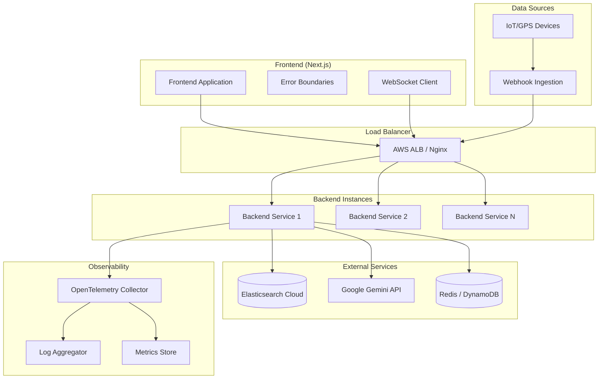
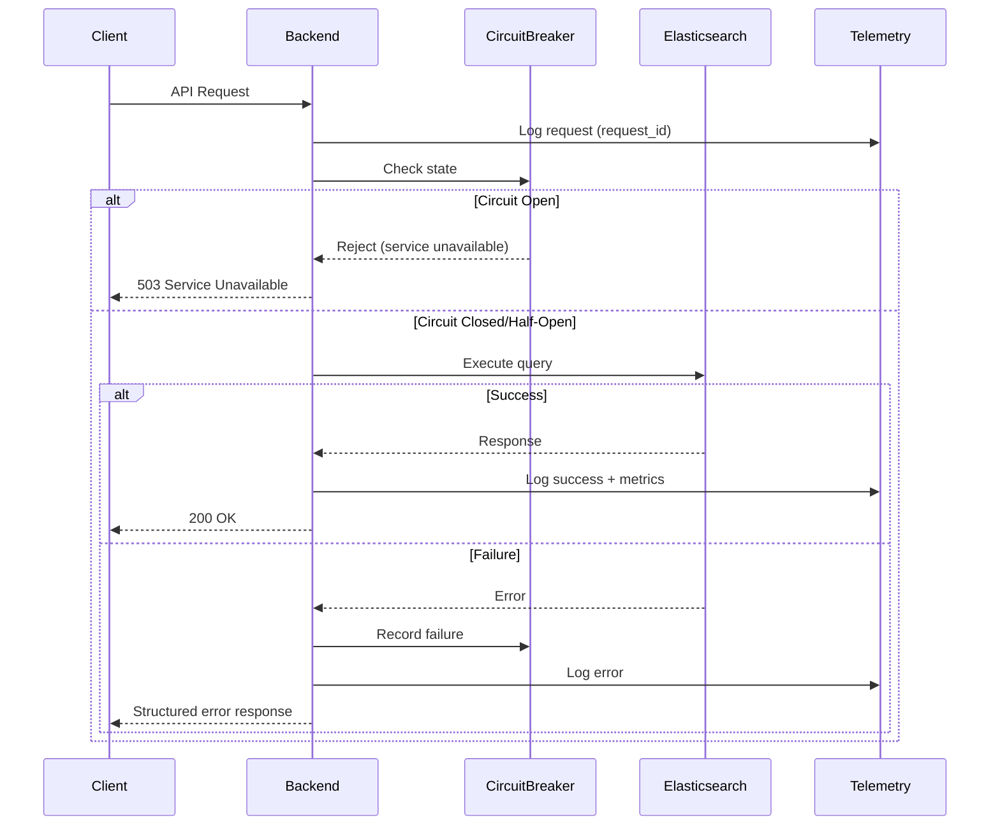
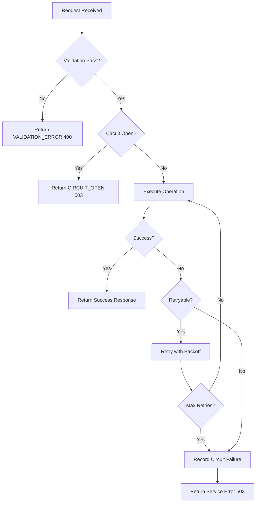

# Design Document: Production Readiness

## Overview

This design document outlines the technical architecture and implementation approach for transforming the Runsheet logistics platform from a demo application to a production-ready system. The design addresses configuration management, error handling, observability, real-time data ingestion, horizontal scaling, frontend resilience, and comprehensive testing.

The implementation follows a layered approach where foundational infrastructure (configuration, logging, error handling) is established first, followed by resilience patterns (circuit breakers, health checks), then data layer improvements (real-time ingestion, session externalization), and finally testing infrastructure.

## Architecture

### High-Level System Architecture



### Request Flow with Resilience Patterns



## Components and Interfaces

### 1. Configuration Manager

The Configuration Manager centralizes all configuration loading and validation using Pydantic settings.

```python
# config/settings.py
from pydantic_settings import BaseSettings
from pydantic import Field, validator
from typing import Optional
from enum import Enum

class Environment(str, Enum):
    DEVELOPMENT = "development"
    STAGING = "staging"
    PRODUCTION = "production"

class Settings(BaseSettings):
    # Environment
    environment: Environment = Field(default=Environment.DEVELOPMENT)
    
    # Elasticsearch
    elastic_endpoint: str = Field(..., description="Elasticsearch endpoint URL")
    elastic_api_key: str = Field(..., description="Elasticsearch API key")
    
    # Google Cloud / Gemini
    google_cloud_project: str = Field(..., description="GCP project ID")
    google_cloud_location: str = Field(default="us-central1")
    google_application_credentials: Optional[str] = Field(default=None)
    
    # Session Store
    session_store_type: str = Field(default="redis", description="redis or dynamodb")
    redis_url: Optional[str] = Field(default=None)
    dynamodb_table: Optional[str] = Field(default=None)
    session_ttl_hours: int = Field(default=24)
    
    # Rate Limiting
    rate_limit_requests_per_minute: int = Field(default=100)
    rate_limit_ai_requests_per_minute: int = Field(default=10)
    
    # Observability
    log_level: str = Field(default="INFO")
    otel_endpoint: Optional[str] = Field(default=None)
    otel_service_name: str = Field(default="runsheet-backend")
    
    # CORS
    cors_origins: list[str] = Field(default=["http://localhost:3000"])
    
    @validator("elastic_endpoint", "elastic_api_key", "google_cloud_project")
    def not_empty(cls, v, field):
        if not v or not v.strip():
            raise ValueError(f"{field.name} cannot be empty")
        return v.strip()
    
    class Config:
        env_file = ".env"
        env_file_encoding = "utf-8"
        case_sensitive = False
```

**Interface:**
- `get_settings() -> Settings`: Returns validated settings singleton
- `validate_startup() -> None`: Validates all required settings, raises on failure

### 2. Structured Error Handler

Provides consistent error responses across all endpoints.

```python
# errors/handlers.py
from enum import Enum
from pydantic import BaseModel
from typing import Optional, Any
from fastapi import Request
from fastapi.responses import JSONResponse

class ErrorCode(str, Enum):
    # Validation errors (4xx)
    VALIDATION_ERROR = "VALIDATION_ERROR"
    INVALID_REQUEST = "INVALID_REQUEST"
    RESOURCE_NOT_FOUND = "RESOURCE_NOT_FOUND"
    
    # Authentication errors
    UNAUTHORIZED = "UNAUTHORIZED"
    FORBIDDEN = "FORBIDDEN"
    
    # External service errors
    ELASTICSEARCH_UNAVAILABLE = "ELASTICSEARCH_UNAVAILABLE"
    AI_SERVICE_UNAVAILABLE = "AI_SERVICE_UNAVAILABLE"
    SESSION_STORE_UNAVAILABLE = "SESSION_STORE_UNAVAILABLE"
    
    # Internal errors
    INTERNAL_ERROR = "INTERNAL_ERROR"
    CIRCUIT_OPEN = "CIRCUIT_OPEN"

class ErrorResponse(BaseModel):
    error_code: ErrorCode
    message: str
    details: Optional[dict[str, Any]] = None
    request_id: str

class AppException(Exception):
    def __init__(
        self,
        error_code: ErrorCode,
        message: str,
        status_code: int = 500,
        details: Optional[dict] = None
    ):
        self.error_code = error_code
        self.message = message
        self.status_code = status_code
        self.details = details
        super().__init__(message)
```

**Interface:**
- `handle_app_exception(request, exc) -> JSONResponse`: Converts AppException to structured response
- `handle_unexpected_exception(request, exc) -> JSONResponse`: Handles unexpected errors safely

### 3. Circuit Breaker

Implements the circuit breaker pattern for external service calls.

```python
# resilience/circuit_breaker.py
from enum import Enum
from dataclasses import dataclass
from datetime import datetime, timedelta
from typing import Callable, TypeVar, Generic
import asyncio

class CircuitState(Enum):
    CLOSED = "closed"
    OPEN = "open"
    HALF_OPEN = "half_open"

@dataclass
class CircuitBreakerConfig:
    failure_threshold: int = 3
    recovery_timeout: timedelta = timedelta(seconds=30)
    half_open_max_calls: int = 1

class CircuitBreaker:
    def __init__(self, name: str, config: CircuitBreakerConfig):
        self.name = name
        self.config = config
        self.state = CircuitState.CLOSED
        self.failure_count = 0
        self.last_failure_time: Optional[datetime] = None
        self.half_open_calls = 0
    
    async def execute(self, func: Callable, *args, **kwargs):
        """Execute function with circuit breaker protection"""
        if self.state == CircuitState.OPEN:
            if self._should_attempt_reset():
                self.state = CircuitState.HALF_OPEN
                self.half_open_calls = 0
            else:
                raise CircuitOpenException(self.name)
        
        try:
            result = await func(*args, **kwargs)
            self._on_success()
            return result
        except Exception as e:
            self._on_failure()
            raise
```

**Interface:**
- `execute(func, *args, **kwargs)`: Executes function with circuit breaker protection
- `get_state() -> CircuitState`: Returns current circuit state
- `reset()`: Manually resets circuit to closed state

### 4. Health Check Service

Provides comprehensive health check endpoints.

```python
# health/service.py
from dataclasses import dataclass
from typing import Optional
from datetime import datetime
import asyncio

@dataclass
class DependencyHealth:
    name: str
    healthy: bool
    response_time_ms: float
    error: Optional[str] = None

@dataclass
class HealthStatus:
    status: str  # "healthy", "degraded", "unhealthy"
    timestamp: datetime
    dependencies: list[DependencyHealth]

class HealthCheckService:
    def __init__(self, es_service, session_store):
        self.es_service = es_service
        self.session_store = session_store
        self.check_timeout = 5.0  # seconds
    
    async def check_readiness(self) -> HealthStatus:
        """Check all dependencies for readiness"""
        dependencies = await asyncio.gather(
            self._check_elasticsearch(),
            self._check_session_store(),
            return_exceptions=True
        )
        # Determine overall status based on dependency health
        ...
    
    async def check_liveness(self) -> dict:
        """Simple liveness check - process is running"""
        return {"status": "alive", "timestamp": datetime.utcnow().isoformat()}
```

**Interface:**
- `check_readiness() -> HealthStatus`: Full dependency health check
- `check_liveness() -> dict`: Simple process liveness check
- `check_health() -> dict`: Basic health response

### 5. Telemetry Service

Provides structured logging and OpenTelemetry integration.

```python
# telemetry/service.py
import logging
import json
from datetime import datetime
from typing import Any, Optional
from contextvars import ContextVar
from opentelemetry import trace
from opentelemetry.sdk.trace import TracerProvider
from opentelemetry.sdk.trace.export import BatchSpanProcessor
from opentelemetry.exporter.otlp.proto.grpc.trace_exporter import OTLPSpanExporter

request_id_var: ContextVar[str] = ContextVar("request_id", default="")

class JSONFormatter(logging.Formatter):
    def format(self, record: logging.LogRecord) -> str:
        log_data = {
            "timestamp": datetime.utcnow().isoformat() + "Z",
            "level": record.levelname,
            "message": record.getMessage(),
            "logger": record.name,
            "request_id": request_id_var.get(""),
        }
        if hasattr(record, "extra_data"):
            log_data.update(record.extra_data)
        if record.exc_info:
            log_data["exception"] = self.formatException(record.exc_info)
        return json.dumps(log_data)

class TelemetryService:
    def __init__(self, settings):
        self.settings = settings
        self.tracer = None
        self._setup_logging()
        self._setup_tracing()
    
    def log_tool_invocation(
        self,
        tool_name: str,
        input_params: dict,
        duration_ms: float,
        success: bool,
        error: Optional[str] = None
    ):
        """Log AI tool invocation with metrics"""
        ...
    
    def record_metric(self, name: str, value: float, tags: dict = None):
        """Record a custom metric"""
        ...
```

**Interface:**
- `set_request_id(request_id)`: Sets request ID for current context
- `log_tool_invocation(...)`: Logs AI tool usage
- `record_metric(name, value, tags)`: Records custom metrics
- `create_span(name) -> Span`: Creates OpenTelemetry span

### 6. Session Store

Abstracts session storage for agent conversation memory.

```python
# session/store.py
from abc import ABC, abstractmethod
from typing import Optional
from datetime import timedelta

class SessionStore(ABC):
    @abstractmethod
    async def get(self, session_id: str) -> Optional[dict]:
        """Retrieve session data"""
        pass
    
    @abstractmethod
    async def set(self, session_id: str, data: dict, ttl: Optional[timedelta] = None):
        """Store session data"""
        pass
    
    @abstractmethod
    async def delete(self, session_id: str):
        """Delete session data"""
        pass
    
    @abstractmethod
    async def health_check(self) -> bool:
        """Check store connectivity"""
        pass

class RedisSessionStore(SessionStore):
    def __init__(self, redis_url: str, default_ttl: timedelta):
        self.redis_url = redis_url
        self.default_ttl = default_ttl
        self.client = None
    
    async def connect(self):
        import redis.asyncio as redis
        self.client = redis.from_url(self.redis_url)
    
    async def get(self, session_id: str) -> Optional[dict]:
        data = await self.client.get(f"session:{session_id}")
        return json.loads(data) if data else None
    
    async def set(self, session_id: str, data: dict, ttl: Optional[timedelta] = None):
        ttl = ttl or self.default_ttl
        await self.client.setex(
            f"session:{session_id}",
            int(ttl.total_seconds()),
            json.dumps(data)
        )
```

**Interface:**
- `get(session_id) -> Optional[dict]`: Retrieve session
- `set(session_id, data, ttl)`: Store session with TTL
- `delete(session_id)`: Remove session
- `health_check() -> bool`: Verify connectivity

### 7. Data Ingestion Service

Handles real-time data from IoT/GPS sources.

```python
# ingestion/service.py
from pydantic import BaseModel, validator
from typing import Optional
from datetime import datetime

class LocationUpdate(BaseModel):
    truck_id: str
    latitude: float
    longitude: float
    timestamp: datetime
    speed_kmh: Optional[float] = None
    heading: Optional[float] = None
    
    @validator("latitude")
    def validate_latitude(cls, v):
        if not -90 <= v <= 90:
            raise ValueError("Latitude must be between -90 and 90")
        return v
    
    @validator("longitude")
    def validate_longitude(cls, v):
        if not -180 <= v <= 180:
            raise ValueError("Longitude must be between -180 and 180")
        return v

class DataIngestionService:
    def __init__(self, es_service, telemetry):
        self.es_service = es_service
        self.telemetry = telemetry
    
    async def process_location_update(self, update: LocationUpdate) -> bool:
        """Process and store a single location update"""
        # Validate truck exists
        # Sanitize input
        # Update Elasticsearch document
        # Broadcast via WebSocket
        ...
    
    async def process_batch_updates(self, updates: list[LocationUpdate]) -> dict:
        """Process multiple location updates efficiently"""
        ...
```

**Interface:**
- `process_location_update(update) -> bool`: Process single update
- `process_batch_updates(updates) -> dict`: Process batch updates
- `validate_truck_exists(truck_id) -> bool`: Verify truck exists

## Data Models

### Error Response Model

```python
class ErrorResponse(BaseModel):
    error_code: str          # From ErrorCode enum
    message: str             # Human-readable message
    details: Optional[dict]  # Field-level errors or additional context
    request_id: str          # Correlation ID for tracing
```

### Health Check Response Model

```python
class HealthResponse(BaseModel):
    status: str              # "healthy", "degraded", "unhealthy"
    timestamp: str           # ISO 8601 timestamp
    version: str             # Application version
    dependencies: list[DependencyHealth]

class DependencyHealth(BaseModel):
    name: str                # "elasticsearch", "redis", "gemini"
    healthy: bool
    response_time_ms: float
    error: Optional[str]
```

### Session Data Model

```python
class SessionData(BaseModel):
    session_id: str
    user_id: Optional[str]
    messages: list[dict]     # Conversation history
    created_at: datetime
    updated_at: datetime
    metadata: dict           # Additional context
```

### Location Update Model

```python
class LocationUpdate(BaseModel):
    truck_id: str
    latitude: float          # -90 to 90
    longitude: float         # -180 to 180
    timestamp: datetime
    speed_kmh: Optional[float]
    heading: Optional[float] # 0 to 360 degrees
    accuracy_meters: Optional[float]
```


## Correctness Properties

*A property is a characteristic or behavior that should hold true across all valid executions of a system—essentially, a formal statement about what the system should do. Properties serve as the bridge between human-readable specifications and machine-verifiable correctness guarantees.*

### Property 1: Configuration Validation Completeness

*For any* configuration object with missing required fields or invalid field formats, the Configuration_Manager SHALL reject the configuration and produce an error message that lists all invalid/missing fields.

**Validates: Requirements 1.3, 1.5**

### Property 2: Environment-Specific Configuration Loading

*For any* valid environment name (development, staging, production), the Configuration_Manager SHALL load the corresponding environment-specific settings and return a configuration object with environment-appropriate values.

**Validates: Requirements 1.4**

### Property 3: Structured Error Response Format

*For any* error condition (validation error, service unavailable, internal error), the Backend_Service SHALL return a JSON response containing exactly the fields: error_code, message, details, and request_id, where error_code is from the defined catalog and request_id matches the request's correlation ID.

**Validates: Requirements 2.1, 2.3, 2.6**

### Property 4: Circuit Breaker State Machine

*For any* sequence of external service calls, the Circuit_Breaker SHALL transition states correctly: CLOSED → OPEN after N consecutive failures, OPEN → HALF_OPEN after timeout period, HALF_OPEN → CLOSED on success or HALF_OPEN → OPEN on failure. While OPEN, all calls SHALL fail immediately without invoking the underlying service.

**Validates: Requirements 3.1, 3.2, 3.3, 3.4**

### Property 5: Health Check Dependency Reflection

*For any* combination of dependency states (Elasticsearch up/down, Redis up/down), the `/health/ready` endpoint SHALL return a status that accurately reflects the aggregate health, include response_time_ms for each dependency, and include error details for any failed dependency.

**Validates: Requirements 4.2, 4.5, 4.6**

### Property 6: Structured Logging Consistency

*For any* log entry produced by the Telemetry_Service, the output SHALL be valid JSON containing timestamp (ISO 8601), level, message, and request_id fields. For tool invocations, the log SHALL additionally contain tool_name, input_params, duration_ms, and success fields.

**Validates: Requirements 5.1, 5.2, 5.4, 5.5, 5.7**

### Property 7: Location Update Validation and Processing

*For any* location update payload, the Data_Ingestion_Service SHALL: (a) reject payloads with invalid schema (missing fields, out-of-range coordinates) with 400 status, (b) sanitize string fields to remove potential injection patterns, (c) reject updates for non-existent truck_ids, and (d) successfully persist valid updates to Elasticsearch.

**Validates: Requirements 6.2, 6.3, 6.4, 6.5, 6.6**

### Property 8: Elasticsearch Partial Failure Handling

*For any* bulk indexing operation where some documents fail and others succeed, the Elasticsearch_Client SHALL index all successful documents, log details of failed documents, and return a result indicating partial success with counts of successes and failures.

**Validates: Requirements 7.3, 7.6**

### Property 9: Session Store Round-Trip Consistency

*For any* conversation session, storing the session in the Session_Store and then retrieving it SHALL return an equivalent session object. When the Session_Store is unavailable, the Backend_Service SHALL create a new empty session rather than failing the request.

**Validates: Requirements 8.1, 8.2, 8.3, 8.4, 8.6**

### Property 10: Rate Limiting Enforcement

*For any* IP address making requests, the rate limiter SHALL allow up to the configured limit (100/min for API, 10/min for AI) and reject subsequent requests with 429 status until the rate window resets. The rate limit state SHALL be consistent across multiple backend instances.

**Validates: Requirements 14.1, 14.2**

### Property 11: Security Headers Presence

*For any* HTTP response from the Backend_Service, the response SHALL include security headers: X-Content-Type-Options, X-Frame-Options, and Content-Security-Policy with appropriate values.

**Validates: Requirements 14.5**

### Property 12: CORS Origin Validation

*For any* request with an Origin header, the Backend_Service SHALL only include CORS allow headers if the origin matches the configured allowed origins list. Requests from non-allowed origins SHALL not receive CORS headers.

**Validates: Requirements 14.4**

## Error Handling

### Error Response Structure

All errors follow a consistent JSON structure:

```json
{
  "error_code": "VALIDATION_ERROR",
  "message": "Human-readable error description",
  "details": {
    "field_errors": {
      "latitude": "Value must be between -90 and 90"
    }
  },
  "request_id": "req_abc123xyz"
}
```

### Error Code Catalog

| Error Code | HTTP Status | Description |
|------------|-------------|-------------|
| VALIDATION_ERROR | 400 | Request payload validation failed |
| INVALID_REQUEST | 400 | Malformed request structure |
| RESOURCE_NOT_FOUND | 404 | Requested resource does not exist |
| UNAUTHORIZED | 401 | Authentication required |
| FORBIDDEN | 403 | Insufficient permissions |
| RATE_LIMITED | 429 | Too many requests |
| ELASTICSEARCH_UNAVAILABLE | 503 | Database connection failed |
| AI_SERVICE_UNAVAILABLE | 503 | Gemini API unavailable |
| SESSION_STORE_UNAVAILABLE | 503 | Redis/DynamoDB unavailable |
| CIRCUIT_OPEN | 503 | Circuit breaker is open |
| INTERNAL_ERROR | 500 | Unexpected server error |

### Error Handling Flow



### Graceful Degradation

When external services are unavailable:

1. **Elasticsearch unavailable**: Return cached data if available, otherwise return 503 with clear message
2. **Gemini API unavailable**: Return 503 for AI endpoints, other endpoints continue functioning
3. **Session Store unavailable**: Start new conversation session, log warning
4. **Partial failures**: Process successful items, report failures in response

## Testing Strategy

### Dual Testing Approach

The testing strategy combines unit tests for specific examples and edge cases with property-based tests for universal correctness guarantees.

### Unit Testing

**Backend Unit Tests (pytest)**:
- Tool functions with mocked Elasticsearch responses
- Configuration validation with various input combinations
- Error handler middleware with different exception types
- Circuit breaker state transitions
- Session store operations

**Frontend Unit Tests (Jest + React Testing Library)**:
- API service functions with mocked fetch
- Error boundary behavior
- Component rendering with various props

### Property-Based Testing

**Framework**: Hypothesis (Python), fast-check (TypeScript)

**Configuration**: Minimum 100 iterations per property test

Each property test must be tagged with:
```python
# Feature: production-readiness, Property 1: Configuration Validation Completeness
```

**Property Tests to Implement**:

1. **Configuration Validation** (Property 1)
   - Generate random configurations with missing/invalid fields
   - Verify error messages list all issues

2. **Error Response Format** (Property 3)
   - Generate various error conditions
   - Verify response structure matches schema

3. **Circuit Breaker State Machine** (Property 4)
   - Generate sequences of success/failure calls
   - Verify state transitions follow specification

4. **Health Check Reflection** (Property 5)
   - Generate dependency state combinations
   - Verify response accurately reflects states

5. **Structured Logging** (Property 6)
   - Generate various log scenarios
   - Verify JSON structure and required fields

6. **Location Update Validation** (Property 7)
   - Generate valid and invalid location payloads
   - Verify correct acceptance/rejection

7. **Session Store Round-Trip** (Property 9)
   - Generate random session data
   - Verify store → retrieve equivalence

8. **Rate Limiting** (Property 10)
   - Generate request sequences
   - Verify rate limits enforced correctly

9. **Security Headers** (Property 11)
   - Generate various requests
   - Verify headers present in all responses

10. **CORS Validation** (Property 12)
    - Generate requests with various origins
    - Verify correct CORS header behavior

### Integration Testing

**Backend Integration Tests**:
- API endpoints with test Elasticsearch instance
- AI chat streaming response format
- WebSocket connection lifecycle
- Health check endpoints with real dependencies

**Test Data Management**:
- Use isolated test indices in Elasticsearch
- Clean up test data after each test run
- Use fixtures for consistent test state

### E2E Testing

**Framework**: Playwright

**Critical Flows**:
1. Authentication flow (sign in → session → sign out)
2. Fleet tracking (load trucks → select truck → view on map)
3. AI chat (send message → receive streaming response → view history)
4. Data upload (select file → upload → verify data)

### Load Testing

**Framework**: Locust or k6

**Scenarios**:
1. 50 concurrent AI chat sessions
2. 100 concurrent API requests
3. Mixed workload simulation

**Metrics**:
- p50, p95, p99 latencies
- Error rates under load
- Resource utilization

### Test Infrastructure

```
tests/
├── unit/
│   ├── backend/
│   │   ├── test_config.py
│   │   ├── test_circuit_breaker.py
│   │   ├── test_error_handlers.py
│   │   ├── test_tools/
│   │   └── test_session_store.py
│   └── frontend/
│       ├── api.test.ts
│       └── components/
├── property/
│   ├── test_config_properties.py
│   ├── test_circuit_breaker_properties.py
│   ├── test_logging_properties.py
│   └── test_ingestion_properties.py
├── integration/
│   ├── test_api_endpoints.py
│   ├── test_health_checks.py
│   └── test_websocket.py
├── e2e/
│   ├── auth.spec.ts
│   ├── fleet.spec.ts
│   └── chat.spec.ts
└── load/
    ├── locustfile.py
    └── scenarios/
```
