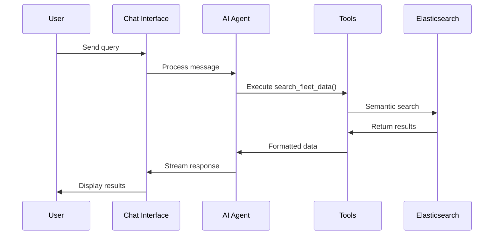
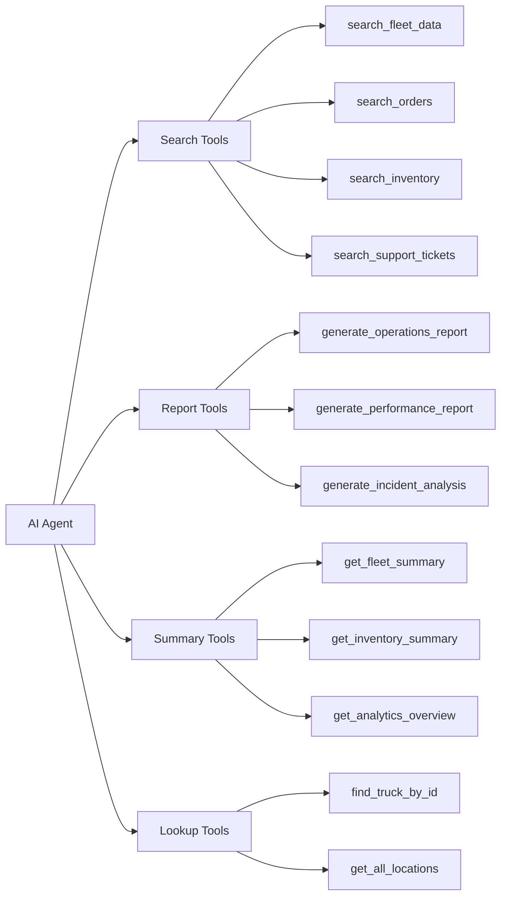
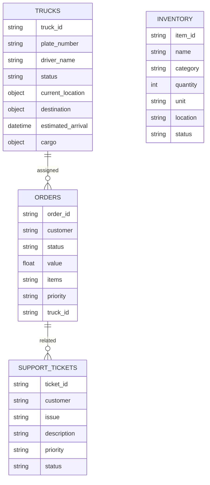

# Runsheet

<div align="center">

[](https://strandsagents.com)
[](https://cloud.google.com/vertex-ai)
[](https://www.elastic.co/)
[](https://nextjs.org/)
[](https://fastapi.tiangolo.com/)
[](https://www.typescriptlang.org/)
[](https://cloud.google.com/)

**AI-powered logistics monitoring system with real-time fleet tracking, inventory management, and intelligent analytics.**

</div>

## Architecture

```mermaid
graph TB
    subgraph "Frontend — Next.js 15 / React"
        FE[Dashboard SPA]
        FE -->|REST| GW
        FE -->|WebSocket| WSG
    end

    subgraph "Middleware Pipeline"
        GW[FastAPI Gateway]
        GW --> MW_RID[RequestID]
        MW_RID --> MW_SEC[Security Headers]
        MW_SEC --> MW_AUTH[Auth Policy]
        MW_AUTH --> MW_TEN[Tenant Guard — JWT → TenantContext]
        MW_TEN --> MW_RL[Rate Limiter]
    end

    subgraph "Bootstrap Lifecycle"
        BOOT[bootstrap/core.py]
        BOOT -->|initialize_all| BOOT_MW[Register Middleware]
        BOOT -->|initialize_all| BOOT_ES[Connect Elasticsearch]
        BOOT -->|initialize_all| BOOT_RED[Connect Redis]
        BOOT -->|initialize_all| BOOT_AGT[Start Agent Scheduler]
        BOOT -->|initialize_all| BOOT_DOM[Mount Domain Routers]
        BOOT -->|shutdown_all| BOOT_SHUT[Graceful Teardown]
    end

    subgraph "Domain Modules"
        MW_RL --> OPS[Ops Module\nops/api/endpoints.py]
        MW_RL --> FUEL[Fuel Module\nfuel/api/endpoints.py]
        MW_RL --> SCHED[Scheduling Module\nscheduling/api/endpoints.py]
        MW_RL --> AGENT[Agent Module\nagent_endpoints.py]
        MW_RL --> DATA[Data Module\ndata_endpoints.py]
        MW_RL --> IMPORT[Import Module\nimport_endpoints.py]
    end

    subgraph "WebSocket Channels"
        WSG[WebSocket Gateway]
        WSG -->|JWT auth| WS_OPS[/ws/ops\nOps real-time]
        WSG -->|JWT auth| WS_SCHED[/ws/scheduling\nScheduling updates]
        WSG -->|JWT auth| WS_AGT[/ws/agent-activity\nAgent activity stream]
        WSG -->|JWT auth| WS_FLEET[/api/fleet/live\nFleet live tracking]
    end

    subgraph "AI Agent Subsystem"
        AGENT --> ORCH[Orchestrator]
        ORCH --> SPEC[Specialist Agents\nFleet · Fuel · Ops · Scheduling · Reporting]
        ORCH --> AUTO[Autonomous Agents\nFuel Mgmt · SLA Guardian · Delay Response]
        ORCH --> OVERLAY[Overlay Agents\nDispatch · Route · Exception · Revenue]
        SPEC --> TOOLS[Agent Tools\nSearch · Report · Lookup · Summary]
    end

    subgraph "Data Layer"
        OPS --> ES[(Elasticsearch)]
        FUEL --> ES
        SCHED --> ES
        DATA --> ES
        IMPORT --> ES
        TOOLS --> ES
        WS_OPS --> REDIS[(Redis)]
        WS_SCHED --> REDIS
        WS_AGT --> REDIS
        WS_FLEET --> REDIS
    end

    subgraph "Multi-Tenant Architecture"
        MW_TEN -.->|tenant_id from JWT| OPS
        MW_TEN -.->|tenant_id from JWT| FUEL
        MW_TEN -.->|tenant_id from JWT| SCHED
        MW_TEN -.->|tenant_id from JWT| AGENT
        MW_TEN -.->|tenant_id from JWT| DATA
        MW_TEN -.->|inject_tenant_filter| ES
    end

    subgraph "External Services"
        EXT_GEM[Google Gemini 2.5 Flash]
        EXT_STRANDS[Strands SDK]
        ORCH --> EXT_GEM
        ORCH --> EXT_STRANDS
    end
```

## Components

### Frontend Structure
```
runsheet/
├── src/
│   ├── app/
│   │   ├── page.tsx           # Main dashboard
│   │   └── signin/page.tsx    # Authentication
│   ├── components/
│   │   ├── AIChat.tsx         # AI assistant
│   │   ├── FleetTracking.tsx  # Fleet management
│   │   ├── Analytics.tsx      # Performance metrics
│   │   ├── MapView.tsx        # Google Maps
│   │   ├── Inventory.tsx      # Stock management
│   │   ├── Orders.tsx         # Order tracking
│   │   └── Support.tsx        # Ticket system
│   ├── services/
│   │   ├── api.ts            # Backend API
│   │   └── mockData.ts       # Test data
│   └── types/
│       └── api.ts            # TypeScript types
```

### Backend Structure
```
Runsheet-backend/
├── main.py                        # FastAPI application entry point
├── data_endpoints.py              # Fleet, orders, inventory, support endpoints
├── agent_endpoints.py             # AI agent management endpoints
├── import_endpoints.py            # CSV/data import endpoints
├── inline_endpoints.py            # Inline utility endpoints
├── bootstrap/                     # Application lifecycle management
│   ├── core.py                    # initialize_all / shutdown_all orchestration
│   ├── container.py               # Dependency injection container
│   ├── middleware.py              # Middleware registration
│   ├── agents.py                  # Agent subsystem bootstrap
│   ├── ops.py                     # Ops domain bootstrap
│   ├── fuel.py                    # Fuel domain bootstrap
│   ├── scheduling.py              # Scheduling domain bootstrap
│   └── agent_scheduler.py         # Autonomous agent scheduler
├── ops/                           # Operations domain module
│   ├── api/endpoints.py           # Ops REST endpoints
│   ├── middleware/
│   │   ├── tenant_guard.py        # JWT tenant extraction & query scoping
│   │   └── pii_masker.py          # PII field masking
│   ├── services/
│   │   ├── ops_es_service.py      # Ops Elasticsearch service
│   │   ├── ops_metrics.py         # Metrics collection
│   │   ├── drift_detector.py      # Configuration drift detection
│   │   └── feature_flags.py       # Tenant feature flags
│   ├── webhooks/receiver.py       # Inbound webhook handler
│   ├── websocket/ops_ws.py        # Ops WebSocket manager
│   └── ingestion/                 # Data ingestion pipeline
│       ├── adapter.py             # Ingestion adapter
│       ├── idempotency.py         # Deduplication logic
│       ├── poison_queue.py        # Failed message handling
│       └── replay.py              # Message replay support
├── fuel/                          # Fuel management domain module
│   ├── api/endpoints.py           # Fuel REST endpoints
│   ├── models.py                  # Fuel domain models
│   └── services/
│       ├── fuel_service.py        # Fuel business logic
│       ├── fuel_alert_service.py  # Fuel level alerts
│       └── fuel_es_mappings.py    # Fuel ES index mappings
├── scheduling/                    # Scheduling domain module
│   ├── api/endpoints.py           # Scheduling REST endpoints
│   ├── models.py                  # Scheduling domain models
│   ├── services/
│   │   ├── job_service.py         # Job CRUD & queries
│   │   ├── cargo_service.py       # Cargo management
│   │   ├── delay_detection_service.py
│   │   └── job_id_generator.py    # Unique job ID generation
│   └── websocket/scheduling_ws.py # Scheduling WebSocket manager
├── errors/                        # Centralized error handling
│   ├── codes.py                   # Error code enum
│   ├── exceptions.py              # AppException base & factories
│   └── handlers.py                # Exception-to-JSON-envelope handlers
├── middleware/                     # Cross-cutting middleware
│   ├── auth_policy.py             # Route-level auth policy matrix
│   ├── rate_limiter.py            # Rate limiting configuration
│   ├── request_id.py              # Request ID propagation
│   └── security_headers.py        # Security response headers
├── config/
│   └── settings.py                # Environment-aware configuration
├── schemas/
│   └── common.py                  # Shared Pydantic models (ErrorResponse, etc.)
├── services/                      # Shared infrastructure services
│   ├── elasticsearch_service.py   # Core ES client & queries
│   ├── data_seeder.py             # Demo data seeding
│   ├── import_service.py          # CSV import processing
│   ├── validation_engine.py       # Input validation
│   ├── field_mapper.py            # Field mapping utilities
│   └── schema_templates.py        # ES index templates
├── health/
│   └── service.py                 # Health check endpoints
├── resilience/                    # Fault tolerance utilities
│   ├── circuit_breaker.py         # Circuit breaker pattern
│   └── retry.py                   # Retry with backoff
├── websocket/                     # WebSocket infrastructure
│   ├── base_ws_manager.py         # Base WebSocket manager
│   └── connection_manager.py      # Connection lifecycle
├── session/                       # Session management
│   ├── redis_store.py             # Redis-backed sessions
│   └── store.py                   # Session store interface
├── ingestion/
│   └── service.py                 # Data ingestion service
├── telemetry/
│   └── service.py                 # Observability & telemetry
├── Agents/                        # AI agent subsystem
│   ├── mainagent.py               # Agent controller
│   ├── orchestrator.py            # Multi-agent orchestrator
│   ├── tools/                     # Agent tool definitions
│   │   ├── search_tools.py        # Data search tools
│   │   ├── report_tools.py        # Report generation tools
│   │   ├── lookup_tools.py        # Data lookup tools
│   │   └── summary_tools.py       # Data summary tools
│   ├── specialists/               # Domain-specialist agents
│   ├── autonomous/                # Autonomous agent framework
│   ├── overlay/                   # Agent overlay layer
│   └── support/                   # Agent support utilities
├── scripts/                       # Utility scripts
│   ├── check_coverage.py          # Coverage verification
│   ├── generate_endpoint_registry.py
│   └── backfill_asset_type.py
├── tests/                         # Test suite
└── demo-data/                     # Sample CSV files
```

### AI Agent Flow



## Technology Stack

**Frontend**
- Next.js 15 (React App Router)
- TypeScript
- Tailwind CSS
- React Google Maps
- Lucide React icons
- React Markdown

**Backend**
- FastAPI (Python)
- Strands AI Framework
- Google Gemini 2.5 Flash
- Elasticsearch
- Python 3.11+

**Infrastructure**
- Elasticsearch Cloud
- Google Cloud Platform
- CORS middleware
- Server-sent events

## Setup

### Prerequisites
- Node.js 18+
- Python 3.11+
- Elasticsearch Cloud account
- Google Cloud Platform account

### Backend

```bash
cd Runsheet-backend
python -m venv venv
source venv/bin/activate  # Windows: venv\Scripts\activate
pip install -r requirements.txt
```

Set up your environment configuration:
```bash
# Copy the example environment file
cp .env.example .env.development

# Open .env.development and fill in your actual credentials:
# - ELASTIC_ENDPOINT: Your Elasticsearch Cloud endpoint URL
# - ELASTIC_API_KEY: Your Elasticsearch API key (from Elastic Cloud console)
# - GOOGLE_CLOUD_PROJECT: Your GCP project ID
# - JWT_SECRET: A strong random secret for JWT signing (min 32 chars)
# - DINEE_WEBHOOK_SECRET: HMAC secret for webhook verification
#
# See .env.example for full documentation of all variables.
```

> **Important**: Never commit `.env.development` or any file containing real credentials.
> Only `.env.example` (with placeholder values) should be tracked in git.

Setup Google Cloud credentials:
- Run `gcloud auth application-default login`, or
- Place service account JSON in the backend directory and set `GOOGLE_APPLICATION_CREDENTIALS` in `.env.development`

Start server:
```bash
python main.py
```

### Frontend

```bash
cd runsheet
npm install

# Copy the example environment file
cp .env.example .env.local

# Open .env.local and fill in your actual values:
# - NEXT_PUBLIC_API_URL: Backend API URL (default: http://localhost:8000/api)
# - NEXT_PUBLIC_GOOGLE_MAPS_API_KEY: Your Google Maps API key
#
# See .env.example for full documentation.
```

> **Important**: Never commit `.env.local` or any file containing real credentials.

```bash
npm run dev
```

The system auto-seeds baseline data on startup. Upload additional data via the Data Upload interface using CSV files from `demo-data/`.

## Usage

### AI Assistant

The system supports natural language queries:

```
"Show me all delayed trucks"
"Find trucks carrying network equipment"
"Search for high priority orders"
"Check diesel fuel levels"
"Generate a performance report"
```

### Available Tools



## Data Models

### Elasticsearch Indices



### API Endpoints

#### Health & Root (public, no auth required)

```
GET  /                              # API root status
GET  /health                        # Basic health check
GET  /health/ready                  # Readiness probe (dependency checks)
GET  /health/live                   # Liveness probe
GET  /api/health                    # Legacy health check
```

#### Fleet & Data (`/api/*` — `data_endpoints.py`)

```
GET  /api/fleet/summary             # Fleet statistics with multi-asset counts
GET  /api/fleet/trucks              # List trucks (asset_subtype=truck)
GET  /api/fleet/trucks/{truck_id}   # Single truck by ID
GET  /api/fleet/assets              # List all assets (filter by type/subtype/status)
GET  /api/fleet/assets/{asset_id}   # Single asset by ID
POST /api/fleet/assets              # Create a new asset
PATCH /api/fleet/assets/{asset_id}  # Update an existing asset
GET  /api/inventory                 # List inventory items
GET  /api/orders                    # List orders
GET  /api/support/tickets           # List support tickets
GET  /api/analytics/metrics         # Analytics overview metrics
GET  /api/analytics/routes          # Route performance analytics
GET  /api/analytics/delay-causes    # Delay cause breakdown
GET  /api/analytics/regional        # Regional performance analytics
GET  /api/analytics/time-series     # Time-series metric data
GET  /api/search                    # Semantic search across indices
POST /api/data/cleanup              # Deduplicate data
POST /api/data/upload/sheets        # Upload data from Google Sheets
POST /api/data/upload/csv           # Upload CSV data
```

#### Ops Intelligence (`/api/ops/*` — `ops/api/endpoints.py`)

```
GET  /api/ops/shipments                         # Paginated shipments with filters
GET  /api/ops/shipments/sla-breaches            # Shipments past estimated delivery
GET  /api/ops/shipments/failures                # Failed shipments with failure reason
GET  /api/ops/shipments/{shipment_id}           # Single shipment with event history
GET  /api/ops/riders                            # Paginated riders
GET  /api/ops/riders/utilization                # Riders with utilization metrics
GET  /api/ops/riders/{rider_id}                 # Single rider with assigned shipments
GET  /api/ops/events                            # Paginated shipment events
GET  /api/ops/metrics/shipments                 # Shipment counts by status (time buckets)
GET  /api/ops/metrics/sla                       # SLA compliance metrics
GET  /api/ops/metrics/riders                    # Rider performance metrics
GET  /api/ops/metrics/failures                  # Failure rate metrics
GET  /api/ops/metrics/prometheus                # Prometheus-format metrics export
GET  /api/ops/monitoring/ingestion              # Ingestion pipeline metrics
GET  /api/ops/monitoring/indexing               # Indexing throughput metrics
GET  /api/ops/monitoring/poison-queue           # Poison queue metrics
POST /api/ops/admin/feature-flags/{tenant_id}/enable    # Enable ops for tenant
POST /api/ops/admin/feature-flags/{tenant_id}/disable   # Disable ops for tenant
POST /api/ops/admin/feature-flags/{tenant_id}/rollback  # Rollback feature flag
POST /api/ops/replay/trigger                    # Trigger event replay
GET  /api/ops/replay/status/{job_id}            # Replay job status
POST /api/ops/drift/run                         # Run configuration drift detection
```

#### Fuel Management (`/api/fuel/*` — `fuel/api/endpoints.py`)

```
GET   /api/fuel/stations                        # List fuel stations (filter by type/status/location)
GET   /api/fuel/stations/{station_id}           # Single station with recent events
POST  /api/fuel/stations                        # Register a new fuel station
PATCH /api/fuel/stations/{station_id}           # Update station metadata
PATCH /api/fuel/stations/{station_id}/threshold # Update alert threshold
POST  /api/fuel/consumption                     # Record fuel consumption event
POST  /api/fuel/consumption/batch               # Batch consumption recording
POST  /api/fuel/refill                          # Record fuel refill event
GET   /api/fuel/alerts                          # List active fuel alerts
GET   /api/fuel/metrics/consumption             # Consumption metrics (time buckets)
GET   /api/fuel/metrics/efficiency              # Fuel efficiency per asset
GET   /api/fuel/metrics/summary                 # Network-wide fuel summary
```

#### Fuel Distribution MVP (`/api/fuel/mvp/*` — `Agents/support/mvp_endpoints.py`)

```
POST /api/fuel/mvp/plan/generate                # Generate a fuel distribution plan
GET  /api/fuel/mvp/plan/{plan_id}               # Get a distribution plan
POST /api/fuel/mvp/plan/{plan_id}/replan        # Replan with exception handling
GET  /api/fuel/mvp/forecasts                    # Get tank level forecasts
GET  /api/fuel/mvp/priorities                   # Get delivery priorities
```

#### Scheduling & Dispatch (`/api/scheduling/*` — `scheduling/api/endpoints.py`)

```
POST  /api/scheduling/jobs                              # Create a new job
GET   /api/scheduling/jobs                              # List jobs with filters and pagination
GET   /api/scheduling/jobs/active                       # Active jobs (scheduled/assigned/in_progress)
GET   /api/scheduling/jobs/delayed                      # Delayed jobs past ETA
GET   /api/scheduling/jobs/{job_id}                     # Single job with event history
GET   /api/scheduling/jobs/{job_id}/events              # Job event timeline
PATCH /api/scheduling/jobs/{job_id}/assign              # Assign asset to job
PATCH /api/scheduling/jobs/{job_id}/reassign            # Reassign asset
PATCH /api/scheduling/jobs/{job_id}/status              # Transition job status
GET   /api/scheduling/jobs/{job_id}/cargo               # Get cargo manifest
PATCH /api/scheduling/jobs/{job_id}/cargo               # Update cargo manifest
PATCH /api/scheduling/jobs/{job_id}/cargo/{item_id}/status  # Update cargo item status
GET   /api/scheduling/cargo/search                      # Search cargo across jobs
GET   /api/scheduling/jobs/{job_id}/eta                 # Current ETA for a job
GET   /api/scheduling/metrics/jobs                      # Job counts by status (time buckets)
GET   /api/scheduling/metrics/completion                # Completion rate by job type
GET   /api/scheduling/metrics/assets                    # Asset utilization metrics
GET   /api/scheduling/metrics/delays                    # Delay statistics
```

#### Agent Management (`/api/agent/*` — `agent_endpoints.py`)

```
GET  /api/agent/approvals                       # List pending approvals
POST /api/agent/approvals/{action_id}/approve   # Approve a pending action
POST /api/agent/approvals/{action_id}/reject    # Reject a pending action
GET  /api/agent/activity                        # Paginated activity log
GET  /api/agent/activity/stats                  # Aggregated activity statistics
GET  /api/agent/config/autonomy                 # Get autonomy level
PATCH /api/agent/config/autonomy                # Update autonomy level (admin-only)
GET  /api/agent/memory                          # List stored memories
DELETE /api/agent/memory/{memory_id}            # Delete a memory
GET  /api/agent/feedback                        # List feedback signals
GET  /api/agent/feedback/stats                  # Aggregated feedback statistics
GET  /api/agent/health                          # Agent health status (public)
POST /api/agent/{agent_id}/pause                # Pause an autonomous agent
POST /api/agent/{agent_id}/resume               # Resume a paused agent
```

#### Data Import (`/api/import/*` — `import_endpoints.py`)

```
POST /api/import/upload/csv                     # Upload CSV for import
POST /api/import/upload/sheets                  # Import from Google Sheets
POST /api/import/validate                       # Validate mapped data
POST /api/import/commit                         # Commit validated records to ES
GET  /api/import/history                        # List import sessions
GET  /api/import/history/{session_id}           # Single import session
GET  /api/import/templates/{data_type}          # Download CSV template
GET  /api/import/schemas/{data_type}            # Get schema for data type
```

#### Chat, Upload & Utilities (`inline_endpoints.py`)

```
POST /api/chat                                  # AI assistant (streaming)
POST /api/chat/fallback                         # AI assistant (non-streaming)
POST /api/chat/clear                            # Clear chat memory
POST /api/demo/reset                            # Reset demo data
GET  /api/demo/status                           # Demo state status
POST /api/upload/csv                            # Temporal CSV upload
POST /api/upload/batch                          # Batch temporal upload
POST /api/upload/selective                       # Selective temporal upload
POST /api/upload/sheets                         # Temporal sheets upload
POST /api/locations/webhook                     # Location update webhook
POST /api/locations/batch                       # Batch location updates
```

#### Webhooks (`/webhooks/*` — `ops/webhooks/receiver.py`)

```
POST /webhooks/dinee                            # Inbound Dinee webhook (HMAC-verified)
```

#### WebSocket Endpoints

```
WS  /ws/ops                                     # Ops real-time updates (JWT required)
WS  /ws/scheduling                              # Scheduling real-time updates (JWT required)
WS  /ws/agent-activity                          # Agent activity stream (JWT required)
WS  /api/fleet/live                             # Fleet live tracking (JWT required)
```

### Route Naming Guidelines

All API routes follow these conventions. New endpoints should conform to these rules; any intentional deviation must be annotated with a rationale.

#### 1. Plural nouns for collections, singular for singletons

| Pattern | Example | Notes |
|---------|---------|-------|
| Collection | `/api/fleet/trucks`, `/api/ops/shipments`, `/api/fuel/stations` | Always plural |
| Singleton by ID | `/api/fleet/trucks/{truck_id}`, `/api/ops/riders/{rider_id}` | Plural collection + `/{id}` |
| Singleton concept | `/api/fleet/summary`, `/api/agent/health` | Singular when the resource is inherently one-of (a summary, a health status) |

#### 2. Resource-based patterns

Routes are structured around resources (nouns), not actions (verbs). State transitions and queries are expressed through sub-resources or HTTP methods:

```
PATCH /api/scheduling/jobs/{job_id}/status       # Update job status (resource-based)
PATCH /api/scheduling/jobs/{job_id}/assign        # Assign asset to job (resource-based)
PATCH /api/scheduling/jobs/{job_id}/cargo         # Update cargo manifest
GET   /api/ops/shipments/sla-breaches            # Filtered sub-collection
GET   /api/scheduling/jobs/active                 # Filtered sub-collection
```

#### 3. `/api/{domain}/{resource}` prefixing

Every REST endpoint uses the pattern `/api/{domain}/{resource}` where `{domain}` identifies the owning module:

| Domain | Prefix | Module |
|--------|--------|--------|
| Fleet & Data | `/api/fleet/*`, `/api/orders`, `/api/inventory`, `/api/support` | `data_endpoints.py` |
| Ops Intelligence | `/api/ops/*` | `ops/api/endpoints.py` |
| Fuel Management | `/api/fuel/*` | `fuel/api/endpoints.py` |
| Scheduling | `/api/scheduling/*` | `scheduling/api/endpoints.py` |
| Agent Management | `/api/agent/*` | `agent_endpoints.py` |
| Data Import | `/api/import/*` | `import_endpoints.py` |
| Utilities | `/api/chat`, `/api/demo/*`, `/api/upload/*`, `/api/locations/*` | `inline_endpoints.py` |
| Health | `/health`, `/health/ready`, `/health/live`, `/api/health` | `health/service.py` |
| WebSocket | `/ws/ops`, `/ws/scheduling`, `/ws/agent-activity`, `/api/fleet/live` | `main.py` |

#### 4. Action-verb convention

The project prefers resource-based patterns, but accepts **verb-style action routes** when the operation does not map cleanly to a CRUD action on a resource. These are documented explicitly:

| Route | Style | Rationale |
|-------|-------|-----------|
| `POST /api/agent/{agent_id}/pause` | Verb | Pausing an agent is a lifecycle command, not a resource update. Using `PATCH .../status` would conflate agent runtime state with configuration. |
| `POST /api/agent/{agent_id}/resume` | Verb | Same rationale as `pause` — a lifecycle command. |
| `POST /api/agent/approvals/{action_id}/approve` | Verb | Approval is a one-shot action that transitions state; it is not a partial update to the approval resource. |
| `POST /api/agent/approvals/{action_id}/reject` | Verb | Same rationale as `approve`. |
| `POST /api/ops/replay/trigger` | Verb | Triggering a replay is an imperative command, not a resource creation. |
| `POST /api/ops/drift/run` | Verb | Running drift detection is an on-demand command. |
| `POST /api/fuel/mvp/plan/{plan_id}/replan` | Verb | Replanning is a domain-specific action that creates a new plan variant, not a simple update. |
| `POST /api/data/cleanup` | Verb | Deduplication is a maintenance action, not a resource operation. |
| `POST /api/demo/reset` | Verb | Resetting demo state is an imperative command. |
| `POST /api/chat/clear` | Verb | Clearing chat memory is a destructive action, not a resource deletion (no specific resource ID). |

All other state transitions use resource-based patterns (e.g., `PATCH /api/scheduling/jobs/{job_id}/status`).

#### 5. Intentional deviations

| Route | Deviation | Rationale |
|-------|-----------|-----------|
| `/api/fleet/live` (WebSocket) | Uses `/api/` prefix instead of `/ws/` | Legacy endpoint; kept for backward compatibility with existing frontend clients. All other WebSocket endpoints use the `/ws/` prefix. |
| `/api/chat`, `/api/demo/*`, `/api/upload/*`, `/api/locations/*` | No domain sub-prefix | Utility and cross-cutting endpoints that do not belong to a single domain module. Grouped under `/api/` directly for simplicity. |
| `/api/orders`, `/api/inventory`, `/api/support/tickets` | Top-level resource without domain prefix | These data endpoints predate the domain-module structure. They are served by `data_endpoints.py` alongside `/api/fleet/*` but lack a unifying `/api/data/*` prefix. Retained for backward compatibility. |
| `/api/search`, `/api/analytics/*` | Top-level resource without domain prefix | Cross-cutting analytics and search endpoints that span multiple domains. Kept under `/api/` directly rather than nesting under a single domain. |

## Configuration

### Environment Variables

Environment configuration is managed through `.env.example` template files. Copy these to create your local configuration:

```bash
# Backend
cp Runsheet-backend/.env.example Runsheet-backend/.env.development

# Frontend
cp runsheet/.env.example runsheet/.env.local
```

See each `.env.example` file for the full list of variables with descriptions, expected formats, and required/optional status.

Key variables:
```bash
# Elasticsearch (required)
ELASTIC_API_KEY=your-api-key-here
ELASTIC_ENDPOINT=https://your-elasticsearch-endpoint.elastic-cloud.com

# Google Cloud (required)
GOOGLE_CLOUD_PROJECT=your-gcp-project-id

# Authentication (required)
JWT_SECRET=your-jwt-secret-here
```

### AI Agent Configuration

The AI agent uses the Strands framework with Google Gemini 2.5 Flash. Tools are automatically registered and available for natural language queries.

## Development

### Running Tests
```bash
# Backend
cd Runsheet-backend
python -m pytest

# Frontend
cd runsheet
npm test
```

### Coverage

The backend uses `pytest-cov` with configuration in `Runsheet-backend/.coveragerc`. Run the canonical coverage command from the backend directory:

```bash
cd Runsheet-backend
pytest --cov=. --cov-report=html:coverage_html
```

This generates an HTML report in `Runsheet-backend/coverage_html/`. The `.coveragerc` file defines source directories, exclusion rules, branch coverage, and a minimum threshold of 70%.

CI pipelines should use this same command and collect `Runsheet-backend/coverage_html/` as the artifact output path.

### Building for Production
```bash
# Frontend
npm run build

# Backend
pip install gunicorn
gunicorn main:app
```